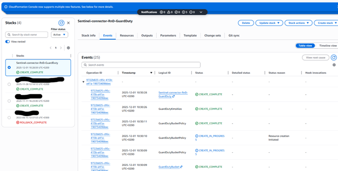
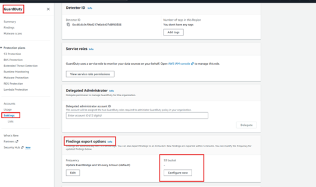
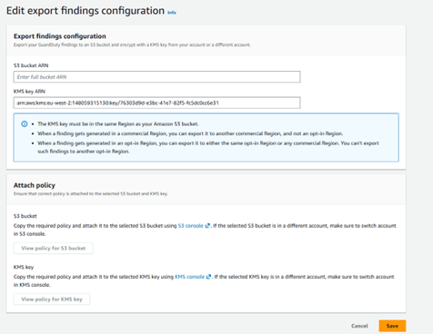

# Deploy AWS GuardDuty log collection for Microsoft Sentinel with CloudFormation

### 1. Create the CloudFormation stack

1. Sign in to the **AWS Management Console**.
2. In the search bar, search for **CloudFormation** and open the **CloudFormation** service.

3. Select **Create stack** → **With new resources (standard)**.

---

#### 1.1 Step 1 – Specify template

1. Under **Prepare template**, select **Choose an existing template**.
2. Under **Template source**, select **Upload a template file**, then choose and upload the provided template file.
3. Click **Next**.

---

#### 1.2 Step 2 – Specify stack details

Fill in the following parameters:

- **Stack name**: Enter a name for the stack.  
- **AWSRoleName**: Enter the IAM role name (the name must start with `OIDC_XXXXX`).  
- **GuardDutyBucketName**: Enter the name of the S3 bucket to be used.  
  - If you already have a generic S3 bucket or wish to use another existing bucket, enter its name here.  
- **BucketName**: Set to `false` if you are using an existing S3 bucket (leave as `true` if a new bucket should be created).  
- **GuardDutyKmsAliasName**: Alias name (without the `alias/` prefix) for the new KMS key that will encrypt GuardDuty findings.  
- **SentinelSQSQueueName**: Enter the name of the Amazon SQS queue.  
- **LogFileSuffix**: S3 object key suffix for GuardDuty exported findings used in the notification filter (must be `.gz` by default).  
- **SentinelWorkspaceId**: Enter the **Workspace ID** from the Azure Log Analytics workspace page:  
  - In the Azure portal, go to **Log Analytics workspace → Overview** and copy the **Workspace ID**.

After filling all required fields, click **Next**.

---

#### 1.3 Step 3 – Configure stack options

1. Leave the default options unchanged.
2. Acknowledge that AWS CloudFormation might create IAM resources with custom names by selecting the required checkbox.

3. Click **Next**.

---

#### 1.4 Step 4 – Review

1. Review all settings and confirm that all required fields are correctly populated.

2. Click **Submit** to create the stack.

Monitor the stack creation:

1. In **CloudFormation → Stacks → Events**, monitor the progress status.
2. When the status indicates completion, verify in the left panel that the stack has been successfully created.

---

### 2. Export GuardDuty logs

1. Go to the **GuardDuty** console and open **Settings**.

2. Under **Findings export options**, choose **Configure now** (or **Edit** if already configured).

3. Enter the **KMS key ARN** and **S3 bucket ARN**, then click **Save**.

