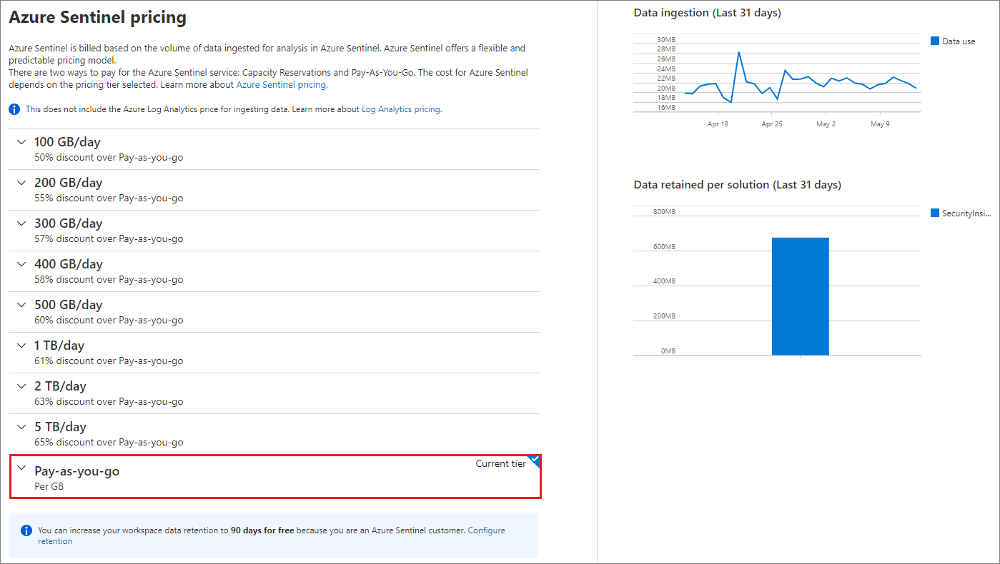
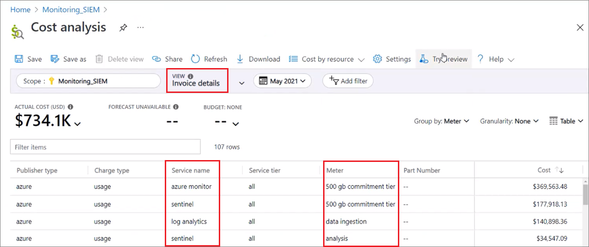

# Azure Sentinel costs and billing

Azure Sentinel provides intelligent security analytics across your enterprise. Azure Sentinel uses an extensive query language to analyze, interact with, and derive insights from huge volumes of operational data in seconds. Azure Sentinel stores its data for analysis in an Azure Monitor Log Analytics workspace, and bills based on the volume of data stored in the workspace for analysis.

When you connect Azure Sentinel to a Log Analytics workspace, Azure Sentinel automatically analyzes and bills for all data the workspace ingests from then on. To save costs, you can use separate Log Analytics workspaces for data you don't need Azure Sentinel to analyze.

## Azure Sentinel pricing model

Azure Sentinel offers a flexible and predictable pricing model. For more information, see the [Azure Sentinel pricing page](https://azure.microsoft.com/pricing/details/azure-sentinel/). For the related Log Analytics charges, see [Azure Monitor Log Analytics pricing](https://azure.microsoft.com/pricing/details/log-analytics/).

The default pricing for Log Analytics and Azure Sentinel is a Pay-As-You-Go model based on the actual data volume stored, and optionally for data retention beyond 90 days. Data volume is measured in GB (10\\^9 bytes). Log Analytics and Azure Sentinel also have Commitment Tier pricing, formerly called Capacity Reservations, which is more predictable and saves as much as 65% compared to Pay-As-You-Go pricing. For more information, see [Commitment Tiers](#pay-as-you-go-and-commitment-tiers).

Azure Sentinel integrates with many other Azure services to provide enhanced capabilities, and some of these services may have additional charges. These services include Azure Logic Apps, Azure Notebooks, and bring your own machine learning (BYOML) models. Some of Azure Sentinel's data connectors and solutions use Azure Functions for data ingestion, which has a separate associated cost.

For pricing details for these services, see:

- [Automation-Logic Apps pricing](https://azure.microsoft.com/pricing/details/logic-apps/)
- [Notebooks pricing](https://azure.microsoft.com/pricing/details/machine-learning/)
- [BYOML pricing](https://azure.microsoft.com/pricing/details/machine-learning-studio/)
- [Azure Functions pricing](https://azure.microsoft.com/en-us/pricing/details/functions/)

Any other additional services you use could have associated costs.

### Data retention costs

When you first enable Azure Sentinel on a Log Analytics workspace, you can retain all data ingested into the workspace at no charge for the first 90 days. Retention beyond 90 days is charged per the standard [Log Analytics retention prices](https://azure.microsoft.com/pricing/details/monitor/).

You can specify different retention settings for individual data types. For more information, see [Retention by data type](/azure/azure-monitor/logs/manage-cost-storage#retention-by-data-type).

### Free trial

You can enable Azure Sentinel on a new or existing Log Analytics workspace at no additional cost for the first 31 days. Usage beyond the first 31 days is charged at standard [Azure Monitor Log Analytics](https://azure.microsoft.com/pricing/details/monitor/) prices. Charges related to Log Analytics, Automation, and BYOML still apply during the free trial.

### Free data sources

The following data sources are free with Azure Sentinel:

- Azure Activity Logs.
- Office 365 Audit Logs, including all SharePoint activity, Exchange admin activity, and Teams.
- Microsoft Defender alerts, including alerts from Azure Defender, Microsoft 365 (M365) Defender, Microsoft Defender for Office 365, Microsoft Defender for Identity, and Microsoft Defender for Endpoint.
- Azure Security Center and Microsoft Cloud App Security (MCAS) alerts. However, raw logs for some M365 Defender, MCAS, Azure Active Directory (Azure AD), and Azure Information Protection (AIP) data types are paid.

The following table lists the free data sources you can enable in Azure Sentinel. Some of the data connectors, such as M365 Defender and MCAS, include both free and paid data types, and you can select which data types you want to enable.

| Azure Sentinel Data Connector   | Data type | Free or paid |
|-------------------------------------|--------------------------------|------------------|
| **Azure Activity Logs**         | AzureActivity                  | Free             |
| **Office 365**                     | OfficeActivity (SharePoint)    | Free|
|| OfficeActivity (Exchange)|Free|
|| OfficeActivity (Teams)          | Free|
| **Azure Defender**                  | SecurityAlert (ASC)             | Free             |
| **Azure Defender for IoT**          | SecurityAlert (ASC for IoT)     | Free             |
| **Microsoft 365 Defender**          | SecurityIncident | Free|
||SecurityAlert| Free|
||DeviceEvents                    | Paid|
||DeviceFileEvents                | Paid|
||DeviceImageLoadEvents           | Paid|
||DeviceInfo                      | Paid|
||DeviceLogonEvents               | Paid|
||DeviceNetworkEvents             | Paid|
||DeviceNetworkInfo               | Paid|
||DeviceProcessEvents             | Paid|
||DeviceRegistryEvents            | Paid|
||DeviceFileCertificateInfo       | Paid|
| **Microsoft Defender for Endpoint** | SecurityAlert (MDATP)          | Free             |
| **Microsoft Defender for Identity** | SecurityAlert (AATP)           | Free             |
| **Microsoft Cloud App Security**   | SecurityAlert (MCAS)           | Free             |
||MCASShadowITReporting           | Paid|

### Pay-As-You-Go and Commitment Tiers

There are two ways to pay for the Azure Sentinel service: Pay-As-You-Go and Commitment Tiers. Pay-As-You-Go is the default model.

Log Analytics and Azure Sentinel capacity Commitment Tiers save you as much as 65% compared to the Pay-As-You-Go price. With Commitment Tier pricing, you can buy a commitment starting at 100 GB/day. Any usage above the commitment level is billed at the Commitment Tier rate you selected. For example, a Commitment Tier of 100GB/day bills you for the committed 100GB/day data volume, plus any additional GB/day at the discounted rate for that tier.

You can increase your commitment tier any time, and decrease it every 31 days, to optimize costs as your data volume increases or decreases. To see your current Azure Sentinel pricing tier, select **Settings** in the Azure Sentinel left navigation, and then select the **Pricing** tab. Your current pricing tier is marked as **Current tier**.



To set and change your Commitment Tier, see [Set or change pricing tier](#set-or-change-pricing-tier).

## Estimate Azure Sentinel costs

If you're not yet using Azure Sentinel, you can use the [Azure Sentinel pricing calculator](https://azure.microsoft.com/pricing/calculator/?service=azure-sentinel) to estimate the potential cost of using Azure Sentinel. Enter *Azure Sentinel* in the Search box and select the resulting Azure Sentinel tile. The pricing calculator helps you estimate your likely costs based on your expected data ingestion and retention.

For example, you can enter the GB of daily data you expect to ingest in Azure Sentinel, and the region for your workspace. The calculator provides the aggregate monthly cost across these components:

- Log Analytics data ingestion 
- Azure Sentinel data analysis 
- Log Analytics data retention 

## Manage Azure Sentinel costs

There are several ways to understand and manage Azure Sentinel usage and costs.

Manage data ingestion and retention:

- [Use Commitment Tier pricing to optimize costs](#set-or-change-pricing-tier) based on your data ingestion volume.
- [Define a Log Analytics data volume cap](#define-a-data-volume-cap-in-log-analytics) to manage ingestion, although security data is excluded from the cap.
- [Optimize Log Analytics costs with dedicated clusters](#optimize-log-analytics-costs-with-dedicated-clusters).
- [Put non-security data in a different workspace](#put-non-security-data-in-a-separate-workspace).
- [Reduce long-term data retention costs with Azure Data Explorer (ADX)](#reduce-long-term-data-retention-costs-with-adx).

Understand, monitor, and alert for data ingestion and cost changes:

- [Run queries to understand your data ingestion](#run-queries-to-understand-your-data-ingestion).
- [Deploy a workbook to visualize data ingestion](#deploy-a-workbook-to-visualize-data-ingestion)
- [Use a cost management playbook](#use-a-playbook-for-cost-management-alerts) that can send an alert when ingestion exceeds a predefined threshold.
- [Understand Common Event Format (CEF) data ingestion](#understand-cef-ingestion-volume).

### Manage data ingestion and retention

Use the following methods to manage data ingestion and retention for your Azure Sentinel workspace.

#### Set or change pricing tier

To optimize for highest savings, monitor your ingestion volume to ensure you have the Commitment Tier that aligns most closely with your ingestion volume patterns. You can increase or decrease your Commitment Tier to align with changing data volumes.

You can increase your Commitment Tier any time, which restarts the 31-day commitment period. However, to move back to Pay-As-You-Go or to a lower Commitment Tier, you must wait until after the 31-day commitment period finishes. Billing for Commitment Tiers is on a daily basis.

To see your current Azure Sentinel pricing tier, select **Settings** in the Azure Sentinel left navigation, and then select the **Pricing** tab. Your current pricing tier is marked **Current tier**.

To change your pricing tier commitment, select one of the other tiers on the pricing page, and then select **Apply**. You must have **Contributor** or **Owner** role in Azure Sentinel to change the pricing tier.

The Azure Sentinel pricing tiers don't include Log Analytics charges. To change your pricing tier commitment for Log Analytics, see [Changing pricing tier](/azure/azure-monitor/logs/manage-cost-storage#changing-pricing-tier).

#### Define a data volume cap in Log Analytics

In Log Analytics, you can enable a daily volume cap that limits the daily ingestion for your workspace. The daily cap can help you manage unexpected increases in data volume, stay within your limit, and limit unplanned charges.

To define a daily volume cap, select **Usage and estimated costs** in the left navigation of your Log Analytics workspace, and then select **Daily cap**. Select **On**, enter a daily volume cap amount, and then select **OK**.


The **Usage and estimated costs** screen also shows your ingested data volume trend in the past 31 days, and the total retained data volume.

> [!IMPORTANT]
> The daily cap doesn't limit collection of all data types. For more information about managing the daily cap in Log Analytics, see [Manage your maximum daily data volume](/azure/azure-monitor/logs/manage-cost-storage#manage-your-maximum-daily-data-volume).

#### Optimize Log Analytics costs with dedicated clusters

If you ingest at least 1TB/day into your Azure Sentinel workspace or workspaces in the same region, consider moving to a Log Analytics dedicated cluster to decrease costs. A Log Analytics dedicated cluster Commitment Tier aggregates data volume across workspaces that ingest a total of 1TB/day.

Log Analytics dedicated clusters don't apply to Azure Sentinel Commitment Tiers. Azure Sentinel costs still apply per workspace in the dedicated cluster.

You can add multiple Azure Sentinel workspace to a Log Analytics dedicated cluster. There are a couple of advantages to using a Log Analytics dedicated cluster for Azure Sentinel:

- Cross-workspace queries run faster if all the workspaces involved in the query are in the dedicated cluster. It's still best to have as few workspaces as possible in your environment, and a dedicated cluster still retains the [100 workspace limit](/azure/azure-monitor/log-query/cross-workspace-query) for inclusion in a single cross-workspace query.

- All workspaces in the dedicated cluster can share the Log Analytics Commitment Tier set on the cluster. Not having to commit to separate Log Analytics Commitment Tiers for each workspace can allow for cost savings and efficiencies. By enabling a dedicated cluster, you commit to a minimum Log Analytics Commitment Tier of 1Tb ingestion per day.

Here are some other considerations for moving to a dedicated cluster for cost optimization:

- The maximum number of clusters per region and subscription is two.
- All workspaces linked to a cluster must be in the same region.
- The maximum of workspaces linked to a cluster is 1000.
- You can unlink a linked workspace from your cluster. The number of link operations on a particular workspace is limited to two in a period of 30 days.
- You can't move an existing workspace to a customer managed key (CMK) cluster. You need to create the workspace in the cluster.
- Moving a cluster to another resource group or subscription isn't currently supported.
- A workspace link to a cluster fails if the workspace is linked to another cluster.

For more information about dedicated clusters, see [Log Analytics dedicated clusters](/azure/azure-monitor/logs/manage-cost-storage#log-analytics-dedicated-clusters).

#### Put non-security data in a separate workspace

Azure Sentinel analyzes all the data ingested into Azure Sentinel-enabled Log Analytics workspaces. It's best to have a separate workspace for non-security operations data, to ensure it doesn't incur Azure Sentinel costs.

When hunting or investigating threats in Azure Sentinel, you might need to access operational data stored in these standalone Azure Log Analytics workspaces. You can access this data by using cross-workspace querying in the log exploration experience and workbooks. However, cross-workspace analytic rules and hunting queries require Azure Sentinel to be enabled on all workspaces.

#### Reduce long-term data retention costs with ADX

Azure Sentinel data retention is free for the first 90 days. To adjust the data retention time period in Log Analytics, select **Usage and estimated costs** in the left navigation, then select **Data retention**, and then adjust the slider.

Azure Sentinel security data might lose some of its value after a few months. Security operations center (SOC) users might not need to access older data as frequently as newer data, but still might need to access the data for sporadic investigations or audit purposes. To reduce Azure Sentinel data retention costs, you can use Azure Data Explorer for long-term data retention at lower cost. ADX provides the right balance of cost and usability for aged data that no longer needs Azure Sentinel security intelligence.

With ADX, you can store data at a lower price, but still explore the data using the same Kusto Query Language (KQL) queries as in Azure Sentinel. You can also use the ADX proxy feature to do cross-platform queries. These queries aggregate and correlate data spread across ADX, Application Insights, Azure Sentinel, and Log Analytics.

For more information, see [Integrate Azure Data Explorer for long-term log retention](store-logs-in-azure-data-explorer.md).

### Understand, monitor, and alert for changes in data ingestion and costs

Use the following methods to understand, monitor, and alert for changes in your Azure Sentinel workspace.

#### Run queries to understand your data ingestion

Here are some queries you can use to understand your data ingestion volume.

Run the following query to show data ingestion volume by solution: 

```kusto
Usage
| where StartTime &gt;= startofday(ago(31d)) and EndTime &lt; startofday(now())
| where IsBillable == true
| summarize BillableDataGB = sum(Quantity) / 1000. by bin(StartTime, 1d), Solution
| extend Solution = iif(Solution == "SecurityInsights", "AzureSentinel", Solution)
| render columnchart
```

Run the following query to show data ingestion volume by data type: 

```kusto
Usage
| where StartTime &gt;= startofday(ago(31d)) and EndTime &lt; startofday(now())
| where IsBillable == true
| summarize BillableDataGB = sum(Quantity) / 1000. by bin(StartTime, 1d), DataType
| render columnchart
```
Run the following query to show data ingestion volume by both solution and data type: 

```kusto
Usage
| where TimeGenerated &gt; ago(32d)
| where StartTime &gt;= startofday(ago(31d)) and EndTime &lt; startofday(now())
| where IsBillable == true
| summarize BillableDataGB = sum(Quantity) by Solution, DataType
| extend Solution = iif(Solution == "SecurityInsights", "AzureSentinel", Solution)
| sort by Solution asc, DataType asc
```

#### Deploy a workbook to visualize data ingestion

The **Workspace Usage Report workbook** provides your workspace's data consumption, cost, and usage statistics. The workbook gives the workspace's data ingestion status and amount of free and billable data. You can use the workbook logic to monitor data ingestion and costs, and to build custom views and rule-based alerts.

This workbook also provides granular ingestion details. The workbook breaks down the data in your workspace by data table, and provides volumes per table and entry to help you better understand your ingestion patterns.

To enable the Workspace Usage Report workbook:

1. In the Azure Sentinel left navigation, select **Threat management** > **Workbooks**.
1. Enter *workspace usage* in the Search bar, and then select **Workspace Usage Report**.
1. Select **View template** to use the workbook as is, or select **Save** to create an editable copy of the workbook. If you save a copy, select **View saved workbook**.
1. In the workbook, select the **Subscription** and **Workspace** you want to view, and then set the **TimeRange** to the time frame you want to see. You can set the **Show help** toggle to **Yes** to display in-place explanations in the workbook.

#### Use a playbook for cost management alerts

To help you control your Azure Sentinel budget, you can create a cost management playbook. The playbook sends you an alert if your Azure Sentinel workspace exceeds a budget, which you define, within a given timeframe.

The Azure Sentinel GitHub community provides the [Send-IngestionCostAlert](https://github.com/iwafula025/Azure-Sentinel/tree/master/Playbooks/Send-IngestionCostAlert) cost management playbook on GitHub. This playbook is activated by a recurrence trigger, and gives you a high level of flexibility. You can control execution frequency, ingestion volume, and the message to trigger, based on your requirements.

#### Understand CEF ingestion volume

CEF is a supported Syslog events format in Azure Sentinel. You can use CEF to bring in valuable security information from a variety of sources to your Azure Sentinel workspace. CEF logs land in the CommonSecurityLog table in Azure Sentinel, which includes all the standard up-to-date CEF fields.

Many device and data sources allow for logging fields beyond the standard CEF schema. These additional fields land in the AdditionalExtensions table. These fields could have higher ingestion volumes than the standard CEF fields, because the event content within these fields can be variable.

## Understand your Azure Sentinel usage

It's important to understand and track your Azure Sentinel usage. The [Azure Cost Management + Billing](/azure/cost-management-billing/costs/quick-acm-cost-analysis) hub provides useful functionality. After you open **Cost Management + Billing** in the Azure portal, select **Cost Management** in the left navigation and then select the [scope](/azure//cost-management-billing/costs/understand-work-scopes) or set of resources to investigate, such as your Azure subscription.

To see your Azure Sentinel costs for the past 30 days, select the **Cost analysis** tile. In **Cost analysis**, select **Daily costs** under **View** and select **Last 30 days** under **Relative dates**. Select **Add filter**, and add the **Service names**: **log analytics** and **azure sentinel**.

Azure Sentinel data ingestion volumes appear under **Security Insights** in some usage charts.


## View your Azure Sentinel bill

Azure Sentinel charges appear on your Azure bill as a separate line item based on your selected pricing plan. You can find Azure Sentinel under the **sentinel** Service name and tier on your Azure bill. For Pay-as-You-Go workspaces, the **meter** column indicates **analysis**. For workspaces with a specific Azure Sentinel Commitment Tier, the specific Commitment Tier appears in the **meter** column.

If you exceed your Commitment Tier usage in a month, the Azure bill show one line item for the Commitment Tier with its associated fixed cost, and a separate line item for the ingestion beyond the Commitment Tier, at the Commitment Tier rate you selected.



For more information on viewing and downloading your Azure bill, see [Azure cost and billing information](/azure/cost-management-billing/understand/download-azure-daily-usage).

## Next steps
For more tips on reducing Log Analytics data volume, see [Tips for reducing data volume](/azure/azure-monitor/logs/manage-cost-storage#tips-for-reducing-data-volume).

