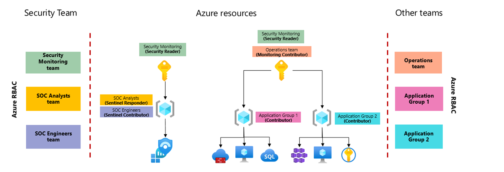

# Microsoft Sentinel workspace architecture best practices

When planning your Microsoft Sentinel workspace deployment, you must also design your Log Analytics workspace architecture. Decisions about the workspace architecture are typically driven by business and technical requirements. This article reviews key decision factors to help you determine the right workspace architecture for your organizations, including:

- Whether you'll use a single tenant or multiple tenants
- Any compliance requirements you have for data collection and storage
- How to control access to Microsoft Sentinel data
- Cost implications for different scenarios

For more information, see [Design your Microsoft Sentinel workspace architecture](design-your-workspace-architecture.md) and [Sample workspace designs](sample-workspace-designs.md) for common scenarios, and [Pre-deployment activities and prerequisites for deploying Microsoft Sentinel](prerequisites.md).

See our video: [Architecting SecOps for Success: Best Practices for Deploying Microsoft Sentinel](https://youtu.be/DyL9MEMhqmI).

This article is part of the [Deployment guide for Microsoft Sentinel](deploy-overview.md).

## Tenancy considerations

While fewer workspaces are simpler to manage, you may have specific needs for multiple tenants and workspaces. For example, many organizations have a cloud environment that contains multiple [Microsoft Entra tenants](../active-directory/develop/quickstart-create-new-tenant.md), resulting from mergers and acquisitions or due to identity separation requirements.

When determining how many tenants and workspaces to use, consider that most Microsoft Sentinel features operate by using a single workspace or Microsoft Sentinel instance, and Microsoft Sentinel ingests all logs housed within the workspace.

Costs are one of the main considerations when determining Microsoft Sentinel architecture. For more information, see [Microsoft Sentinel costs and billing](billing.md).

### Working with multiple tenants

If you have multiple tenants, such as if you're a managed security service provider (MSSP), we recommend that you create at least one workspace for each Microsoft Entra tenant to support built-in, [service to service data connectors](connect-data-sources.md#service-to-service-integration-for-data-connectors) that work only within their own Microsoft Entra tenant.

All connectors based on diagnostics settings can't be connected to a workspace that isn't located in the same tenant where the resource resides. This applies to connectors such as [Azure Firewall](./data-connectors/azure-firewall.md), [Azure Storage](./data-connectors/azure-storage-account.md), [Azure Activity](./data-connectors/azure-activity.md) or [Microsoft Entra ID](connect-azure-active-directory.md).

Use [Azure Lighthouse](../lighthouse/how-to/onboard-customer.md) to help manage multiple Microsoft Sentinel instances in different tenants.

> [!NOTE]
> [Partner data connectors](data-connectors-reference.md) are often based on API or agent collections, and therefore are not attached to a specific Microsoft Entra tenant.
> >
## Compliance considerations

After your data is collected, stored, and processed, compliance can become an important design requirement, with a significant impact on your Microsoft Sentinel architecture. Having the ability to validate and prove who has access to what data under all conditions is a critical data sovereignty requirement in many countries and regions, and assessing risks and getting insights in Microsoft Sentinel workflows is a priority for many customers.

In Microsoft Sentinel, data is mostly stored and processed in the same geography or region, with some exceptions, such as when using detection rules that leverage Microsoft's Machine learning. In such cases, data might be copied outside your workspace geography for processing.

For more information, see:

- [Geographical availability and data residency](geographical-availability-data-residency.md)
- [Data residency in Azure](https://azure.microsoft.com/global-infrastructure/data-residency/)
- [Storing and processing EU data in the EU - EU policy blog](https://blogs.microsoft.com/eupolicy/2021/05/06/eu-data-boundary/)

To start validating your compliance, assess your data sources, and how and where they send data.

> [!NOTE]
> The [Log Analytics agent](connect-windows-security-events.md) supports TLS 1.2 to ensure data security in transit between the agent and the Log Analytics service, as well as the FIPS 140 standard. 
> >
> If you are sending data to a geography or region that is different from your Microsoft Sentinel workspace, regardless of whether or not the sending resource resides in Azure, consider using a workspace in the same geography or region.
> >
## Region considerations

Use separate Microsoft Sentinel instances for each region. While Microsoft Sentinel can be used in multiple regions, you might have requirements to separate data by team, region, or site, or regulations and controls that make multi-region models impossible or more complex than needed. Using separate instances and workspaces for each region helps to avoid bandwidth / egress costs for moving data across regions.

Consider the following when working with multiple regions:

- Egress costs generally apply when the [Log Analytics or Azure Monitor agent](connect-windows-security-events.md) is required to collect logs, such as on virtual machines.

- Internet egress is also charged, which might not affect you unless you export data outside your Log Analytics workspace. For example, you might incur internet egress charges if you export your Log Analytics data to an on-premises server.

- Bandwidth costs vary depending on the source and destination region and collection method. For more information, see:

  - [Bandwidth pricing](https://azure.microsoft.com/pricing/details/bandwidth/)
  - [Data transfers charges using Log Analytics ](../azure-monitor/usage-estimated-costs.md#data-transfer-charges).

- Use templates for your analytics rules, custom queries, workbooks, and other resources to make your deployments more efficient. Deploy the templates instead of manually deploying each resource in each region.

- Connectors that are based on diagnostics settings don't incur in-bandwidth costs. For more information, see [Data transfers charges using Log Analytics](../azure-monitor/usage-estimated-costs.md#data-transfer-charges).

For example, if you decide to collect logs from Virtual Machines in East US and send them to a Microsoft Sentinel workspace in West US, you'll be charged ingress costs for the data transfer. Since the Log Analytics agent compresses the data in transit, the size charged for the bandwidth might be lower than the size of the logs in Microsoft Sentinel.

If you're collecting Syslog and CEF logs from multiple sources around the world, you might want to set up a Syslog collector in the same region as your Microsoft Sentinel workspace to avoid bandwidth costs, provided that compliance isn't a concern.

Understanding whether bandwidth costs justify separate Microsoft Sentinel workspaces depend on the volume of data you need to transfer between regions. Use the [Azure Pricing Calculator](https://azure.microsoft.com/pricing/details/bandwidth/) to estimate your costs.

For more information, see [Data residency in Azure](https://azure.microsoft.com/global-infrastructure/data-residency/).

## Access considerations

You might have situations planned where different teams will need access to the same data. For example, your SOC team must have access to all Microsoft Sentinel data, while operations and applications teams will need access to only specific parts. Independent security teams might also need to access Microsoft Sentinel features, but with varying sets of data.

Combine [resource-context RBAC](resource-context-rbac.md) and [table-level RBAC](../azure-monitor/logs/manage-access.md#set-table-level-read-access) to provide your teams with a wide range of access options that should support most use cases.

For more information, see [Permissions in Microsoft Sentinel](roles.md).

### Resource-context RBAC

The following image shows a simplified version of a workspace architecture where security and operations teams need access to different sets of data, and resource-context RBAC is used to provide the required permissions.

[  ](media/resource-context-rbac/resource-context-rbac-sample.png#lightbox)

In this image, the Microsoft Sentinel workspace is placed in a separate subscription to better isolate permissions.

> [!NOTE]
> Another option would be to place Microsoft Sentinel under a separate management group that's dedicated to security, which would ensure that only minimal permission assignments are inherited. Within the security team, several groups are assigned permissions according to their functions. Because these teams have access to the entire workspace, they'll have access to the full Microsoft Sentinel experience, restricted only by the Microsoft Sentinel roles they're assigned. For more information, see [Permissions in Microsoft Sentinel](roles.md).
> >
In addition to the security subscription, a separate subscription is used for the applications teams to host their workloads. The applications teams are granted access to their respective resource groups, where they can manage their resources. This separate subscription and resource-context RBAC allows these teams to view logs generated by any resources they have access to, even when the logs are stored in a workspace where they *don't* have direct access. The applications teams can access their logs via the **Logs** area of the Azure portal, to show logs for a specific resource, or via Azure Monitor, to show all of the logs they can access at the same time.

Azure resources have built-in support for resource-context RBAC, but might require additional fine-tuning when working with non-Azure resources. For more information, see [Explicitly configure resource-context RBAC](resource-context-rbac.md#explicitly-configure-resource-context-rbac).

### Table-level RBAC

Table-level RBAC enables you to define specific data types (tables) to be accessible only to a specified set of users.

For example, consider if the organization whose architecture is described in the image above must also grant access to Office 365 logs to an internal audit team. In this case, they might use table-level RBAC to grant the audit team with access to the entire **OfficeActivity** table, without granting permissions to any other table.

### Access considerations with multiple workspaces

If you have different entities, subsidiaries, or geographies within your organization, each with their own security teams that need access to Microsoft Sentinel, use separate workspaces for each entity or subsidiary. Implement the separate workspaces within a single Microsoft Entra tenant, or across multiple tenants using Azure Lighthouse.

Your central SOC team might also use an additional, optional Microsoft Sentinel workspace to manage centralized artifacts such as analytics rules or workbooks.

For more information, see [Simplify working with multiple workspaces](#simplify-working-with-multiple-workspaces).

## Technical best practices for creating your workspace

Use the following best practice guidance when creating the Log Analytics workspace you'll use for Microsoft Sentinel:

- **When naming your workspace**, include *Microsoft Sentinel* or some other indicator in the name, so that it's easily identified among your other workspaces.

- **Use the same workspace for both Microsoft Sentinel and Microsoft Defender for Cloud**, so that all logs collected by Microsoft Defender for Cloud can also be ingested and used by Microsoft Sentinel. The default workspace created by Microsoft Defender for Cloud won't appear as an available workspace for Microsoft Sentinel.

- **Use a dedicated workspace cluster if your projected data ingestion is around or more than 1 TB per day**. A [dedicated cluster](../azure-monitor/logs/logs-dedicated-clusters.md) enables you to secure resources for your Microsoft Sentinel data, which enables better query performance for large data sets. Dedicated clusters also provide the option for more encryption and control of your organization's keys.

Don't apply a resource lock to a Log Analytics workspace you'll use for Microsoft Sentinel. A resource lock on a workspace can cause many Microsoft Sentinel operations to fail.

## Simplify working with multiple workspaces

If you do need to work with multiple workspaces, simplify your incident management and investigation by [condensing and listing all incidents from each Microsoft Sentinel instance in a single location](multiple-workspace-view.md).

To reference data that's held in other Microsoft Sentinel workspaces, such as in [cross-workspace workbooks](extend-sentinel-across-workspaces-tenants.md#use-cross-workspace-workbooks), use [cross-workspace queries](extend-sentinel-across-workspaces-tenants.md#query-multiple-workspaces).

The best time to use cross-workspace queries is when valuable information is stored in a different workspace, subscription or tenant, and can provide value to your current action. For example, the following code shows a sample cross-workspace query:

```Kusto
union Update, workspace("contosoretail-it").Update, workspace("WORKSPACE ID").Update
| where TimeGenerated >= ago(1h)
| where UpdateState == "Needed"
| summarize dcount(Computer) by Classification
```

For more information, see [Extend Microsoft Sentinel across workspaces and tenants](extend-sentinel-across-workspaces-tenants.md).

## Next steps

In this article, you learned about key decision factors to help you determine the right workspace architecture for your organizations.

> [!div class="nextstepaction"]
> >[Design your Microsoft Sentinel workspace architecture](design-your-workspace-architecture.md)
