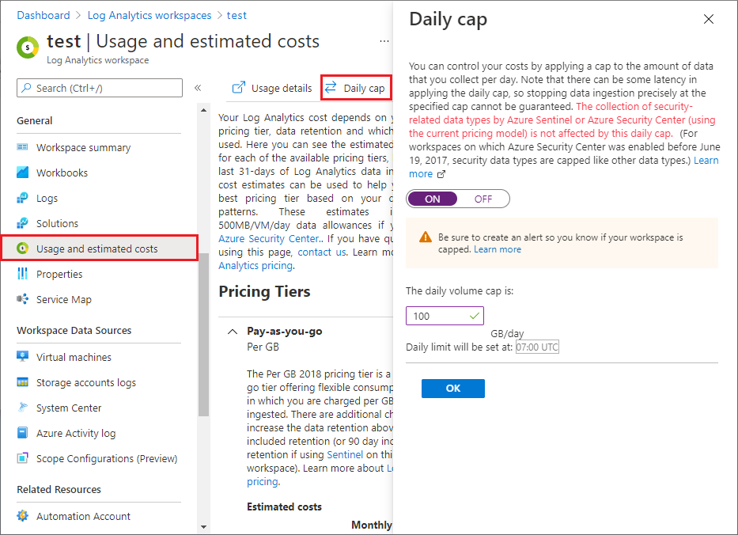

# Manage and monitor costs for Microsoft Sentinel

After you've started using Microsoft Sentinel resources, use Cost Management features to set budgets and monitor costs. You can also review forecasted costs and identify spending trends to identify areas where you might want to act. 

Costs for Microsoft Sentinel are only a portion of the monthly costs in your Azure bill. Although this article explains how to manage and monitor costs for Microsoft Sentinel, you're billed for all Azure services and resources your Azure subscription uses, including Partner services.

## Prerequisites

To view cost data and perform cost analysis in Cost Management, you must have a supported Azure account type, with at least read access.

While cost analysis in Cost Management supports most Azure account types, not all are supported. To view the full list of supported account types, see [Understand Cost Management data](../cost-management-billing/costs/understand-cost-mgt-data.md?WT.mc_id=costmanagementcontent_docsacmhorizontal_-inproduct-learn).

For information about assigning access to Azure Cost Management data, see [Assign access to data](../cost-management/assign-access-acm-data.md?WT.mc_id=costmanagementcontent_docsacmhorizontal_-inproduct-learn).


## View costs by using cost analysis
As you use Azure resources with Microsoft Sentinel, you incur costs. Azure resource usage unit costs vary by time intervals such as seconds, minutes, hours, and days, or by unit usage, like bytes and megabytes. As soon as Microsoft Sentinel starts to analyze billable data, it incurs costs. View these costs by using cost analysis in the Azure portal. For more information, see [Start using cost analysis](../cost-management/quick-acm-cost-analysis.md?WT.mc_id=costmanagementcontent_docsacmhorizontal_-inproduct-learn).

When you use cost analysis, you view Microsoft Sentinel costs in graphs and tables for different time intervals. Some examples are by day, current and prior month, and year. You also view costs against budgets and forecasted costs. Switching to longer views over time can help you identify spending trends. And you see where overspending might have occurred. If you've created budgets, you can also easily see where they're exceeded.

The [Azure Cost Management + Billing](../cost-management-billing/costs/quick-acm-cost-analysis.md) hub provides useful functionality. After you open **Cost Management + Billing** in the Azure portal, select **Cost Management** in the left navigation and then select the [scope](..//cost-management-billing/costs/understand-work-scopes.md) or set of resources to investigate, such as an Azure subscription or resource group.

The **Cost Analysis** screen shows detailed views of your Azure usage and costs, with the option to apply various controls and filters.

For example, to see charts of your daily costs for a certain time frame:

1. Select the drop-down caret in the **View** field and select **Accumulated costs** or **Daily costs**.
1. Select the drop-down caret in the date field and select a date range.
1. Select the drop-down caret next to **Granularity** and select **Daily**.

   The costs shown in the following image are for example purposes only. They're not intended to reflect actual costs.

   :::image type="content" source="media/billing-monitor-costs/cost-management.png" alt-text="Screenshot of a cost management + billing cost analysis screen." lightbox="media/billing-monitor-costs/cost-management.png":::

You could also apply further controls. For example, to view only the costs associated with Microsoft Sentinel, select **Add filter**, select **Service name**, and then select the service names **Sentinel**, **Log Analytics**, and **Azure Monitor**.

Microsoft Sentinel data ingestion volumes appear under **Security Insights** in some portal Usage Charts.

The Microsoft Sentinel classic pricing tiers don't include Log Analytics charges, so you may see those charges billed separately. Microsoft Sentinel simplified pricing combines the two costs into one set of tiers. To learn more about Microsoft Sentinel's simplified pricing tiers, see [Simplified pricing tiers](billing.md#simplified-pricing-tiers).

For more information on reducing costs, see [Create budgets](#create-budgets) and [Reduce costs in Microsoft Sentinel](billing-monitor-costs.md).

## Using Azure Prepayment with Microsoft Sentinel

You can pay for Microsoft Sentinel charges with your Azure Prepayment credit. However, you can't use Azure Prepayment credit to pay bills to third-party organizations for their products and services, or for products from the Azure Marketplace.

## Run queries to understand your data ingestion

Microsoft Sentinel uses an extensive query language to analyze, interact with, and derive insights from huge volumes of operational data in seconds. Here are some Kusto queries you can use to understand your data ingestion volume.

Run the following query to show data ingestion volume by solution:

```kusto
Usage
| where StartTime >= startofday(ago(31d)) and EndTime < startofday(now())
| where IsBillable == true
| summarize BillableDataGB = sum(Quantity) / 1000. by bin(StartTime, 1d), Solution
| extend Solution = iif(Solution == "SecurityInsights", "AzureSentinel", Solution)
| render columnchart
```

Run the following query to show data ingestion volume by data type:

```kusto
Usage
| where StartTime >= startofday(ago(31d)) and EndTime < startofday(now())
| where IsBillable == true
| summarize BillableDataGB = sum(Quantity) / 1000. by bin(StartTime, 1d), DataType
| render columnchart
```

Run the following query to show data ingestion volume by both solution and data type:

```kusto
Usage
| where TimeGenerated > ago(32d)
| where StartTime >= startofday(ago(31d)) and EndTime < startofday(now())
| where IsBillable == true
| summarize BillableDataGB = sum(Quantity) by Solution, DataType
| extend Solution = iif(Solution == "SecurityInsights", "AzureSentinel", Solution)
| sort by Solution asc, DataType asc
```

## Deploy a workbook to visualize data ingestion

The **Workspace Usage Report workbook** provides your workspace's data consumption, cost, and usage statistics. The workbook gives the workspace's data ingestion status and amount of free and billable data. You can use the workbook logic to monitor data ingestion and costs, and to build custom views and rule-based alerts.

This workbook also provides granular ingestion details. The workbook breaks down the data in your workspace by data table, and provides volumes per table and entry to help you better understand your ingestion patterns.

To enable the Workspace Usage Report workbook:

1. In the Microsoft Sentinel left navigation, select **Threat management** > **Workbooks**.
1. Enter *workspace usage* in the Search bar, and then select **Workspace Usage Report**.
1. Select **View template** to use the workbook as is, or select **Save** to create an editable copy of the workbook. If you save a copy, select **View saved workbook**.
1. In the workbook, select the **Subscription** and **Workspace** you want to view, and then set the **TimeRange** to the time frame you want to see. You can set the **Show help** toggle to **Yes** to display in-place explanations in the workbook.

## Export cost data

You can also [export your cost data](../cost-management-billing/costs/tutorial-export-acm-data.md?WT.mc_id=costmanagementcontent_docsacmhorizontal_-inproduct-learn) to a storage account. Exporting cost data is helpful when you need or others to do more data analysis for costs. For example, a finance team can analyze the data using Excel or Power BI. You can export your costs on a daily, weekly, or monthly schedule and set a custom date range. Exporting cost data is the recommended way to retrieve cost datasets.

## Create budgets

You can create [budgets](../cost-management/tutorial-acm-create-budgets.md?WT.mc_id=costmanagementcontent_docsacmhorizontal_-inproduct-learn) to manage costs and create [alerts](../cost-management-billing/costs/cost-mgt-alerts-monitor-usage-spending.md?WT.mc_id=costmanagementcontent_docsacmhorizontal_-inproduct-learn) that automatically notify stakeholders of spending anomalies and overspending risks. Alerts are based on spending compared to budget and cost thresholds. Budgets and alerts are created for Azure subscriptions and resource groups, so they're useful as part of an overall cost monitoring strategy.

You can create budgets with filters for specific resources or services in Azure if you want more granularity in your monitoring. Filters help ensure that you don't accidentally create new resources that cost you more money. For more information about the filter options available when you create a budget, see [Group and filter options](../cost-management-billing/costs/group-filter.md?WT.mc_id=costmanagementcontent_docsacmhorizontal_-inproduct-learn).

## Use a playbook for cost management alerts

To help you control your Microsoft Sentinel budget, you can create a cost management playbook. The playbook sends you an alert if your Microsoft Sentinel workspace exceeds a budget, which you define, within a given timeframe.

The Microsoft Sentinel GitHub community provides the [`Send-IngestionCostAlert`](https://github.com/iwafula025/Azure-Sentinel/tree/master/Playbooks/Send-IngestionCostAlert) cost management playbook on GitHub. This playbook is activated by a recurrence trigger, and gives you a high level of flexibility. You can control execution frequency, ingestion volume, and the message to trigger, based on your requirements.

## Define a data volume cap in Log Analytics

> [!IMPORTANT]
> Starting September 18, 2023, the Log Analytics Daily Cap will no longer exclude the below set of data types from the daily cap, and all billable data types will be capped if the daily cap is met. This change improves your ability to fully contain costs from higher-than-expected data ingestion. 
> If you have a Daily Cap set on your workspace which has [Microsoft Defender for Servers](/azure/defender-for-cloud/plan-defender-for-servers-select-plan) or Microsoft Sentinel, be sure that the cap is high enough to accommodate this change. Also, be sure to set an alert so that you are notified as soon as your Daily Cap is met, see [Set daily cap on Log Analytics workspace](../azure-monitor/logs/daily-cap.md). 

In Log Analytics, you can enable a daily volume cap that limits the daily ingestion for your workspace. The daily cap can help you manage unexpected increases in data volume, stay within your limit, and limit unplanned charges.

To define a daily volume cap, select **Usage and estimated costs** in the left navigation of your Log Analytics workspace, and then select **Daily cap**. Select **On**, enter a daily volume cap amount, and then select **OK**.



The **Usage and estimated costs** screen also shows your ingested data volume trend in the past 31 days, and the total retained data volume.

Until September 18, 2023, the following is true. If a workspace enabled the ⁠[Microsoft Defenders for Servers](/azure/defender-for-cloud/plan-defender-for-servers-select-plan) solution after June 19, 2017, some security related data types are collected for Microsoft Defender for Cloud or Microsoft Sentinel despite any daily cap configured. The following data types will be subject to this special exception from the daily cap:

- WindowsEvent
- SecurityAlert
- SecurityBaseline
- SecurityBaselineSummary
- SecurityDetection
- SecurityEvent
- WindowsFirewall
- MaliciousIPCommunication
- LinuxAuditLog
- SysmonEvent
- ProtectionStatus
- Update
- UpdateSummary 
- CommonSecurityLog
- Syslog

For more information about managing the daily cap in Log Analytics, see [Set daily cap on Log Analytics workspace](../azure-monitor/logs/daily-cap.md).

## Next steps

- [Reduce costs for Microsoft Sentinel](billing-reduce-costs.md)
- Learn [how to optimize your cloud investment with Azure Cost Management](../cost-management-billing/costs/cost-mgt-best-practices.md?WT.mc_id=costmanagementcontent_docsacmhorizontal_-inproduct-learn).
- Learn more about managing costs with [cost analysis](../cost-management-billing/costs/quick-acm-cost-analysis.md?WT.mc_id=costmanagementcontent_docsacmhorizontal_-inproduct-learn).
- Learn about how to [prevent unexpected costs](../cost-management-billing/understand/analyze-unexpected-charges.md?WT.mc_id=costmanagementcontent_docsacmhorizontal_-inproduct-learn).
- Take the [Cost Management](/training/paths/control-spending-manage-bills?WT.mc_id=costmanagementcontent_docsacmhorizontal_-inproduct-learn) guided learning course.
- For more tips on reducing Log Analytics data volume, see [Azure Monitor best practices - Cost management](../azure-monitor/best-practices-cost.md).
