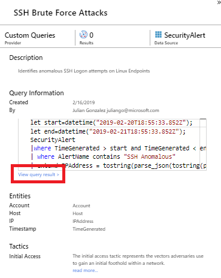
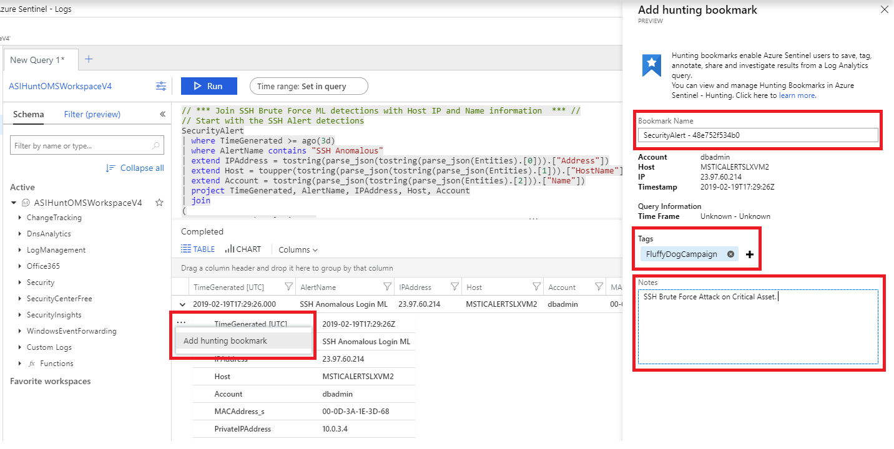
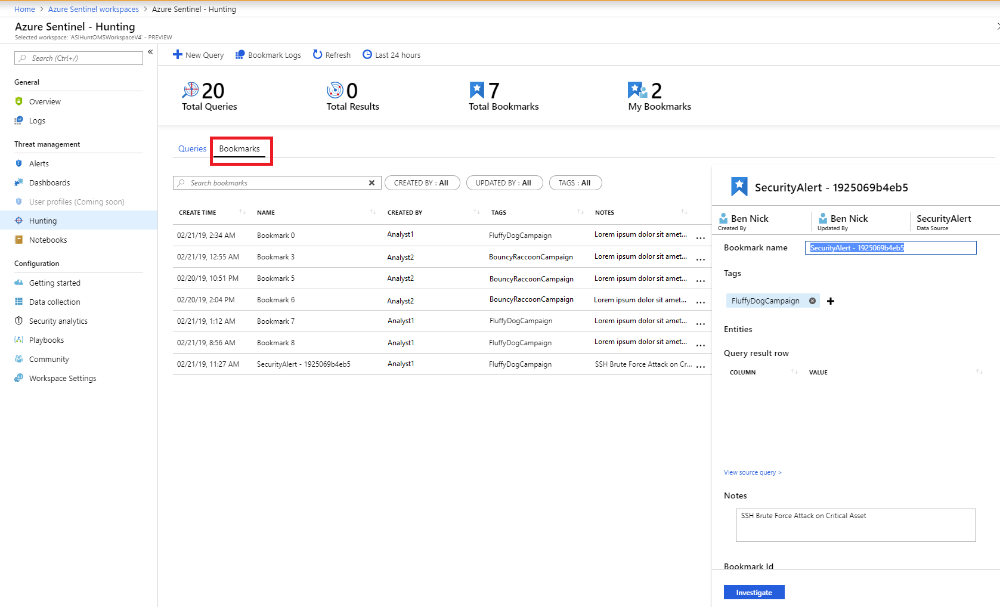

# Keep track of data during hunting with Azure Sentinel

Threat hunting typically requires reviewing mountains of log data looking for evidence of malicious behavior. During this process, investigators find events that they want to remember, revisit, and analyze as part of validating potential hypotheses and understanding the full story of a compromise.

Hunting bookmarks in Azure Sentinel help you do this, by preserving the queries you ran in Log Analytics, along with the query results that you deem relevant. You can also record your contextual observations and reference your findings by adding notes and tags. Bookmarked data is visible to you and your teammates for easy collaboration.

Now in preview, you can pivot between data in Log Analytics and the Investigation Graph by creating a bookmark and clicking **investigate**.  Also, if you find something that urgently needs to be addressed while hunting in Log Analytics, you can create a bookmark and promote it to an incident, or add the bookmark to an existing incident in a couple of clicks.

You can revisit your bookmarked data at any time on the **Bookmark** tab of the **Hunting** page. You can use filtering and search options to quickly find specific data for your current investigation. Alternatively, you can view your bookmarked data directly in the **HuntingBookmark** table in Log Analytics. This enables you to filter, summarize, and join bookmarked data with other data sources, making it easy to look for corroborating evidence.

You can also visualize your bookmarked data, by clicking **Investigate**. This launches the investigation experience in which you can view, investigate, and visually communicate your findings using an interactive entity-graph diagram and timeline.

## Run a Log Analytics query from Azure Sentinel

1. In the Azure portal, select **Sentinel** > **Hunting** to run queries for suspicious and anomalous behavior.

1. To run a hunting campaign, select one of the hunting queries and on the left, review the results. 

1. Click **View query results** in the hunting query **Details** page to view the query results in Log Analytics. Here's an example of what you see if you ran a custom SSH bruteforce attack query.
  
   

## Add a bookmark

1. In the Log Analytics query results list, expand the row containing the information that you find interesting.

2. Select the ellipsis (...) at the end of the row, and select **Add hunting bookmarks**.

3. On the right, in the **Details** page, update the name, and add tags, and notes to help you identify what was interesting about the item.

3. Click **Save** to commit your changes. All bookmarked data is shared with other investigators, and is a first step toward a collaborative investigation experience.

   

 
> [!NOTE]
> You can also use bookmarks with arbitrary Log Analytics queries launched from the Azure Sentinel Log Analytics Logs page, or queries created on the fly from the Log Analytics page and opened from the Hunting page. You will not be able to add a bookmark if you launch Log Analytics from outside of Azure Sentinel. 

## View and update bookmarks 

1. In the Azure portal, select **Sentinel** > **Threat management** > **Hunting**. 
2. Select the **Bookmarks** tab to view the list of bookmarks.
3. If required, use the search box or filter options to find a specific bookmark.
4. Select individual bookmarks and view the bookmark details in the right hand details pane.
5. To update tags and notes, make your changes in the editable text boxes, and then click **Save**.

   

## Investigate bookmarks in the investigation graph - Preview

> [!IMPORTANT]
> Investigating bookmarks in the investigation graph is currently in public preview.
> This feature is provided without a service level agreement, and it's not recommended for production workloads.
> For more information, see [Supplemental Terms of Use for Microsoft Azure Previews](https://azure.microsoft.com/support/legal/preview-supplemental-terms/).

1. In the Azure portal, **Sentinel** > **Threat management** > **Hunting** and the **Bookmarks** tab, select the bookmark or bookmarks you want to investigate.

2. In the bookmark details pane, ensure that at least one entity is mapped. For example, for **ENTITIES**, you see values for **IP**, **Machine**, or **Account**.

3. Click **Investigate**.

### Add bookmarks to a new or existing incident - Preview

> [!IMPORTANT]
> Adding bookmarks to a new or existing incident is currently in public preview.
> This feature is provided without a service level agreement, and it's not recommended for production workloads.
> For more information, see [Supplemental Terms of Use for Microsoft Azure Previews](https://azure.microsoft.com/support/legal/preview-supplemental-terms/).

1. In the Azure portal, **Sentinel** > **Threat management** > **Hunting** and the **Bookmarks** tab, select the bookmark or bookmarks you want to add to an incident.

2. On the actions bar, select **Incident actions (Preview)**:
    
    > [!div class="mx-imgBorder"]
    > 

3. Select either **Create new incident** or **Add to existing incident**, as required.

## View bookmarked data in Log Analytics 

There are multiple options to viewing your bookmarked data in Log Analytics. 

The easiest way to view bookmarked queries, results, or history is by selecting the desired bookmark in the **Bookmarks** table and use the links provided in the details pane. Options include: 
- Click on **View query** to view the source query in Log Analytics.  
- Click on **View bookmark history** to see all bookmark metadata including: who made the update, the updated values, and the time the update occurred. 

- You can also view the raw bookmark data for all bookmarks by clicking on **Bookmark logs** above the bookmark grid. This view will show the all your bookmarks in the hunting bookmark table with associated metadata. You can use KQL queries to filter down to the latest version of the specific bookmark you are looking for.  

> [!NOTE]
> There can be significant delay (measured in minutes) between the creation of a bookmark and when it is displayed in the **HuntingBookmark** table. It is recommended to create your bookmarks first, then analyze them after the data is ingested. 

## Delete a bookmark
If you want to delete a bookmark, do the following: 
1.	Open the **Hunting bookmark** tab. 
2.	Select the target bookmark.
3.	Select the ellipsis (...) at the end of the row and select **Delete bookmark**.
	
Deleting the bookmark removes the bookmark from the list in the **Bookmark** tab. The Log Analytics “HuntingBookmark” table will continue to contain previous bookmark entries, but the latest entry will change the **SoftDelete** value to true, making it easy to filter out old bookmarks. Deleting a bookmark does not remove any entities from the investigation experience that are associated with other bookmarks or alerts. 

## Next steps

In this article, you learned how to run a hunting investigation using bookmarks in Azure Sentinel. To learn more about Azure Sentinel, see the following articles:

- [Proactively hunt for threats](hunting.md)
- [Use notebooks to run automated hunting campaigns](notebooks.md)
