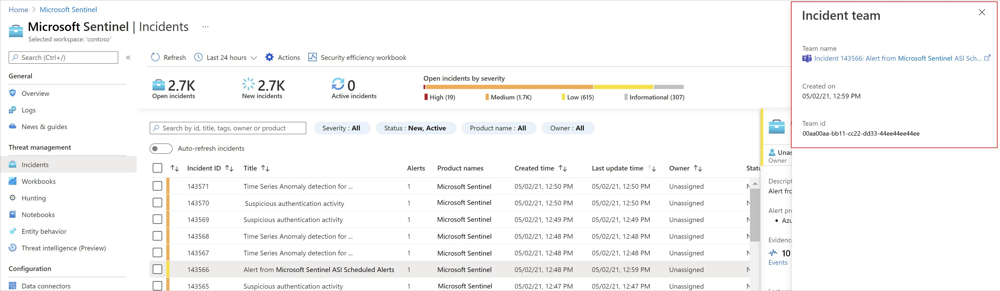

# Collaborate in Microsoft Teams (Public preview)

Microsoft Sentinel supports a direct integration with [Microsoft Teams](/microsoftteams/), enabling you to jump directly into teamwork on specific incidents.

> [!IMPORTANT]
> Integration with Microsoft Teams is currently in **PREVIEW**. See the [Supplemental Terms of Use for Microsoft Azure Previews](https://azure.microsoft.com/support/legal/preview-supplemental-terms/) for additional legal terms that apply to Azure features that are in beta, preview, or otherwise not yet released into general availability.

## Overview

Integrating with Microsoft Teams directly from Microsoft Sentinel enables your teams to collaborate seamlessly across the organization, and with external stakeholders.

Use Microsoft Teams with a Microsoft Sentinel *incident team* to centralize your communication and coordination across the relevant personnel. Incident teams are especially helpful when used as a dedicated conference bridge for high-severity, ongoing incidents.

Organizations that already use Microsoft Teams for communication and collaboration can use the Microsoft Sentinel integration to bring security data directly into their conversations and daily work. 

A Microsoft Sentinel incident team always has the most updated and recent data from Microsoft Sentinel, ensuring that your teams have the most relevant data right at hand.

## Required permissions

In order to create teams from Microsoft Sentinel:

- The user creating the team must have Incident write permissions in Microsoft Sentinel. For example, the [Microsoft Sentinel Responder](../role-based-access-control/built-in-roles.md#microsoft-sentinel-responder) role is an ideal, minimum role for this privilege.

- The user creating the team must also have permissions to create teams in Microsoft Teams.

- Any Microsoft Sentinel user, including users with the [Reader](../role-based-access-control/built-in-roles.md#microsoft-sentinel-reader), [Responder](../role-based-access-control/built-in-roles.md#microsoft-sentinel-responder), or [Contributor](../role-based-access-control/built-in-roles.md#microsoft-sentinel-contributor) roles, can gain access to the created team by requesting access.

## Use an incident team to investigate

Investigate together with an *incident team* by integrating Microsoft Teams directly from your incident.

**To create your incident team**:

1. In Microsoft Sentinel, in the **Threat management** > **Incidents** grid, select the incident you're currently investigating.

1. At the bottom of the incident pane that appears on the right, select **Actions** > **Create team (Preview)**.

    

    The **Incident team** pane opens on the right. Define the following settings for your incident team:

    - **Team name**: Automatically defined as the name of your incident. Modify the name as needed so that it's easily identifiable to you.
    - **Team description**: Enter a meaningful description for your incident team.
    - **Add groups and members**: Select one or more Microsoft Entra users and/or groups to add to your incident team. As you select users and groups, they will appear in the **Selected groups and users:** list below the **Add groups and members** list.

        > [!TIP]
        > If you regularly work with the same users and groups, you may want to select the star :::image type="icon" source="media/collaborate-in-microsoft-teams/save-as-favorite.png" border="false"::: next to each one in the **Selected groups and users** list to save them as favorites.
        >
        > Favorites are automatically selected the next time you create a team. If you want to remove a favorite from the next team you create, either select **Delete** :::image type="icon" source="media/collaborate-in-microsoft-teams/delete-user-group.png" border="false":::, or select the star :::image type="icon" source="media/collaborate-in-microsoft-teams/save-as-favorite.png" border="false"::: again to remove the team from your favorites altogether.
        >

1. When you're done adding users and groups, select **Create team** to create your incident team.

    The incident pane refreshes, with a link to your new incident team under the **Team name** title.

    

1. Select your **Teams integration** link to switch into Microsoft Teams, where all of the data about your incident is listed on the **Incident page** tab.

    

Continue the conversation about the investigation in Teams for as long as needed. You have the full incident details directly in teams.

> [!TIP]
> - If you need to add individual users to your team, you can do so in Microsoft Teams using the **Add more people** button on the **Posts** tab.
>
> - When you [close an incident](investigate-cases.md#closing-an-incident), the related incident team you've created in Microsoft Teams is archived. If the incident is ever re-opened, the related incident team is also re-opened in Microsoft Teams so that you can continue your conversation, right where you left off.
>

## Next steps

For more information, see:

- [Tutorial: Investigate incidents with Microsoft Sentinel](investigate-cases.md)
- [Overview of teams and channels in Microsoft Teams](/microsoftteams/teams-channels-overview/)
