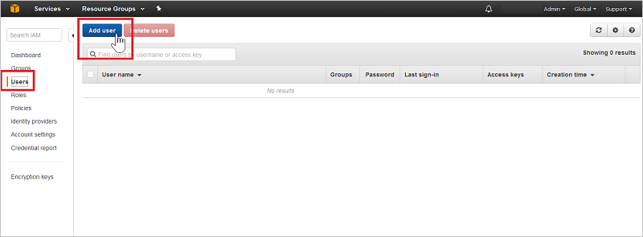
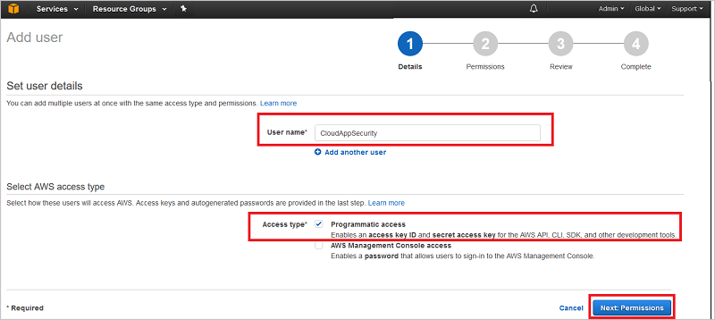
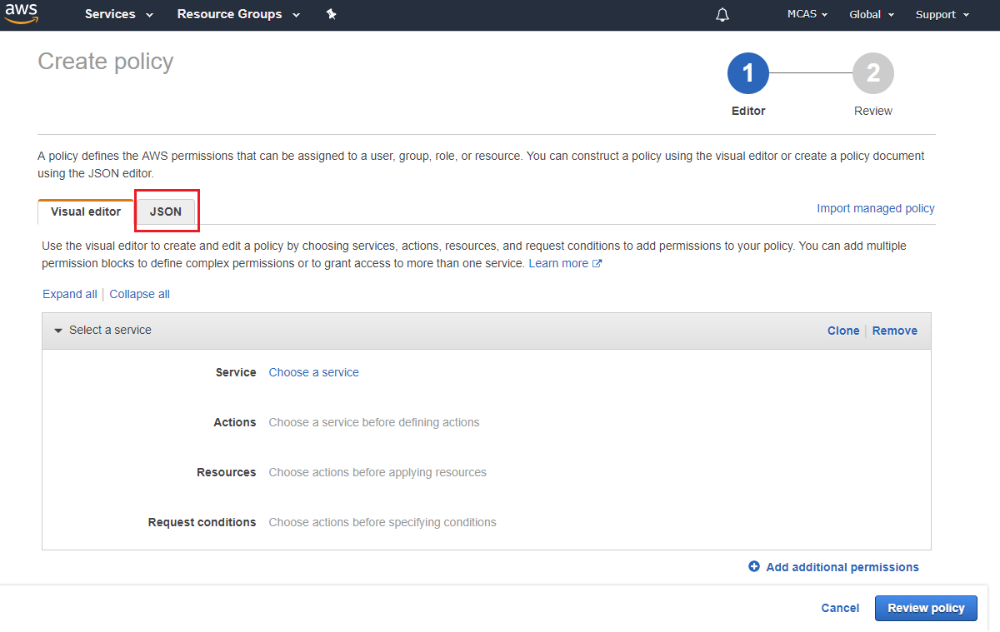
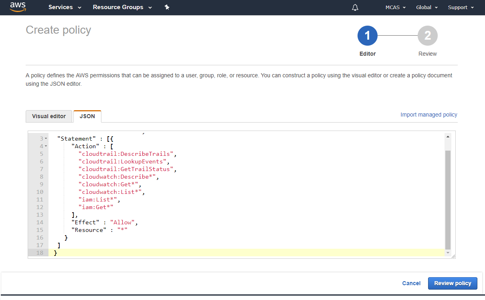
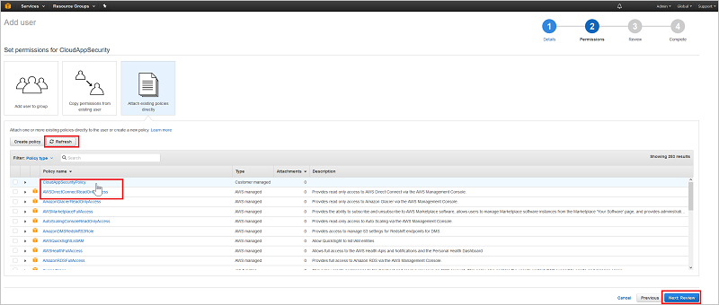
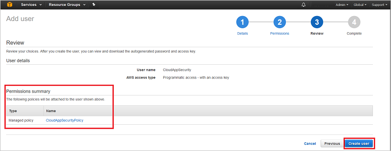

# Collect data from AWS


This article provides instructions for connecting Azure Sentinel to your existing Amazon Web Services account using the connector. This connection streams your AWS CloudTrail logs into your Azure Sentinel workspace in just a few clicks. 
  
## How to connect Amazon Web Services to Azure Sentinel  

To stream logs from AWS to Azure Sentinel, you first have to download keys to your AWS instance, and then paste them in the new account you create in Azure Sentinel.

## Step 1: Download your AWS keys
  
1.  In your [Amazon Web Services console](https://console.aws.amazon.com/), under **Security, Identity & Compliance**, click on **IAM**.  
  
       
  
2.  Click on the **Users** tab and then click **Add user**.  
  
     
  
4.  In the **Details** step, provide a new user name for Azure Sentinel. Make sure that under **Access type** you select **Programmatic access** and click **Next permissions**.  

     

5. Click on the JSON tab:

     

6. Paste the following script into the provided area:

    ```     
    {  
      "Version" : "2012-10-17",  
      "Statement" : [{  
          "Action" : [  
            "cloudtrail:DescribeTrails",  
            "cloudtrail:LookupEvents",  
            "cloudtrail:GetTrailStatus",  
            "cloudwatch:Describe*",  
            "cloudwatch:Get*",  
            "cloudwatch:List*",  
            "iam:List*",  
            "iam:Get*",
            "s3:ListAllMyBuckets",
            "s3:PutBucketAcl",
            "s3:GetBucketAcl",
            "s3:GetBucketLocation"
          ],  
          "Effect" : "Allow",  
          "Resource" : "*"  
        }  
      ]  
     }  
  
    ```  

     
    
6. Click **Review policy**.

7. Provide a **Name** and click **Create policy**.

     

9. Back in the **Add user** screen, refresh the list if necessary, and select the user you created, and click **Next review**.

   

10. If all the details are correct, click **Create user**.

    

11. When you get the success message, click **Download .csv** to save a copy of the new user's credentials, you need these later.  

    
  
## Step 2: Set Azure Sentinel to gather the data

1. In Azure Sentinel, click **Data collection** and then select the **AWS** tile.

2. Under **Add account to Azure Sentinel integration** click **Add account**. 
1. In the **AWS account details** pane, provide the **AWS account name**, the **Access key, and the **Secret key** that you saved at the end of Step 1 and click **Connect**.
 
 
> [!NOTE]
> Make sure you don't connect the same account twice, this will stop the connection from working properly.

## Next steps
In this document, you learned how to connect AWS to Azure Sentinel. To learn more about Azure Sentinel, see the following articles:
- Learn how to [get visibility into your data, and potential threats](qs-get-visibility.md).
- Get started [detecting threats with Azure Sentinel](tutorial-detect-threats.md).
