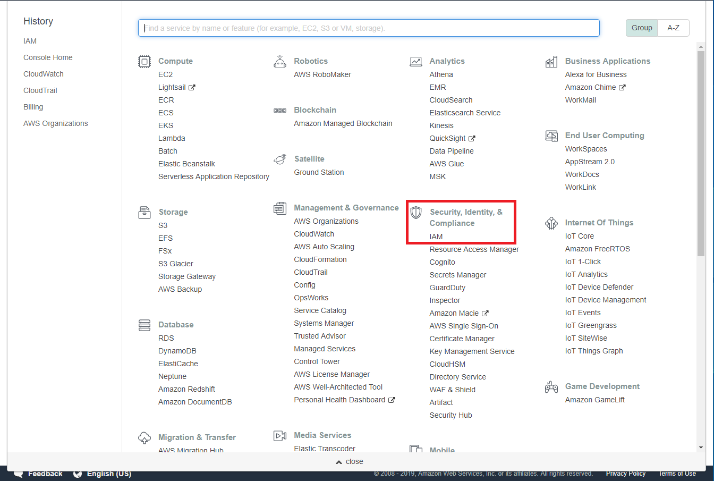
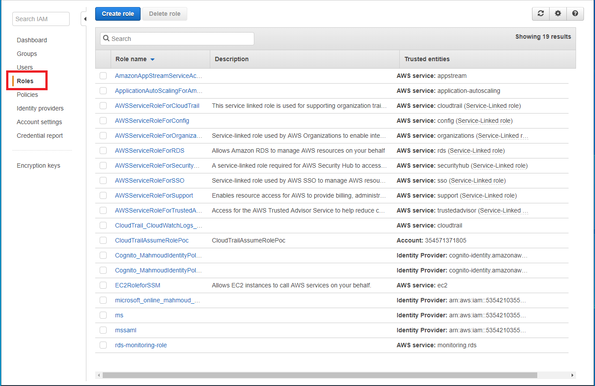
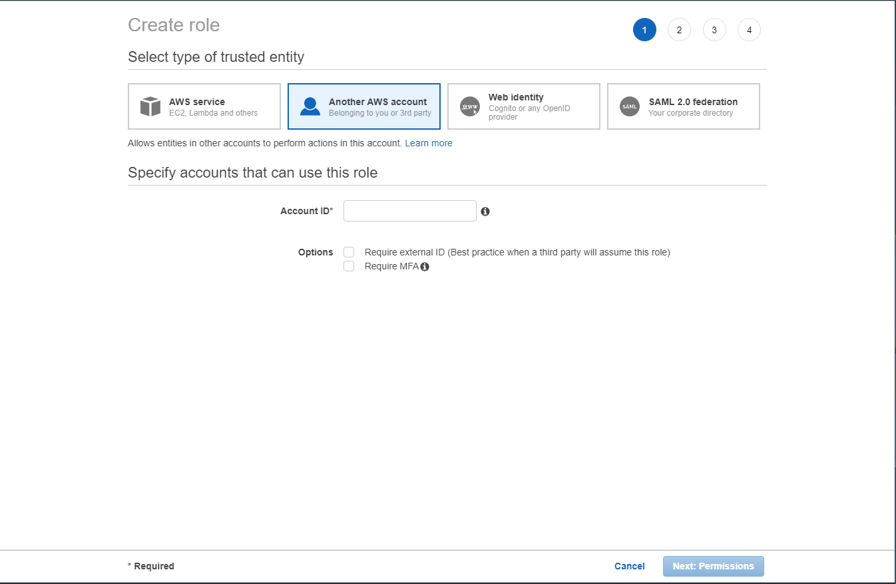
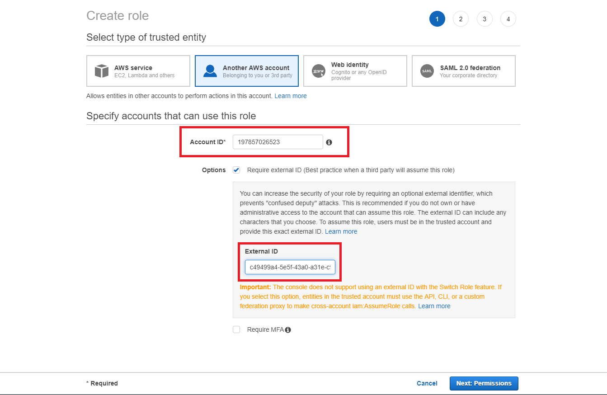
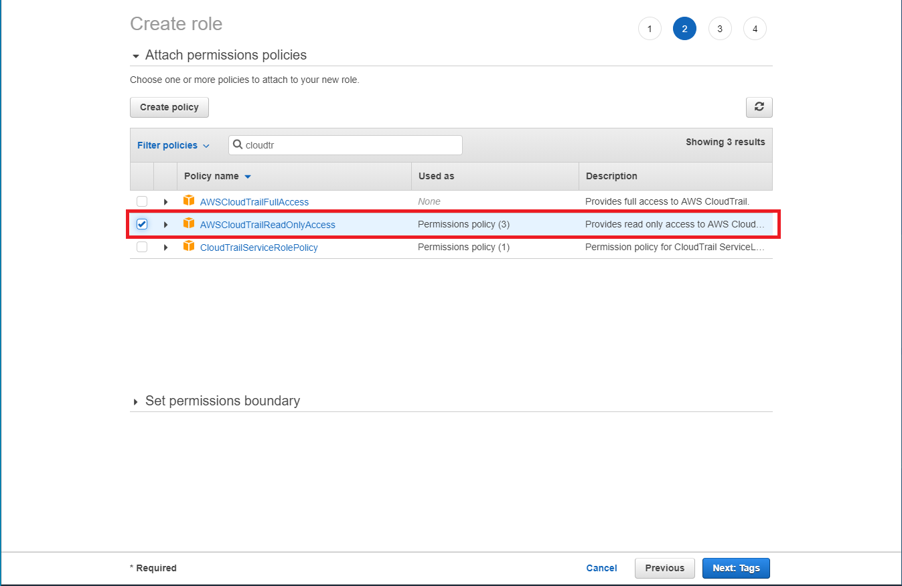
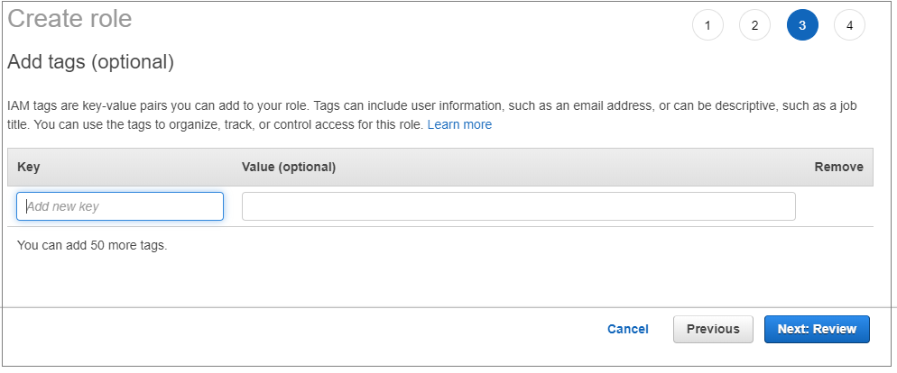
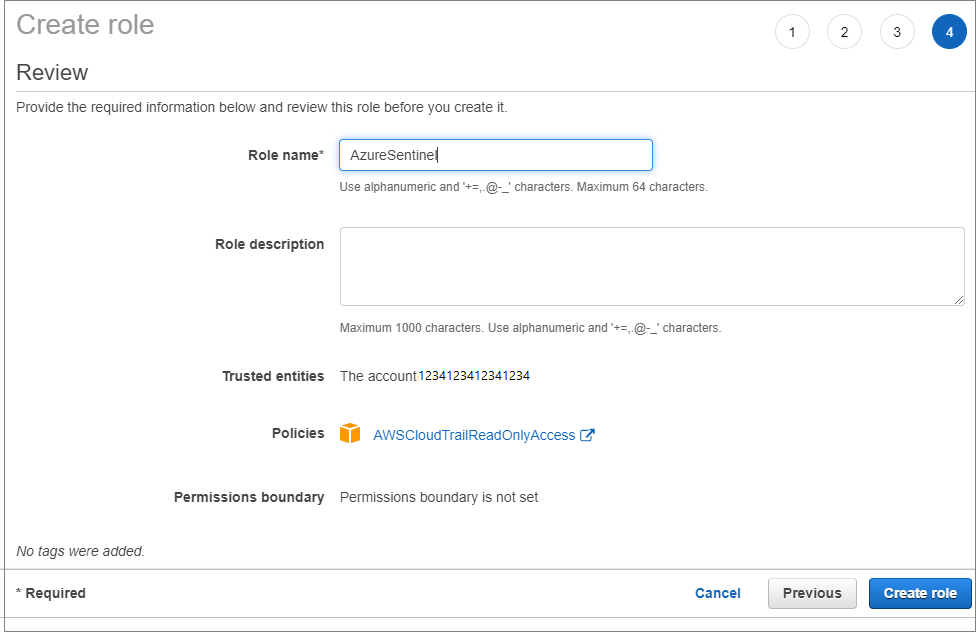
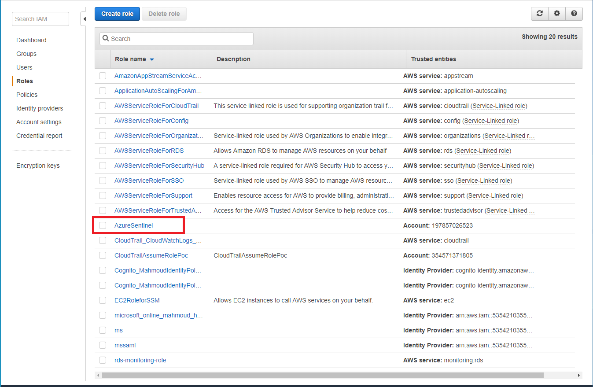
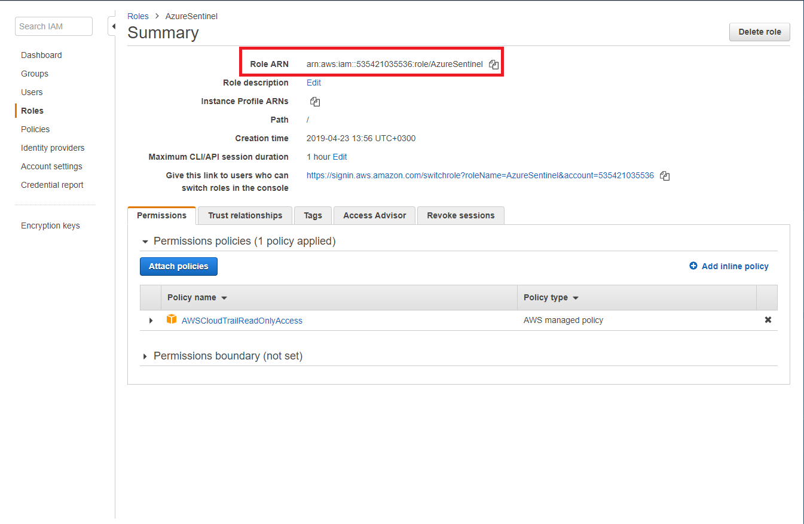

# Connect Azure Sentinel to AWS CloudTrail

Use the AWS connector to stream all your AWS CloudTrail events into Azure Sentinel. This connection process delegates access for Azure Sentinel to your AWS resource logs, creating a trust relationship between AWS CloudTrail and
Azure Sentinel. This is accomplished on AWS by creating a role that gives permission to Azure Sentinel to access your AWS logs.

## Prerequisites

You must have write permission on the Azure Sentinel workspace.

> [!NOTE]
> Azure Sentinel collects CloudTrail events from all regions. It is recommended that you do not stream events from one region to another.

## Connect AWS 

1. In Azure Sentinel, select **Data connectors** and then select the **Amazon Web Services** line in the table and in the AWS pane to the right,  click **Open connector page**.

1. Follow the instructions under **Configuration** using the following steps.
 
1.  In your Amazon Web Services console, under **Security, Identity & Compliance**, select **IAM**.

    

1.  Choose **Roles** and select **Create role**.

    

1.  Choose **Another AWS account.** In the **Account ID** field, enter the **Microsoft Account ID** (**123412341234**) that can be found in the AWS connector page in the Azure Sentinel portal.

    

1.  Make sure **Require External ID** is selected and then and enter the External ID (Workspace ID) that can be found in the AWS connector page in the Azure Sentinel portal.

    

1.  Under **Attach permissions policy** select **AWSCloudTrailReadOnlyAccess**.

    

1.  Enter a Tag (Optional).

    

1.  Then, enter a **Role name** and select the **Create role** button.

    

1.  In the Roles list, choose the role you created.

    

1.  Copy the **Role ARN**. In the Azure Sentinel portal, in the Amazon Web Services connector screen, paste it into the **Role to add** field and click **Add**.

    

1. To use the relevant schema in Log Analytics for AWS events, search for **AWSCloudTrail**.

## Next steps
In this document, you learned how to connect AWS CloudTrail to Azure Sentinel. To learn more about Azure Sentinel, see the following articles:
- Learn how to [get visibility into your data, and potential threats](quickstart-get-visibility.md).
- Get started [detecting threats with Azure Sentinel](tutorial-detect-threats.md).

