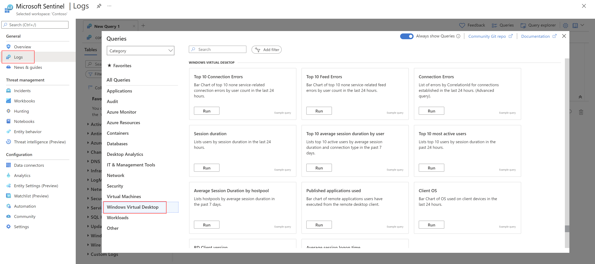

# Connect Azure Virtual Desktop data to Microsoft Sentinel

This article describes how you can monitor your Azure Virtual Desktop environments using Microsoft Sentinel.

For example, monitoring your Azure Virtual Desktop environments can enable you to provide more remote work using virtualized desktops, while maintaining your organization's security posture.

## Azure Virtual Desktop data in Microsoft Sentinel

Azure Virtual Desktop data in Microsoft Sentinel includes the following types:

|Data  |Description  |
|---------|---------|
|**Windows event logs**     |  Windows event logs from the Azure Virtual Desktop environment are streamed into a Microsoft Sentinel-enabled Log Analytics workspace in the same manner as Windows event logs from other Windows machines, outside of the Azure Virtual Desktop environment.   Install the Log Analytics agent onto your Windows machine and configure the Windows event logs to be sent to the Log Analytics workspace.  For more information, see: - [Install Log Analytics agent on Windows computers](../azure-monitor/agents/agent-windows.md) - [Collect Windows event log data sources with Log Analytics agent](../azure-monitor/agents/data-sources-windows-events.md) - [Connect Windows security events](connect-windows-security-events.md)       |
|**Microsoft Defender for Endpoint alerts**     |  To configure Defender for Endpoint for Azure Virtual Desktop, use the same procedure as you would for any other Windows endpoint.   For more information, see:  - [Set up Microsoft Defender for Endpoint deployment](/windows/security/threat-protection/microsoft-defender-atp/production-deployment) - [Connect data from Microsoft Defender XDR to Microsoft Sentinel](connect-microsoft-365-defender.md)       |
|**Azure Virtual Desktop diagnostics**     | Azure Virtual Desktop diagnostics is a feature of the Azure Virtual Desktop PaaS service, which logs information whenever someone assigned Azure Virtual Desktop role uses the service.   Each log contains information about which Azure Virtual Desktop role was involved in the activity, any error messages that appear during the session, tenant information, and user information.   The diagnostics feature creates activity logs for both user and administrative actions.   For more information, see [Use Log Analytics for the diagnostics feature in Azure Virtual Desktop](../virtual-desktop/virtual-desktop-fall-2019/diagnostics-log-analytics-2019.md).        |

## Connect Azure Virtual Desktop data

To start ingesting Azure Virtual Desktop data into Microsoft Sentinel, use the instructions from the Azure Virtual Desktop documentation.

For more information, see [Push Azure Virtual Desktop data to your Log Analytics workspace](../virtual-desktop/diagnostics-log-analytics.md).

## Find your data

After a successful connection is established, run queries in Microsoft Sentinel against your Log Analytics data.

For example, see sample queries from the [Azure Virtual Desktop documentation](../virtual-desktop/diagnostics-log-analytics.md).

Microsoft Sentinel also provides built-in queries in the **General** > **Logs** > **Azure Virtual Desktop** area:

## Next steps

For more information, see the [Azure Monitor for Azure Virtual Desktop glossary](../virtual-desktop/azure-monitor-glossary.md).
