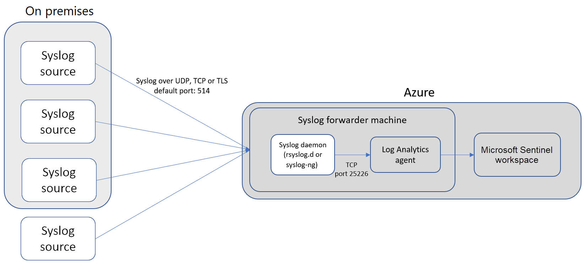
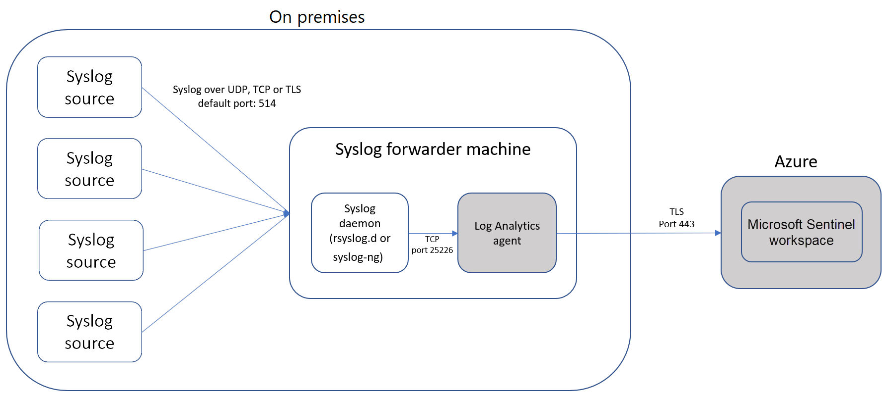

# Connect data sources

[!INCLUDE [reference-to-feature-availability](includes/reference-to-feature-availability.md)]

After you enable Azure Sentinel, the first thing you need to do is connect your data sources. Azure Sentinel comes with many connectors for Microsoft products, available out of the box and providing real-time integration. These service-to-service connectors include Microsoft 365 Defender connectors, Microsoft 365 sources including Office 365, Azure Active Directory (Azure AD), Microsoft Defender for Identity, and Microsoft Cloud App Security.

You can also enable built-in connectors to the broader security ecosystem for non-Microsoft products. You can use Syslog, Common Event Format (CEF), or REST APIs to connect your data sources with Azure Sentinel.

To enable a data connector in Azure Sentinel:

1. On the Azure Sentinel left navigation menu, select **Data connectors**. The **Data connectors** page shows the full list of connectors that Azure Sentinel provides, and their status. Select the connector you want to connect, and then select **Open connector page**. 

   

1. On the connector page, make sure you've fulfilled all the prerequisites, and follow the instructions to connect the data to Azure Sentinel. It may take some time for the logs to start syncing with Azure Sentinel. After you connect, you see a summary of the data in the **Data received** graph, and the connectivity status of the data types.

   
  
1. Select the **Next steps** tab to see content that Azure Sentinel provides for the specific data type.

   

## Data connector support

Microsoft and other organizations author Azure Sentinel data connectors. Each data connector has one of the following support types:

| Support type| Description|
|-------------|------------|
|**Microsoft-supported**|Applies to:<ul><li>Data connectors for data sources where Microsoft is the data provider and author.</li><li>Some Microsoft-authored data connectors for non-Microsoft data sources.</li></ul>Microsoft supports and maintains data connectors in this category in accordance with [Microsoft Azure Support Plans](https://azure.microsoft.com/support/options/#overview).  Partners or the Community provide support and maintenance for data connectors authored by any party other than Microsoft.|
|**Partner-supported**|Applies to data connectors authored by parties other than Microsoft.  The partner company provides support or maintenance for these data connectors. The partner company can be an Independent Software Vendor, a Managed Service Provider (MSP/MSSP), a Systems Integrator (SI), or any organization whose contact information is provided on the Azure Sentinel page for that data connector.  For any issues with a partner-supported data connector, contact the specified data connector support contact.|
|**Community-supported**|Applies to data connectors authored by Microsoft or partner developers that don't have listed contacts for data connector support and maintenance on the page for that data connector.  For questions or issues with these data connectors, you can [file an issue](https://github.com/Azure/Azure-Sentinel/issues/new/choose) in the [Azure Sentinel GitHub community](https://aka.ms/threathunters).|

### Find the support contact

To find the support contact information for a data connector:

1. In the Azure Sentinel left menu, select **Data connectors**.
   
1. Select the connector you want to find support information for.
   
1. View the **Supported by** field on the side panel for the data connector.
   
   
   
   The **Supported by** field has a support contact link you can use for support and maintenance of the selected data connector.

## Data connection methods

Azure Sentinel supports the following data connection methods:

### Service to service integration

Some services connect natively, such as Amazon Web Services and Microsoft services. These services use the Azure foundation for out-of-the box integration. You can connect the following services with a few selections:

- [Amazon Web Services - CloudTrail](connect-aws.md)
- [Azure Active Directory](connect-azure-active-directory.md) - audit logs and sign-in logs
- [Azure Active Directory Identity Protection](connect-azure-ad-identity-protection.md)
- [Azure Activity](connect-azure-activity.md)
- [Azure DDoS Protection](connect-azure-ddos-protection.md)
- [Azure Defender](connect-azure-security-center.md) alerts from Azure Security Center
- [Azure Defender for IoT](connect-asc-iot.md) (formerly Azure Security Center for IoT)
- [Azure Firewall](connect-azure-firewall.md)
- [Azure Information Protection](connect-azure-information-protection.md). InformationProtectionLogs_CL usually uses the **InformationProtectionEvents** function in addition to the data type. For more information, see [How to modify the reports and create custom queries](/azure/information-protection/reports-aip#how-to-modify-the-reports-and-create-custom-queries).
- [Azure Key Vault](connect-azure-key-vault.md)
- [Azure Kubernetes Service (AKS)](connect-azure-kubernetes-service.md)
- [Azure SQL Databases](connect-azure-sql-logs.md)
- [Azure Storage Account](connect-azure-storage-account.md)
- [Azure Web Application Firewall (WAF)](connect-azure-waf.md) (formerly Microsoft WAF)
- [Domain name server](connect-dns.md)
- [Dynamics 365](connect-dynamics-365.md)
- [Microsoft 365 Defender](connect-microsoft-365-defender.md) - includes M365D incidents and Defender for Endpoint raw data
- [Microsoft Cloud App Security (MCAS)](connect-cloud-app-security.md)
- [Microsoft Defender for Endpoint](connect-microsoft-defender-advanced-threat-protection.md) (formerly Microsoft Defender Advanced Threat Protection)
- [Microsoft Defender for Identity](connect-azure-atp.md) (formerly Azure Advanced Threat Protection)
- [Microsoft Defender for Office 365](connect-office-365-advanced-threat-protection.md) (formerly Office 365 Advanced Threat Protection)
- [Office 365](connect-office-365.md) (includes Teams)
- [Security events (Windows)](connect-windows-security-events.md). For the Insecure Protocols workbooks, see [Insecure protocols workbook setup](./quickstart-get-visibility.md#use-built-in-workbooks).
- [Windows firewall](connect-windows-firewall.md)

### REST API integration

Some data sources connect using APIs provided by those data sources. Many security technologies provide a set of APIs for retrieving different types of logs. The following sections describe the two data connector types in this category. For a complete listing and information about these connectors, see [Azure Sentinel partner data connectors](partner-data-connectors.md).

#### REST API integration on the provider side

The data source provider builds these integrations. The provider's documentation has specific guidance for configuring these connectors to send logs to Azure Sentinel. These integrations connect with the provider data sources and push data into Azure Sentinel custom log tables by using the [Azure Monitor Data Collector API](/azure/azure-monitor/logs/data-collector-api).

#### REST API integration using Azure Functions

These integrations use [Azure Functions](/azure/azure-functions/) to connect with the provider APIs, format the data, and send it to Azure Sentinel custom log tables using the Monitor Data Collector API. Follow each specific connector's configuration steps in Azure Sentinel to connect with the provider API and collect logs in Azure Sentinel.

To simplify log collection, the Functions data connectors offer a **Deploy to Azure** button. You can enter specific parameters to connect with the provider API, and enter your Azure Sentinel workspace ID and key to connect with Log Analytics and send the data into Azure Sentinel. This type of data connector might incur additional data ingestion costs, because you host Azure Functions on your Azure tenant. Check the [Azure Functions pricing page](https://azure.microsoft.com/pricing/details/functions/) for details.

### Agent-based integration

Azure Sentinel can connect via an agent to any data source that can perform real-time log streaming using the Syslog protocol. Most on-premises data sources connect via agent-based integration.

Most agent-based integrations use the Syslog protocol to send event messages that include the log itself and data about the log. Log formats vary, but most sources support CEF-based formatting. The Azure Sentinel agent, which is actually the Log Analytics agent, converts CEF-formatted logs into a format that Log Analytics can ingest.

Agent-based integrations include:

- [Apache HTTP Server](connect-apache-http-server.md)
- Data loss prevention (DLP) software
- [Threat intelligence providers](connect-threat-intelligence.md)
- [DNS machines](connect-dns.md)  via agent installed directly on the DNS machine
- [Azure Stack virtual machines (VMs)](connect-azure-stack.md)
- Linux servers
- Other clouds

The following sections describe the three types of Azure Sentinel agent-based data connectors. Follow the Azure Sentinel configuration steps for each specific data connector to connect using agent-based mechanisms. For a complete listing and information about firewalls, proxies, and endpoints that connect to Azure Sentinel through CEF or Syslog, see [Azure Sentinel partner data connectors](partner-data-connectors.md).

#### Syslog

You can stream events from Linux-based, Syslog-supporting machines or appliances into Azure Sentinel by using the Log Analytics agent for Linux, formerly called the OMS agent. You can do this for any device that lets you install the Log Analytics agent directly on the device. The device's native Syslog daemon collects local events of the specified types, and forwards them locally to the agent, which streams them to your Log Analytics workspace. After successful configuration, the data appears in the Azure Log Analytics Syslog table.

Depending on the appliance type, the agent is installed either directly on the appliance, or on a dedicated Linux-based log forwarder. The agent for Linux receives events from the Syslog daemon over UDP. However, if a Linux machine is expected to collect a high volume of Syslog events, it sends events over TCP from the Syslog daemon to the agent and from there to Log Analytics.

For instructions on how to connect and configure Syslog, see [Connect Syslog-based appliances to Azure Sentinel](connect-syslog.md). 

#### Common Event Format (CEF)

Some data sources emit data in CEF. You set up the Syslog agent and follow a few more steps to configure the CEF data flow. After successful configuration, the data appears in the CommonSecurityLog table. For instructions, see [Connect CEF-based appliances to Azure Sentinel](connect-common-event-format.md).

#### Custom logs

Some data sources are available for collection as files on Windows or Linux. Some data connectors use this pattern to establish log collection. You can collect these logs by using the Log Analytics custom log collection agent. Follow the Azure Sentinel configuration steps for each specific data connector to connect using this agent. For more information, see [Collect custom logs with the Log Analytics agent](/azure/azure-monitor/agents/data-sources-custom-logs). After successful configuration, the data appears in custom tables.

## Agent connection options

To connect your external appliance to Azure Sentinel, the agent must be deployed on a dedicated machine (VM or on-premises) to support the communication between the appliance and Azure Sentinel. You can deploy the agent automatically or manually. Automatic deployment is available only if your dedicated machine is a new VM you are creating in Azure. 

Alternatively, you can deploy the agent manually on an existing Azure VM, on a VM in another cloud, or on an on-premises machine.

> [!NOTE]
> - The data types VMConnection, ServiceMapComputer_CL, and ServiceMapProcess_CL don't have native data connectors. For more information about connecting these data types, see [Azure Monitor service map](../azure-monitor/vm/service-map.md), [Azure Monitor VM insights](../azure-monitor/vm/vminsights-enable-overview.md), and the VM insights workbook.
> 
> - Sysmon event collection isn't installed by default on virtual machines. For [Sysmon](https://azure.microsoft.com/blog/detecting-in-memory-attacks-with-sysmon-and-azure-security-center), get the [Sysmon parser](https://github.com/Azure/Azure-Sentinel/blob/master/Parsers/Sysmon/Sysmon-v10.42-Parser.txt), and see [Connect Windows Events](../azure-monitor/agents/data-sources-windows-events.md).
>   
>   For more information on how to install the Sysmon agent, see [Sysmon](/sysinternals/downloads/sysmon).

## Next steps

- To get started with Azure Sentinel, you need a subscription to Microsoft Azure. If you don't have a subscription, you can sign up for a [free trial](https://azure.microsoft.com/free/).
- Learn how to [onboard your data to Azure Sentinel](quickstart-onboard.md) and [get visibility into your data and potential threats](quickstart-get-visibility.md).
