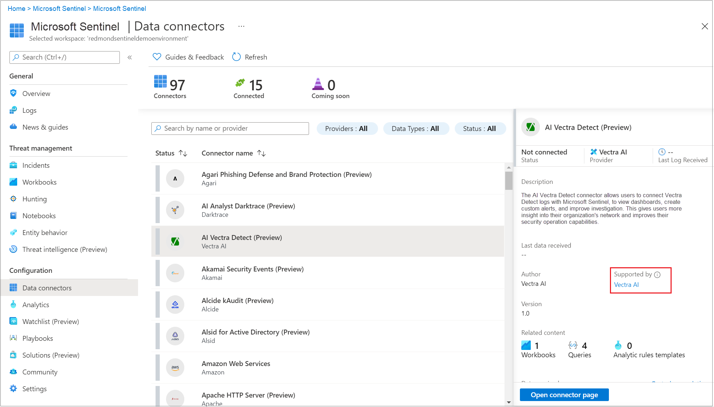

# Connect data sources

[!INCLUDE [reference-to-feature-availability](includes/reference-to-feature-availability.md)]

To get any use out of Azure Sentinel after you've enabled it, the first thing you need to do is connect your data sources. Azure Sentinel comes with many connectors for Microsoft products, available out of the box and providing real-time integration. For example, service-to-service connectors include Microsoft 365 Defender connectors and Microsoft 365 sources, such as Office 365, Azure Active Directory (Azure AD), Microsoft Defender for Identity, and Microsoft Cloud App Security.

You can also enable built-in connectors to the broader security ecosystem for non-Microsoft products. For example, you can use [Syslog](#syslog), [Common Event Format (CEF)](#common-event-format-cef), or [REST APIs](#rest-api-integration) to connect your data sources with Azure Sentinel.

For more information, see [Azure Sentinel partner data connectors](partner-data-connectors.md) and the [Azure Sentinel solutions catalog](sentinel-solutions-catalog.md).

## Enable a data connector

The **Data connectors** page, accessible from the Azure Sentinel navigation menu, shows the full list of connectors that Azure Sentinel provides, and their status. Select the connector you want to connect, and then select **Open connector page**. 

   
   
   For more information, see [Service-to-service integration](#service-to-service-integration) and [Azure Sentinel partner data connectors](partner-data-connectors.md).
   

You'll need to have fulfilled all the prerequisites, and you'll see complete instructions on the connector page to ingest the data to Azure Sentinel. It may take some time for data to start arriving. After you connect, you see a summary of the data in the **Data received** graph, and the connectivity status of the data types.

   
  
In the **Next steps** tab, you'll see additional content that Azure Sentinel provides for the specific data type - sample queries, visualization workbooks, and analytics rule templates to help you detect and investigate threats.

   

## Data connection methods

Azure Sentinel supports the following data connection methods:

### Service to service integration

Azure Sentinel uses the Azure foundation to provide built-in, service-to-service support for the following Microsoft services and Amazon Web Services:

- [Amazon Web Services - CloudTrail](connect-aws.md)
- [Azure Active Directory](connect-azure-active-directory.md), including audit logs and sign-in logs
- [Azure Active Directory Identity Protection](connect-azure-ad-identity-protection.md)
- [Azure Activity](connect-azure-activity.md)
- [Azure DDoS Protection](connect-azure-ddos-protection.md)
- [Azure Defender](connect-azure-security-center.md) alerts from Azure Security Center
- [Azure Defender for IoT](connect-asc-iot.md) (formerly Azure Security Center for IoT)
- [Azure Firewall](connect-azure-firewall.md)
- [Azure Information Protection](connect-azure-information-protection.md). For more information, see [How to modify the reports and create custom queries](/azure/information-protection/reports-aip#how-to-modify-the-reports-and-create-custom-queries).
- [Azure Key Vault](connect-azure-key-vault.md)
- [Azure Kubernetes Service (AKS)](connect-azure-kubernetes-service.md)
- [Azure SQL Databases](connect-azure-sql-logs.md)
- [Azure Storage Account](connect-azure-storage-account.md)
- [Azure Web Application Firewall (WAF)](connect-azure-waf.md) (formerly Microsoft WAF)
- [Domain name server](connect-dns.md)
- [Dynamics 365](connect-dynamics-365.md)
- [Microsoft 365 Defender](connect-microsoft-365-defender.md), including Microsoft 365 Defender incidents and raw data from Microsoft 365 Defender for Endpoint
- [Microsoft Cloud App Security (MCAS)](connect-cloud-app-security.md)
- [Microsoft Defender for Endpoint](connect-microsoft-defender-advanced-threat-protection.md) (formerly Microsoft Defender Advanced Threat Protection)
- [Microsoft Defender for Identity](connect-azure-atp.md) (formerly Azure Advanced Threat Protection)
- [Microsoft Defender for Office 365](connect-office-365-advanced-threat-protection.md) (formerly Office 365 Advanced Threat Protection)
- [Office 365](connect-office-365.md), including Microsoft Teams
- [Security events (Windows)](connect-windows-security-events.md). For more information, see [Insecure protocols workbook setup](./get-visibility.md#use-built-in-workbooks).
- [Windows firewall](connect-windows-firewall.md)

### REST API integration

Many security technologies provide a set of APIs for retrieving log files, and some data sources can use those APIs to connect to Azure Sentinel.

Data connectors that use APIs either integrate from the provider side or integrate using Azure Functions, as described in the following sections.

For a complete listing and information about these connectors, see [Azure Sentinel partner data connectors](partner-data-connectors.md).

#### REST API integration on the provider side

An API integration that is built by the provider connects with the provider data sources and pushes data into Azure Sentinel custom log tables using the [Azure Monitor Data Collector API](../azure-monitor/logs/data-collector-api.md).

For more information about configuring these data connectors to send logs to Azure Sentinel, see the relevant provider documentation. 

#### REST API integration using Azure Functions

Integrations that use [Azure Functions](../azure-functions/index.yml) to connect with a provider API first format the data, and then send it to Azure Sentinel custom log tables using the [Azure Monitor Data Collector API](../azure-monitor/logs/data-collector-api.md).

For more information about configuring these data connectors to connect with the provider API and collect logs in Azure Sentinel, follow the steps shown for each data connector in Azure Sentinel.

Integrations that use Azure Functions also have a **Deploy to Azure** button in their Azure Sentinel data connector page. For these integrations, do the following to simplify the configuration:

1. Select **Deploy to Azure**
1. Enter the parameter values to connect with the provider API.
1. Enter your Azure Sentinel workspace ID and key to connect with Log Analytics and send the data into Azure Sentinel.

> [!IMPORTANT]
> Integrations that use Azure Functions may incur additional data ingestion costs, because you host Azure Functions on your Azure tenant. For more information, see the [Azure Functions pricing page](https://azure.microsoft.com/pricing/details/functions/).

### Agent-based integration

Azure Sentinel can use the Syslog protocol to connect via an agent to any data source that can perform real-time log streaming. For example, most on-premises data sources connect via agent-based integration.
The following sections describe the different types of Azure Sentinel agent-based data connectors. Follow the steps in each Azure Sentinel data connector page to configure connections using agent-based mechanisms.

For a complete listing of firewalls, proxies, and endpoints that connect to Azure Sentinel through CEF or Syslog, see [Azure Sentinel partner data connectors](partner-data-connectors.md).

#### Syslog

You can stream events from Linux-based, Syslog-supporting devices into Azure Sentinel by using the Log Analytics agent for Linux, formerly called the OMS agent. The Log Analytics agent is supported for any device that allows you to install the Log Analytics agent directly on the device.

The device's built-in Syslog daemon collects local events of the specified types, and forwards them locally to the agent, which then streams them to your Log Analytics workspace. After successful configuration, the data appears in the Log Analytics Syslog table.

Depending on the device type, the agent is installed either directly on the device, or on a dedicated Linux-based log forwarder. The Log Analytics agent receives events from the Syslog daemon over UDP. If a Linux machine is expected to collect a high volume of Syslog events, it sends events over TCP from the Syslog daemon to the agent, and from there to Log Analytics.

For more information, see [Connect Syslog-based appliances to Azure Sentinel](connect-syslog.md). 

#### Common Event Format (CEF)

Log formats vary, but many sources support CEF-based formatting. The Azure Sentinel agent, which is actually the Log Analytics agent, converts CEF-formatted logs into a format that Log Analytics can ingest.

For data sources that emit data in CEF, set up the Syslog agent and then configure the CEF data flow. After successful configuration, the data appears in the **CommonSecurityLog** table.

For more information, see [Connect CEF-based appliances to Azure Sentinel](connect-common-event-format.md).

#### Custom logs

Some data sources have logs available for collection as files on Windows or Linux. You can collect these logs by using the Log Analytics custom log collection agent.

Follow the steps in each Azure Sentinel data connector page to connect using the Log Analytics custom log collection agent. After successful configuration, the data appears in custom tables.

For more information, see [Collect custom logs with the Log Analytics agent](../azure-monitor/agents/data-sources-custom-logs.md).

## Data connector support

Both Microsoft and other organizations author Azure Sentinel data connectors. Each data connector has one of the following support types:

| Support type| Description|
|-------------|------------|
|**Microsoft-supported**|Applies to:<ul><li>Data connectors for data sources where Microsoft is the data provider and author.</li><li>Some Microsoft-authored data connectors for non-Microsoft data sources.</li></ul>Microsoft supports and maintains data connectors in this category in accordance with [Microsoft Azure Support Plans](https://azure.microsoft.com/support/options/#overview).  Partners or the Community support data connectors that are authored by any party other than Microsoft.|
|**Partner-supported**|Applies to data connectors authored by parties other than Microsoft.  The partner company provides support or maintenance for these data connectors. The partner company can be an Independent Software Vendor, a Managed Service Provider (MSP/MSSP), a Systems Integrator (SI), or any organization whose contact information is provided on the Azure Sentinel page for that data connector.  For any issues with a partner-supported data connector, contact the specified data connector support contact.|
|**Community-supported**|Applies to data connectors authored by Microsoft or partner developers that don't have listed contacts for data connector support and maintenance on the specified data connector page in Azure Sentinel.  For questions or issues with these data connectors, you can [file an issue](https://github.com/Azure/Azure-Sentinel/issues/new/choose) in the [Azure Sentinel GitHub community](https://aka.ms/threathunters).|

### Find the support contact for a data connector

To find the support contact information for a data connector:

1. In the Azure Sentinel left menu, select **Data connectors**.
   
1. Select the connector you want to find support information for.
   
1. View the **Supported by** field on the side panel for the data connector.
   
   
   
   The **Supported by** field has a support contact link you can use to access support and maintenance for the selected data connector.

## Next steps

- To get started with Azure Sentinel, you need a subscription to Microsoft Azure. If you don't have a subscription, you can sign up for a [free trial](https://azure.microsoft.com/free/).
- Learn how to [onboard your data to Azure Sentinel](quickstart-onboard.md) and [get visibility into your data and potential threats](get-visibility.md).