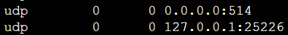

# Connect your Fortinet appliance

> [!IMPORTANT]
> Azure Sentinel is currently in public preview.
> This preview version is provided without a service level agreement. We don't recommend it for production workloads. Certain features might not be supported or might have constrained capabilities. 
> For more information, see [Supplemental terms of use for Microsoft Azure previews](https://azure.microsoft.com/support/legal/preview-supplemental-terms/).

You can connect Azure Sentinel to any Fortinet appliance by saving the log files as Syslog Common Event Format (CEF). With the integration with Azure Sentinel, you can easily run analytics and queries across the log file data from Fortinet. For more information on how Azure Sentinel ingests CEF data, see [Connect CEF appliances](connect-common-event-format.md).

> [!NOTE]
> Data is stored in the geographic location of the workspace on which you run Azure Sentinel.

## Step 1: Connect your Fortinet appliance by using an agent

To connect your Fortinet appliance to Azure Sentinel, deploy an agent on a dedicated VM or on-premises machine to support the communication between the appliance and Azure Sentinel. You can deploy the agent automatically or manually. Automatic deployment is only available if your dedicated machine is a new VM that you create in Azure.

You also can deploy the agent manually on an existing Azure VM, on a VM in another cloud, or on an on-premises machine.

To see a network diagram of both options, see [Connect data sources](connect-data-sources.md#agent-options).

### Deploy the agent in Azure

1. In the Azure Sentinel portal, select **Data connectors** and select your appliance type.

1. Under **Linux Syslog agent configuration**:
   - Choose **Automatic deployment** if you want to create a new machine that's preinstalled with the Azure Sentinel agent and includes all the configuration necessary, as previously described. Select **Automatic deployment** > **Automatic agent deployment**. The purchase page for a dedicated VM that's automatically connected to your workspace appears. The VM is a **standard D2s v3 (2 vCPUs, 8 GB memory)** and has a public IP address.
      1. On the **Custom deployment** page, provide your details, enter a username and a password, and if you agree to the terms and conditions, purchase the VM.
      1. Configure your appliance to send logs by using the settings listed on the connection page. For the Generic Common Event Format connector, use these settings:
         - Protocol = UDP
         - Port = 514
         - Facility = Local-4
         - Format = CEF
   - Choose **Manual deployment** if you want to use an existing VM as the dedicated Linux machine onto which the Azure Sentinel agent is installed. 
      1. Under **Download and install the Syslog agent**, select **Azure Linux virtual machine**. 
      1. On the **Virtual machines** screen, select the machine you want to use and select **Connect**.
      1. On the connector screen, under **Configure and forward Syslog**, set whether your Syslog daemon is **rsyslog.d** or **syslog-ng**. 
      1. Copy these commands and run them on your appliance:
          - If you selected rsyslog.d:
              
            1. Tell the Syslog daemon to listen on facility local_4 and to send the Syslog messages to the Azure Sentinel agent by using port 25226. Use this command: `sudo bash -c "printf 'local4.debug  @127.0.0.1:25226\n\n:msg, contains, \"Fortinet\"  @127.0.0.1:25226' > /etc/rsyslog.d/security-config-omsagent.conf"`
            1. Download and install the [security_events config file](https://aka.ms/asi-syslog-config-file-linux) that configures the Syslog agent to listen on port 25226. Use this command: `sudo wget -O /etc/opt/microsoft/omsagent/{0}/conf/omsagent.d/security_events.conf "https://aka.ms/syslog-config-file-linux"` where {0} should be replaced with your workspace GUID.
            1. Restart the syslog daemon by using this command: `sudo service rsyslog restart`
             
          - If you selected syslog-ng:

              1. Tell the Syslog daemon to listen on facility local_4 and to send the Syslog messages to the Azure Sentinel agent by using port 25226. Use this command: `sudo bash -c "printf 'filter f_local4_oms { facility(local4); };\n  destination security_oms { tcp(\"127.0.0.1\" port(25226)); };\n  log { source(src); filter(f_local4_oms); destination(security_oms); };\n\nfilter f_msg_oms { match(\"Fortinet\" value(\"MESSAGE\")); };\n  destination security_msg_oms { tcp(\"127.0.0.1\" port(25226)); };\n  log { source(src); filter(f_msg_oms); destination(security_msg_oms); };' > /etc/syslog-ng/security-config-omsagent.conf"`
              1. Download and install the [security_events config file](https://aka.ms/asi-syslog-config-file-linux) that configures the Syslog agent to listen on port 25226. Use this command: `sudo wget -O /etc/opt/microsoft/omsagent/{0}/conf/omsagent.d/security_events.conf "https://aka.ms/syslog-config-file-linux"` where {0} should be replaced with your workspace GUID.
              1. Restart the syslog daemon by using this command: `sudo service syslog-ng restart`
      1. Restart the Syslog agent by using this command: `sudo /opt/microsoft/omsagent/bin/service_control restart [{workspace GUID}]`
      1. Confirm that there are no errors in the agent log by running this command: `tail /var/opt/microsoft/omsagent/log/omsagent.log`

### Deploy the agent on an on-premises Linux server

If you aren't using Azure, manually deploy the Azure Sentinel agent to run on a dedicated Linux server.

1. In the Azure Sentinel portal, select **Data connectors** and select your appliance type.
1. To create a dedicated Linux VM, under **Linux Syslog agent configuration** select **Manual deployment**.

    1. Under **Download and install the Syslog agent**, select **Non-Azure Linux machine**.
    1. In the **Direct agent** screen that opens, select **Agent for Linux** to download the agent or run this command to download it on your Linux machine: `wget https://raw.githubusercontent.com/Microsoft/OMS-Agent-for-Linux/master/installer/scripts/onboard_agent.sh && sh onboard_agent.sh -w {workspace GUID} -s gehIk/GvZHJmqlgewMsIcth8H6VqXLM9YXEpu0BymnZEJb6mEjZzCHhZgCx5jrMB1pVjRCMhn+XTQgDTU3DVtQ== -d opinsights.azure.com`

       1. In the connector screen, under **Configure and forward Syslog**, set whether your Syslog daemon is **rsyslog.d** or **syslog-ng**.
       1. Copy these commands and run them on your appliance:

          - If you selected rsyslog:

            1. Tell the Syslog daemon to listen on facility local_4 and to send the Syslog messages to the Azure Sentinel agent using port 25226. Use this command: `sudo bash -c "printf 'local4.debug  @127.0.0.1:25226\n\n:msg, contains, \"Fortinet\"  @127.0.0.1:25226' > /etc/rsyslog.d/security-config-omsagent.conf"`
            1. Download and install the [security_events config file](https://aka.ms/asi-syslog-config-file-linux) that configures the Syslog agent to listen on port 25226. Use this command: `sudo wget -O /etc/opt/microsoft/omsagent/{0}/conf/omsagent.d/security_events.conf "https://aka.ms/syslog-config-file-linux"` where {0} should be replaced with your workspace GUID.
            1. Restart the syslog daemon by using this command: `sudo service rsyslog restart`

          - If you selected syslog-ng:

            1. Tell the Syslog daemon to listen on facility local_4 and to send the Syslog messages to the Azure Sentinel agent by using port 25226. Use this command: `sudo bash -c "printf 'filter f_local4_oms { facility(local4); };\n  destination security_oms { tcp(\"127.0.0.1\" port(25226)); };\n  log { source(src); filter(f_local4_oms); destination(security_oms); };\n\nfilter f_msg_oms { match(\"Fortinet\" value(\"MESSAGE\")); };\n  destination security_msg_oms { tcp(\"127.0.0.1\" port(25226)); };\n  log { source(src); filter(f_msg_oms); destination(security_msg_oms); };' > /etc/syslog-ng/security-config-omsagent.conf"`
            1. Download and install the [security_events config file](https://aka.ms/asi-syslog-config-file-linux) that configures the Syslog agent to listen on port 25226. Use this command: `sudo wget -O /etc/opt/microsoft/omsagent/{0}/conf/omsagent.d/security_events.conf "https://aka.ms/syslog-config-file-linux"` where {0} should be replaced with your workspace GUID.
            1. Restart the syslog daemon by using this command: `sudo service syslog-ng restart`

      1. Restart the Syslog agent by using this command: `sudo /opt/microsoft/omsagent/bin/service_control restart [{workspace GUID}]`
      1. Confirm that there are no errors in the agent log by running this command: `tail /var/opt/microsoft/omsagent/log/omsagent.log`
 
## Step 2: Forward Fortinet logs to the Syslog agent

Configure Fortinet to forward Syslog messages in CEF format to your Azure workspace via the Syslog agent.

1. Open the CLI on your Fortinet appliance and run the following commands:

        config log syslogd setting
        set format cef
        set facility <facility_name>
        set port 514
        set reliable disable
        set server <ip_address_of_Receiver>
        set status enable
        end

    - Replace the server **ip address** with the IP address of the agent.
    - Set **facility_name** to use the facility you configured in the agent. By default, the agent sets this to local4.
    - Set the **syslog port** to **514** or the port set on the agent.
    - To enable CEF format in early FortiOS versions, you might need to run the command set **csv disable**.
 
   > [!NOTE] 
   > For more information, go to the [Fortinet document library](https://aka.ms/asi-syslog-fortinet-fortinetdocumentlibrary). Select your version, and use the **Handbook** and **Log Message Reference**.

 To use the relevant schema in Azure Monitor Log Analytics for the Fortinet events, search for `CommonSecurityLog`.

## Step 3: Validate connectivity

It might take up to 20 minutes until your logs start to appear in Log Analytics. 

1. Make sure you use the right facility. The facility must be the same in your appliance and in Azure Sentinel. You can check which facility file you're using in Azure Sentinel and modify it in the file `security-config-omsagent.conf`. 

2. Make sure that your logs are getting to the right port in the Syslog agent. Run this command on the Syslog agent machine: `tcpdump -A -ni any  port 514 -vv`. This command shows you the logs that stream from the device to the Syslog machine. Make sure that logs are being received from the source appliance on the right port and the right facility.

3. Make sure that the logs you send comply with [RFC 5424](https://tools.ietf.org/html/rfc542).

4. On the computer running the Syslog agent, make sure the ports 514 and 25226 are open and listening by using the command `netstat -a -n:`. For more information about using this command, see [netstat(8) - Linux man page](https://linux.die.net/man/8/netstat). If it’s listening properly, you see:

    

5. Make sure the daemon is set to listen on port 514, on which you’re sending the logs.
    - For rsyslog: Make sure that the file `/etc/rsyslog.conf` includes this configuration:

           # provides UDP syslog reception
           module(load="imudp")
           input(type="imudp" port="514")
        
           # provides TCP syslog reception
           module(load="imtcp")
           input(type="imtcp" port="514")

      For more information, see [imudp: UDP Syslog input module](https://www.rsyslog.com/doc/v8-stable/configuration/modules/imudp.html#imudp-udp-syslog-input-module) and [imtcp: TCP Syslog input module](https://www.rsyslog.com/doc/v8-stable/configuration/modules/imtcp.html#imtcp-tcp-syslog-input-module).

   - For syslog-ng: Make sure that the file `/etc/syslog-ng/syslog-ng.conf` includes this configuration:

           # source s_network {
            network( transport(UDP) port(514));
             };
     For more information, see [imudp: UDP Syslog input module](https://rsyslog.readthedocs.io/en/latest/configuration/modules/imudp.html) and [syslog-ng Open source edition 3.16 - Administration guide](https://www.syslog-ng.com/technical-documents/doc/syslog-ng-open-source-edition/3.16/administration-guide/19#TOPIC-956455).

1. Check that there's communication between the Syslog daemon and the agent. Run this command on the Syslog agent machine: `tcpdump -A -ni any  port 25226 -vv`. This command shows you the logs that stream from the device to the Syslog machine. Make sure that the logs are also being received on the agent.

6. If both of those commands provided successful results, check Log Analytics to see if your logs are arriving. All events streamed from these appliances appear in raw form in Log Analytics under `CommonSecurityLog` type.

7. To check if there are errors or if the logs aren't arriving, look in `tail /var/opt/microsoft/omsagent/<workspace id>/log/omsagent.log`. If it says there are log format mismatch errors, go to `/etc/opt/microsoft/omsagent/{0}/conf/omsagent.d/security_events.conf "https://aka.ms/syslog-config-file-linux"` and look at the file `security_events.conf`. Make sure that your logs match the regex format you see in this file.

8. Make sure that your Syslog message default size is limited to 2048 bytes (2 KB). If logs are too long, update security_events.conf by using this command: `message_length_limit 4096`

10. If your Fortinet logs aren't being received by the agent, run this command, depending on which type of Syslog daemon you're using, to set the facility and set the logs to search for the word Fortinet in the logs:
       - rsyslog.d: `sudo bash -c "printf 'local4.debug  @127.0.0.1:25226\n\n:msg, contains, \"Fortinet\"  @127.0.0.1:25226' > /etc/rsyslog.d/security-config-omsagent.conf"`

     Restart the Syslog daemon by using this command: `sudo service rsyslog restart`
       - syslog-ng: `sudo bash -c "printf 'filter f_local4_oms { facility(local4); };\n  destination security_oms { tcp(\"127.0.0.1\" port(25226)); };\n  log { source(src); filter(f_local4_oms); destination(security_oms); };\n\nfilter f_msg_oms { match(\"Fortinet\" value(\"MESSAGE\")); };\n  destination security_msg_oms { tcp(\"127.0.0.1\" port(25226)); };\n  log { source(src); filter(f_msg_oms); destination(security_msg_oms); };' > /etc/syslog-ng/security-config-omsagent.conf"`
      
     Restart the Syslog daemon by using this command: `sudo service syslog-ng restart`

## Next steps
In this article, you learned how to connect Fortinet appliances to Azure Sentinel. To learn more about Azure Sentinel, see the following articles:
- Learn how to [get visibility into your data, and potential threats](quickstart-get-visibility.md).
- Get started [detecting threats with Azure Sentinel](tutorial-detect-threats.md).

