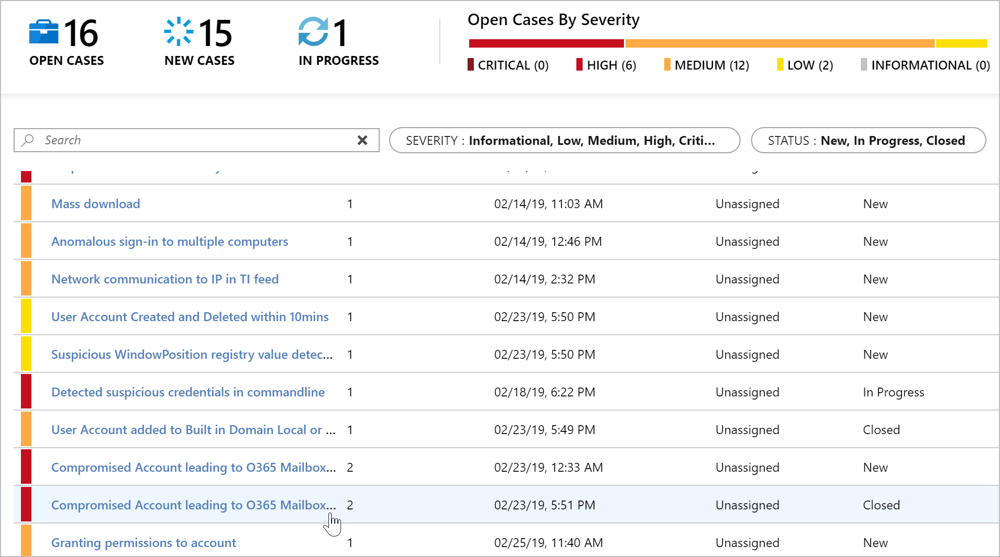

# Focus on important security events

> [!IMPORTANT]
> Azure Sentinel is currently in public preview.
> This preview version is provided without a service level agreement, and it's not recommended for production workloads. Certain features might not be supported or might have constrained capabilities. 
> For more information, see [Supplemental Terms of Use for Microsoft Azure Previews](https://azure.microsoft.com/support/legal/preview-supplemental-terms/).

Azure Sentinel's built in state-of-the-art graph-powered machine learning algorithms and alert fusion help you filter out the noise and focus your time and attention on high-fidelity, interesting security cases.
To help you deal with the vast number of security alerts arriving every day, Azure Sentinel streamlines your security workload using:
- **Alert fusion**: Fusion uses machine learning algorithms and to find correlations between millions of lower fidelity anomalous activities from different products such as Azure AD Identity Protection, and Microsoft Cloud App Security, fusing them into a manageable number of interesting security cases.

- **Built-in ML**: Azure Sentinel comes with built-in machine-learning based detections designed to simplify ML for security professionals without the need for training, cross-validation, and deployment hassles. 
 
- **Build-your-own ML**: For organizations that already have advanced ML functionality and algorithms designed, Azure Sentinel enables you to "build-your-own" ML. By integrating Databricks, Spark, and Jupyter Notebook detection authoring environments, you can use these external tools to handle data plumbing, use ML algorithm templates, and get code snippets for model training and scheduling.

## Working with fusion

To help you deal with the vast number of security alerts arriving every day, fusion uses state-of-the-art graph-powered machine learning algorithms to correlate millions of lower fidelity anomalous activities from different products such as Azure AD Identity Protection, and Microsoft Cloud App Security into dozens of high-fidelity, interesting security cases.

Fusion provides:

- Iterative attack simulation - Fusion encodes uncertainty with paths and stages by simulating different attack paths using an iterative arkov Chain Monte Carlo Simulations  
- Probabilistic cloud kill chain – Fusion constantly updates the probability of moving to the next step the in kill chain using a custom-defined prior-probability function.    
Using advanced graphical methods – Fusion encodes uncertainty in completeness and connectivity of information in the kill chain, to enable detection of novel attacks.

### Enable fusion

1. In the Azure portal, select the icon to open Cloud Shell.
  
 
2.	In the **Welcome to Cloud Shell** windows that opens below, select PowerShell.

3.	Choose the subscription on which you deployed Azure Sentinel, and **Create storage**.
 
4. After you are authenticated and and your Azure drive is built, at the command prompt, run the following commands: 
 
            az resource update --ids /subscriptions/{Subscription Guid}/resourceGroups/{Log analytics resource Group Name}/providers/Microsoft.OperationalInsights/workspaces/{Log analytics workspace Name}/providers/Microsoft.SecurityInsights/settings/Fusion --api-version 2019-01-01-preview --set properties.IsEnabled=true --subscription "{Subscription Guid}"

### Use fusion

You can use fusion to compound anomalies from Azure AD Identity Protection and Microsoft Cloud App Security products, such as the following detections: 
- Compromised account leading to Office 365 mailbox exfiltration 
- Compromised account leading to mass file deletion 
- Compromised account leading to ransomware in a cloud app 
- Compromised account leading mass file download 
- Compromised account leading to suspicious cloud app administrative activity 
- Compromised account leading to mass file sharing 
- Compromised account leading to Office 365 impersonation 

Your fusion alerts are displayed in the **Cases** page.

1. In the Azure Sentinel portal, go to **Cases**.
1. Your fusion cases will appear like other cases that include multiple alerts, such as this one, for Compromised account leading to Office365 mailbox exfiltration.
   
 
### Disable fusion

Follow the same procedure as above, and run the following command: 

            az resource update --ids /subscriptions/{Subscription Guid}/resourceGroups/{Log analytics resource Group Name}/providers/Microsoft.OperationalInsights/workspaces/{Log analytics workspace Name}/providers/Microsoft.SecurityInsights/settings/Fusion --api-version 2019-01-01-preview --set properties.IsEnabled=false --subscription "{Subscription Guid}"

### View the status of fusion

            az resource show --ids /subscriptions/{Subscription Guid}/resourceGroups/{Log analytics resource Group Name}/providers/Microsoft.OperationalInsights/workspaces/{Log analytics workspace Name}/providers/Microsoft.SecurityInsights/settings/Fusion --api-version 2019-01-01-preview --subscription "{Subscription Guid}"

## Built-in machine learning  

Built-in machine learning is designed for security analysts and engineers who have no prior ML knowledge. It is based on ML systems designed by Microsoft’s fleet of security Machine learning engineers. With built-in ML, there is no need to worry about training, cross validation, or deployment hassles. Built-in ML uses principles of model compression and elements of transfer-learning to make a model that is ready to use for any organization’s needs. These models are trained on diverse data sets, and periodically retrained to account for concept drift.

To enable built-in ML detections, contact askepd@microsoft.com.

### Built-in detections

- Geographic location sign-in anomaly: This model lets you detect unusual sign-ins across SSH logs. 

## Build-your-own ML

Some organizations have different levels of investment in machine learning for security use cases, and want to be able to leverage existing ML efforts across the logs in Azure Sentinel. For this reason, Azure Sentinel enables you to build-your-own ML for authoring security analytics. Azure Sentinel enables you to author your ML models in Databricks, Spark, and Jupyter Notebooks to allow flexibility of detection authoring environments. You can author your own ML models in these environments to handle data plumbing, provide ML algorithm templates, write code snippets for model training, and scheduling. This frees up your security data scientists from time-consuming pipeline and platform work, to allow them to focus on productive analytics. 

To enable build-your-own ML, contact askepd@microsoft.com.

## Next steps
In this document, you learned how to enable Fusion in Azure Sentinel. To learn more about Azure Sentinel, see the following articles:
- Learn how to [get visibility into your data, and potential threats](quickstart-get-visibility.md).
- Get started [detecting threats with Azure Sentinel](tutorial-detect-threats.md).
- Any questions on fusion and ML? Send them to askepd@microsoft.com 

