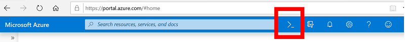

# Enable fusion

> [!IMPORTANT]
> Azure Sentinel is currently in public preview.
> This preview version is provided without a service level agreement, and it's not recommended for production workloads. Certain features might not be supported or might have constrained capabilities.
> For more information, see [Supplemental Terms of Use for Microsoft Azure Previews](https://azure.microsoft.com/support/legal/preview-supplemental-terms/).

Machine Learning in Azure Sentinel is built-in right from the beginning. We have thoughtfully designed the system with ML innovations aimed to make security analysts, security data scientists and engineers productive. One such innovation is Azure Sentinel Fusion built especially to reduce alert fatigue.

Fusion uses graph powered machine learning algorithms to correlate between millions of lower fidelity anomalous activities from different products such as Azure AD Identity Protection, and Microsoft Cloud App Security, to combine them into a manageable number of interesting security cases.

## Enable fusion

1. In the Azure portal, select the icon to open Cloud Shell.
  

2.	In the **Welcome to Cloud Shell** windows that opens below, select PowerShell.

3.	Choose the subscription on which you deployed Azure Sentinel, and **Create storage**.

4. After you are authenticated and your Azure drive is built, at the command prompt, run the following commands:

            az resource update --ids /subscriptions/{Subscription Guid}/resourceGroups/{Log analytics resource Group Name}/providers/Microsoft.OperationalInsights/workspaces/{Log analytics workspace Name}/providers/Microsoft.SecurityInsights/settings/Fusion --api-version 2019-01-01-preview --set properties.IsEnabled=true --subscription "{Subscription Guid}"

## Disable fusion

Follow the same procedure as above, and run the following command:

            az resource update --ids /subscriptions/{Subscription Guid}/resourceGroups/{Log analytics resource Group Name}/providers/Microsoft.OperationalInsights/workspaces/{Log analytics workspace Name}/providers/Microsoft.SecurityInsights/settings/Fusion --api-version 2019-01-01-preview --set properties.IsEnabled=false --subscription "{Subscription Guid}"

## View the status of fusion

            az resource show --ids /subscriptions/{Subscription Guid}/resourceGroups/{Log analytics resource Group Name}/providers/Microsoft.OperationalInsights/workspaces/{Log analytics workspace Name}/providers/Microsoft.SecurityInsights/settings/Fusion --api-version 2019-01-01-preview --subscription "{Subscription Guid}"

## Next steps

In this document, you learned how to enable Fusion in Azure Sentinel. To learn more about Azure Sentinel, see the following articles:
- Learn how to [get visibility into your data, and potential threats](quickstart-get-visibility.md).
- Get started [detecting threats with Azure Sentinel](tutorial-detect-threats.md).

