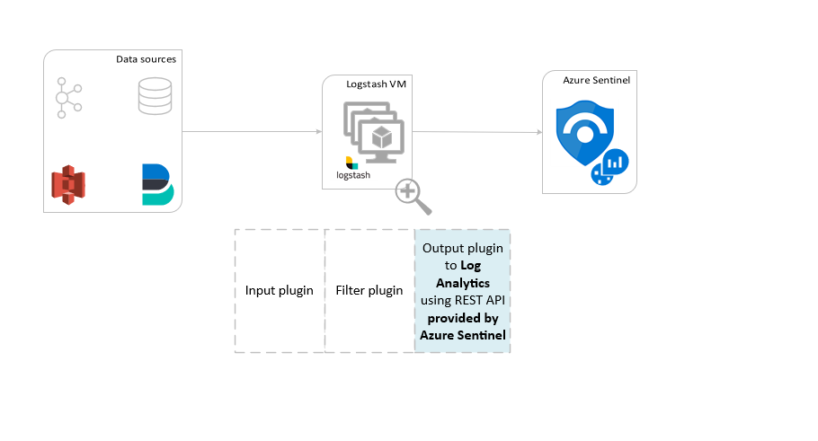

# Use Logstash to connect data sources to Azure Sentinel

> [!IMPORTANT]
> Data ingestion using the Logstash output plugin is currently in public preview. This feature is provided without a service level agreement, and it's not recommended for production workloads. For more information, see [Supplemental Terms of Use for Microsoft Azure Previews](https://azure.microsoft.com/support/legal/preview-supplemental-terms/).

Using Azure Sentinel's output plugin for the **Logstash data collection engine**, you can send any type of log you want through Logstash directly to your Log Analytics workspace in Azure Sentinel. Your logs will be sent to a custom table that you will define using the output plugin.

To learn more about working with the Logstash data collection engine, see [Getting started with Logstash](https://www.elastic.co/guide/en/logstash/current/getting-started-with-logstash.html).

## Overview

### Architecture and background



The Logstash engine is comprised of three components:

- Input plugins: Customized collection of data from various sources.
- Filter plugins: Manipulation and normalization of data according to specified criteria.
- Output plugins: Customized sending of collected and processed data to various destinations.

> [!NOTE]
> Azure Sentinel supports its own provided output plugin only. It does not support third-party output plugins for Azure Sentinel, or any other Logstash plugin of any type.

The Azure Sentinel output plugin for Logstash sends JSON-formatted data to your Log Analytics workspace, using the Log Analytics HTTP Data Collector REST API. The data is ingested into custom logs.

- Learn more about the [Log Analytics REST API](/rest/api/loganalytics/create-request).
- Learn more about [custom logs](../azure-monitor/agents/data-sources-custom-logs.md).

## Deploy the Azure Sentinel output plugin in Logstash

### Step 1: Installation

The Azure Sentinel output plugin is available in the Logstash collection.

- Follow the instructions in the Logstash [Working with plugins](https://www.elastic.co/guide/en/logstash/current/working-with-plugins.html) document to install the ***[microsoft-logstash-output-azure-loganalytics](https://github.com/Azure/Azure-Sentinel/tree/master/DataConnectors/microsoft-logstash-output-azure-loganalytics)*** plugin.
   
- If your Logstash system does not have Internet access, follow the instructions in the Logstash [Offline Plugin Management](https://www.elastic.co/guide/en/logstash/current/offline-plugins.html) document to prepare and use an offline plugin pack. (This will require you to build another Logstash system with Internet access.)

### Step 2: Configuration

Use the information in the Logstash [Structure of a config file](https://www.elastic.co/guide/en/logstash/current/configuration-file-structure.html) document and add the Azure Sentinel output plugin to the configuration with the following keys and values. (The proper config file syntax is shown after the table.)

| Field name | Data type | Description |
|----------------|---------------|-----------------|
| `workspace_id` | string | Enter your workspace ID GUID. * |
| `workspace_key` | string | Enter your workspace primary key GUID. * |
| `custom_log_table_name` | string | Set the name of the table into which the logs will be ingested. Only one table name per output plugin can be configured. The log table will appear in Azure Sentinel under **Logs**, in **Tables** in the **Custom Logs** category, with a `_CL` suffix. |
| `endpoint` | string | Optional field. By default, this is the Log Analytics endpoint. Use this field to set an alternative endpoint. |
| `time_generated_field` | string | Optional field. This property overrides the default **TimeGenerated** field in Log Analytics. Enter the name of the timestamp field in the data source. The data in the field must conform to the ISO 8601 format (`YYYY-MM-DDThh:mm:ssZ`) |
| `key_names` | array | Enter a list of Log Analytics output schema fields. Each list item should be enclosed in single quotes and the items separated by commas, and the entire list enclosed in square brackets. See example below. |
| `plugin_flush_interval` | number | Optional field. Set to define the maximum interval (in seconds) between message transmissions to Log Analytics. The default is 5. |
    | `amount_resizing` | boolean | True or false. Enable or disable the automatic scaling mechanism, which adjusts the message buffer size according to the volume of log data received. |
| `max_items` | number | Optional field. Applies only if `amount_resizing` set to "false." Use to set a cap on the message buffer size (in records). The default is 2000.  |
| `azure_resource_id` | string | Optional field. Defines the ID of the Azure resource where the data resides. <br>The resource ID value is especially useful if you are using [resource-context RBAC](resource-context-rbac.md) to provide access to specific data only. |
| | | |

* You can find the workspace ID and primary key in the workspace resource, under **Agents management**.

#### Sample configurations

Here are some sample configurations that use a few different options.

- A basic configuration that uses a filebeat input pipe:

   ```ruby
    input {
        beats {
            port => "5044"
        }
    }
    filter {
    }
    output {
        microsoft-logstash-output-azure-loganalytics {
          workspace_id => "4g5tad2b-a4u4-147v-a4r7-23148a5f2c21" # <your workspace id>
          workspace_key => "u/saRtY0JGHJ4Ce93g5WQ3Lk50ZnZ8ugfd74nk78RPLPP/KgfnjU5478Ndh64sNfdrsMni975HJP6lp==" # <your workspace key>
          custom_log_table_name => "tableName"
        }
    }
   ```
    
- A basic configuration that uses a tcp input pipe:

   ```ruby
    input {
        tcp {
            port => "514"
            type => syslog #optional, will effect log type in table
        }
    }
    filter {
    }
    output {
        microsoft-logstash-output-azure-loganalytics {
          workspace_id => "4g5tad2b-a4u4-147v-a4r7-23148a5f2c21" # <your workspace id>
          workspace_key => "u/saRtY0JGHJ4Ce93g5WQ3Lk50ZnZ8ugfd74nk78RPLPP/KgfnjU5478Ndh64sNfdrsMni975HJP6lp==" # <your workspace key>
          custom_log_table_name => "tableName"
        }
    }
   ```
  
- An advanced configuration:

   ```ruby    
    input {
        tcp {
            port => 514
            type => syslog
        }
    }
    filter {
        grok {
            match => { "message" => "<%{NUMBER:PRI}>1 (?<TIME_TAG>[0-9]{4}-[0-9]{1,2}-[0-9]{1,2}T[0-9]{1,2}:[0-9]{1,2}:[0-9]{1,2})[^ ]* (?<HOSTNAME>[^ ]*) %{GREEDYDATA:MSG}" }
        }
    }
    output {
        microsoft-logstash-output-azure-loganalytics {
            workspace_id => "<WS_ID>"
            workspace_key => "${WS_KEY}"
            custom_log_table_name => "logstashCustomTable"
            key_names => ['PRI','TIME_TAG','HOSTNAME','MSG']
            plugin_flush_interval => 5
        }
    } 
   ```

   > [!NOTE]
   > Visit the output plugin [GitHub repository](https://github.com/Azure/Azure-Sentinel/tree/master/DataConnectors/microsoft-logstash-output-azure-loganalytics) to learn more about its inner workings, configuration, and performance settings.

### Step 3: Restart Logstash

### Step 4: View incoming logs in Azure Sentinel

1. Verify that messages are being sent to the output plugin.

1. From the Azure Sentinel navigation menu, click **Logs**. Under the **Tables** heading, expand the **Custom Logs** category. Find and click the name of the table you specified (with a `_CL` suffix) in the configuration.

   :::image type="content" source="./media/connect-logstash/logstash-custom-logs-menu.png" alt-text="Screenshot of log stash custom logs.":::

1. To see records in the table, query the table by using the table name as the schema.

   :::image type="content" source="./media/connect-logstash/logstash-custom-logs-query.png" alt-text="Screenshot of a log stash custom logs query.":::

## Monitor output plugin audit logs

To monitor the connectivity and activity of the Azure Sentinel output plugin, enable the appropriate Logstash log file. See the [Logstash Directory Layout](https://www.elastic.co/guide/en/logstash/current/dir-layout.html#dir-layout) document for the log file location.

If you are not seeing any data in this log file, generate and send some events locally (through the input and filter plugins) to make sure the output plugin is receiving data. Azure Sentinel will support only issues relating to the output plugin.

## Next steps

In this document, you learned how to use Logstash to connect external data sources to Azure Sentinel. To learn more about Azure Sentinel, see the following articles:
- Learn how to [get visibility into your data, and potential threats](quickstart-get-visibility.md).
- Get started detecting threats with Azure Sentinel, using [built-in](tutorial-detect-threats-built-in.md) or [custom](tutorial-detect-threats-custom.md) rules.
