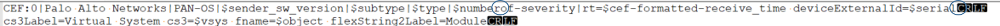

# Connect Palo Alto Networks to Azure Sentinel

This article explains how to connect your Palo Alto Networks appliance to Azure Sentinel. The Palo Alto Networks data connector allows you to easily connect your Palo Alto Networks logs with Azure Sentinel, to view dashboards, create custom alerts, and improve investigation. Using Palo Alto Networks on Azure Sentinel will provide you more insights into your organization’s Internet usage, and will enhance its security operation capabilities.​ 

## Forward Palo Alto Networks logs to the Syslog agent

Configure Palo Alto Networks to forward Syslog messages in CEF format to your Azure workspace via the Syslog agent:
1.  Go to [Common Event Format (CEF) Configuration Guides](https://docs.paloaltonetworks.com/resources/cef) and download the pdf for your appliance type. Follow all the instructions in the guide to set up your Palo Alto Networks appliance to collect CEF events. 

1.  Go to [Configure Syslog monitoring](https://docs.paloaltonetworks.com/pan-os/8-1/pan-os-admin/monitoring/use-syslog-for-monitoring/configure-syslog-monitoring) and follow steps 2 and 3 to configure CEF event forwarding from your Palo Alto Networks appliance to Azure Sentinel.

    1. Make sure to set the **Syslog server format** to **BSD**.

       > [!NOTE]
       > The copy/paste operations from the PDF might change the text and insert random characters. To avoid this, copy the text to an editor and remove any characters that might break the log format before pasting it, as you can see in this example.
 
        

1. To use the relevant schema in Log Analytics for the Palo Alto Networks events, search for **CommonSecurityLog**.

1. Continue to [STEP 3: Validate connectivity](connect-cef-verify.md).

## Next steps
In this document, you learned how to connect Palo Alto Networks appliances to Azure Sentinel. To learn more about Azure Sentinel, see the following articles:
- Learn how to [get visibility into your data, and potential threats](quickstart-get-visibility.md).
- Get started [detecting threats with Azure Sentinel](tutorial-detect-threats-built-in.md).
- [Use workbooks](tutorial-monitor-your-data.md) to monitor your data.

