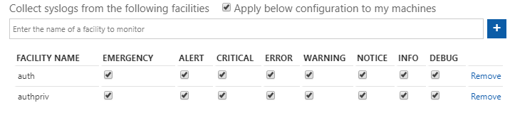

# Connect your external solution using Syslog

You can connect any on-premises appliance that supports Syslog to Azure Sentinel. This is done by using an agent based on a Linux machine between the appliance and Azure Sentinel. If your Linux machine is in Azure, you can stream the logs from your appliance or application to a dedicated workspace you create in Azure and connect it. If your Linux machine is not in Azure, you can stream the logs from your appliance to a dedicated on premises VM or machine onto which you install the Agent for Linux. 

> [!NOTE]
> If your appliance supports Syslog CEF, the connection is more complete and you should choose this option and follow the instructions in [Connecting data from CEF](connect-common-event-format.md).

## How it works

Syslog is an event logging protocol that is common to Linux. Applications will send messages that may be stored on the local machine or delivered to a Syslog collector. When the Log Analytics agent for Linux is installed, it configures the local Syslog daemon to forward messages to the agent. The agent then sends the message to Azure Monitor where a corresponding record is created.

For more information, see [Syslog data sources in Azure Monitor](../azure-monitor/platform/data-sources-syslog.md).

> [!NOTE]
> - The agent can collect logs from multiple sources, but must be installed on dedicated proxy machine.
> - If you want to support connectors for both CEF and Syslog on the same VM, perform the following steps to avoid duplicating data:
>    1.	Follow the instructions to [Connect your CEF](connect-common-event-format.md).
>    2.	To connect the Syslog data, go to **Settings** > **Workspace settings** > **Advanced settings** > **Data** > **Syslog** and set the Facilities and their priorities so that they are not the same facilities and properties you used in your CEF configuration.   If you select **Apply below configuration to my machines**, it applies these setings to all VMs connected to this workspace.

## Connect your Syslog appliance

1. In Azure Sentinel, select **Data connectors** and then select the **Syslog** connector.

2. On the **Syslog** blade, select **Open connector page**.

3. Install the Linux agent:
    
    - If your Linux virtual machine is in Azure, select **Download and install agent on Azure Linux virtual machine**. In the **Virtual machines** blade, select the virtual machines to install the agent on, and then click **Connect**.
    - If your Linux machine isn't in Azure, select **Download and install agent on Linux non-Azure machine**. In the **Direct agent** blade, copy the command for **DOWNLOAD AND ONBOARD AGENT FOR LINUX** and run it on your computer. 
    
   > [!NOTE]
   > Make sure you configure security settings for these computers according to your organization's security policy. For example, you can configure the network settings to align with your organization's network security policy, and change the ports and protocols in the daemon to align with the security requirements.

4. Select **Open your workspace advanced settings configuration**.

5. On the **Advanced settings** blade, select **Data** > **Syslog**. Then add the facilities for the connector to collect.
    
    Add the facilities that your syslog appliance includes in its log headers. You can see this configuration in your Syslog appliance in **Syslog-d** in the `/etc/rsyslog.d/security-config-omsagent.conf` folder, and in **r-Syslog** from `/etc/syslog-ng/security-config-omsagent.conf`.
    
    If you want to use anomalous SSH login detection with the data that you collect, add **auth** and **authpriv**. See the [following section](#configure-the-syslog-connector-for-anomalous-ssh-login-detection) for additional details.

6. When you have added all the facilities that you want to monitor, and adjusted any severity options for each one, select the checkbox **Apply below configuration to my machines**.

7. Select **Save**. 

8. On your syslog appliance, make sure you're sending the facilities that you specified.

9. To use the relevant schema in Azure Monitor for the syslog logs, search for **Syslog**.

10. You can use the Kusto function described in [Using functions in Azure Monitor log queries](../azure-monitor/log-query/functions.md) to parse your Syslog messages. You can then save them as a new Log Analytics function to use as a new data type.

### Configure the Syslog connector for anomalous SSH login detection

> [!IMPORTANT]
> Anomalous SSH login detection is currently in public preview.
> This feature is provided without a service level agreement, and it's not recommended for production workloads.
> For more information, see [Supplemental Terms of Use for Microsoft Azure Previews](https://azure.microsoft.com/support/legal/preview-supplemental-terms/).

Azure Sentinel can apply machine learning (ML) to the syslog data to identify anomalous Secure Shell (SSH) login activity. Scenarios include:

- Impossible travel – when two successful login events occur from two locations that are impossible to reach within the timeframe of the two login events.
- Unexpected location – the location from where a successful login event occurred is suspicious. For example, the location has not been seen recently.
 
This detection requires a specific configuration of the Syslog data connector: 

1. For step 5 in the previous procedure, make sure that both **auth** and **authpriv** are selected as facilities to monitor. Keep the default settings for the severity options, so that they are all selected. For example:
    
    > [!div class="mx-imgBorder"]
    > 

2. Allow sufficient time for syslog information to be collected. Then, navigate to **Azure Sentinel - Logs**, and copy and paste the following query:
    
    	Syslog |  where Facility in ("authpriv","auth")| extend c = extract( "Accepted\\s(publickey|password|keyboard-interactive/pam)\\sfor ([^\\s]+)",1,SyslogMessage)| where isnotempty(c) | count 
    
    Change the **Time range** if required, and select **Run**.
    
    If the resulting count is zero, confirm the configuration of the connector and that the monitored computers do have successful login activity for the time period you specified for your query.
    
    If the resulting count is greater than zero, your syslog data is suitable for anomalous SSH login detection. You enable this detection from **Analytics** >  **Rule templates** > **(Preview) Anomalous SSH Login Detection**.

## Next steps
In this document, you learned how to connect Syslog on-premises appliances to Azure Sentinel. To learn more about Azure Sentinel, see the following articles:
- Learn how to [get visibility into your data, and potential threats](quickstart-get-visibility.md).
- Get started [detecting threats with Azure Sentinel](tutorial-detect-threats-built-in.md).
- [Use workbooks](tutorial-monitor-your-data.md) to monitor your data.

