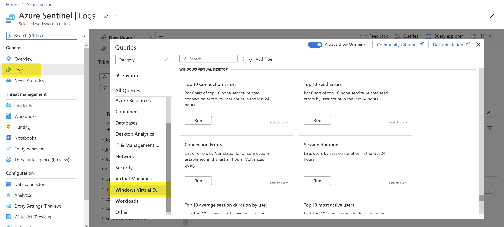

# Connect Windows Virtual Desktop data to Azure Sentinel

This article describes how to connect your Windows Virtual Desktop data into Azure Sentinel. 

Windows Virtual Desktop data is streamed into Sentinel via Log Analytics, and includes Windows event logs, Microsoft Defender Advanced Threat Protection (MDATP) alerts, and diagnostic logs from the WVD PaaS service itself.

## Connect Windows Virtual Desktop data

Use the following sets of instructions from the Windows Virtual Desktop documentation:

1. [Configure Azure Monitor for Windows Virtual Desktop to monitor your deployment](/azure/virtual-desktop/azure-monitor).

1. [Push Windows Virtual Desktop data to your Log Analytics workspace](/azure/virtual-desktop/diagnostics-log-analytics).

## Find your data

After a successful connection is established, use the **WINDOWS VIRTUAL DESKTOP** log queries in the Azure Sentinel **General** > **Logs** area.

## Next steps

For more information, see:
- [Connect Windows security events](connect-windows-security-events.md).
- [Azure Monitor for Windows Virtual Desktop glossary](/azure/virtual-desktop/azure-monitor-glossary)
