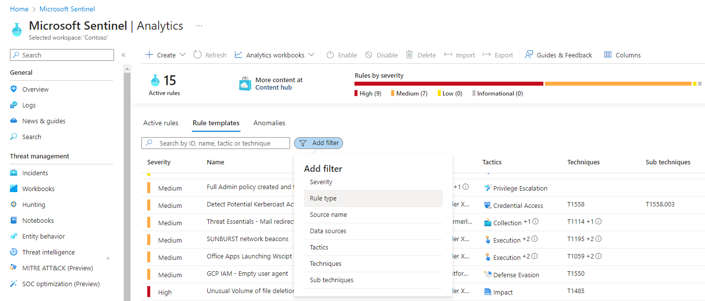
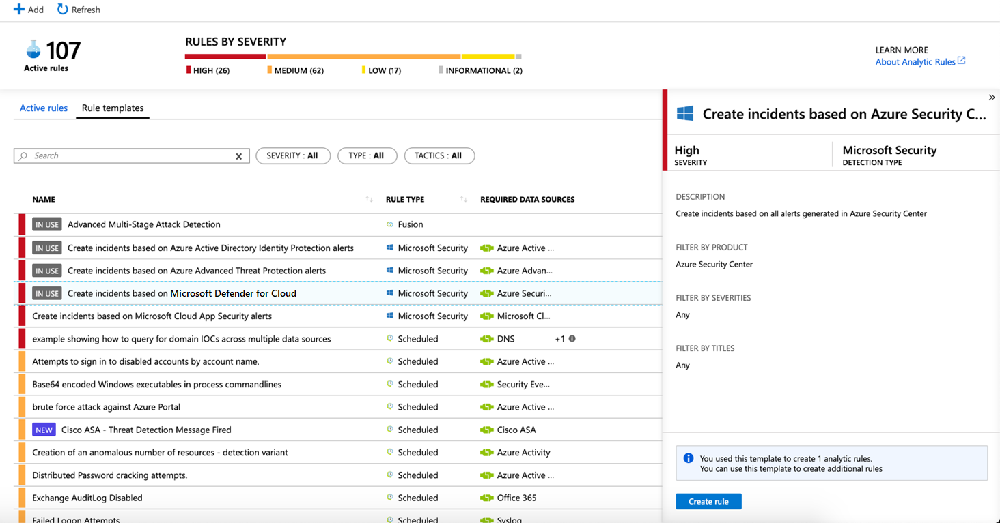
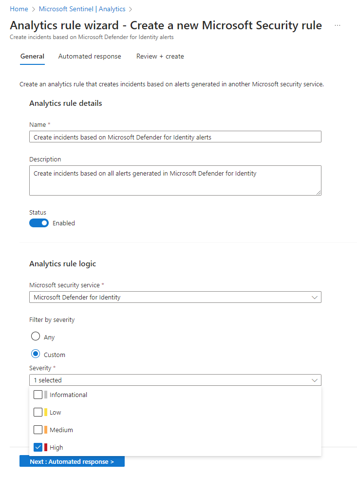
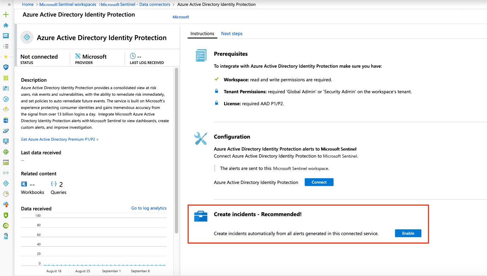

# Automatically create incidents from Microsoft security alerts

Alerts triggered in Microsoft security solutions that are connected to Microsoft Sentinel, such as Microsoft Defender for Cloud Apps and Microsoft Defender for Identity, do not automatically create incidents in Microsoft Sentinel. By default, when you connect a Microsoft solution to Microsoft Sentinel, any alert generated in that service will be stored as raw data in Microsoft Sentinel, in the *SecurityAlert* table in your Microsoft Sentinel workspace. You can then use that data like any other raw data you ingest into Microsoft Sentinel.

You can easily configure Microsoft Sentinel to automatically create incidents every time an alert is triggered in a connected Microsoft security solution, by following the instructions in this article.

## Prerequisites

Connect your security solution by installing the appropriate solution from the **Content Hub** in Microsoft Sentinel and setting up the data connector. For more information, see [Discover and manage Microsoft Sentinel out-of-the-box content](sentinel-solutions-deploy.md) and [Microsoft Sentinel data connectors](connect-data-sources.md).

## Using Microsoft Security incident creation analytics rules

Use the rule templates available in Microsoft Sentinel to choose which connected Microsoft security solutions should create Microsoft Sentinel incidents automatically. You can also edit the rules to define more specific options for filtering which of the alerts generated by the Microsoft security solution should create incidents in Microsoft Sentinel. For example, you can choose to create Microsoft Sentinel incidents automatically only from high-severity Microsoft Defender for Cloud alerts.

1. In the Azure portal under Microsoft Sentinel, select **Analytics**.

1. Select the **Rule templates** tab to see all of the analytics rule templates. To find more rule templates, go to the **Content hub** in Microsoft Sentinel.

    

1. Choose the **Microsoft security** analytics rule template that you want to use, and select  **Create rule**.

    

1. You can modify the rule details, and choose to filter the alerts that will create incidents by alert severity or by text contained in the alert’s name.  
      
    For example, if you choose **Microsoft Defender for Cloud** in the **Microsoft security service** field and choose **High** in the **Filter by severity** field, only high severity security alerts will automatically create incidents in Microsoft Sentinel.  

    

1. You can also create a new **Microsoft security** rule that filters alerts from different Microsoft security services by clicking on **+Create** and selecting **Microsoft incident creation rule**.

    

    You can create more than one **Microsoft Security** analytics rule per **Microsoft security service** type. This does not create duplicate incidents, since each rule is used as a filter. Even if an alert matches more than one **Microsoft Security** analytics rule, it creates just one Microsoft Sentinel incident.

## Enable incident generation automatically during connection

When you connect a Microsoft security solution, you can select whether you want the alerts from the security solution to automatically generate incidents in Microsoft Sentinel automatically.

1. Connect a Microsoft security solution data source. 

   

1. Under **Create incidents** select **Enable** to enable the default analytics rule that creates incidents automatically from alerts generated in the connected security service. You can then edit this rule under **Analytics** and then **Active rules**.

## Next steps

- To get started with Microsoft Sentinel, you need a subscription to Microsoft Azure. If you do not have a subscription, you can sign up for a [free trial](https://azure.microsoft.com/free/).
- Learn how to [onboard your data to Microsoft Sentinel](quickstart-onboard.md), and [get visibility into your data and potential threats](get-visibility.md).
