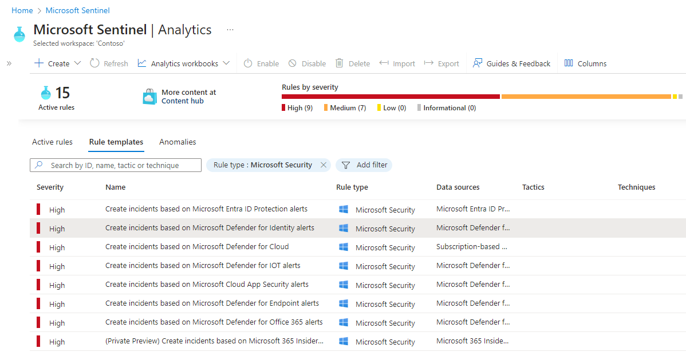
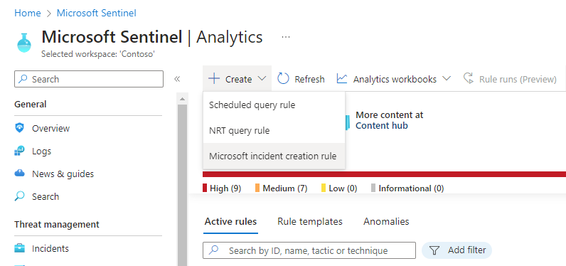
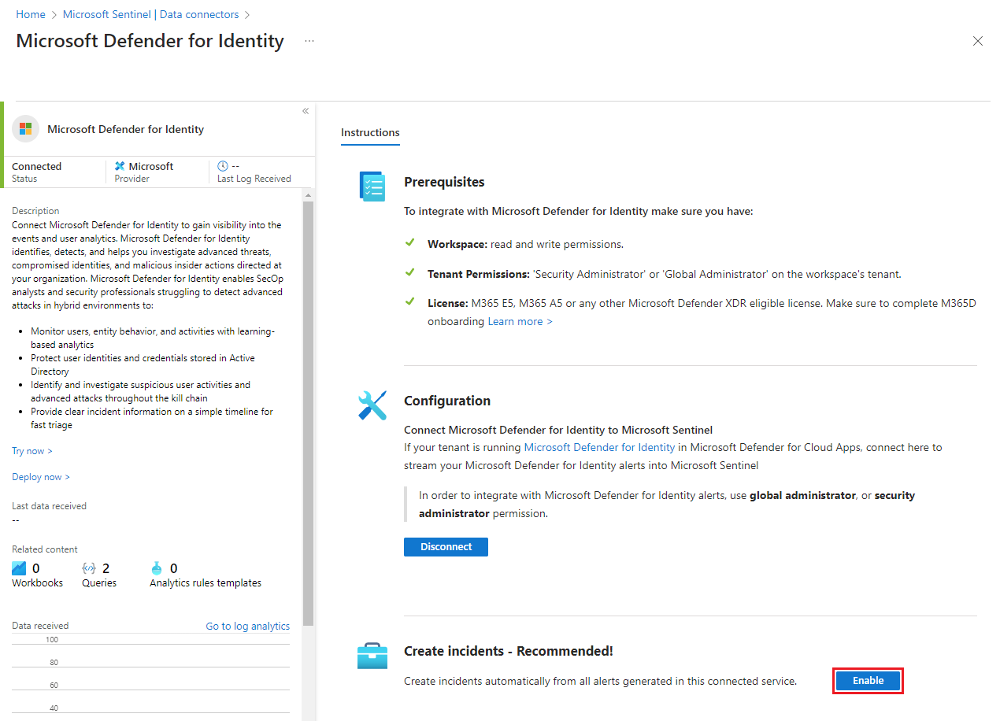

# Automatically create incidents from Microsoft security alerts

Alerts triggered in Microsoft security solutions that are connected to Azure Sentinel, such as Microsoft Cloud App Security and Azure Advanced Threat Protection, do not
automatically create incidents in Azure Sentinel. By default, when you connect a Microsoft solution to Azure Sentinel, any alert generated in that service will
be stored as raw data in Azure Sentinel, in the Security Alert table in your Azure Sentinel workspace. You can then use that data like any other raw data you
connect into Sentinel.

You can easily configure Azure Sentinel to automatically create incidents every time an alert is triggered in a connected Microsoft security solution, by following the
instructions in this article.

## Prerequisites
You must [connect Microsoft security solutions](connect-data-sources.md#data-connection-methods) to enable incident creation from security service alerts.

## Using Microsoft Security incident creation analytic rules

Use the built-in rules available in Azure Sentinel to choose which connected Microsoft security solutions should create Azure Sentinel incidents automatically in real time. You can also edit the rules to define more specific options for filtering which of the alerts generated by the Microsoft security solution should create incidents in Azure Sentinel. For example, you can choose to create Azure Sentinel incidents automatically only from high-severity Azure Security Center alerts.

1. In the Azure portal under Azure Sentinel, select **Analytics**.

1. Select the **Rule templates** tab to see all of the built-in analytic rules.

    

1. Choose the **Microsoft security** analytics rule template that you want to use, and click on **Create rule**.

    

1. You can modify the rule details, and choose to filter the alerts that will create incidents by alert severity or by text contained in the alert’s name.  
      
    For example, if you choose **Azure Security Center** in the **Microsoft security service** field and choose **High** in the **Filter by severity** field,
    only high severity Azure Security Center alerts will automatically create incidents in Azure Sentinel.  

    

1. You can also create a new **Microsoft security** rule that filters alerts from different Microsoft security services by clicking on **+Create** and
    selecting **Microsoft incident creation rule**.

    

  You can create more than one **Microsoft Security** analytic rule per **Microsoft security service** type. This does not create duplicate incidents, since each rule
is used as a filter. Even if an alert matches more than one **Microsoft Security** analytic rule, it creates just one Azure Sentinel incident.

## Enable incident generation automatically during connection
 When you connect a Microsoft security solution, you can select whether you want the alerts from the security solution to automatically generate incidents in Azure Sentinel automatically.

1. Connect a Microsoft security solution data source. 

   

1. Under **Create incidents** select **Enable** to enable the default analytic rule that creates incidents automatically from alerts generated in the connected security service. You can then edit this rule under **Analytics** and then **Active rules**.

## Next steps

- To get started with Azure Sentinel, you need a subscription to Microsoft Azure. If you do not have a subscription, you can sign up for a [free trial](https://azure.microsoft.com/free/).
- Learn how to [onboard your data to Azure Sentinel](quickstart-onboard.md), and [get visibility into your data, and potential threats](quickstart-get-visibility.md).
