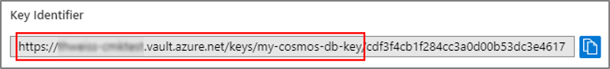
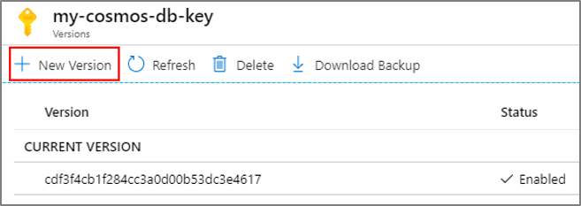

# Set up Azure Sentinel customer-managed key

This article provides background information and steps to configure a customer-managed key (CMK) for Azure Sentinel. CMK enables all data saved or sent to
Azure Sentinel to be encrypted in all relevant storage resources with an Azure Key Vault key created or owned by you.

> [!NOTE]
> -   The Azure Sentinel CMK capability is provided only to customers who are **new** and access to this capability is controlled by Azure feature registration. You can request access by contacting azuresentinelCMK@microsoft.com, and as capacity is available, pending requests will be approved.
> -   The Azure Sentinel CMK capability is only available in East US, West US 2, and South-Central US regions.
> -   The CMK capability is only available to customers sending 1TB per day or more. You will receive information about additional pricing when you apply to Microsoft to provision CMK on your Azure subscription. Learn more about [Log Analytics pricing](../azure-monitor/platform/manage-cost-storage.md#log-analytics-dedicated-clusters).

## How CMK works 

The Azure Sentinel solution uses several storage resources for log collection and features, including Log Analytics and others. As part of the Azure Sentinel CMK configuration, you will have to configure the CMK settings on the related storage resources as well. Data saved in storage resources other than Log Analytics will also be encrypted.

Learn more about [CMK](../azure-monitor/platform/customer-managed-keys.md#customer-managed-key-cmk-overview).

> [!NOTE]
> If you enable CMK on Azure Sentinel, any Public Preview feature that does not support CMK will not be enabled.

## Enable CMK 

To provision CMK, follow these steps: 

1.  Create an Azure Key Vault and storing key.

2.  Enable CMK on your Log Analytics workspace.

3.  Register for Cosmos DB.

4.  Add an access policy to your Azure Key Vault instance.

5.  Enable CMK in Azure Sentinel.

6.  Enable Azure Sentinel.

### STEP 1: Create an Azure Key Vault and storing key

1.  [Create Azure Key Vault resource](https://docs.microsoft.com/azure-stack/user/azure-stack-key-vault-manage-portal?view=azs-1910),
    then generate or import a key to be used for data encryption.
    > [!NOTE]
    >  Azure Key Vault must be configured as recoverable to protect your key and the access.

1.  [Turn on recovery options:](../key-vault/general/best-practices.md#turn-on-recovery-options)

    -   Make sure [Soft Delete](../key-vault/general/overview-soft-delete.md) is turned on.

    -   Turn on [Purge protection](../key-vault/general/overview-soft-delete.md#purge-protection) to guard against forced deletion of the secret/vault even after soft delete.

### STEP 2: Enable CMK on your Log Analytics workspace

Follow the instructions in [Azure Monitor customer-managed key configuration](../azure-monitor/platform/customer-managed-keys.md) in order to create a CMK workspace that will be used as the Azure Sentinel workspace in the following steps.

### STEP 3: Register for Cosmos DB

Azure Sentinel works with Cosmos DB as an additional storage resource. Make sure to register to Cosmos DB.

Follow the Cosmos DB instruction to [Register the Azure Cosmos DB](../cosmos-db/how-to-setup-cmk.md#register-resource-provider) resource provider for your Azure subscription.

### STEP 4: Add an access policy to your Azure Key Vault instance

Make sure to add access from Cosmos DB to your Azure Key Vault instance. Follow the Cosmos DB instruction to [add an access policy to your Azure Key Vault instance](../cosmos-db/how-to-setup-cmk.md#add-an-access-policy-to-your-azure-key-vault-instance) with Azure Cosmos DB principal.

### STEP 5: Enable CMK in Azure Sentinel

The Azure Sentinel CMK capability is provided to new customers only after receiving access directly from the Azure product group. Use your contacts at Microsoft to receive approval from the Azure Sentinel team to enable CMK in your solution.

After you get approval, you will be asked to provide the following information to enable the CMK feature.

-  Workspace ID on which you want to enable CMK

-  Key Vault URL: Copy the key’s “Key Identifier” up to the last forward slash:  
    

    

    The Azure Sentinel team will enable the Azure Sentinel CMK feature for your
    provided workspace.

-  Verification from the Azure Sentinel product team that you were approved to use this feature. You must have this before proceeding.

### STEP 6: Enable Azure Sentinel

Go to the Azure portal and enable Azure Sentinel on the workspace on which you set up CMK. For more information, see [Azure Sentinel Onboarding](quickstart-onboard.md).

## Key Encryption Key revocation or deletion

In the event that a user revokes the key encryption key, either by deleting it or removing access for Azure Sentinel, within one hour, Azure Sentinel will
honor the change and behave as if the data is no longer available. At this point, any operation performed that uses persistent storage resources such as
data ingestion, persistent configuration changes, and incident creation, will be prevented. Previously stored data will not be deleted but will remain
inaccessible. Inaccessible data is governed by the data-retention policy and will be purged in accordance with that policy.

The only operation possible after the encryption key is revoked or deleted is account deletion.

If access is restored after revocation, Azure Sentinel will restore access to the data within an hour.

To understand more about how this works in Azure Monitor, see [Azure Monitor CMK revocation](../azure-monitor/platform/customer-managed-keys.md#cmk-kek-revocation).

## Key encryption key rotation

Azure Sentinel and Log Analytics support key rotation. When a user performs key rotation in Key Vault, Azure Sentinel supports the new key within an hour.

In Key Vault, you can perform key rotation by creating a new version of the key:

You can disable the previous version of the key after 24 hours, or after the Azure Key Vault audit logs no longer show any activity that uses the previous
version.

If you use the same key in Azure Sentinel and in Log Analytics, it is necessary to perform key rotation you must explicitly update the cluster resource in Log
Analytics with the new Azure Key Vault key version. For more information, see [Azure Monitor CMK rotation](../azure-monitor/platform/customer-managed-keys.md#cmk-kek-rotation).

## Next steps
In this document, you learned how to set up a customer-managed key in Azure Sentinel. To learn more about Azure Sentinel, see the following articles:
- Learn how to [get visibility into your data, and potential threats](quickstart-get-visibility.md).
- Get started [detecting threats with Azure Sentinel](tutorial-detect-threats.md).
- [Use workbooks](tutorial-monitor-your-data.md) to monitor your data.

