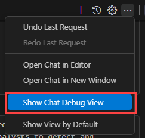

# Microsoft Sentinel MCP tool collection best practices and troubleshooting (preview)

> [!IMPORTANT]
> Microsoft Sentinel MCP server is currently in preview.
> This information relates to a prerelease product that may be substantially modified before it's released. Microsoft makes no warranties, expressed or implied, with respect to the information provided here.

This article outlines best practices to using Microsoft Sentinel's collection of Model Context Protocol (MCP) tools. It also provides steps you can take to troubleshoot common issues you might experience while using them.

## Best practices

- **Make sure your MCP client is compatible and up to date.** Microsoft Sentinel's MCP server implements the latest authorization specifications from MCP. Before connecting to the MCP server, make sure that your client is [compatible](sentinel-mcp-get-started.md#supported-code-editors-and-agent-platforms) and up to date to help prevent connectivity and common authentication issues.
- **Be specific in your prompts.** Good prompts deliver good results. If your prompts are taking longer to generate results, or if the agent's responses lack in ground truth, try writing more specific prompts. For example, a prompt that says `For user <UPN>, baseline their network, file, sign-in, and device events over 90 days and compare with +/- 10 minutes to find anomalies or suspicious activities to help me triage the severity and priority of this alert.` is far better than a prompt that says `What is risky about <UPN>?`.
- **Pick your workspace.** All Microsoft Sentinel security data is associated with a workspace. Our tools optionally require a workspace ID. If you work with multiple workspaces, be specific on what workspace ID you want your tools to run. Use the [`list_sentinel_workspaces`](sentinel-mcp-data-exploration-tool.md#list-workspaces-list_sentinel_workspaces) tool to identify the workspace you would like to run your tools against.
- **Troubleshoot common issues.** Familiarize yourself with common issues or error messages and respective troubleshooting steps provided in the next section of this article.

## Troubleshooting

The following table lists the common issues you might encounter while interacting with your Microsoft Sentinel's collection of MCP tools, their possible root causes, and the recommended actions to resolve them.

| Issue | Root cause | Suggested actions | 
|----------|----------|----------|
| My tools aren't getting called by the model| There are multiple possible root causes for this issue:<ul><li>The tools are semantically overlapping <li>Some models aren't able to intelligently reason over a large combination of tool.<li>Conversation context is favored over running the tools</ul> |<ul><li>Choose the right combination of tools in your MCP client (for example, Visual Studio Code) that delivers the desired outcome. Microsoft Sentinel's scenario focused collections are purpose built to avoid such challenges.<li>Pick newer reasoning model for best performance.<li>If you prefer your tools to execute each time, start a new conversation with your agent</ul> |
| My tools are randomly using data from different workspace identifiers (IDs). How do I force my tool to always return data from a single workspace?| You have access to multiple workspaces in Microsoft Sentinel data lake. |<ul><li>Use the `list_workspaces` tool to find your workspaces.<li>Specify a workspace ID directly in your prompt.</ul> |
| I'm intermittently getting a `HTTP 404 Resource not found` error in Visual Studio Code when invoking a tool | Possible bug in refreshing tokens|<ol><li>Remove the MCP server.<li>Close and reopen Visual Studio Code<li>[Add the MCP server](sentinel-mcp-get-started.md#add-microsoft-sentinels-collection-of-mcp-tools) again</ul> |
|I'm consistently getting an `HTTP 404 Resource not found` error when adding the MCP server in Visual Studio Code |There are multiple possible root causes for this issue:<ul><li>Your tenant isn't registered<li>Your tenant isn't attached to a Microsoft Sentinel data lake workspace<li>Your user account doesn't have access to a Microsoft Sentinel data lake workspace</ul> |Check if you're onboarded to the data lake. For more information, see [Onboard to Microsoft Sentinel data lake and Microsoft Sentinel graph (preview)](sentinel-lake-onboarding.md). |
|My prompts don't yield any results |There are multiple possible root causes for this issue:<ul><li>The Microsoft Sentinel table doesn't exist<li>Your query is too specific to match any table<li>The workspace ID you used is invalid<li>You don't have permission to access the tables</ul> |<ul><li>Navigate to Lake explorer and search for the noncustom table. If noncustom tables exist, open a support ticket so we can investigate further.<li>Try broadening your search for relevant tables.<li>Use the `list_workspaces` tool to find all workspaces you have access to. Use a valid workspace ID to run your tools against.<li>Contact your Microsoft Sentinel admin to give you permissions.</ul>|
|I'm getting a `HTTP 403 Unauthorized to access account` error. | The MCP client doesn't support MCP auth | If you're using Visual Studio Code, try upgrading to the latest version. |
|I'm signing in as a guest, but Visual Studio Code is generating a token for my home tenant. How do I force my MCP server to authenticate against my actual tenant? |This is a known issue in Visual Studio Code.  |Add a new header called `x-mcp-client-tenant-id` to your MCP server definition. For example:  <pre>"Sentinel-mcp-server": {    "type": "http",    "url": "<URL\>”,    "headers": {       "x-mcp-client-tenant-id" : "<tenant_id\>"    } }</pre> |
| I don't see my default workspace in the `list_workspaces` tool. How do I query data from my default workspace?|System tables don't have a valid workspace ID |Append your prompt to specifically mention your default workspace. For example, add the following line in your prompt:  `Use 'default' as the workspaceId.` |

### Debugging GitHub Copilot agent for troubleshooting support

To debug what your GitHub Copilot agent did and prepare your case for troubleshooting with support, Use the [Chat Debug View](https://code.visualstudio.com/docs/copilot/chat/copilot-chat#_chat-debug-view) in Visual Studio Code:

1. From the GitHub Copilot chat side bar, select the three-dots (...) and select **Show Chat Debug View**.

    

2. In the Copilot Chat Debug panel, Select **Export All as JSON...** to export the entire folder of the conversation for the prompt you need support for.

    

## Related content
- [Troubleshoot KQL queries for the Microsoft Sentinel data lake](kql-troubleshoot.md)