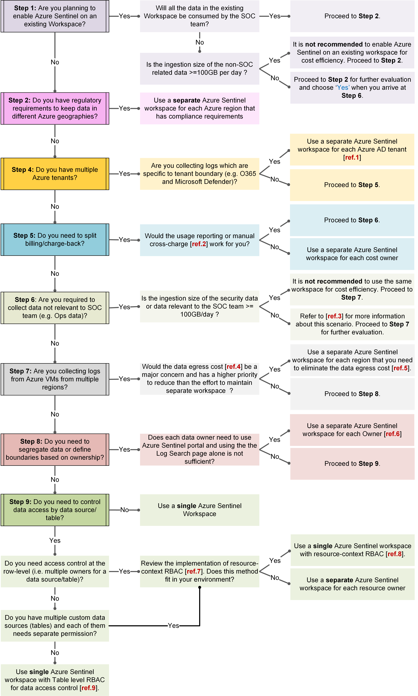

# Design your Microsoft Sentinel workspace architecture

This article provides a decision tree to help you make key decisions about how to design your Microsoft Sentinel workspace architecture. For more information, see [Microsoft Sentinel sample workspace designs](sample-workspace-designs.md) and [Microsoft Sentinel workspace architecture best practices](best-practices-workspace-architecture.md).

## Prerequisites

Before working through the decision tree, make sure you have the following information:

|Prerequisite  | Description |
|---------|---------|
|**Regulatory requirements related to Azure data residency**     |  Microsoft Sentinel can run on workspaces in most, but not all regions [supported in GA for Log Analytics](https://azure.microsoft.com/global-infrastructure/services/?products=monitor). Newly supported Log Analytics regions may take some time to onboard the Microsoft Sentinel service.    Data generated by Microsoft Sentinel, such as incidents, bookmarks, and analytics rules, may contain some customer data sourced from the customer's Log Analytics workspaces.   For more information, see [Geographical availability and data residency](geographical-availability-data-residency.md).|
|**Data sources**     |   Find out which [data sources](connect-data-sources.md) you need to connect, including built-in connectors to both Microsoft and non-Microsoft solutions. You can also use Common Event Format (CEF), Syslog or REST-API to connect your data sources with Microsoft Sentinel.   If you have Azure VMs in multiple Azure locations that you need to collect the logs from and the saving on data egress cost is important to you, you need to calculate the data egress cost using [Bandwidth pricing calculator](https://azure.microsoft.com/pricing/details/bandwidth/#overview) for each Azure location.      |
|**User roles and data access levels/permissions**     |    Microsoft Sentinel uses [Azure role-based access control (Azure RBAC)](../role-based-access-control/role-assignments-portal.md) to provide [built-in roles](../role-based-access-control/built-in-roles.md) that can be assigned to users, groups, and services in Azure.   All Microsoft Sentinel built-in roles grant read access to the data in your Microsoft Sentinel workspace. Therefore, you need to find out whether there is a need to control data access per data source or row-level as that will impact the workspace design decision. For more information, see [Custom roles and advanced Azure RBAC](roles.md#custom-roles-and-advanced-azure-rbac).     |
|**Daily ingestion rate**     |  The daily ingestion rate, usually in GB/day, is one of the key factors in cost management and planning considerations and workspace design for Microsoft Sentinel.   In most cloud and hybrid environments, networking devices, such as firewalls or proxies, and Windows and Linux servers produce the most ingested data. To obtain the most accurate results, Microsoft recommends an exhaustive inventory of data sources.   Alternatively, the Microsoft Sentinel [cost calculator](https://cloudpartners.transform.microsoft.com/download?assetname=assets%2FAzure_Sentinel_Calculator.xlsx&download=1) includes tables useful in estimating footprints of data sources.   **Important**: These estimates are a starting point, and log verbosity settings and workload will produce variances. We recommend that you monitor your system regularly to track any changes. Regular monitoring is recommended based on your scenario.   For more information, see [Azure Monitor Logs pricing details](../azure-monitor/logs/cost-logs.md).       |

## Decision tree

The following image shows a full decision tree flow chart to help you understand how to best design your workspace.

The following sections provide a full-text version of this decision tree, including the following notes referenced from the image:

[Note #1](#note1) | [Note #2](#note2)  | [Note #3](#note3)  | [Note #4](#note4)  | [Note #5](#note5)  | [Note #6](#note6)  | [Note #7](#note7)  | [Note #8](#note8)  | [Note #9](#note9) | [Note #10](#note10)

### Step 1: New or existing workspace?

Do you have an existing workspace that you can use for Microsoft Sentinel?

- **If not, and you'll be creating a new workspace** in any case, continue directly with [step 2](#step-2-keeping-data-in-different-azure-geographies).

- **If you have an existing workspace** that you might use, consider how much data you'll be ingesting.

  - **If you'll be ingesting *more* than 100 GB / day**, we recommend that you use a separate workspace for the sake of cost efficiency.

  - **If you'll be ingesting *less* than 100 GB / day**, continue with [step 2](#step-2-keeping-data-in-different-azure-geographies) for further evaluation. Consider this question again when it arises in [step 5](#step-5-collecting-any-non-soc-data).

### Step 2: Keeping data in different Azure geographies?

- **If you have regulatory requirements to keep data in different Azure geographies**, use a separate Microsoft Sentinel workspace for each Azure region that has compliance requirements. For more information, see [Region considerations](best-practices-workspace-architecture.md#region-considerations).

- **If you don't need to keep data in different Azure geographies**, continue with [step 3](#step-3-do-you-have-multiple-azure-tenants).

### Step 3: Do you have multiple Azure tenants?

- **If you have only a single tenant**, continue directly with [step 4](#step-4-splitting-billing--charge-back).

- **If you have multiple Azure tenants**, consider whether you're collecting logs that are specific to a tenant boundary, such as Office 365 or Microsoft 365 Defender.

  - **If you don't have any tenant-specific logs**, continue directly with [step 4](#step-4-splitting-billing--charge-back).

  - **If you *are* collecting tenant-specific logs**, use a separate Microsoft Sentinel workspace for each Azure AD tenant. Continue with [step 4](#step-4-splitting-billing--charge-back) for other considerations.

    [Decision tree note #1](#decision-tree): Logs specific to tenant boundaries, such as from Office 365 and Microsoft Defender for Cloud, can only be stored in the workspace within the same tenant.

    Although it is *possible* to use custom collectors to collect tenant-specific logs from a workspace in another tenant, we do not recommend this due to the following disadvantages:

    - Data collected by custom connectors will be ingested into custom tables. Therefore, you won’t be able to use all the built-in rules and workbooks.
    - Custom tables are not considered by some of the built-in features, such as UEBA and machine learning rules.
    - Additional cost and effort required for the custom connectors, such as using Azure Functions and Logic Apps.

    If these disadvantages are not a concern for your organization, continue with [step 4](#step-4-splitting-billing--charge-back) instead of using separate Microsoft Sentinel workspaces.

### Step 4: Splitting billing / charge-back?

If you need to split your billing or charge-back, consider whether the usage reporting or manual cross-charge works for you.

- **If you *do not* need to split your billing or charge-back**, continue with [step 5](#step-5-collecting-any-non-soc-data).

- **If you *do* need to split your billing or charge-back**, consider using manual cross-charge. In order to get accurate costs per entity, you can use a modified version of the Microsoft Sentinel Cost workbook that breaks down the cost by entity.

  - **If usage reporting or manual cross-charging works for you**, continue with [step 5](#step-5-collecting-any-non-soc-data).

  - **If *neither* usage reporting or manual cross-charging will work for you**, use a separate Microsoft Sentinel workspace for each cost owner.

  [Decision tree note #2](#decision-tree): For more information, see [Microsoft Sentinel costs and billing](billing.md).

### Step 5: Collecting any non-SOC data?

- **If you are not collecting any non-SOC data**, such as operational data, you can skip directly to [step 6](#step-6-multiple-regions).

- **If you *are* collecting non-SOC data**, consider whether there are any overlaps, where the same data source is required for both SOC and non-SOC data.

  **If you *do* have overlaps between SOC and non-SOC data**, treat the overlapping data as SOC data only. Then, consider whether the ingestion for *both* SOC and non-SOC data individually is less than 100 GB / day, but more than 100 GB / day when combined:

  - **Yes**: Proceed with [step 6](#step-6-multiple-regions) for further evaluation.
  - **No**: We do not recommend using the same workspace for the sake of cost efficiency. Proceed with [step 6](#step-6-multiple-regions) for further evaluation.

  In either case, for more information, see [note 10](#note10).

  **If you have *no* overlapping data**, consider whether the ingestion for *both* SOC and non-SOC data individually is less than 100 GB / day, but more than 100 GB / day when combined:

  - **Yes**: Proceed with [step 6](#step-6-multiple-regions) for further evaluation. For more information, see [note 3](#combining-your-soc-and-non-soc-data).
  - **No**: We do not recommend using the same workspace for the sake of cost efficiency. Proceed with [step 6](#step-6-multiple-regions) for further evaluation.

#### Combining your SOC and non-SOC data

[Decision tree note #3](#decision-tree): While we generally recommend that customers keep a separate workspace for their non-SOC data so that non-SOC data is not subject to Microsoft Sentinel costs, there may be situations where combining SOC and non-SOC data is less expensive than separating them.

For example, consider an organization that has security logs ingesting at 50 GB/day, operations logs ingesting at 50 GB/day, and a workspace in the East US region.

The following table compares workspace options with and without separate workspaces.

> [!NOTE]
> Costs and terms listed in the following table are fake, and used for illustrative purposes only. For up-to-date cost information, see the Microsoft Sentinel pricing calculator.
>

|Workspace architecture  |Description |
|---------|---------|
|The SOC team has its own workspace, with Microsoft Sentinel enabled.   The Ops team has its own workspace, without Microsoft Sentinel enabled.     |  **SOC team**:  Microsoft Sentinel cost for 50 GB/day is $6,500 per month. First three months of retention are free.   **Ops team**: - Cost of Log Analytics at 50 GB/day is around $3,500 per month. - First 31 days of retention are free.  The total cost for both equals $10,000 per month.       |
|Both SOC and Ops teams share the same workspace with Microsoft Sentinel enabled. |By combining both logs, ingestion will be 100 GB / day, qualifying for eligibility for Commitment Tier (50% for Sentinel and 15% for LA).         Cost of Microsoft Sentinel for 100 GB / day equals $9,000 per month.      |

In this example, you'd have a cost savings of $1,000 per month by combining both workspaces, and the Ops team will also enjoy 3 months of free retention instead of only 31 days.

This example is relevant only when both SOC and non-SOC data each have an ingestion size of >=50 GB/day and <100 GB/day.

[Decision tree note #10](#decision-tree): We recommend using a separate workspace for non-SOC data so that non-SOC data isn't subjected to Microsoft Sentinel costs.

However, this recommendation for separate workspaces for non-SOC data comes from a purely cost-based perspective, and there are other key design factors to examine when determining whether to use a single or multiple workspaces. To avoid double ingestion costs, consider collecting overlapped data on a single workspace only with table-level Azure RBAC.

### Step 6: Multiple regions?

- **If you are collecting logs from Azure VMs in a *single* region only**, continue directly with [step 7](#step-7-segregating-data-or-defining-boundaries-by-ownership).

- **If you are collecting logs from Azure VMs in *multiple* regions**, how concerned are you about the data egress cost?

  [Decision tree note #4](#decision-tree): Data egress refers to the [bandwidth cost](https://azure.microsoft.com/pricing/details/bandwidth/) for moving data out of Azure datacenters. For more information, see [Region considerations](best-practices-workspace-architecture.md#region-considerations).

  - If reducing the amount of effort required to maintain separate workspaces is a priority, continue with [step 7](#step-7-segregating-data-or-defining-boundaries-by-ownership).

  - If the data egress cost is enough of a concern to make maintaining separate workspaces worthwhile, use a separate Microsoft Sentinel workspace for each region where you need reduce the data egress cost.

    [Decision tree note #5](#decision-tree): We recommend that you have as few workspaces as possible. Use the [Azure pricing calculator](https://azure.microsoft.com/pricing/calculator/?service=azure-sentinel) to estimate the cost and determine which regions you actually need, and combine workspaces for regions with low egress costs. Bandwidth costs may be only a small part of your Azure bill when compared with separate Microsoft Sentinel and Log Analytics ingestion costs.

    For example, your cost might be estimated as follows:

    - 1,000 VMs, each generating 1 GB / day;
    - Sending data from a US region to an EU region;
    - Using a 2:1 compression rate in the agent

    The calculation for this estimated cost would be: `1000 VMs * (1GB/day ÷ 2) * 30 days/month * $0.05/GB = $750/month bandwidth cost`

    This sample cost would be much less expensive when compared with the monthly costs of a separate Microsoft Sentinel and Log Analytics workspace.

    > [!NOTE]
    > Listed costs are fake and are used for illustrative purposes only. For up-to-date cost information, see the Microsoft Sentinel pricing calculator.
    >

### Step 7: Segregating data or defining boundaries by ownership?

- **If you *do not* need to segregate data or define any ownership boundaries**, continue directly with [step 8](#step-8-controlling-data-access-by-data-source--table).

- **If you *do* need to segregate data or define boundaries based on ownership**, does each data owner need to use the Microsoft Sentinel portal?

  - If each data owner must have access to the Microsoft Sentinel portal, use a separate Microsoft Sentinel workspace for each owner.

    [Decision tree note #6](#decision-tree): Access to the Microsoft Sentinel portal requires that each user have a role of at least a [Microsoft Sentinel Reader](../role-based-access-control/built-in-roles.md), with **Reader** permissions on all tables in the workspace. If a user does not have access to all tables in the workspace, they'll need to use Log Analytics to access the logs in search queries.

  - If access to the logs via Log Analytics is sufficient for any owners without access to the Microsoft Sentinel portal, continue with [step 8](#step-8-controlling-data-access-by-data-source--table).

  For more information, see [Permissions in Microsoft Sentinel](roles.md).

### Step 8: Controlling data access by data source / table?

- **If you *do not* need to control data access by source or table**, use a single Microsoft Sentinel workspace.

- **If you *do* need to control data access by source or table**, consider using [resource-context RBAC](resource-context-rbac.md) in the following situations:

  - If you need to control access at the row level, such as providing multiple owners on each data source or table

  - If you have multiple, custom data sources/tables, where each one needs separate permissions

  In other cases, when you do *not* need to control access at the row level, provide multiple, custom data sources/tables with separate permissions, use a single Microsoft Sentinel workspace, with table-level RBAC for data access control.

#### Considerations for resource-context or table-level RBAC

When planning to use resource-context or table level RBAC, consider the following information:

- [Decision tree note #7](#decision-tree): To configure resource-context RBAC for non-Azure resources, you may want to associate a Resource ID to the data when sending to Microsoft Sentinel, so that the permission can be scoped using resource-context RBAC. For more information, see [Explicitly configure resource-context RBAC](resource-context-rbac.md#explicitly-configure-resource-context-rbac) and [Access modes by deployment](../azure-monitor/logs/workspace-design.md).

- [Decision tree note #8](#decision-tree): [Resource permissions](../azure-monitor/logs/manage-access.md) or [resource-context](../azure-monitor/logs/workspace-design.md) allows users to view logs only for resources that they have access to. The workspace access mode must be set to **User resource or workspace permissions**. Only tables relevant to the resources where the user has permissions will be included in search results from the **Logs** page in Microsoft Sentinel.

- [Decision tree note #9](#decision-tree): [Table-level RBAC](../azure-monitor/logs/manage-access.md) allows you to define more granular control to data in a Log Analytics workspace in addition to the other permissions. This control allows you to define specific data types that are accessible only to a specific set of users. For more information, see [Table-level RBAC in Microsoft Sentinel](https://techcommunity.microsoft.com/t5/azure-sentinel/table-level-rbac-in-azure-sentinel/ba-p/965043).

## Next steps

In this article, you reviewed a decision tree to help you make key decisions about how to design your Microsoft Sentinel workspace architecture.

> [!div class="nextstepaction"]
> >[Microsoft Sentinel sample workspace designs](sample-workspace-designs.md)