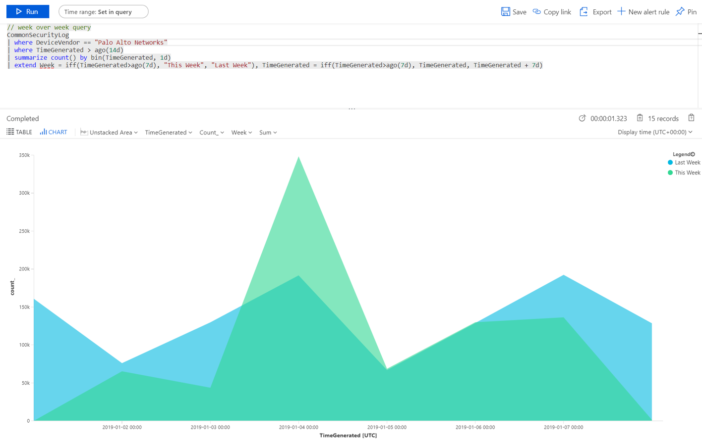
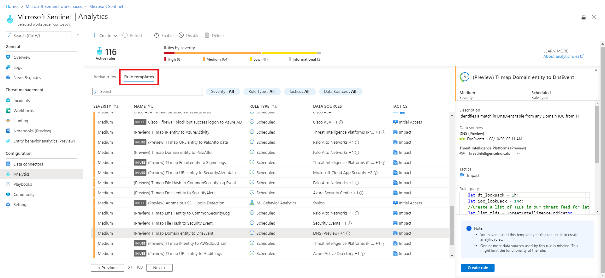

# Visualize collected data

In this article, you will learn how to quickly be able to view and monitor what's happening across your environment using Microsoft Sentinel. After you connected your data sources to Microsoft Sentinel, you get instant visualization and analysis of data so that you can know what's happening across all your connected data sources. Microsoft Sentinel gives you workbooks that provide you with the full power of tools already available in Azure as well as tables and charts that are built in to provide you with analytics for your logs and queries. You can either use workbook templates or create a new workbook easily, from scratch or based on an existing workbook. 

## Get visualization

To visualize and get analysis of what's happening on your environment, first, take a look at the overview dashboard to get an idea of the security posture of your organization. To help you reduce noise and minimize the number of alerts you have to review and investigate, Microsoft Sentinel uses a fusion technique to correlate alerts into incidents. **Incidents** are groups of related alerts that together create an actionable incident that you can investigate and resolve.

In the Azure portal, select Microsoft Sentinel and then select the workspace you want to monitor.

:::image type="content" source="./media/qs-get-visibility/overview.png" alt-text="Screenshot of the Microsoft Sentinel overview page." lightbox="./media/qs-get-visibility/overview.png":::

If you want to refresh the data for all sections of the dashboard, select **Refresh** at the top of the dashboard. To improve performance, the data for each section of the dashboard is pre-calculated, and you can see the refresh time at the top of each section.

### View incident data

You see different types of incident data under **Incidents**.

:::image type="content" source="./media/qs-get-visibility/incidents.png" alt-text="Screenshot of the Incidents section in the Microsoft Sentinel Overview page." lightbox="./media/qs-get-visibility/incidents.png":::
 
- On the top left, you see the number of new, active, and closed incidents over the last 24 hours. 
- On the top right, you see incidents organized by severity, and closed incidents by closing classification. 
- On the bottom left, a graph breaks up the incident status by creation time, in four hour intervals.
- On the bottom right, you can see the mean time to acknowledge an incident and mean time to close, with a link to the SOC efficiency workbook. 

### View automation data

You see different types of automation data under **Automation**.

:::image type="content" source="./media/qs-get-visibility/automation.png" alt-text="Screenshot of the Automation section in the Microsoft Sentinel Overview page." lightbox="./media/qs-get-visibility/automation.png":::

- At the top, you see a summary of the automation rules activity: Incidents closed by automation, the time the automation saved, and related playbooks health. 
- Below the summary, a graph summarizes the numbers of actions performed by automation, by type of action. 
- At the bottom, you can find a count of the active automation rules with a link to the automation blade. 

### View status of data records, data collectors, and threat intelligence

You see different types of data on data records, data collectors, and threat intelligence under **Data**.

:::image type="content" source="./media/qs-get-visibility/data.png" alt-text="Screenshot of the Data section in the Microsoft Sentinel Overview page." lightbox="./media/qs-get-visibility/data.png":::

- On the left, a graph shows the number of records that Microsoft Sentinel collected in the last 24 hours, compared to the previous 24 hours, and anomalies detected in that time period.
- On the top right, you see a summary of the data connector status, divided by unhealthy and active connectors. **Unhealthy connectors** indicate how many connectors have errors. **Active connectors** are connectors with data streaming into Microsoft Sentinel, as measured by a query included in the connector.
- On the bottom right, you can see threat intelligence records in Microsoft Sentinel, by indicator of compromise.

### View analytics data

You see data for analytics rules under **Analytics**.

:::image type="content" source="./media/qs-get-visibility/analytics.png" alt-text="Screenshot of the Analytics section in the Microsoft Sentinel Overview page.":::

You see the number of analytics rules in Microsoft Sentinel, by enabled, disabled, or auto-disabled status.

## Use workbooks templates<a name="dashboards"></a>

Workbook templates provide integrated data from your connected data sources to let you deep dive into the events generated in those services. Workbook templates include Azure Active Directory (Azure AD), Azure activity events, and on-premises, which can be data from Windows Events from servers, from first party alerts, from any third-party including firewall traffic logs, Office 365, and insecure protocols based on Windows events. The workbooks are based on Azure Monitor Workbooks to provide you with enhanced customizability and flexibility in designing your own workbook. For more information, see [Workbooks](../azure-monitor/visualize/workbooks-overview.md).

1. Under **Settings**, select **Workbooks**. Under **My workbooks**, you can see all your saved workbook. Under **Templates**, you can see the workbooks templates that are installed. To find more workbook templates, go to the **Content hub** in Microsoft Sentinel to install product solutions or standalone content.
2. Search for a specific workbook to see the whole list and description of what each offers. 
3. Assuming you use Azure AD, to get up and running with Microsoft Sentinel, we recommend that you install the Azure AD solution for Microsoft Sentinel and use the following workbooks:
   - **Azure AD**: Use either or both of the following:
       - **Azure AD sign-ins** analyzes sign-ins over time to see if there are anomalies. This workbooks provides failed sign-ins by applications, devices, and locations so that you can notice, at a glance if something unusual happens. Pay attention to multiple failed sign-ins. 
       - **Azure AD audit logs** analyzes admin activities, such as changes in users (add, remove, etc.), group creation, and modifications.  

   - Install the appropriate solution to add a workbook for your firewall. For example, install the Palo Alto firewall solution for Microsoft Sentinel to add the Palo Alto workbooks. The workbooks analyze your firewall traffic, providing you with correlations between your firewall data and threat events, and highlights suspicious events across entities. Workbooks provide you with information about trends in your traffic and let you drill down into and filter results. 

      


You can customize the workbooks either by editing the main query . You can click the button  to go to [Log Analytics to edit the query there](../azure-monitor/logs/log-analytics-tutorial.md), and you can select the ellipsis (...) and select **Customize tile data**, which enables you to edit the main time filter, or remove the specific tiles from the workbook.

For more information on working with queries, see [Tutorial: Visual data in Log Analytics](../azure-monitor/visualize/tutorial-logs-dashboards.md)

### Add a new tile

If you want to add a new tile, you can add it to an existing workbook, either one that you create or a Microsoft Sentinel built-in workbook. 
1. In Log Analytics, create a tile using the instructions found in [Visual data in Log Analytics](../azure-monitor/visualize/tutorial-logs-dashboards.md). 
2. After the tile is created, under **Pin**, select the workbook in which you want the tile to appear.

## Create new workbooks

You can create a new workbook from scratch or use a workbook template as the basis for your new workbook.

1. To create a new workbook from scratch, select **Workbooks** and then **+New workbook**.
1. Select the subscription the workbook is created in and give it a descriptive name. Each workbook is an Azure resource like any other, and you can assign it roles (Azure RBAC) to define and limit who can access.
1. To enable it to show up in your workbooks to pin visualizations to, you have to share it. Click **Share** and then **Manage users**.
1. Use the **Check access** and **Role assignments** as you would for any other Azure resource. For more information, see [Share Azure workbooks by using Azure RBAC](../azure-portal/azure-portal-dashboard-share-access.md).


## New workbook examples

The following sample query enables you to compare trends of traffic across weeks. You can easily switch which device vendor and data source you run the query on. This example uses SecurityEvent from Windows, you can switch it to run on AzureActivity or CommonSecurityLog on any other firewall.

```console
// week over week query
SecurityEvent
| where TimeGenerated > ago(14d)
| summarize count() by bin(TimeGenerated, 1d)
| extend Week = iff(TimeGenerated>ago(7d), "This Week", "Last Week"), TimeGenerated = iff(TimeGenerated>ago(7d), TimeGenerated, TimeGenerated + 7d)
```

You might want to create a query that incorporates data from multiples sources. You can create a query that looks at Azure Active Directory audit logs for new users that were just created, and then checks your Azure logs to see if the user started making role assignment changes within 24 hours of creation. That suspicious activity would show up on this dashboard:

```console
AuditLogs
| where OperationName == "Add user"
| project AddedTime = TimeGenerated, user = tostring(TargetResources[0].userPrincipalName)
| join (AzureActivity
| where OperationName == "Create role assignment"
| project OperationName, RoleAssignmentTime = TimeGenerated, user = Caller) on user
| project-away user1
```

You can create different workbooks based on role of person looking at the data and what they're looking for. For example, you can create a workbook for your network admin that includes the firewall data. You can also create workbooks based on how frequently you want to look at them, whether there are things you want to review daily, and others items you want to check once an hour, for example, you might want to look at your Azure AD sign-ins every hour to search for anomalies. 

## Create new detections

Generate detections on the [data sources that you connected to Microsoft Sentinel](connect-data-sources.md) to investigate threats in your organization.

When you create a new detection, leverage the detections crafted by Microsoft security researchers that are tailored to the data sources you connected.

To view the installed out-of-the-box detections, go to **Analytics** and then **Rule templates**. This tab contains all the installed Microsoft Sentinel rule templates. To find more rule templates, go to the **Content hub** in Microsoft Sentinel to install product solutions or standalone content.

   

For more information about getting out-of-the-box detections, see [Get built-in-analytics](detect-threats-built-in.md).

## Next steps

[Detect threats out-of-the-box](detect-threats-built-in.md) and [create custom threat detection rules](detect-threats-custom.md) to automate your responses to threats.
