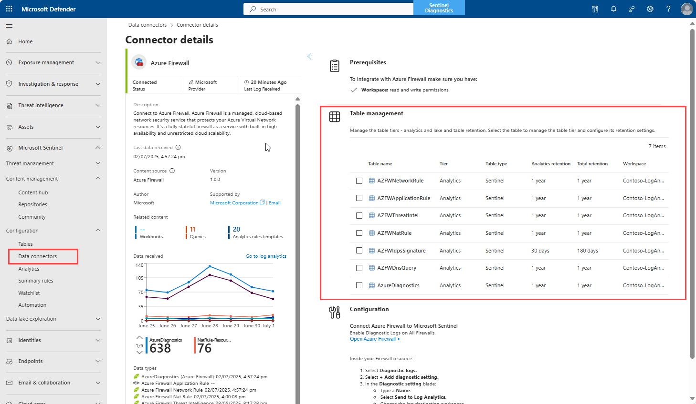

---  
title: Setting up Microsoft Sentinel data lake (Preview)
titleSuffix: Microsoft Security  
description: Setting up and configuring connectors for Microsoft Sentinel data lake.
author: EdB-MSFT  
ms.service: microsoft-sentinel  
ms.topic: conceptual
ms.custom: sentinel-graph
ms.date: 07/02/2025
ms.author: edbaynash  

ms.collection: ms-security  
---  

# Setting up Microsoft Sentinel data lake (Preview)

The Microsoft Sentinel data lake mirrors data from Microsoft Sentinel workspaces. When you onboard to Microsoft Sentinel data lake, your existing Microsoft Sentinel data connectors are configured to send data to both the analytics tier - your Microsoft Sentinel workspaces, and mirror the data to the data lake tier for longer term storage. After onboarding, configure your connectors to retain data in each tier according to your requirements.   

This article explains how to set up connectors for the Microsoft Sentinel data lake and configure retention. For more information On onboarding, see [Onboading to Microsoft Sentinel data lake](senitnel-lake-onboarding.md)

## Setting up connectors for the lake

After on boarding, you can enable new connectors and configure retention for existing connectors. You can and choose to the send the data to the analytics in Lake and mirror the data to the data lake tier, or send the data only to the data lake tier. Retention and tiering can be done from the connector setup experience or using the Table management page in the Defender portal. For mre information on table management and retention, see [Manage data tiers and retention in Microsoft Defender Portal (Preview)](https://aka.ms/manage-data-defender-portal-overview).

When you enable a connector, the default is for data to be sent to the analytics tier and mirrored in the data lake tier. When you enable Microsoft Sentinel data lake, the mirroring is automatically enabled for all the tables from onboaring forward. Pre-existing data in the tables isn't mirrored. The retention of in the data lake tier set to the same value as teh analytics tier. 

The data retained in Archive will still be available and can be restored using Search and Restore functionality. 

You can switch to data lake tier only, where data is only ingested into the data lake tier and ingestion into the analytics tier stops.

For more details on Tiering options and Retention settings, see [Manage data tiers and retention in Microsoft Defender Portal (Preview)](https://aka.ms/manage-data-defender-portal-overview).

 To setup the data lake initially will take approximately 90-120 minutes after onboarding for the data to show up. All tables corresponding to the new connectors enabled after the data lake is setup will take 90-120 minutes to show up in the lake. For any new DCRs setup or updating existing DCRs, it may take more than 30 minutes to reflect the change in the data flowing to lake.
To query the logs in the data lake navigate to the Lake explorer experience. In the Defender portal, query data stored in your Analytics tier in the Advanced hunting page, or in the Azure portal, query data in the Logs page. When a Defender and Sentinel customer onboards to the data lake and attaches Defender connected workspaces to the data lake, customers will no longer see Aux log tables in Microsoft Defender’s Advanced Hunting experience or in the Sentinel Azure portal.

## Default data in the lake
In addition to the tables already enabled by the connectors you have already setup, the data lake setup will enable additional data in your lake. 
1.	All tables in your XDR connector will be enabled in your lake with 30-day retention free if you have only one Sentinel workspace in your tenant. You can navigate to the Table management experience to extend retention of the XDR tables without requiring you to extend the default retention of you Analytics tier table.
2.	Asset tables corresponding to Entra, M365 and ARG will be auto-enabled. In case your onboarding does not enable these assets by default, follow the instructions to enable the asset tables documented here.
3.	All mirrored data in the lake with the same retention as Analytics tier will be free.

Key points to note
1.	CLv1 tables will not be mirrored to the lake. 
2.	When tables are converted to lake-only, previously ingested data in the Analytics tier is still available for you to query. No new data will be ingested into the Analytics tier.
3.	The table name in the lake is exactly same as it is in Analytics tier.
4.	A hypothetical sequence of steps describing the effect of tier switching and data availability is described below:
•	Syslog via AMA connector is enabled.
•	Data is sent to Syslog and can be queried it in Log Analytics/Advanced Hunting.
•	I enable Sentinel data lake on my workspace on 1-Jun. The table is automatically mirrored where data is sent to both Analytics and data lake, with retention same as Analytics tier.
•	Syslog will have all the data (including before 1-Jun) when you query Syslog on 10-Jun in Log Analytics.
•	When you query Syslog on 10-Jun in the Lake, you would only see data from 1-Jun thru 10-Jun.
•	You change the tier of Syslog on 15-Jun to be data lake only. 
•	On 20-Jun, you should still be able to query Syslog in Log Analytics, and only see data thru 15-Jun (and less any data removed for retention period)
•	You can query Syslog in the Lake and see data from 1-Jun thru 20-Jun.
