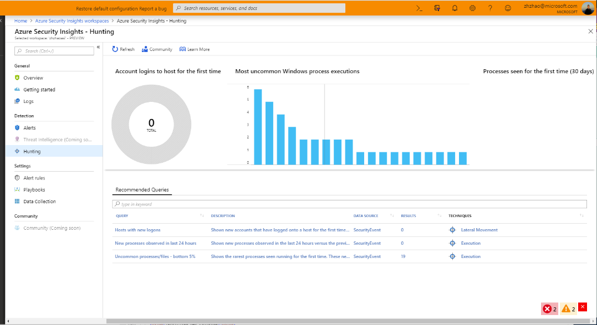
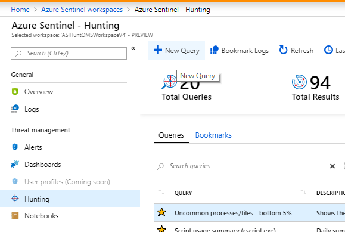
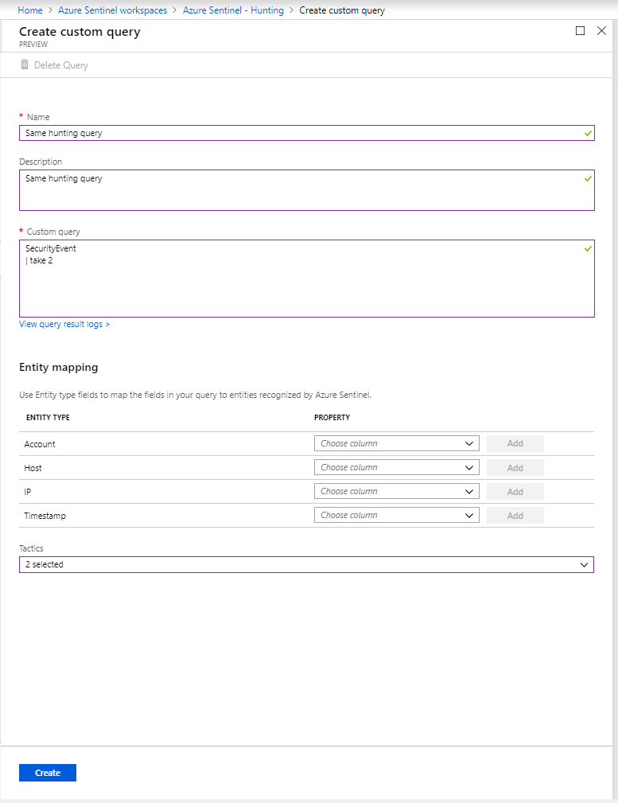
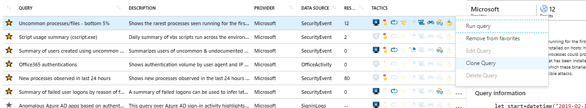
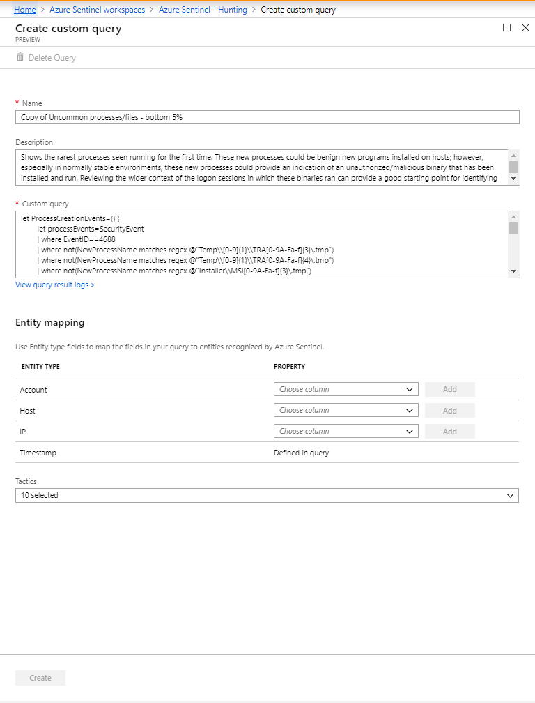

# Hunt for threats with in Azure Sentinel Preview

> [!IMPORTANT]
> Azure Sentinel is currently in public preview.
> This preview version is provided without a service level agreement, and it's not recommended for production workloads. Certain features might not be supported or might have constrained capabilities. 
> For more information, see [Supplemental Terms of Use for Microsoft Azure Previews](https://azure.microsoft.com/support/legal/preview-supplemental-terms/).

If you're an investigator who wants to be proactive about looking for security threats, Azure Sentinel powerful hunting search and query tools to hunt for security threats across your organization’s data sources. But your systems and security appliances generate mountains of data that can be difficult to parse and filter into meaningful events. To help security analysts look proactively for new anomalies that weren't detected by your security apps, Azure Sentinel' built-in hunting queries guide you into asking the right questions to find issues in the data you already have on your network. 

For example, one built-in query provides data about the most uncommon processes running on your infrastructure - you wouldn't want an alert about each time they are run, they could be entirely innocent, but you might want to take a look at the query on occasion to see if there's anything unusual. 

With Azure Sentinel hunting, you can take advantage of the following capabilities:

- Built-in queries: To get you started, a starting page provides preloaded query examples designed to get you started and get you familiar with the tables and the query language. These built-in hunting queries are developed by Microsoft security researchers on a continuous basis, adding new queries, and fine-tuning existing queries to provide you with an entry point to look for new detections and figure out where to start hunting for the beginnings of new attacks. 

- Powerful query language with IntelliSense: Built on top of a query language that gives you the flexibility you need to take hunting to the next level.

- Create your own bookmarks: During the hunting process, you may come across matches or findings, dashboards, or activities that look unusual or suspicious. In order to mark those items so you can come back to them in the future, use the bookmark functionality. Bookmarks let you save items for later, to be used to create a case for investigation. For more information about bookmarks, see Use [bookmarks in hunting].

- Use notebooks to automate investigation: Notebooks are like step-by-step playbooks that you can build to walk through the steps of an investigation and hunt.  Notebooks encapsulate all the hunting steps in a reusable playbook that can be shared with others in your organization. 
- Query the stored data: The data is accessible in tables for you to query. For example, you can query process creation, DNS events, and many other event types.

- Links to community: Leverage the power of the greater community to find additional queries and data sources.
 
## Get started hunting

1. In the Azure Sentinel portal, click **Hunting**.
  

2. When you open the **Hunting** page, all the hunting queries are displayed in a single table. The table lists all the queries written by Microsoft's team of security analysts as well as any additional query you created or modified. Each query provides a description of what it hunts for, and what kind of data it runs on. These templates are grouped by their various tactics - the icons on the right categorize the type of threat, such as initial access, persistence, and exfiltration. You can filter these hunting query templates using any of the fields. You can save any query to your favorites. By saving a query to your favorites, the query automatically runs each time the **Hunting** page is accessed. You can create your own hunting query or clone and customize an existing hunting query template. 
 
2. Click **Run query** in the hunting query details page to run any query without leaving the hunting page.  The number of matches is displayed within the table. Review the list of hunting queries and their matches. Check out which stage in the kill chain the match is associated with.

3. Perform a quick review of the underlying query in the query details pane or click **View query result** to open the query in Log Analytics. At the bottom, review the matches for the query.

4.	Click on the row and select **Add bookmark** to add the rows to be investigated - you can do this for anything that looks suspicious. 

5. Then, go back to the main **Hunting** page and click the **Bookmarks** tab to see all the suspicious activities. 

6. Select a bookmark and then click **Investigate** to open the investigation experience. You can filter the bookmarks. For example, if you're investigating a campaign, you can create a tag for the campaign and then filter all the bookmarks based on the campaign.

1. After you discovered which hunting query provides high value insights into possible attacks, you can also create custom detection rules based on your query and surface those insights as alerts to your security incident responders.

 

## Query language 

Hunting in Azure Sentinel is based on Azure Log Analytics query language. For more information on the query language and supported operators, see [Query Language Reference](https://docs.loganalytics.io/docs/Language-Reference/).

## Public hunting query GitHub repository

Check out the [Hunting query repository](https://github.com/Azure/Orion). Contribute and use example queries shared by our customers.

 

## Sample query

A typical query starts with a table name followed by a series of operators separated by \|.

In the example above, start with the table name SecurityEvent and add piped elements as needed.

1. Define a time filter to review only records from the previous seven days.

2. Add a filter in the query to only show event ID 4688.

3. Add a filter in the query on the CommandLine to contain only instances of cscript.exe.

4. Project only the columns you're interested in exploring and limit the results to 1000 and click **Run query**.
5. Click the green triangle and run the query. You can test the query and run it to look for anomalous behavior.

## Useful operators

The query language is powerful and has many available operators, some useful operators are listed here:

**where** - Filter a table to the subset of rows that satisfy a predicate.

**summarize** - Produce a table that aggregates the content of the input table.

**join** - Merge the rows of two tables to form a new table by matching values of the specified column(s) from each table.

**count** - Return the number of records in the input record set.

**top** - Return the first N records sorted by the specified columns.

**limit** - Return up to the specified number of rows.

**project** - Select the columns to include, rename or drop, and insert new computed columns.

**extend** - Create calculated columns and append them to the result set.

**makeset** - Return a dynamic (JSON) array of the set of distinct values that Expr takes in the group

**find** - Find rows that match a predicate across a set of tables.

## Save a query

You can create or modify a query and save it as your own query or share it with users who are in the same tenant.

   

Create a new hunting query:

1. Click **New query** and select **Save**.
2. Fill in all the blank fields and select **Save**.

   

Clone and modify an existing hunting query:

1. Select the hunting query in the table you want to modify.
2. Select the ellipsis (...) in the line of the query you want to modify, and select **Clone query**.

   
 

3. Modify the query and select **Create**.

   

## Next steps
In this article, you learned how to run a hunting investigation with Azure Sentinel. To learn more about Azure Sentinel, see the following articles:

- [Use notebooks to run automated hunting campaigns](notebooks.md)
- [Use bookmarks to save interesting information while hunting](bookmarks.md)
