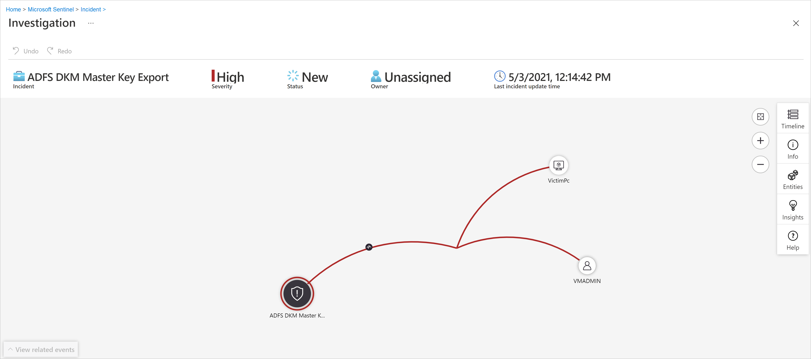
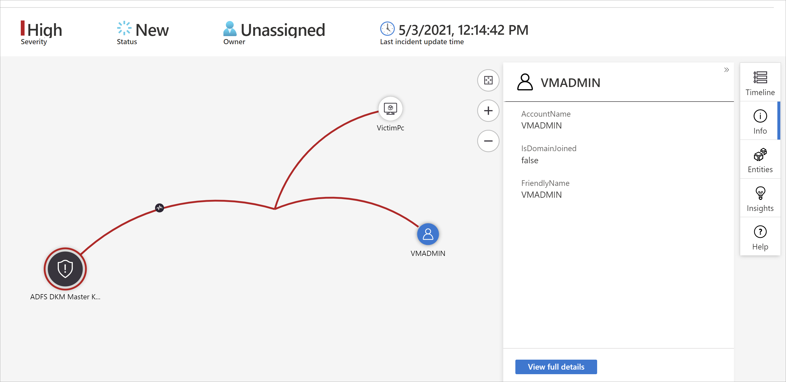
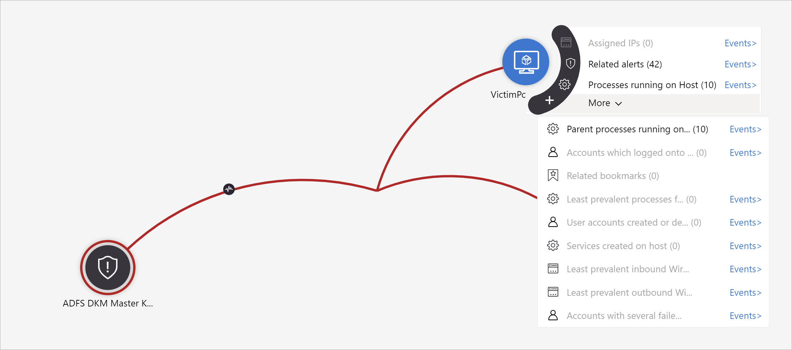

# Navigate and investigate incidents in Microsoft Sentinel

Microsoft Sentinel gives you a complete, full-featured case management platform for investigating security incidents. The **Incident details** page is your central location from which to run your investigation, collecting all the relevant information and all the applicable tools and tasks in one screen.

This article takes you through all the panels and options available on the incident details page, helping you navigate and investigate your incidents more quickly, effectively, and efficiently, and reducing your mean time to resolve (MTTR).

See instructions for the [previous version of incident investigation](investigate-cases.md).

Incidents are your case files that contain an aggregation of all the relevant evidence for specific investigations. Each incident is created (or added to) based on pieces of evidence ([alerts](detect-threats-built-in.md)) that were either generated by analytics rules or imported from third-party security products that produce their own alerts. Incidents inherit the [entities](entities.md) contained in the alerts, as well as the alerts' properties, such as severity, status, and MITRE ATT&CK tactics and techniques.

## Prerequisites

- The [**Microsoft Sentinel Responder**](../role-based-access-control/built-in-roles.md#microsoft-sentinel-responder) role assignment is required to investigate incidents.

    Learn more about [roles in Microsoft Sentinel](roles.md).

- If you have a guest user that needs to assign incidents, the user must be assigned the [Directory Reader](../active-directory/roles/permissions-reference.md#directory-readers) role in your Azure AD tenant. Regular (non-guest) users have this role assigned by default.

## Navigate and triage incidents

### The Incidents page

1. From the Microsoft Sentinel navigation menu, under **Threat management**, select **Incidents**. 

    The **Incidents** page gives you basic information about all of your open incidents.

    - Across the top of the screen you have the counts of open incidents, whether new or active, and the counts of open incidents by severity. You also have the **banner** with actions you can take outside of a specific incident&mdash;either on the grid as a whole, or on multiple selected incidents.

    - In the central pane, you have the **incident grid**, a list of incidents as filtered by the filtering controls at the top of the list, and a search bar to find specific incidents.

    - On the right side, you have a **details pane** that shows important information about the incident highlighted in the central list, along with buttons for taking certain specific actions with regard to that incident.

    :::image type="content" source="media/investigate-incidents/incident-grid.png" alt-text="Screenshot of view of incident severity." lightbox="media/investigate-incidents/incident-grid.png":::

1. Your Security Operations team may have [**automation rules**](automate-incident-handling-with-automation-rules.md#automatic-assignment-of-incidents) in place to perform basic triage on new incidents and assign them to the proper personnel.

    In that case, filter the incident list by **Owner** to limit the list to the incidents assigned to you or to your team. This filtered set represents your personal workload.

    Otherwise, you can perform basic triage yourself. You can start by filtering the list of incidents by available filtering criteria, whether status, severity, or product name. For more information, see [Search for incidents](#search-for-incidents).

1. Triage a specific incident and take some actions on it immediately, right from the **details pane** on the **Incidents** page, without having to enter the incident’s full details page.

    - **Investigate Microsoft 365 Defender incidents in Microsoft 365 Defender:** Follow the [**Investigate in Microsoft 365 Defender**](microsoft-365-defender-sentinel-integration.md) link to pivot to the parallel incident in the Defender portal. Any changes you make to the incident in Microsoft 365 Defender will be synchronized to the same incident in Microsoft Sentinel.

    - **Open the list of assigned tasks:** Incidents for which any tasks have been assigned will display a count of completed and total tasks and a **View full details** link. Follow the link to open the [**Incident tasks**](incident-tasks.md) panel to see the list of tasks for this incident.

    - **Assign ownership of the incident** to a user or group by selecting from the **Owner** drop-down list.

        :::image type="content" source="media/investigate-incidents/assign-incident-to-user.png" alt-text="Screenshot of assigning incident to user.":::

        Recently selected users and groups will appear at the top of the pictured drop-down list.

    - **Update the incident’s status** (for example, from **New** to **Active** or **Closed**) by selecting from the **Status** drop-down list. When closing an incident, you’ll be required to specify a reason. [See below for instructions](#closing-an-incident).

    - **Change the incident’s severity** by selecting from the **Severity** drop-down list.

    - **Add tags** to categorize your incidents. You may need to scroll down to the bottom of the details pane to see where to add tags.

    - **Add comments** to log your actions, ideas, questions, and more. You may need to scroll down to the bottom of the details pane to see where to add comments.

1. If the information in the **details pane** is sufficient to prompt further remediation or mitigation actions, select the **Actions** button at the bottom of the **details pane** to do one of the following:

    - **Investigate:** use the [graphical investigation tool](#investigate-incidents-visually-using-the-investigation-graph) to discover relationships between alerts, entities, and activities, both within this incident and across other incidents.

    - **Run playbook (Preview):** run a [playbook](automate-responses-with-playbooks.md#run-a-playbook-manually) on this incident to take particular [enrichment, collaboration, or response actions](automate-responses-with-playbooks.md#use-cases-for-playbooks) such as your SOC engineers may have made available.

    - **Create automation rule:** create an [automation rule](automate-incident-handling-with-automation-rules.md#common-use-cases-and-scenarios) that will run only on incidents like this one (generated by the same analytics rule) in the future, in order to reduce your future workload or to account for a temporary change in requirements (such as for a penetration test).

    - **Create team (Preview):** create a team in Microsoft Teams to collaborate with other individuals or teams across departments on handling the incident.

    :::image type="content" source="media/investigate-incidents/incident-actions.png" alt-text="Screenshot of menu of actions that can be performed on an incident from the details pane.":::

1. If more information about the incident is needed, select **View full details** in the details pane to open and see the incident's details in their entirety, including the alerts and entities in the incident, a list of similar incidents, and selected top insights.

See the next sections of this article to follow a typical investigation path, learning in the process about all the information you'll see there, and all the actions you can take.

## Investigate your incident in depth

Microsoft Sentinel offers a complete, full-featured incident investigation and case management experience so you can investigate, remediate, and resolve incidents more quickly and efficiently. Here's the new incident details page:

:::image type="content" source="media/investigate-incidents/incident-details-overview.png" alt-text="Screenshot of incident details page, featuring the overview tab." lightbox="media/investigate-incidents/incident-details-overview.png":::

### Prepare the ground properly

As you're setting up to investigate an incident, assemble the things you'll need to direct your workflow. You'll find the following tools on a button bar at the top of the incident page, right below the title.

:::image type="content" source="media/investigate-incidents/top-toolbar.png" alt-text="Screenshot of the button bar on the incident details page.":::

1.  Select **Tasks (Preview)** to [see the tasks assigned for this incident](work-with-tasks.md#view-and-follow-incident-tasks), or to [add your own tasks](work-with-tasks.md#manually-add-an-ad-hoc-task-to-an-incident). 

    Learn more about [using incident tasks](incident-tasks.md) to improve process standardization in your SOC.

1. Select **Activity log** to see if any actions have already been taken on this incident&mdash;by automation rules, for example&mdash;and any comments that have been made. You can add your own comments here as well. See [more about the activity log below](#audit-and-comment-on-incidents).

1. Select **Logs** at any time to open a full, blank Log analytics query window *inside* the incident page. Compose and run a query, related or not, without leaving the incident. So, whenever you're struck with sudden inspiration to go chasing a thought, don't worry about interrupting your flow. Logs is there for you.

    See [more about Logs](#dive-deeper-into-your-data-in-logs) below.

You'll also see the **Incident actions** button opposite the **Overview** and **Entities** tabs. Here you have available to you the same actions described above as available from the **Actions** button on the details pane on the **Incidents** grid page. The only one missing there is **Investigate**, which is available on the left-hand details panel.

:::image type="content" source="media/investigate-incidents/incident-actions-button.png" alt-text="Screenshot of incident actions button available on incident details page.":::

To recap the available actions under the **Incident actions** button:

- **Run playbook:** run a [playbook](automate-responses-with-playbooks.md#run-a-playbook-manually) on this incident to take particular [enrichment, collaboration, or response actions](automate-responses-with-playbooks.md#use-cases-for-playbooks) such as your SOC engineers may have made available.

- **Create automation rule:** create an [automation rule](automate-incident-handling-with-automation-rules.md#common-use-cases-and-scenarios) that will run only on incidents like this one (generated by the same analytics rule) in the future, in order to reduce your future workload or to account for a temporary change in requirements (such as for a penetration test).

- **Create team (Preview):** create a team in Microsoft Teams to collaborate with other individuals or teams across departments on handling the incident. If a team has already been created for this incident, this menu item will display as **Open Teams**.


### Get the whole picture on the incident details page

The left-hand panel of the incident details page contains the same incident detail information that you saw on the **Incidents** page to the right of the grid, and it's pretty much unchanged from the previous version. This panel is always on display, no matter which tab is shown on the rest of the page. From there, you can see the incident's basic information, and drill down in the following ways:

- Select **Events**, **Alerts**, or **Bookmarks** to open the **Logs** panel *within the incident page*. The **Logs** panel will display with the query of whichever of the three you selected, and you can go through the query results in depth, without pivoting away from the incident. [Learn more about Logs](#dive-deeper-into-your-data-in-logs).

- Select any of the entries under **Entities** to display it in the **Entities tab**. (Only the first four entities in the incident are shown here. See the rest of them by selecting **View all**, or in the **Entities** widget on the **Overview tab**, or in the **Entities tab**.) [Learn what you can do in the **Entities tab**](#entities-tab).

    :::image type="content" source="media/investigate-incidents/details-panel.png" alt-text="Screenshot of details panel in incident details page.":::

You can also select **Investigate** to open the incident in the [graphical investigation tool](#investigate-incidents-visually-using-the-investigation-graph) that diagrams relationships between all the elements of the incident.

This panel can also be collapsed into the left margin of the screen by selecting the small, left-pointing double arrow next to the **Owner** drop-down. Even in this minimized state, however, you will still be able to change the owner, status, and severity.

:::image type="content" source="media/investigate-incidents/collapsed-side-panel.png" border="false" alt-text="Screenshot of collapsed side panel on incident details page.":::

The rest of the incident details page is divided into two tabs, **Overview** and **Entities**. 

The **Overview** tab contains the following widgets, each of which represents an essential objective of your investigation.

- The **Incident timeline** widget shows you the timeline of alerts and [bookmarks](bookmarks.md) in the incident, which can help you reconstruct the timeline of attacker activity. Select an individual item to see all of its details, enabling you to drill down further.

    [Learn more about the **Incident timeline** widget below](#incident-timeline).

- In the **Similar incidents** widget, you'll see a collection of up to 20 other incidents that most closely resemble the current incident. This allows you to view the incident in a larger context and helps direct your investigation. 

    [Learn more about the **Similar incidents** widget below](#similar-incidents).

- The **Entities** widget shows you all the [entities](entities.md) that have been identified in the alerts. These are the objects that played a role in the incident, whether they be users, devices, addresses, files, or [any other types](./entities-reference.md). Select an entity to see its full details (which will be displayed in the **Entities tab**&mdash;see below).

    [Learn more about the **Entities** widget below](#explore-the-incidents-entities).

- Finally, in the **Top insights** widget, you'll see a collection of results of queries defined by Microsoft security researchers that provide valuable and contextual security information on all the entities in the incident, based on data from a collection of sources. 

    [Learn more about the **Top insights** widget below](#get-the-top-insights-into-your-incident).

The **Entities** tab shows you the complete list of entities in the incident (the same ones as in the Entities widget above). When you select an entity in the widget, you're directed here to see the entity's full dossier&mdash;its identifying information, a timeline of its activity (both within and outside the incident), and the full set of insights about the entity, just as you would see in its full entity page (but limited to the time frame appropriate to the incident).

### Incident timeline

The **Incident timeline** widget shows you the timeline of alerts and [bookmarks](bookmarks.md) in the incident, which can help you reconstruct the timeline of attacker activity. 

You can search the list of alerts and bookmarks, or filter the list by severity, tactics, or content type (alert or bookmark), to help you find the item you want to pursue.

The initial display of the timeline immediately tells you several important things about each item in it, whether alert or bookmark:

- The **date and time** of the creation of the alert or bookmark.
- The **type** of item, alert or bookmark, indicated by an icon and a ToolTip when hovering on the icon.
- The **name** of the alert or the bookmark, in bold type on the first line of the item.
- The **severity** of the alert, indicated by a color band along the left edge, and in word form at the beginning of the three-part "subtitle" of the alert.
- The **alert provider**, in the second part of the subtitle. For bookmarks, the **creator** of the bookmark.
- The MITRE ATT&CK **tactics** associated with the alert, indicated by icons and ToolTips, in the third part of the subtitle.

Hover over any icon or incomplete text element to see a ToolTip with the full text of that icon or text element. These ToolTips come in handy when the displayed text is truncated due to the limited width of the widget. See the example in this screenshot:

:::image type="content" source="media/investigate-incidents/incident-timeline.png" border="false" alt-text="Screenshot of incident timeline display details.":::

Select an individual alert or bookmark to see its full details.

- **Alert details** include the alert's severity and status, the analytics rules that generated it, the product that produced the alert, the entities mentioned in the alert, the associated MITRE ATT&CK tactics and techniques, and the internal **System alert ID**.

    Select the **System alert ID** link to drill down even further into the alert, opening the **Logs** panel and displaying the query that generated the results and the events that triggered the alert.

- **Bookmark details** aren't exactly the same as alert details; while they too include entities, MITRE ATT&CK tactics and techniques, and the **bookmark ID**, they also include the raw result and the bookmark creator information.

    Select the **View bookmark logs** link to open the **Logs** panel and display the query that generated the results that were saved as the bookmark.

    :::image type="content" source="media/investigate-incidents/alert-details.png" alt-text="Screenshot of the details of an alert displayed in the incident details page.":::

From the incident timeline widget, you can also take the following actions on alerts and bookmarks:

- Run a playbook on the alert to take immediate action to mitigate a threat. Sometimes you need to block or isolate a threat before you continue investigating. [Learn more about running playbooks on alerts](tutorial-respond-threats-playbook.md#run-a-playbook-manually-on-an-alert).

- Remove an alert from an incident. You can remove alerts that were added to incidents after their creation if you judge them to not be relevant. [Learn more about removing alerts from incidents](relate-alerts-to-incidents.md#remove-an-alert-from-an-incident).

- Remove a bookmark from an incident, or edit those fields in the bookmark that can be edited (not shown).

    :::image type="content" source="media/investigate-incidents/remove-alert.png" alt-text="Screenshot of removing an alert from an incident.":::

<a name="similar-incidents-preview"></a>
### Similar incidents

As a security operations analyst, when investigating an incident you'll want to pay attention to its larger context. For example, you'll want to see if other incidents like this have happened before or are happening now.

- You might want to identify concurrent incidents that may be part of the same larger attack strategy.

- You might want to identify similar incidents in the past, to use them as reference points for your current investigation.

- You might want to identify the owners of past similar incidents, to find the people in your SOC who can provide more context, or to whom you can escalate the investigation.

The **similar incidents** widget in the incident details page presents up to 20 other incidents that are the most similar to the current one. Similarity is calculated by internal Microsoft Sentinel algorithms, and the incidents are sorted and displayed in descending order of similarity.

:::image type="content" source="media/investigate-incidents/similar-incidents.png" alt-text="Screenshot of the similar incidents display." lightbox="media/investigate-incidents/similar-incidents.png":::

As with the incident timeline widget, you can hover over any text that's incompletely displayed due to column width to reveal the full text.

There are three criteria by which similarity is determined:

- **Similar entities:** An incident is considered similar to another incident if they both include the same [entities](entities.md). The more entities two incidents have in common, the more similar they are considered to be.

- **Similar rule:** An incident is considered similar to another incident if they were both created by the same [analytics rule](detect-threats-built-in.md).

- **Similar alert details:** An incident is considered similar to another incident if they share the same title, product name, and/or [custom details](surface-custom-details-in-alerts.md).

The reasons an incident appears in the similar incidents list are displayed in the **Similarity reason** column. Hover over the info icon to show the common items (entities, rule name, or details).

:::image type="content" source="media/investigate-incidents/similarity-popup.png" alt-text="Screenshot of pop-up display of similar incident details.":::

Incident similarity is calculated based on data from the 14 days prior to the last activity in the incident, that being the end time of the most recent alert in the incident.

Incident similarity is recalculated every time you enter the incident details page, so the results may vary between sessions if new incidents were created or updated.

### Get the top insights into your incident

Microsoft Sentinel's security experts have built queries that automatically ask the big questions about the entities in your incident. You can see the top answers in the **Top insights** widget, visible on the right side of the incident details page. This widget shows a collection of insights based on both machine-learning analysis and the curation of top teams of security experts.

These are some of the same insights that appear on [entity pages](entity-pages.md#entity-insights), specially selected for helping you triage quickly and understand the scope of the threat. For the same reason, insights for all the entities in the incident are presented together to give you a more complete picture of what's happening.

The following are the currently selected top insights (the list is subject to change):

1. Actions *by* account.
1. Actions *on* account.
1. [UEBA insights](identify-threats-with-entity-behavior-analytics.md).
1. Threat indicators related to user.
1. Watchlist insights (Preview).
1. Anomalously high number of a security event.
1. Windows sign-in activity.
1. IP address remote connections.
1. IP address remote connections with TI match.

Each of these insights (except for the ones relating to watchlists, for now) has a link you can select to open the underlying query in the [**Logs** panel that opens in the incident page](#dive-deeper-into-your-data-in-logs). You can then drill down into the query's results.

The time frame for the **Top insights** widget is from 24 hours before the earliest alert in the incident until the time of the latest alert.

### Explore the incident's entities

The **Entities** widget shows you all the [entities](entities.md) that have been identified in the alerts in the incident. These are the objects that played a role in the incident, whether they be users, devices, addresses, files, or [any other types](./entities-reference.md). 

You can search the list of entities in the entities widget, or filter the list by entity type, to help you find an entity.

:::image type="content" source="media/investigate-incidents/entity-actions-from-overview.png" alt-text="Screenshot of the actions you can take on an entity from the overview tab.":::

If you already know that a particular entity is a known indicator of compromise, select the three dots on the entity's row and choose **Add to TI** to [add the entity to your threat intelligence](add-entity-to-threat-intelligence.md). (This option is available for [supported entity types](incident-investigation.md#view-entities).)

If you want to [trigger an automatic response sequence for a particular entity](respond-threats-during-investigation.md), select the three dots and choose **Run playbook (Preview)**. (This option is available for [supported entity types](incident-investigation.md#view-entities).)

Select an entity to see its full details. When you select an entity, you will move from the **Overview tab** to the **Entities tab**, another part of the incident details page.

#### Entities tab

The **Entities tab** shows a list of all the entities in the incident.

:::image type="content" source="media/investigate-incidents/entities-tab.png" alt-text="Screenshot of entities tab in incident details page." lightbox="media/investigate-incidents/entities-tab.png":::

Like the entities widget, this list can also be searched and filtered by entity type. Searches and filters applied in one list won't apply to the other.

Select a row in the list for that entity's information to be displayed in a side panel to the right.

If the entity name appears as a link, selecting the entity's name will redirect you to the full [entity page](entity-pages.md), outside the incident investigation page. To display just the side panel without leaving the incident, select the row in the list where the entity appears, but don't select its name.

You can take the same actions here that you can take from the widget on the overview page. Select the three dots in the row of the entity to either run a playbook or add the entity to your threat intelligence.

You can also take these actions by selecting the button next to **View full details** at the bottom of the side panel. The button will read either **Add to TI**, **Run playbook (Preview)**, or **Entity actions**&mdash;in which case a menu will appear with the other two choices.

The **View full details** button itself will redirect you to the entity's full entity page.

The side panel features three cards:

- **Info** contains identifying information about the entity. For example, for a user account entity this might be things like the username, domain name, security identifier (SID), organizational information, security information, and more, and for an IP address it would include, for example, geolocation.

- **Timeline** contains a list of the alerts, [bookmarks](bookmarks.md), and [anomalies](soc-ml-anomalies.md) that feature this entity, and also activities the entity has performed, as collected from logs in which the entity appears. All alerts featuring this entity will be in this list, *whether or not* the alerts belong to this incident.

    Alerts that are not part of the incident will be displayed differently: the shield icon will be grayed out, the severity color band will be a dotted line instead of a solid line, and there will be a button with a plus sign on the right side of the alert's row.

    :::image type="content" source="media/investigate-incidents/entity-timeline.png" alt-text="Screenshot of entity timeline in entities tab.":::

    Select the plus sign to [add the alert to this incident](relate-alerts-to-incidents.md). When the alert is added to the incident, all the alert's other entities (that weren't already part of the incident) are also added to it. Now you can further expand your investigation by looking at *those* entities' timelines for related alerts.

    This timeline is limited to alerts and activities over the prior seven days. To go further back, pivot to the timeline in the full entity page, whose time frame is customizable.

- **Insights** contains results of queries defined by Microsoft security researchers that provide valuable and contextual security information on entities, based on data from a collection of sources. These insights include the ones from the **Top insights** widget and many more; they are the same ones that appear on the full [entity page](entity-pages.md), but over a limited time frame: starting from 24 hours before the earliest alert in the incident, and ending with the time of the latest alert.

    Most insights contain links which, when selected, open the [**Logs** panel](#dive-deeper-into-your-data-in-logs) displaying the query that generated the insight along with its results.

### Focus your investigation

Learn how you can broaden or narrow the scope of your investigation by either [adding alerts to your incidents or removing alerts from incidents](relate-alerts-to-incidents.md).

### Dive deeper into your data in Logs

From just about anywhere in the investigation experience, you'll be able to select a link that will open an underlying query in the **Logs** panel, in the context of the investigation. If you got to the Logs panel from one of these links, the corresponding query will appear in the query window, and the query will run automatically and generate the appropriate results for you to explore.

You can also call an empty Logs panel inside the incident details page anytime, if you think of a query you want to try while investigating, while remaining in context. To do this, select **Logs** at the top of the page.

However you end up on the Logs panel, if you've run a query whose results you want to save:

1. Mark the check box next to the row you want to save from among the results. To save all the results, mark the check box at the top of the column. 

1. Save the marked results as a bookmark. You have two options to do this:

    - Select **Add bookmark to the current incident** to create a bookmark and add it to the open incident. Follow the [bookmark instructions](bookmarks.md) to complete the process. Once completed, the bookmark will appear in the incident timeline.

    - Select **Add bookmark** to create a bookmark without adding it to any incident. Follow the [bookmark instructions](bookmarks.md) to complete the process. You'll be able to find this bookmark along with any others you've created on the **Hunting** page, under the **Bookmarks** tab. From there you can add it to this or any other incident.

1. After creating the bookmark (or if you choose not to), select **Done** to close the **Logs** panel.

:::image type="content" source="media/investigate-incidents/logs-panel.png" alt-text="Screenshot of Logs panel open in incident details page." lightbox="media/investigate-incidents/logs-panel.png":::

## Audit and comment on incidents

When investigating an incident, you'll want to thoroughly document the steps you take, both to ensure accurate reporting to management and to enable seamless cooperation and collaboration amongst coworkers. You'll also want to clearly see records of any actions taken on the incident by others, including by automated processes. Microsoft Sentinel gives you the **Activity log**, a rich audit and commenting environment, to help you accomplish this.

You can also enrich your incidents automatically with comments. For example, when you run a playbook on an incident that fetches relevant information from external sources (say, checking a file for malware at VirusTotal), you can have the playbook place the external source's response&mdash;along with any other information you define&mdash;in the incident's comments.

The activity log auto-refreshes, even while open, so that you can always see changes in real time. You'll also be notified of any changes made to the activity log while you have it open.

To view the log of activities and comments, or to add your own comments:

1. Select **Activity log** at the top of the incident details page.
1. To filter the log to show either only activities or only comments, select the filter control at the top of the log.
1. If you want to add a comment, enter it in the rich text editor at the bottom of the **Incident activity log** panel.
1. Select **Comment** to submit the comment. You'll now see your comment at the top of the log.


:::image type="content" source="media/investigate-incidents/comments-screen.png" alt-text="Screenshot of viewing and entering comments.":::

### Considerations for comments

The following are several considerations to take into account when using incident comments.

**Supported input:**

- **Text:** Comments in Microsoft Sentinel support text inputs in plain text, basic HTML, and Markdown. You can also paste copied text, HTML, and Markdown into the comment window.

- **Links:** Links must be in the form of HTML anchor tags, and they must have the parameter `target="_blank"`. Example:

    ```html
    <a href="https://www.url.com" target="_blank">link text</a>
    ```

    > [!NOTE]
    >
    > If you have playbooks that create comments in incidents, links in those comments must now conform to this template as well, due to a change in the format of comments.

- **Images:** You can insert links to images in comments and the images will be displayed inline, but the images must already be hosted in a publicly accessible location such as Dropbox, OneDrive, Google Drive and the like. Images can't be uploaded directly to comments.

**Size limit:**

- **Per comment:** A single comment can contain up to **30,000 characters**. 

- **Per incident:** A single incident can contain up to **100 comments**.  

    > [!NOTE]
    > The size limit of a single incident record in the *SecurityIncident* table in Log Analytics is 64 KB. If this limit is exceeded, comments (starting with the earliest) will be truncated, which may affect the comments that will appear in [advanced search](#search-for-incidents) results.
    >
    > The actual incident records in the incidents database will not be affected.

**Who can edit or delete:**

- **Editing:** Only the author of a comment has permission to edit it.

- **Deleting:** Only users with the [Microsoft Sentinel Contributor](roles.md) role have permission to delete comments. Even the comment's author must have this role in order to delete it.

## Investigate incidents visually using the investigation graph

If you prefer a visual, graphical representation of alerts, entities, and the connections between them in your investigation, you can accomplish many of the things discussed above with the classic investigation graph as well. The downside of the graph is that you'll end up having to switch contexts a great deal more.
  
The investigation graph provides you with:

- **Visual context from raw data**: The live, visual graph displays entity relationships extracted automatically from the raw data. This enables you to easily see connections across different data sources.

- **Full investigation scope discovery**: Expand your investigation scope using built-in exploration queries to surface the full scope of a breach.

- **Built-in investigation steps**: Use predefined exploration options to make sure you are asking the right questions in the face of a threat.

To use the investigation graph:

1. Select an incident, then select **Investigate**. This takes you to the investigation graph. The graph provides an illustrative map of the entities directly connected to the alert and each resource connected further.


    [](media/investigate-incidents/investigation-map.png#lightbox)

   > [!IMPORTANT] 
   > - You'll only be able to investigate the incident if the analytics rule or bookmark that generated it contains entity mappings. The investigation graph requires that your original incident includes entities.
   >
   > - The investigation graph currently supports investigation of **incidents up to 30 days old**.


1. Select an entity to open the **Entities** pane so you can review information on that entity.

    
  
1. Expand your investigation by hovering over each entity to reveal a list of questions that was designed by our security experts and analysts per entity type to deepen your investigation. We call these options **exploration queries**.

    

    For example, you can request related alerts. If you select an exploration query, the resulting entitles are added back to the graph. In this example, selecting **Related alerts** returned the following alerts into the graph:

    :::image type="content" source="media/investigate-incidents/related-alerts.png" alt-text="Screenshot: view related alerts." lightbox="media/investigate-incidents/related-alerts.png":::

    See that the related alerts appear connected to the entity by dotted lines.

1. For each exploration query, you can select the option to open the raw event results and the query used in Log Analytics, by selecting **Events\>**.

1. In order to understand the incident, the graph gives you a parallel timeline.

    :::image type="content" source="media/investigate-incidents/map-timeline.png" alt-text="Screenshot: view timeline in map." lightbox="media/investigate-incidents/map-timeline.png":::

1. Hover over the timeline to see which things on the graph occurred at what point in time.

    :::image type="content" source="media/investigate-incidents/use-timeline.png" alt-text="Screenshot: use timeline in map to investigate alerts.'" lightbox="media/investigate-incidents/use-timeline.png":::


## Closing an incident

Once you have resolved a particular incident (for example, when your investigation has reached its conclusion), you should set the incident’s status to **Closed**. When you do so, you will be asked to classify the incident by specifying the reason you are closing it. This step is mandatory. Click **Select classification** and choose one of the following from the drop-down list:

- True Positive &ndash; suspicious activity
- Benign Positive &ndash; suspicious but expected
- False Positive &ndash; incorrect alert logic
- False Positive &ndash; incorrect data
- Undetermined

:::image type="content" source="media/investigate-incidents/closing-reasons-dropdown.png" alt-text="Screenshot that highlights the classifications available in the Select classification list.":::

For more information about false positives and benign positives, see [Handle false positives in Microsoft Sentinel](false-positives.md).

After choosing the appropriate classification, add some descriptive text in the **Comment** field. This will be useful in the event you need to refer back to this incident. Click **Apply** when you’re done, and the incident will be closed.

:::image type="content" source="media/investigate-incidents/closing-reasons-comment-apply.png" alt-text="{alt-text}":::

## Search for incidents

To find a specific incident quickly, enter a search string in the search box above the incidents grid and press **Enter** to modify the list of incidents shown accordingly. If your incident isn't included in the results, you may want to narrow your search by using **Advanced search** options.

To modify the search parameters, select the **Search** button and then select the parameters where you want to run your search.

For example:

:::image type="content" source="media/investigate-incidents/advanced-search.png" alt-text="Screenshot of the incident search box and button to select basic and/or advanced search options.":::

By default, incident searches run across the **Incident ID**, **Title**, **Tags**, **Owner**, and **Product name** values only. In the search pane, scroll down the list to select one or more other parameters to search, and select **Apply** to update the search parameters. Select **Set to default** reset the selected parameters to the default option.


> [!NOTE]
> Searches in the **Owner** field support both names and email addresses.
>

Using advanced search options changes the search behavior as follows:

| Search behavior  | Description  |
|---------|---------|
| **Search button color**     | The color of the search button changes, depending on the types of parameters currently being used in the search. <ul><li>As long as only the default parameters are selected, the button is grey. <li>As soon as different parameters are selected, such as advanced search parameters, the button turns blue.         |
| **Auto-refresh**     | Using advanced search parameters prevents you from selecting to automatically refresh your results.        |
| **Entity parameters**     | All entity parameters are supported for advanced searches. When searching in any entity parameter, the search runs in all entity parameters.         |
| **Search strings**     | Searching for a string of words includes all of the words in the search query. Search strings are case sensitive.     |
| **Cross workspace support**     | Advanced searches are not supported for cross-workspace views.     |
| **Number of search results displayed** | When you're using advanced search parameters, only 50 results are shown at a time. |


> [!TIP]
>  If you're unable to find the incident you're looking for, remove search parameters to expand your search. If your search results in too many items, add more filters to narrow down your results.
>


## Next steps
In this article, you learned how to get started investigating incidents using Microsoft Sentinel. For more information, see:

- [Investigate incidents comprehensively in Microsoft Sentinel](incident-investigation.md)
- [Tutorial: Use playbooks with automation rules in Microsoft Sentinel](tutorial-respond-threats-playbook.md)
- [Investigate incidents with UEBA data](investigate-with-ueba.md)
