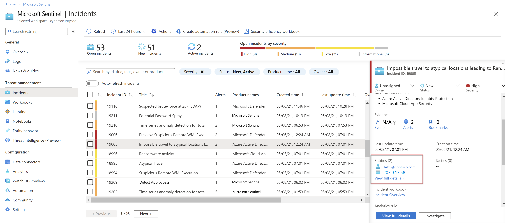

# Tutorial: Investigate incidents with UEBA data

This article describes common methods and sample procedures for using [user entity behavior analytics (UEBA)](identify-threats-with-entity-behavior-analytics.md) in your regular investigation workflows.

> [!IMPORTANT]
>
> Noted features in this article are currently in  **PREVIEW**. See the [Supplemental Terms of Use for Microsoft Azure Previews](https://azure.microsoft.com/support/legal/preview-supplemental-terms/) for additional legal terms that apply to Azure features that are in beta, preview, or otherwise not yet released into general availability.
>

> [!NOTE]
> This tutorial provides scenario-based procedures for a top customer task: investigating with UEBA data. For more information, see [Investigate incidents with Microsoft Sentinel](investigate-cases.md).
>
## Prerequisites

Before you can use UEBA data in your investigations, you must [enable User and Entity Behavior Analytics (UEBA) in Microsoft Sentinel](enable-entity-behavior-analytics.md).

Start looking for machine powered insights about one week after enabling UEBA.

## Run proactive, routine searches in entity data

We recommend running regular, proactive searches through user activity to create leads for further investigation.

You can use the Microsoft Sentinel [User and Entity Behavior Analytics workbook](identify-threats-with-entity-behavior-analytics.md#hunting-queries-and-exploration-queries) to query your data, such as for:

- **Top risky users**, with anomalies or attached incidents
- **Data on specific users**, to determine whether subject has indeed been compromised, or whether there is an insider threat due to action deviating from the user's profile.

Additionally, capture non-routine actions in the UEBA workbook, and use them to find anomalous activities and potentially non-compliance practices.

### Investigate an anomalous sign-in

For example, the following steps follow the investigation of a user who connected to a VPN that they'd never used before, which is an anomalous activity.

1. In the Sentinel **Workbooks** area, search for and open the **User and Entity Behavior Analytics** workbook.
1. Search for a specific user name to investigate and select their name in the **Top users to investigate** table.
1. Scroll down through the **Incidents Breakdown** and **Anomalies Breakdown** tables to view the incidents and anomalies associated with the selected user.
1. In the anomaly, such as one named **Anomalous Successful Logon**, review the details shown in the table to investigate. For example:

    |Step  |Description  |
    |---------|---------|
    |**Note the description on the right**     |    Each anomaly has a description, with a link to learn more in the [MITRE ATT&CK knowledge base](https://attack.mitre.org/). <br>For example: <br><br>        ***Initial Access*** <br>*The adversary is trying to get into your network.* <br>*Initial Access consists of techniques that use various entry vectors to gain their initial foothold within a network. Techniques used to gain a foothold include targeted spear phishing and exploiting weaknesses on public-facing web servers. Footholds gained through initial access may allow for continued access, like valid accounts and use of external remote services, or may be limited-use due to changing passwords.*     |
    |**Note the text in the Description column**     |   In the anomaly row, scroll to the right to view an additional description. Select the link to view the full text. For example: <br><br> *Adversaries may steal the credentials of a specific user or service account using Credential Access techniques or capture credentials earlier in their reconnaissance process through social engineering for means of gaining Initial Access. APT33, for example, has used valid accounts for initial access. The query below generates an output of successful Sign-in performed by a user from a new geo location he has never connected from before, and none of his peers as well.*     |
    |**Note the UsersInsights data**     |  Scroll further to the right in the anomaly row to view the user insight data, such as the account display name and the account object ID. Select the text to view the full data on the right.         |
    |**Note the Evidence data**     |  Scroll further to the right in the anomaly row to view the evidence data for the anomaly. Select the text view the full data on the right, such as the following fields: <br><br>-  **ActionUncommonlyPerformedByUser** <br>- **UncommonHighVolumeOfActions** <br>- **FirstTimeUserConnectedFromCountry** <br>- **CountryUncommonlyConnectedFromAmongPeers** <br>- **FirstTimeUserConnectedViaISP** <br>- **ISPUncommonlyUsedAmongPeers** <br>- **CountryUncommonlyConnectedFromInTenant** <br>- **ISPUncommonlyUsedInTenant** |


Use the data found in the **User and Entity Behavior Analytics** workbook to determine whether the user activity is suspicious and requires further action.

## Use UEBA data to analyze false positives

Sometimes, an incident captured in an investigation is a false positive.

A common example of a false positive is when impossible travel activity is detected, such as a user who signed into an application or portal from both New York and London within the same hour. While Microsoft Sentinel notes the impossible travel as an anomaly, an investigation with the user might clarify that a VPN was used with an alternative location to where the user actually was.

### Analyze a false positive

For example, for an **Impossible travel** incident, after confirming with the user that a VPN was used, navigate from the incident to the user entity page. Use the data displayed there to determine whether the locations captured are included in the user's commonly known locations.

For example:

[  ](media/ueba/open-entity-pages.png#lightbox)

The user entity page is also linked from the [incident page](investigate-cases.md#how-to-investigate-incidents) itself and the [investigation graph](investigate-cases.md#use-the-investigation-graph-to-deep-dive).

> [!TIP]
> After confirming the data on the user entity page for the specific user associated with the incident, go to the Microsoft Sentinel **Hunting** area to understand whether the user's peers usually connect from the same locations as well. If so, this knowledge would make an even stronger case for a false positive.
>
> In the **Hunting** area, run the **Anomalous Geo Location Logon** query. For more information, see [Hunt for threats with Microsoft Sentinel](hunting.md).
>

### Embed IdentityInfo data in your analytics rules (Public Preview)

As attackers often use the organization's own user and service accounts, data about those user accounts, including the user identification and privileges, are crucial for the analysts in the process of an investigation.

Embed data from the **IdentityInfo table** to fine-tune your analytics rules to fit your use cases, reducing false positives, and possibly speeding up your investigation process.

For example:

- To correlate security events with the **IdentityInfo** table in an alert that's triggered if a server is accessed by someone outside the **IT** department:

    ```kusto
    SecurityEvent
    | where EventID in ("4624","4672")
    | where Computer == "My.High.Value.Asset"
    | join kind=inner  (
        IdentityInfo
        | summarize arg_max(TimeGenerated, *) by AccountObjectId) on $left.SubjectUserSid == $right.AccountSID
    | where Department != "IT"
    ```

- To correlate Microsoft Entra sign-in logs with the **IdentityInfo** table in an alert that's triggered if an application is accessed by someone who isn't a member of a specific security group:

    ```kusto
    SigninLogs
    | where AppDisplayName == "GithHub.Com"
    | join kind=inner  (
        IdentityInfo
        | summarize arg_max(TimeGenerated, *) by AccountObjectId) on $left.UserId == $right.AccountObjectId
    | where GroupMembership !contains "Developers"
    ```

The **IdentityInfo** table synchronizes with your Microsoft Entra workspace to create a snapshot of your user profile data, such as user metadata, group information, and Microsoft Entra roles assigned to each user. For more information, see [IdentityInfo table](ueba-reference.md#identityinfo-table) in the UEBA enrichments reference.

## Identify password spray and spear phishing attempts

Without multi-factor authentication (MFA) enabled, user credentials are vulnerable to attackers looking to compromise attacks with [password spraying](https://www.microsoft.com/security/blog/2020/04/23/protecting-organization-password-spray-attacks/) or [spear phishing](https://www.microsoft.com/security/blog/2019/12/02/spear-phishing-campaigns-sharper-than-you-think/) attempts.

### Investigate a password spray incident with UEBA insights

For example, to investigate a password spray incident with UEBA insights, you might do the following to learn more:

1. In the incident, on the bottom left, select **Investigate** to view the accounts, machines, and other data points that were potentially targeted in an attack.

    Browsing through the data, you might see an administrator account with a relatively large number of logon failures. While this is suspicious, you might not want to restrict the account without further confirmation.

1. Select the administrative user entity in the map, and then select **Insights** on the right to find more details, such as the graph of sign-ins over time.

1. Select **Info** on the right, and then select **View full details** to jump to the [user entity page](entity-pages.md) to drill down further. 

    For example, note whether this is the user's first Potential Password spray incident, or watch the user's sign-in history to understand whether the failures were anomalous.

> [!TIP]
> You can also run the **Anomalous Failed Logon** [hunting query](hunting.md) to monitor all of an organization's anomalous failed logins. Use the results from the query to start investigations into possible password spray attacks.
>

## URL detonation (Public preview)

When there are URLs in the logs ingested into Microsoft Sentinel, those URLs are automatically detonated to help accelerate the triage process. 

The Investigation graph includes a node for the detonated URL, as well as the following details:

- **DetonationVerdict**. The high-level, Boolean determination from detonation. For example, **Bad** means that the side was classified as hosting malware or phishing content.
- **DetonationFinalURL**. The final, observed landing page URL, after all redirects from the original URL.
- **DetonationScreenshot**. A screenshot of what the page looked like at the time that the alert was triggered. Select the screenshot to enlarge.

For example:

:::image type="content" source="media/investigate-with-ueba/url-detonation-example.png" alt-text="Sample URL detonation shown in the Investigation graph.":::

> [!TIP]
> If you don't see URLs in your logs, check that URL logging, also known as threat logging, is enabled for your secure web gateways, web proxies, firewalls, or legacy IDS/IPS.
>
> You can also create custom logs to channel specific URLs of interest into Microsoft Sentinel for further investigation.
>

## Next steps

Learn more about UEBA, investigations, and hunting:

- [Identify advanced threats with User and Entity Behavior Analytics (UEBA) in Microsoft Sentinel](identify-threats-with-entity-behavior-analytics.md)
- [Microsoft Sentinel UEBA reference](ueba-reference.md)
- [Tutorial: Investigate incidents with Microsoft Sentinel](investigate-cases.md)
- [Hunt for threats with Microsoft Sentinel](hunting.md)
