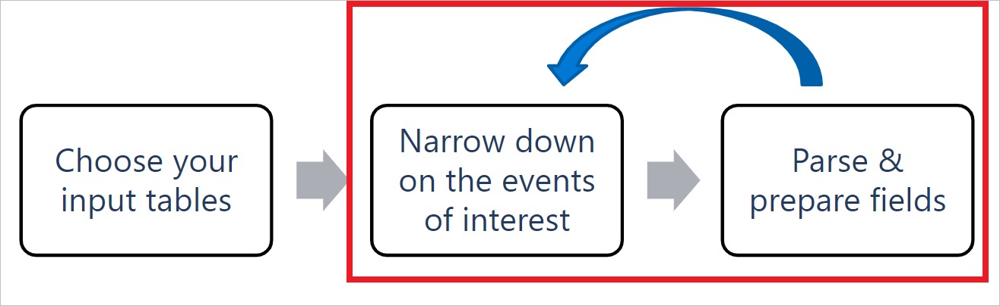

# Kusto Query Language (KQL) in Microsoft Sentinel

Read this article to learn some basic uses for Kusto Query Language (KQL) in Microsoft Sentinel.

## Background - Why KQL?

Microsoft Sentinel is built on top of the Azure Monitor service and it uses Azure Monitor’s [Log Analytics](../azure-monitor/logs/log-analytics-overview.md) workspaces to store all of its data. This data includes any of the following:
- data ingested from external sources into predefined tables using Microsoft Sentinel data connectors.
- data ingested from external sources into user-defined custom tables, using custom-created data connectors as well as some types of out-of-the-box connectors. 
- data created by Sentinel itself, resulting from the analyses Sentinel creates and performs - for example, alerts, incidents, and UEBA-related information.
- data uploaded to Sentinel to assist with detection and analysis - for example, threat intelligence feeds and watchlists.

[Kusto Query Language](/data-explorer/kusto/query/) (KQL) was developed as part of the [Azure Data Explorer](/data-explorer/) service, and it’s therefore optimized for searching through big-data stores in a cloud environment. Inspired by famed undersea explorer Jacques Cousteau (and pronounced accordingly "koo-STOH"), it’s designed to help you dive deep into your oceans of data and explore their hidden treasures. 

KQL is also used in Azure Monitor (and therefore in Microsoft Sentinel), including some additional Azure Monitor features, to retrieve, visualize, analyze, and parse data in Log Analytics data stores. In Microsoft Sentinel, you're using tools based on Kusto Query Language whenever you’re visualizing and analyzing data and hunting for threats, whether in existing rules and workbooks, or in building your own.

Because Kusto Query Language is a part of nearly everything you do in Microsoft Sentinel, a clear understanding of how KQL works will help you get that much more out of your SIEM.

## KQL queries

A KQL query is a read-only request to process data and return results – it doesn’t write any data. Queries operate on data that's organized into a hierarchy of [databases](/data-explorer/kusto/query/schema-entities/databases), [tables](/data-explorer/kusto/query/schema-entities/tables), and [columns](/data-explorer/kusto/query/schema-entities/columns), similar to SQL.

KQL requests are stated in plain language and use a data-flow model designed to make the syntax easy to read, write, and automate.

KQL queries are made up of *statements* separated by semicolons. There are many kinds of statements, but only two widely used types that we’ll discuss here:

- ***let* statements** allow you to create and define variables and constants outside the body of the query, for easier readability and versatility. Optional. [Learn more](/azure/data-explorer/kusto/query/letstatement)

- **tabular expression statements** are what we typically mean when we talk about queries – these are the actual body of the query. Required. [Learn more](/azure/data-explorer/kusto/query/tabularexpressionstatements)

You start KQL queries (actually, tabular expression statements) with a data source (a table or an expression representing a virtual table, possibly defined by a function or a *let* statement). You then perform a sequence of actions on those tables using operators to transform the data. Each of these actions passes the resulting data to the next action, and this passing is symbolized in the query by a pipe (|) delimiter.

## KQL demo environment

You can practice KQL statements in a [Log Analytics demo environment](https://aka.ms/lademo) in the Azure portal. There is no charge to use this practice environment, but you do need an Azure account to access it.

Explore the demo environment. Like Log Analytics in your production environment, it can be used in a number of ways:

- **Choose a table on which to build a query.** From the default **Tables** tab (shown in the red rectangle at the upper left), select a table from the list of tables grouped by topics (shown at the lower left). Expand the topics to see the individual tables, and you can further expand each table to see all its fields (columns). Double-clicking on a table or a field name will place it at the point of the cursor in the query window. Type the rest of your query following the table name, as directed below.

- **Find an existing query to study or modify.** Select the **Queries** tab (shown in the red rectangle at the upper left) to see a list of queries available out-of-the-box. By default they are grouped by category, and expanding the Security category will show you the security-related queries already available. You can also group them by solution, and you can then expand *Microsoft Sentinel* to see the relevant queries. Double-clicking a query will place the whole query in the query window at the point of the cursor.


:::image type="content" source="./media/kql-overview/demo-environment.png" alt-text="Shows the Log Analytics demo environment.":::

In this article all the examples are run in the demo environment, so you can try them out. 


You can query and filter data in the Microsoft Sentinel console  > **Logs** page. You can select a table and drill down to see columns. You can modify the default columns shown, and the default time range for queries.

:::image type="content" source="./media/kql-overview/portal-placement.png" alt-text="Shows where to run KQL queries in the Sentinel portal.":::


## Before you start

Before you start trying out KQL queries for Microsoft Sentinel, review some [query best practices](/azure/data-explorer/kusto/query/best-practices).

## Data flow in Kusto queries

When you want to glean usable information from large amounts of data in Microsoft Sentinel, you follow a query process that starts with a set of data. Each step in the process takes the data fed into it, transforms that data, and passes it to the next step in the process using the ` | ` (pipe) delimiter. These are the essential steps in a simple query process:

`Get data | Filter | Summarize | Sort | Select`

Here’s an example that illustrates this process:

```kusto
SigninLogs
| where RiskLevelDuringSignIn != 'none'
   and TimeGenerated >= ago(7d)
| summarize Count = count() by UserDisplayName
| order by Count desc
| take 5
```

1. **Get data:** You start by selecting a data set. This can be a single table in Log Analytics, a group of tables, or a virtual table defined by a function or a let statement. In the example above, we chose the `SigninLogs` table, which is ingested into Microsoft Sentinel through the Azure Active Directory data connector.

1. **Filter:** You use the `where` operator (for example) to narrow down the data you want, by criteria appropriate to the data. We’ve chosen two filters here. One, by checking the text value of a particular column, `RiskLevelDuringSignIn`, and eliminating any records where the value is “none”. The other, by checking the date/time value in the `TimeGenerated` column and including only those records where that value is greater than or equal to (that is, more recent than or just as recent as) seven days ago. This combination of filters will give us a resulting data set of all the sign-ins during the past week where the user had some risk attached.

1. **Summarize:** Since a plain list of all the sign-ins fitting those criteria may well still leave us with a long list that we’d still have to sift through to find usable, actionable information, we need to further massage this data. By summarizing it, we can leave ourselves with a quickly readable and understandable result. In this example, we’re using a count-type summarization by the `UserDisplayName` column, meaning that for each user that had sign-ins matching the filter criteria, the results will show how many sign-ins that user had.

1. **Sort:** To further simplify and clarify the results, we will use the `order by` operator to list these users in descending order of the number of sign-ins they had. The users that had the most, which may mean they are of the greatest concern to us, will be at the top.

1. **Select:** Finally, we can choose to display only a subset of all the records that answered all the criteria, and we can also choose to display only the most relevant columns from the original table. In this example, we only want the top five users by number of risky sign-ins. The `take` operator is one way to choose a subset of rows. The `project` operator is one way to choose a subset of columns. We'll discuss these more below.

**Output**

| UserDisplayName  | Count |
| ---------------- | ----- |
| Hannah Jarvis    | 782   |
| Sam Cantrell     | 466   |
| Miguel Reyes     | 60    |
| Wesley Brooks    | 5     |
| Avery Howard     | 2     |
|

More complex queries can contain additional analysis operations, and also feature multiple layers of filtering, analysis, and summarization.

For example, we can add a level of summarization so that we can break down each user's number of sign-ins by risk level:

```kusto
SigninLogs
| where RiskLevelDuringSignIn != 'none'
   and TimeGenerated >= ago(10d)
| summarize Count = count() by UserDisplayName, RiskLevel = RiskLevelDuringSignIn
| order by Count desc
| take 10
```
And here's the output now:

| UserDisplayName  | RiskLevel | Count |
| ---------------- | --------- | ----- |
| Hannah Jarvis    | low       | 782   |
| Sam Cantrell     | high      | 270   |
| Sam Cantrell     | medium    | 113   |
| Sam Cantrell     | low       | 83    |
| Miguel Reyes     | low       | 56    |
| Wesley Brooks    | low       | 5     |
| Miguel Reyes     | medium    | 4     |
| Avery Howard     | medium    | 2     |
|

> [!NOTE]
> Where you place your operators in the pipeline affects the data you will receive in the results. 
> - If, for example, you placed the `take 5` line before the summarization and sorting operators, the query would select five random records from the filtered data.
> - If you placed the `take 5` line before the filter operators, the query would select five random records from unfiltered data, and then filter and summarize only those records - in other words, the query would be of no use to you at all.
>
> The location of operations in the pipeline can also affect performance. That's why it's a good idea to put your filtering operations as close as possible to the beginning of your query statement, so that only the relevant data gets passed to the next operations in the pipeline.

:::image type="content" source="./media/kql-overview/pipe-command.png" alt-text="Shows how the pipe command works.":::

Now, let's go through some examples of various queries, starting with the simplest and increasing in complexity.

## Count rows

The **`SecurityEvent`** table contains raw data about events that took place on Windows systems monitored by Microsoft Sentinel. To find out how large the table is, we'll pipe its content into a summarization operator - one that counts rows.

This query takes the entire **`SecurityEvent`** table and passes it to the [count operator](/azure/data-explorer/kusto/query/countoperator). The `count` operator displays the results because the operator is the last command in the query.


```kusto
//Count the records in the SecurityEvent table.
SecurityEvent 
| count
```
### Results
:::image type="content" source="./media/kql-overview/table-count-results.png" alt-text="Shows the result for counting records in the SecurityEvent table.":::


<!--### Example 2

```kusto
//Use union to return all rows in the SecurityEvent and SecurityAlert tables.
SecurityEvent 
| union SecurityAlert  
```
#### Results

:::image type="content" source="./media/kql-overview/table-union-results.png" alt-text="Shows the union of the SecurityEvent and SecurityAlert tables.":::


### Limit and sort data

For datasets that are large you might want to sort results, or limit data that's returned.

#### Example 1

```kusto
//Use order to sort data in descending order in the TimeGenerated column. 
//Get the first five records in the results.
SecurityEvent 
| order by TimeGenerated desc
| take 5
```

##### Results

:::image type="content" source="./media/kql-overview/table-sort-limit.png" alt-text="Shows five records of sorted data in the TimeGenerated column.":::

#### Example 2

```kusto
//If two or more records in the TimeGenerated column have the same value, sort by the AccountName column
// Get the first five records.
SecurityEvent 
| order by TimeGenerated, AcccountName desc
| take 5
```

##### Results

:::image type="content" source="./media/kql-overview/table-sort-multiple.png" alt-text="Shows five records by AccountName column for duplicated TimeGenerated values.":::

#### Example 3

```kusto
// Sort security events (newest first).
// Focus on the project columns for the last seven days (default time period).
SecurityEvent
| project TimeGenerated, Account, Activity, Computer
| sort by TimeGenerated desc
```

##### Results

:::image type="content" source="./media/kql-overview/table-security-events-newest.png" alt-text="Show latest security events for columns specified by project operator.AccountName column for duplicated TimeGenerated values.":::
-->

## Filter by Boolean expression: *where*

Now we want to see actual rows in the SecurityEvent table, but only those representing particular types of events.

The [where](/azure/data-explorer/kusto/query/whereoperator) operator is one of the most common in the Kusto Query Language. This operator filters a table to rows that match specific criteria. Let's look at a few examples of the use of `where`:

### Example 1

In the following example, we want to see all the successful logon events. The query first gets all records for the table. It then filters the data for records with the Event ID for successful logon (4624). Finally, it sorts those results in descending order of recent occurrence and displays the most recent ten events.

```kusto
//Retrieve the latest 10 occurrences of EventID 4624 (successful Windows logon) in the SecurityEvent table.
SecurityEvent
| where EventID == 4624
| order by TimeGenerated desc
| take 10
```
### Results

:::image type="content" source="./media/kql-overview/table-where-event-sort.png" alt-text="Screenshot of results of request to get occurrences of Event I D 4624 in the SecurityEvent table.":::

### Example 2

In this example, we want to see both successful logon and logoff events from the past week. 

- We can use the [in operator](/azure/data-explorer/kusto/query/in-cs-operator) to give our filter a choice of values that can evaluate to true. 
- We can use the [ago function](/azure/data-explorer/kusto/query/agofunction) to delineate a dynamic time frame: we want to see events that occurred in the past seven days every time we run this query.

```kusto
//Retrieve 10 occurrences (descending TimeGenerated order) of EventID 4624 or 4634 in the SecurityEvent table, seven or fewer days ago. Note that you can combine where statements.
SecurityEvent
| where EventID in (4624, 4634)
| where TimeGenerated >= ago(7d)
| order by TimeGenerated, AccountName desc
| take 10
```

### Results

:::image type="content" source="./media/kql-overview/table-where-multiple-events.png" alt-text="Screenshot of results of request to get 10 occurrences in descending order for Event I D 4624, 4634.":::

> [!TIP]
> Just so you know, you can - and should, when possible ***(???)*** - combine multiple `where` operations into a single one using the `and` operator. ***(YL: IS THIS MORE PERFORMANT? ONE BOOLEAN OPERATION ON EVERY ROW INSTEAD OF MULTIPLES?)***
>
> ```kusto
> //Combine where statements using the and operator.
> SecurityEvent
> | where EventID == 4624
> >   and TimeGenerated <= ago(1d)
> | take 10
> ```


### Example 3

```kusto
//This example turns the EventID value into a string to filter on all EventIDs that start with "47"

SecurityEvent  
| where tostring(EventId) startswith "47" 
```

##### Results

:::image type="content" source="./media/kql-overview/table-where-event-string.png" alt-text="Turn EventIDs that start with 47 into string operators.":::


### Time queries

Many Microsoft Sentinel rule queries and examples use time filters. KQL is optimized for time filters, and they're useful in narrowing down results. By default Microsoft Sentinel filters on the last 24 hours.

#### Example 1

```kusto
//Retrieves occurrences of EventID 4624 from the SecurityEvent table between five and seven days ago.

SecurityEvent
| where TimeGenerated between (ago(7d) .. ago(5d) ) 
  and EventID == 4624
```

##### Results

:::image type="content" source="./media/kql-overview/table-time-five-seven-days.png" alt-text="Get EventID 4624 occurrences from 5 to 7 days ago.":::

#### Example 2

```kusto
//Retrieves occurrences of EventID 4624 from the SecurityEvent table from July 1 until 9 a.m on July 30 2020.

SecurityEvent
| where TimeGenerated between ( datetime(2020-07-01) .. datetime(2020-07-30, 09:00) )
  and EventID == 4624
```

#### Results

:::image type="content" source="./media/kql-overview/table-time-between-dates.png" alt-text="Get EventID 4624 occurrences from July 1 to July 30.":::


#### Example 4

```kusto
//Operators that use the present time as start point return data changes each time your run the query.
//This example uses the [startofday function](/data-explorer/kusto/query/startofdayfunction) as a fixed point in time (one day ago), until the present time. 

SecurityEvent
| where TimeGenerated > startofday(ago(1d))
  and EventID == 4624
```
##### Results

The query ran on October 26 2021, sorted in ascending order.

:::image type="content" source="./media/kql-overview/table-start-day.png" alt-text="Get occurrences of EventID 4624 with the startofday function.":::


#### Example 5 

```kusto
//This example combines the startofday function with the endofday function, to guarantee two fixed points for retrieving , with the same results each time the query runs. In this example we mix and match hours and days. Startofday is set to two days ago, endofday is set to one day ago.

SecurityEvent
| where TimeGenerated between ( startofday(ago(48hrs)) .. endofday(ago(1d)) )
  and EventID == 4624
```

##### Results

The query ran on October 26 2021, sorted in ascending order. The first record is close to midnight on October 24th, 2021.

:::image type="content" source="./media/kql-overview/table-start-end-day.png" alt-text="Get occurrences of EventID 4624 with the startofday and endofday functions.":::


#### More examples

There are additional timeline examples in Clive Watson's [TechCommunity blog](https://techcommunity.microsoft.com/t5/azure-sentinel/how-to-align-your-analytics-with-time-windows-in-azure-sentinel/ba-p/1667574), and in the [KQL docs](/data-explorer/kusto/query/samples?pivots=azuremonitor#date-and-time-operations).


## Prepare data

After initial filtering, you can manipulate data to make it more useful. Typically, you might summarize to aggregate data and output a new table, parse data, add or remove table columns, or join tables. 

After preparing the data, you might then refilter to further pin down results.

:::image type="content" source="./media/kql-overview/filter-flow.png" alt-text="Shows the query filtering flow.":::




### Summarize data

Use *summarize* to query table data and output a new table aggregated by one or more columns that you specify.

#### Example 1

```kusto
//Return multiple EventIDs in the SecurityEvent table using the [count() aggregation function](/data-explorer/kusto/query/count-aggfunction).
// count_ is the automatically generated column name for the count() of requests for each EventID.

SecurityEvent
| summarize count() by EventID
| order by count_
```

##### Results

:::image type="content" source="./media/kql-overview/table-summarize-event.png" alt-text="Count the occurrence of different EventIDs in the SecurityEvent table.":::


#### Example 2

```kusto
// Retrieve entries from the Classification table where security or critical updates are needed in the last 10 days.
// Show the results by Classification, Computer, and Resource ID

Update
| where Classification in ("Security Updates", "Critical Updates")
| where UpdateState == 'Needed' and Optional == false and Approved == true
| where TimeGenerated <= ago(10d)
| summarize count() by Classification, Computer, _ResourceId
// This query requires the Security or Update solutions
```

##### Results

:::image type="content" source="./media/kql-overview/table-security-updates.png" alt-text="Retrieve entries needing security or critical updates.":::


### Other aggregation options

In addition to count() aggregation, there are a lot of other KQL [aggregation functions](/data-explorer/kusto/query/aggregation-functions) you might use in Microsoft Sentinel.  Let's look at a few examples.

