# KQL in Microsoft Sentinel

Read this article to learn how to use Kusto Query Language (KQL) in Microsoft Sentinel.

Microsoft Sentinel data is stored in Azure Monitor [Log Analytics](https://docs.microsoft.com/azure/azure-monitor/logs/log-analytics-overview) workspaces. Log Analytics is build on top of [Azure Data Explorer](https://docs.microsoft.com/azure/data-explorer/), and uses the same [KQL language](https://docs.microsoft.com/azure/data-explorer/kusto/query/) (with some specific Azure Monitor features) to retrieve, visualize, and analyze, and parse data. In Microsoft Sentinel, you use KQL when you visualize and analyze data, build rules and workbooks, and hunt for threats.

## KQL queries

KQL queries are read-only and plain text, and operate on data that's gathered into [databases](https://docs.microsoft.com/azure/data-explorer/kusto/query/schema-entities/databases), [tables](https://docs.microsoft.com/azure/data-explorer/kusto/query/schema-entities/tables), and [columns](https://docs.microsoft.com/azure/data-explorer/kusto/query/schema-entities/columns), similar to SQL. Queries don't modify data or metadata. You start KQL queries with a data source (table) and then perform actions on those tables with operators and functions. Tables and operators are tied together with a [pipe (|) delimiter](https://docs.microsoft.com/azure/data-explorer/kusto/query/queries).


## Learning KQL

### Demo environment

Microsoft provides a [Log Analytics demo environment](https://aka.ms/lademo) in the Azure portal so that you can practice KQL statements. The practice environment has no charges. You just need an account to sign into Azure.

The demo environment has a number of tables on the left. You type a query into the query window (you can add in multiple queries), and then run it. Results appear below.

:::image type="content" source="/media/kql-overview/demo-environment.png" alt-text="KQL queries in the Sentinel portal.":::

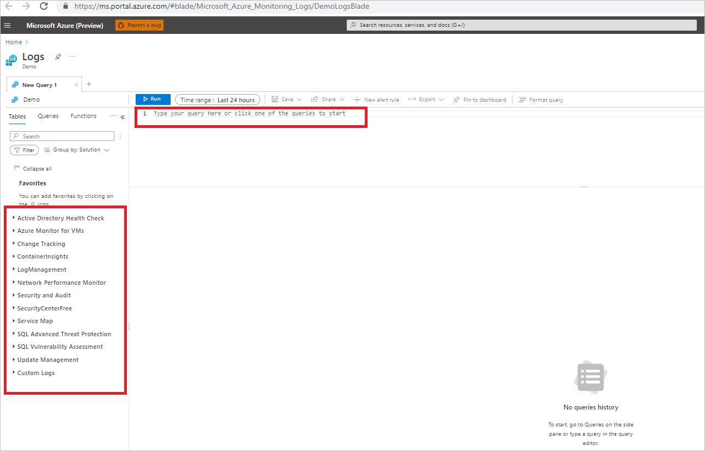

In this article we'll provide a number of suggested queries that you can use for practice.

### Before you start

Before you start trying out KQL queries for Microsoft Sentinel, review some [query best practices](https://docs.microsoft.com/azure/data-explorer/kusto/query/best-practices).

## Using KQL in Sentinel

Typically when you search for data in Microsoft Sentinel, you move through a query process using KQL as follows.

:::image type="content" source="/media/kql-overview/pipe-command.png" alt-text="Shows how the pipe command works.":::

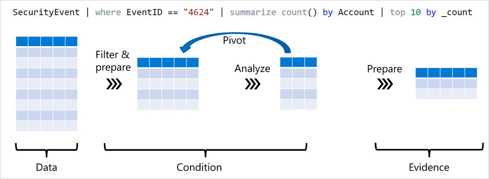

1. **Step 1: Get data*: Data streamed into Microsoft Sentinel is stored in Log Analytics tables. Select tables containing the input data you want to query.
2. **Step 2: Narrow down data**: 
    1. **Filter**: Use operators to filter table and column data.
    2. **Parse and prepare**. Prepare the filtered data with parsing, aggregrating etc. 
    3. **Analyze**: Analyze the results. After analysis, you might want to further filter or parse the results data.
3. **Step 3: Gather the evidence**: Prepare the results so that they're useful in your Microsoft Sentinel environment.

You query and filter data in the Microsoft Sentinel console  > **Logs** page.
- When you select a table, you see the columns within that table.
- You can use tables and columns to filter for specific values.
- Sentinel sets some defaults for columns, but you can modify those.

:::image type="content" source="/media/kql-overview/portal-placement.png" alt-text="KQL queries in the Sentinel portal.":::

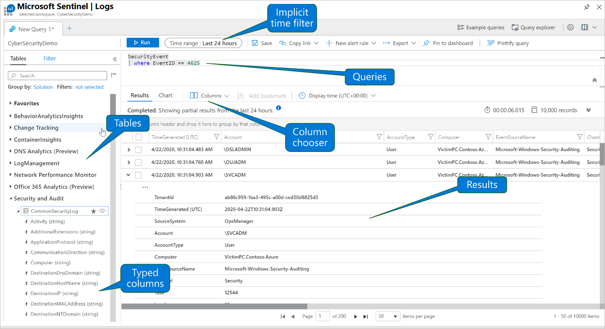

## Getting data

Microsoft Sentinel data is organized into tables with ordered columns and rows of data. Different types of tables store different kinds of data, including:

- Tables created by default in Log Analytics.
- Tables created when you set up data connectors and Microsoft Sentinel ingests data.
- Custom tables that are created when you set up [custom connectors](create-custom-connector.md).

You can retrieve data from a standard table, a custom table, or use operators to retrieve and manipulate tables.


### Example 1
```kusto
//Count the records in the SecurityEvent table.
SecurityEvent 
| count
```
#### Results
:::image type="content" source="/media/kql-overview/table-count-results.png" alt-text="KQL queries in the Sentinel portal.":::

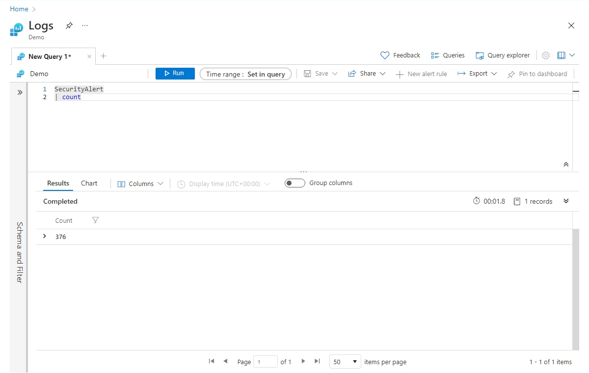

### Example 2

```kusto
//Use union to return all rows in the SecurityEvent and SecurityAlert tables.
SecurityEvent 
| union SecurityAlert  
```

#### Results

:::image type="content" source="/media/kql-overview/table-union-results.png" alt-text="KQL queries in the Sentinel portal.":::

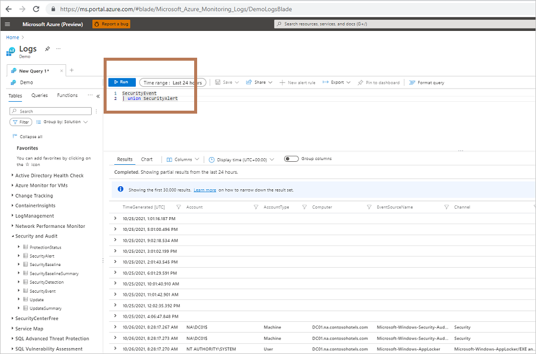


### Limiting and sorting data

For datasets that are large you might want to sort results, or limit data that's returned.

#### Example 1

```kusto
//Use order to sort data by with the TimeGenerated column, in descending order, and get the first five records in the results.
SecurityEvent 
| order by TimeGenerated desc
| take 5
```

##### Results

:::image type="content" source="/media/kql-overview/table-sort-limit.png" alt-text="KQL queries in the Sentinel portal.":::

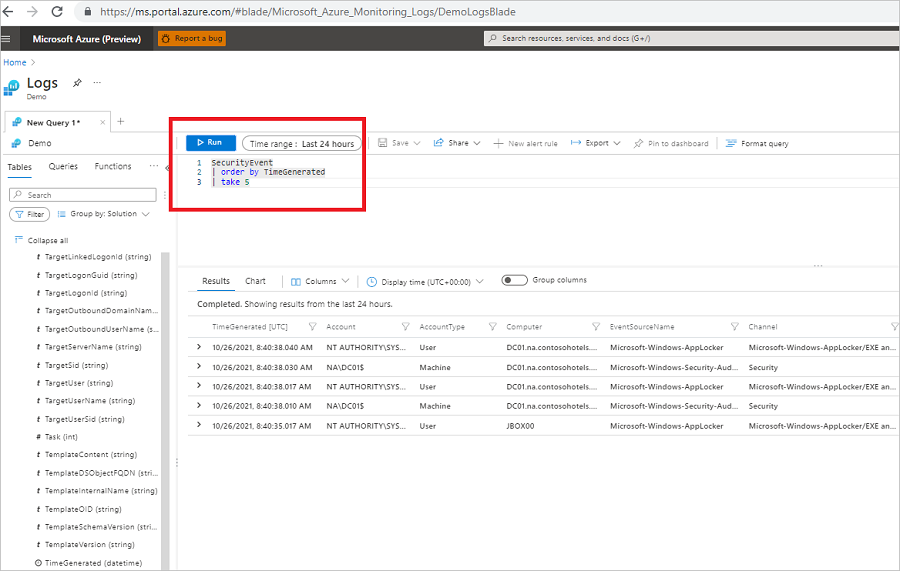

#### Example 2

```kusto
//If two or more records in the TimeGenerated column have the same value, try to sort by the AccountName column, and get the first five records in the results.
SecurityEvent 
| order by TimeGenerated, AcccountName desc
| take 5
```

##### Results

:::image type="content" source="/media/kql-overview/table-sort-multiple.png" alt-text="KQL queries in the Sentinel portal.":::

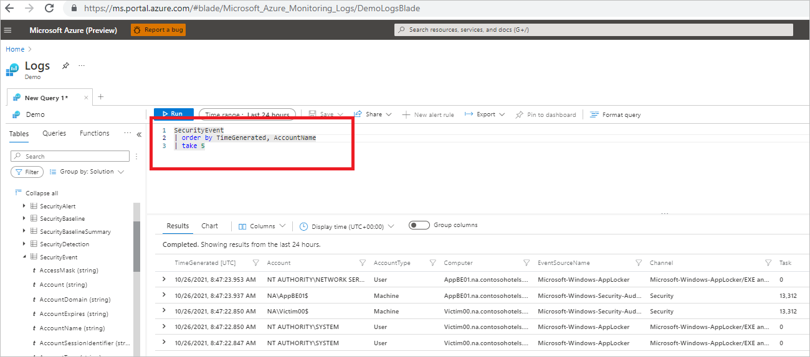

## Filtering data

After retrieving and perhaps sorting table data, you'll want to filter it by columns/values to narrow down results to points of interest.

### Using where

The where operator is one of the most common you'll use. It's best to use where to filter early on in the query. This improves performance by reducing the amount of data you need to process as you dig down into the query results.

#### Example 1

```kusto
//Retrieve the latest 10 occurrences of EventID 4624 (Successful Windows logon) that occurred in the SecurityEvent table.
SecurityEvent
| where EventID == 4624
| order by TimeGenerated desc
| take 10
```

##### Results

:::image type="content" source="/media/kql-overview/table-where-event-sort.png" alt-text="KQL queries in the Sentinel portal.":::

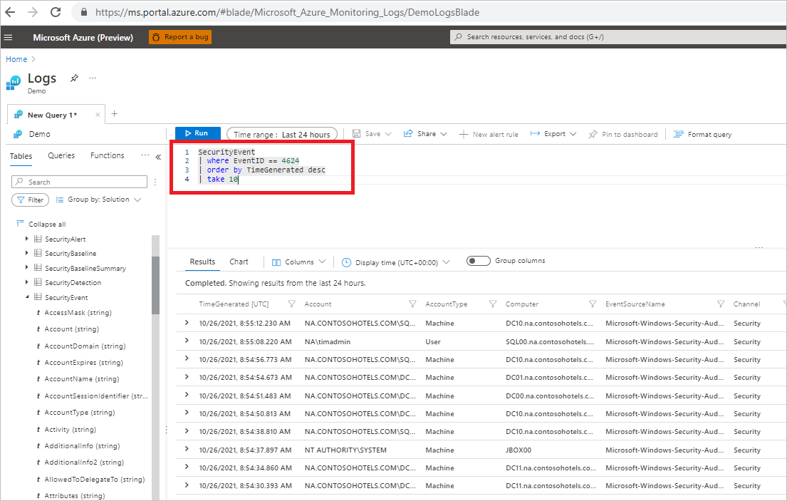


#### Example 2

```kusto
//Retrieve 10 occurrences (in descending TimeGenerated order) of EventID 4624 (Successful Windows logon) or EventID 4634 that occurred in the SecurityEvent table seven or more days ago. Note that you can combine where statement.
SecurityEvent
| where EventID in (4624, 4634)
| where TimeGenerated >= ago(7d)
| order by TimeGenerated, AccountName desc
| take 10
```

##### Results

:::image type="content" source="/media/kql-overview/table-where-multiple-events.png" alt-text="KQL queries in the Sentinel portal.":::

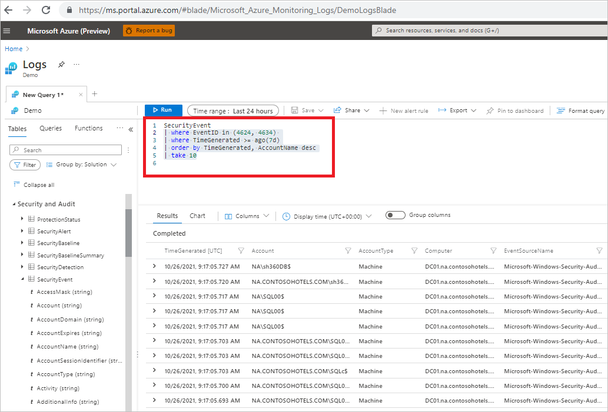


#### Example 3

```kusto
//You can also combine where statements using the and operator.
SecurityEvent
| where EventID == 4624
  and TimeGenerated <= ago(1d)
| take 10
```

##### Results

:::image type="content" source="/media/kql-overview/table-where-and.png" alt-text="KQL queries in the Sentinel portal.":::

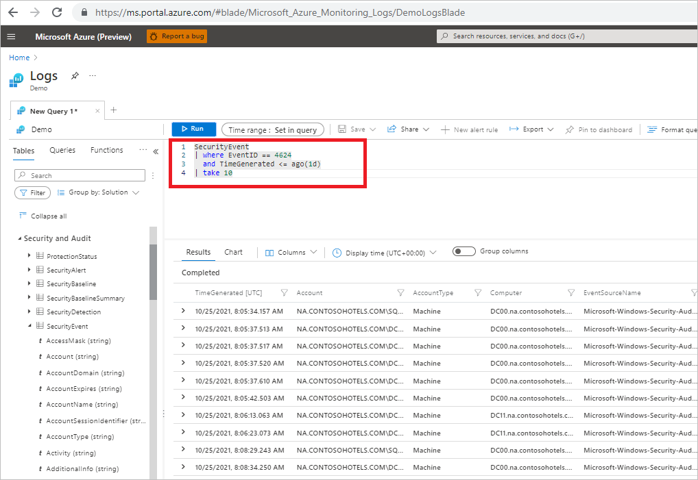


#### Example 4

```kusto
//Turns the EventID into a string to filter on all EventIDs that start with "47"

SecurityEvent  
| where tostring(EventId) startswith "47" 
```

##### Results

:::image type="content" source="/media/kql-overview/table-where-event-string.png" alt-text="KQL queries in the Sentinel portal.":::

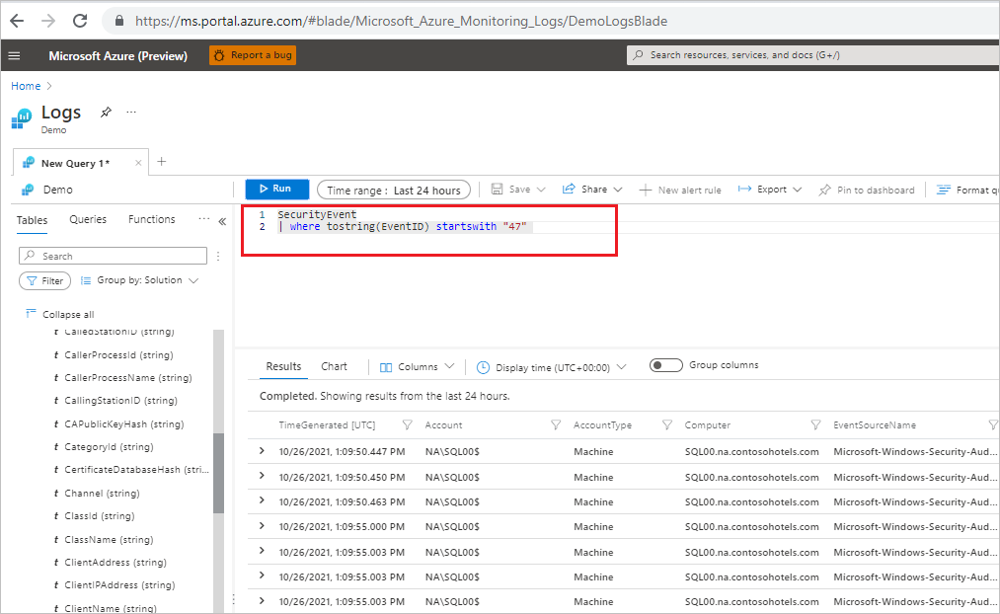


### Time queries

Many of the queries and query examples in Microsoft Sentinel rules, hunting, and workbooks use time filters. KQL is optimized for time filters, and they're useful in narrowing down results. Note that by default Microsoft Sentinel filters on the last 24 hours.

#### Example 1

```kusto
//Retrieves occurrences of EventID 4624 from the SecurityEvent table between five and seven days ago.

SecurityEvent
| where TimeGenerated between (ago(7d) .. ago(5d) ) 
  and EventID == 4624
```

##### Results

:::image type="content" source="/media/kql-overview/table-time-five-seven-days.png" alt-text="KQL queries in the Sentinel portal.":::

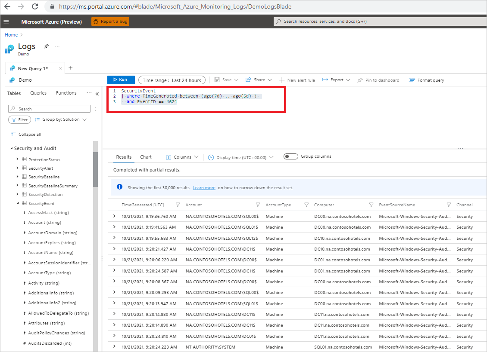

#### Example 2

```kusto
//Retrieves occurrences of EventID 4624 from the SecurityEvent table from July 1 until 9 a.m on July 30 2020.

SecurityEvent
| where TimeGenerated between ( datetime(2020-07-01) .. datetime(2020-07-30, 09:00) )
  and EventID == 4624
```

#### Results

:::image type="content" source="/media/kql-overview/table-time-between-dates.png" alt-text="KQL queries in the Sentinel portal.":::

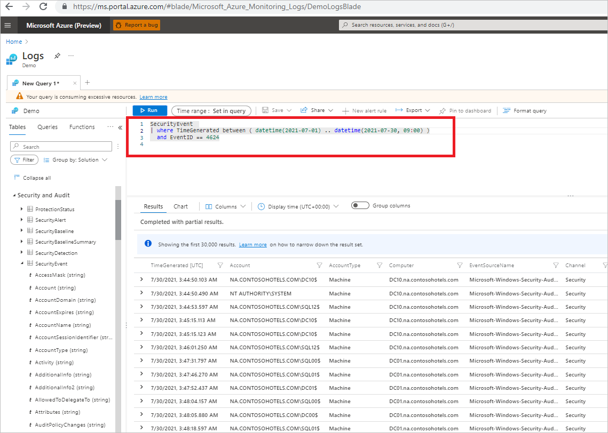


#### Example 4

```kusto
//When you use a element that uses now as a start point to pivot from, returned data changes each time your run the query this example uses the [startofday function](https://docs.microsoft.com/azure/data-explorer/kusto/query/startofdayfunction) for one day ago as a fixed point in time, until the present time. 

SecurityEvent
| where TimeGenerated > startofday(ago(1d))
  and EventID == 4624
```
##### Results

The query is running on October 26 2021, and is sorted in ascending order. We see that the first record is close to midnight on October 25, 2021.

:::image type="content" source="/media/kql-overview/table-start-day.png" alt-text="KQL queries in the Sentinel portal.":::

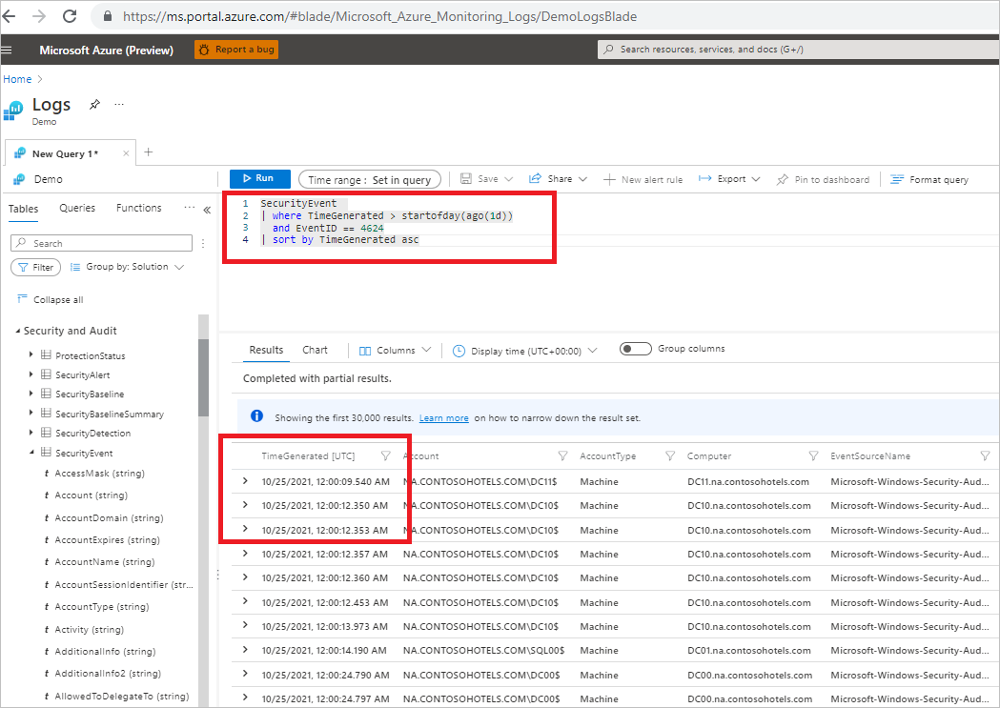

#### Example 5 

```kusto
//The startofday function can be combined with the endofday function, to guarantee you have two fixed points for retrieving data. You will get the same results each time you run the query. In this example we mix and match hours and days. Startofday is set to 2 days ago, endofday is set to one day ago.

SecurityEvent
| where TimeGenerated between ( startofday(ago(48hrs)) .. endofday(ago(1d)) )
  and EventID == 4624
```

##### Results

The query is running on October 26 2021, and is sorted in ascending order. We see that the first record is close to midnight on October 24th, 2021.

:::image type="content" source="/media/kql-overview/table-start-end-day.png" alt-text="KQL queries in the Sentinel portal.":::

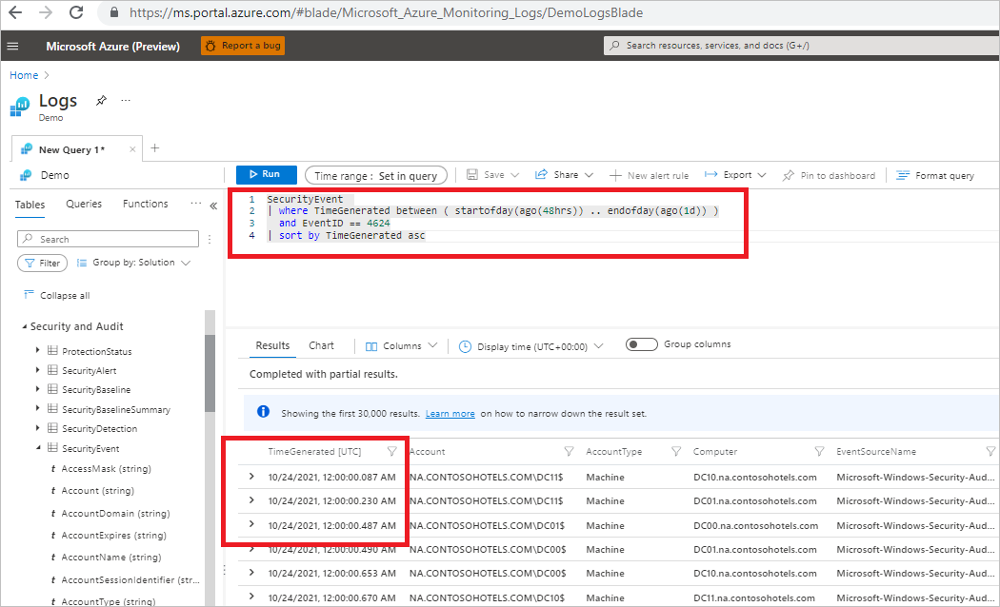


#### More examples

There are additional timeline examples in Clive Watson's [TechCommunity blog](https://techcommunity.microsoft.com/t5/azure-sentinel/how-to-align-your-analytics-with-time-windows-in-azure-sentinel/ba-p/1667574), and in the [KQL docs](https://docs.microsoft.com/azure/data-explorer/kusto/query/samples?pivots=azuremonitor#date-and-time-operations).


## Prepare data

After initial filtering to narrow down data, you can manipulate the data to make it more useful. Typically, you might summarize data and output a new table, aggregate values, parse data, add or remove table columns, or join tables. 

After preparing the data, you might then refilter to further pin down results.

:::image type="content" source="/media/kql-overview/filter-flow.png" alt-text="Shows the filtering flow.":::


### Summarize data

You can use summarize to aggregate data. Summarize summarizes the contents of the input tables you specify in the query, and outputs a new table.When you use summarize, any columns that you don't specify in the query won't be taken into account.

#### Example 1

```kusto
//Return multiple EventIDs in the SecurityEvent table. count_ is the automatically generated column name for the count() of requests for each

SecurityEvent
| summarize count() by EventID
| order by count_
```

##### Results

:::image type="content" source="/media/kql-overview/table-summarize-event.png" alt-text="KQL queries in the Sentinel portal.":::


#### Example 2

```kusto
//Aggregrate to compare the number of sign ins with a threshold you set. Use Let to set values. In this case we're setting the signin_threshold to five. We \'re setting suspicious_signins to entries in the SigninLogs that correspond to the where statements. We'll summarize by IP addresses from which the sign in occurs

Let signin_threshold = 5;
let suspicious_signins =
SigninLogs
| where ResultType !in ("0", "50125", "50140")
| where IPAddress != "127.0.0.1"
| summarize count() by IPAddress
| where count_ > signin_threshold
| summarize make_list(IPAddress)
```


This is a real-world example using a real Microsoft Sentinel [threat intelligence rule](https://github.com/Azure/Azure-Sentinel/blob/master/Detections/Syslog/squid_tor_proxies.yaml) that checks for Squid proxy events associated with common ToR proxies.

This example uses these operators

[let](): The let statement maps names to expressions, where expressions can be tabular, scalar, or user-defined functions.
[where](https://docs.microsoft.com/azure/data-explorer/kusto/query/whereoperator): filters a table based on a [boolean data type](https://docs.microsoft.com/azure/data-explorer/kusto/query/scalar-data-types/bool).
[contains](https://docs.microsoft.com/azure/data-explorer/kusto/query/contains-operator): filters for a case-insensitive string.
[extend](https://docs.microsoft.com/azure/data-explorer/kusto/query/extendoperator): Creates calculated columns and appends them to the result set.

Here's how the query works:

1. Define names: We define names using let.
    - timeframe is set as one day (to better organize the query).
    - DomainList is set as any of the values specified, including tor2web.org, tor2web.com, and others.

2. Filter: We filter on the Syslog table. On the TimeGenerated column up to 24 hours ago, where the ProcessName column contains squid.
3. Parse: 
 


T | extend [ColumnName | (ColumnName[, ...]) =] Expression [, ...]


Name of colum to add update. If omitted name is generated
Column 


### Example 2

In the example, we'll show you how to find all Windows logon events that occured on a computer with name beginning with *App*, from two weeks to to one week ago.

The example uses these operators:

where: 
limit
summarize
startswith
count()


#### search operator

The search operator is simple to use. It's ineffienct and should be used interactively in general search in Microsoft Sentinel, but not in content (writing rules).

- Syntax: T|] search "string": [in (Tables)]
- Example 1: search "10.1.55". This example searches for the text string across all tables.
- Example 2: SecurityEvent | where TimeGenerated > ago(1h) | search "Guest". This example searches the SecurityEvent table for the string during the last hour.

Note that:
- "T|" and "in (Tables)" are optional. You don't have to specify a table. If you don't, all tables are searched.
- The '$table" field will include the table name if you're doing a multi-table search.

##### Search shortcuts

The right hand shows the where equivalent for the search. 

Syntax | Meaning (equivalent where)
--- | ---
search "err" union * | where * has "err"
search in (T1,T2,A*) and "err" union T1,T2,A* | where * has "err"
search col:"err" union * | where col has "err"
search col=="err" union * | where col == "err"
search "err*" union * | where * hasprefix "err"
search "Lab*PC" union * | where * matches regex @"\bLab\w*PC\b"
search "abc" and ("def" or "hij") union * | where * has "abc" and (* has "def" or * has hij")

#### Use the Extend operator

The extend operator creates calculated columns and appends them to the result set. This operator is used extensively for parsing.

Syntax: T | extend ColumnName [=Expression] [, ...]
Example: SecurityEvent| extend ComputerNameLength = strlen(Computer). This example 

Note that:
- The added column isn't stored.
- If you want to change only a column name, use project-rename.
- There are a wide range of expression capabilities.
- The Extend operator is used for parsing, as shown in the following graphic.

    :::image type="content" source="/media/kql-overview/extend-parsing.png" alt-text="Shows how to use the extend operator for parsing.":::

This example uses extract to take a regular expression and extract one field out of it. Here we're extracting the resource group from the resoruce id available in any sentinel event. I'm also use parse to parse an entire line in a single expression. I'm parse the sub and rgroup from the source ID.

#### Real world example


## Analyze

### Use the Summarize operator

The summarize operator produces a table that aggregates the content of the input table.

Syntax: T|summarize Aggregation [by Group Expression]
Examples: SecurityEvent| summarize count() by Computer
Simple aggregation functions: count(), sum(), avg(), min(), max()
Advanced functions: arg_min(), arg_max(), make_list(), cuntif()

#### Variants and add-ons

##### Shortcuts

SecurityEvent | distinct Computer, Account
SecurityEvent | where EventID == <id> | order by Account
SecurityEvent | top 10 by TimeGenerated desc

## Prepare

## Visualize

## Next steps

> [!div class="nextstepaction"]
>[On-board Azure Sentinel](quickstart-onboard.md)

> [!div class="nextstepaction"]
>[Get visibility into alerts](get-visibility.md)


Our example uses the [where](https://docs.microsoft.com/azure/data-explorer/kusto/query/whereoperator) operator.

### Learn more

- [Review](https://docs.microsoft.com/azure/azure-monitor/reference/tables/tables-resourcetype#azure-sentinel) the list of Sentinel tables.
- Read about [Kusto tables](https://docs.microsoft.com/azure/data-explorer/kusto/query/schema-entities/tables). 
- Read about table operations, including [union](https://docs.microsoft.com/azure/data-explorer/kusto/query/unionoperator?pivots=azuremonitor), [externaldata](https://docs.microsoft.com/azure/data-explorer/kusto/query/externaldata-operator?pivots=azuremonitor), [join](https://docs.microsoft.com/azure/data-explorer/kusto/query/joinoperator?pivots=azuremonitor), [datatable](https://docs.microsoft.com/azure/data-explorer/kusto/query/datatableoperator?pivots=azuremonitor) and [stored functions](https://docs.microsoft.com/azure/data-explorer/kusto/query/schema-entities/stored-functions) 
- [Read our TechCommunity blog](https://techcommunity.microsoft.com/t5/azure-sentinel/implementing-lookups-in-azure-sentinel/ba-p/1091306) for a deep dive on *externaldata* and implementing lookups.
