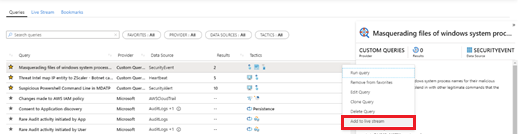
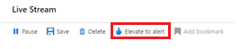

# Use Live Stream while hunting in Azure Sentinel to detect threats

Use Live Stream to create interactive sessions that let you test newly created queries as events occur, get notifications from the sessions when a match is found, and launch investigations if necessary. You can quickly create a Live Stream session using any Log Analytics query.

- **Test newly created queries as events occur**
    
    You can test and adjust queries without any conflicts to current rules that are being actively applied to events. After you confirm these new queries work as expected, it's easy to promote them to custom alert rules by selecting an option that elevates the session to an alert.

- **Get notified when threats occur**
    
    You can compare threat data feeds to aggregated log data and be notified when a match occurs. Threat data feeds are ongoing streams of data that are related to potential or current threats, so the notification might indicate a potential threat to your organization. Create a Live Stream session instead of a custom alert rule when you want to be notified of a potential issue without the overheads of maintaining a custom alert rule.

- **Launch investigations**
    
    If there is an active investigation in the organization involving an asset such as a host or user, you can view specific (or any) activity in the log data as it occurs on that asset. You can be notified when that activity occurs.

## Create a Live Stream session

You can create a Live Stream session from an existing hunting query, or create your session from scratch.

1. In the Azure portal, navigate to **Sentinel** > **Threat management** > **Hunting**.

2. To create a Live Stream session from a hunting query:
    
    1. Locate the hunting query to use.
    2. Right-click the query and select **Add to Live Stream**:
    
    > [!div class="mx-imgBorder"]
    > 

3. To create a Live Stream session from scratch: 
    
    1. Select the **Live Stream** tab
    2. Select **Live Stream**.
    
4. On the **Live Stream** blade, create your query, and then select **Play**.  
    
    The status bar under the command bar indicates whether your Live Stream is running or paused. For example:
    
    > [!div class="mx-imgBorder"]
    > 

## View and edit your Live Stream sessions

1. In the Azure portal, navigate to **Sentinel** > **Threat management** > **Hunting** > **Live Stream** tab.

2. Select the Live Stream session you want to view or edit. For example:
    
    > [!div class="mx-imgBorder"]
    > 

3. To make changes, first select **Pause** from the command. Then   make your changes to the query, and select **Play**. To save your changes, select **Save**.

## Receive notifications when new events occur

Because Live Stream notifications for new events use Azure portal notifications, you see these notifications whenever you use the Azure portal. For example:

Select the notification to open the **Live Stream** blade.
 
## Elevate a Live Stream session to an alert

You can promote a Live Stream session to a new alert by selecting **Elevate to alert** from the command bar on the relevant Live Stream session:

> [!div class="mx-imgBorder"]
> 

This action opens the rule creation wizard, which is prepopulated with the query that is associated with the Live Stream session.

## Next steps

In this article, you learned how to use Live Stream for a hunting investigation in Azure Sentinel. To learn more about Azure Sentinel, see the following articles:

- [Proactively hunt for threats](hunting.md)
- [Use notebooks to run automated hunting campaigns](notebooks.md)
