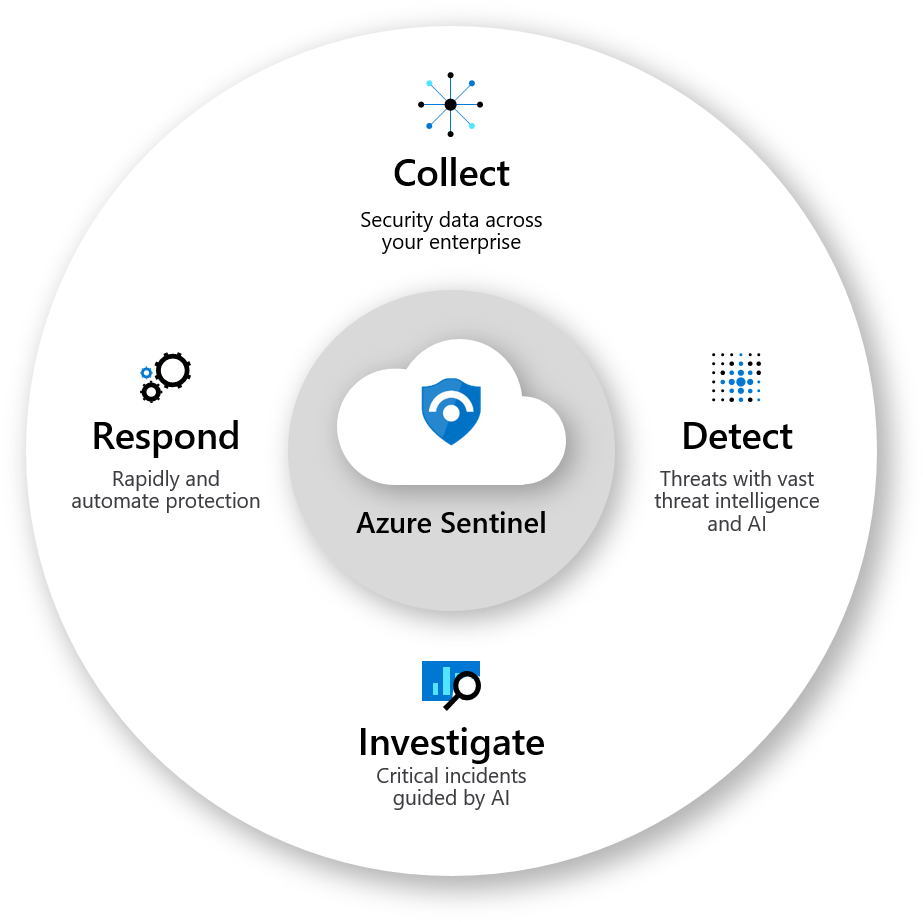
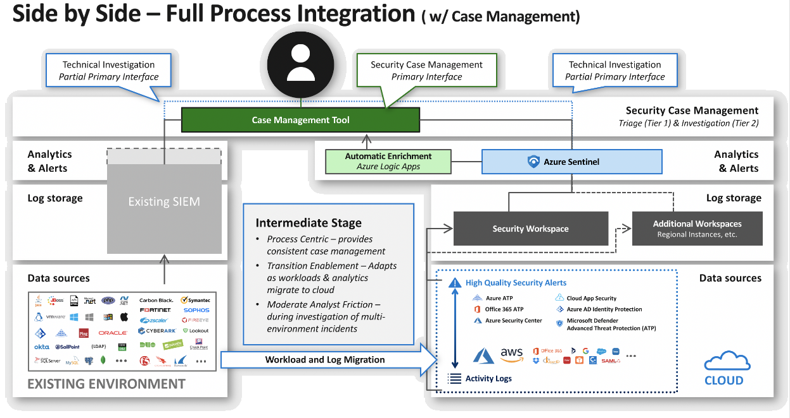
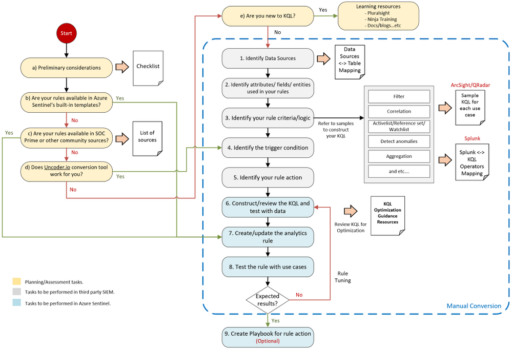

# Azure Sentinel migration fundamentals

With today's widespread adoption of cloud and remote work, security operations center (SOC) teams must protect an increasingly decentralized digital estate. Organizations are making do with siloed, patchwork security solutions, just as cyber threats are becoming more sophisticated and relentless. Businesses need a centralized security information and event management (SIEM) and security operation and automated response (SOAR) solution that meets growing needs across a decentralized digital estate.

[Azure Sentinel](https://azure.microsoft.com/services/azure-sentinel) is a cloud-native SIEM + SOAR solution that provides the scope, flexibility, and real-time analysis to meet today's security needs. Azure Sentinel can help businesses across IT, financial services, e-commerce, big data, and other vertical enterprises to modernize their SOCs.

You can rapidly adopt Azure Sentinel as a single solution, use Azure Sentinel in a side-by-side configuration with an existing SIEM, or eventually transition to a full Azure Sentinel deployment. This article presents recommendations, considerations, and steps for adopting, migrating, and transitioning security operations to Azure Sentinel.

This article helps you plan and carry out a migration to Azure Sentinel. The article:

- Describes Azure Sentinel's core capabilities, and the benefits of moving to a fully cloud-native SIEM.
- Breaks down key criteria for comparing Azure Sentinel to your existing SIEM.
- Reviews the pros and cons of operating a side-by-side configuration that combines Azure Sentinel and a legacy SIEM.
- Compares transitional or medium- to long-term side-by-side configurations.
- Provides a checklist of tasks to complete before deprovisioning a legacy SIEM.
- Gives you some resources for getting the most from Azure Sentinel after migration.

The information in this article comes from Microsoft customer migrations and Microsoft's own security operations center (SOC) experience protecting Microsoft IT infrastructure.

## Azure Sentinel capabilities and benefits

Azure Sentinel provides intelligent security analytics across entire organizations, powered by AI and enhanced with automation.

### Flexibility and cost savings

Azure Sentinel helps secure your entire digital estate, without the costly infrastructure and time-consuming maintenance of a legacy or on-premises SIEM.

- Azure Sentinel can receive data in real time from sources across your enterprise. Sources can include on-premises systems, software-as-a-service (SaaS) applications, firewalls, Linux systems, and non-Microsoft cloud environments such as Amazon Web Services (AWS).

- A cloud-native SIEM means greater flexibility, which translates to significant cost savings. Data ingestion can scale up or down as needed, without requiring time-consuming and expensive infrastructure changes. [The Forrester Total Economic Impact™ (TEI) of Microsoft Azure Sentinel](https://query.prod.cms.rt.microsoft.com/cms/api/am/binary/RE4IgFh) found that Azure Sentinel is 48% less expensive than traditional on-premises SIEMs.

### SOC effectiveness and efficiency

Today's SOC teams must do more with less. An estimated 3.5 million unfilled security professional jobs in 2021 mean that [44 percent of security alerts are never investigated](https://www.microsoft.com/security/blog/wp-content/uploads/2020/07/Azure-Sentinel-whitepaper.pdf). The mean time to detect a threat has increased to 197 days, while the time to contain the threat has stretched to 69 days. The volume of cloud service logs and noisy alerts is increasing.

A cloud-native SIEM can mitigate these challenges.

- Azure Sentinel's AI and automation capabilities can save significant time for SOC teams. By combining low-fidelity alerts about different entities into potential high-fidelity security incidents, Azure Sentinel helps reduce noise and alert fatigue.

- Azure Sentinel's cloud-native capabilities and AI provide quick correlation, leading to cost savings, greater visibility, and faster time to resolution.

- Using machine learning (ML) distilled from customer security data and more than [eight trillion daily signals](https://www.microsoft.com/security/blog/2021/01/27/microsoft-surpasses-10-billion-in-security-business-revenue-more-than-40-percent-year-over-year-growth/) from Microsoft, Azure Sentinel dramatically reduces false positives. Forrester's TEI report showed that deploying Azure Sentinel led to a 79 percent decrease in false positives over three years, reducing SOC workloads and generating [$2.2 million in efficiency gains](https://query.prod.cms.rt.microsoft.com/cms/api/am/binary/RE4IgFh).

- SOC teams can use Azure Sentinel's proactive threat hunting to stop threats before they cause harm. Azure Sentinel provides pre-built queries based on Microsoft's decades of security experience. Teams can modify the ML models or bring their own models for tailored detections.

- Built-in automation for common tasks and workflows frees up analysts' time for tasks that require human attention. Moving to Azure Sentinel helps make SOC teams more efficient, and uses their time and resources for dealing with security, not infrastructure.

## Plan the migration

Your migration journey begins with the decision to initiate a direct or gradual transition to Azure Sentinel, according to your business needs and available resources. Getting started with a SIEM migration can seem daunting, considering the amount of data and content. It's important that the migration doesn't introduce gaps in coverage, which could put the security of your organization in jeopardy.

### Key core capabilities and use cases

Identify your key core capabilities and first-priority requirements. Evaluate the key use cases your current SIEM deploys. Decide which detections and capabilities are vital for your new SIEM to maintain effectiveness. Your current SIEM might have an overwhelming amount of detections and use cases, so decide which ones are actively useful to your business and which ones don't need to be migrated. A good starting place is to look at which detections produced actual results within the past year.

### Legacy and cloud SIEM comparison

If you're evaluating Azure Sentinel, or plan to use it alongside your legacy SIEM for an extended period, compare Azure Sentinel to your current traditional SIEM. This process helps you refine your migration completion criteria and understand where you can extract more value with Azure Sentinel.

Based on experience with responding to a high volume of real-world attacks, these are key areas to evaluate:

                                    | Evaluation|
------------------------------------|-----------|
| **Attack detection coverage**     | Compare how well each SIEM can detect the full range of attacks, using [MITRE ATT&CK](https://attack.mitre.org/) or a similar framework.|
| **Responsiveness**                | Measure the mean time to acknowledge (MTTA), which is the time between an alert appearing in the SIEM and an analyst starting work on it. This time will probably be similar between SIEMs.|
| **Mean time to remediate (MTTR)** | Compare the MTTR for incidents investigated by each SIEM, assuming analysts at equivalent skill levels.|
| **Hunting speed and agility**     | Measure how fast teams can hunt, starting from a fully-formed hypothesis, to querying the data, to getting the results on each SIEM platform.|
| **Capacity growth friction**      | Compare the level of difficulty in adding capacity as usage grows. Cloud services and applications tend to generate more log data than traditional on-premises workloads.|

### SIEM architectural models and migration phases

For an organization with limited or no investment in an existing on-premises SIEM, moving to Azure Sentinel can be a straightforward, direct migration.

Enterprises that are heavily invested in a legacy SIEM can usually maintain good coverage of on-premises assets. But these organizations often lack security coverage for their cloud assets, such as Azure, AWS, Google Cloud Platform (GCP), or Microsoft 365, due to the scale limitations of physical hardware and the pace of innovation in cloud technologies. For these organizations, migration typically requires a three-stage process to accommodate transition tasks:

1. Plan and start the migration.
2. Run Azure Sentinel and an on-premises SIEM side by side.
3. Complete the migration by moving completely off the on-premises SIEM.

Three architectural models correspond to these migration stages:

- **On-premises SIEM architecture** is the classic model, with both analytics and database functions residing on-premises. This type of SIEM usually has limited scalability and isn't designed with AI, so may overwhelm your SOC with a large volume of alerts, or technical indicator of anomalous activity. This article considers an on-premises SIEM to be the before state, prior to migration.
  
- **Side-by-side architecture** configuration uses an on-premises SIEM and cloud-native SIEM at the same time. There are various configurations for this stage, but typically local resources use the on-premises SIEM, while cloud resources and new workloads use cloud-based analytics.
  
  The side-by-side architecture or migration phase can be a medium-to-long-term operational model, or a short-term transitional phase leading to a completely cloud-hosted SIEM architecture.
  
  While many organizations avoid running multiple on-premises analytics solutions because of cost and complexity, Azure Sentinel makes this option simpler with pay-as-you-go pricing and flexible infrastructure. Running a side-by-side configuration as a transitional phase gives SOC teams time to adapt to the change. You can migrate and test content at a pace that works best for your organization.
  
- **Cloud-native architecture** uses native cloud services for both security analytics and data storage. Unless you choose a long-term side-by-side configuration, this full Azure Sentinel deployment model is the migration end state. Migrating completely away from a legacy SIEM gives you the lower infrastructure costs, real-time threat analysis, and easy scalability of a cloud-native SIEM.

## Operate side-by-side with a legacy SIEM

There are several ways to approach the side-by-side phase of a migration process.

### Transitional vs. medium- to long-term side-by-side

Side-by-side configuration is usually a temporary step in a migration journey to using Azure Sentinel as a primary SIEM. However, some organizations that aren't ready to move away from their current SIEM may choose to use Azure Sentinel in a side-by-side configuration with their legacy SIEM as a long-term solution. Typically, these organizations use Azure Sentinel to analyze only their cloud data.

- The **transitional side-by-side** approach involves running Azure Sentinel side-by-side with a legacy SIEM just long enough to complete a migration, with the end goal of moving permanently to Azure Sentinel.
  
  **Pros:** Gives SOC staff time to adapt to new processes as workloads and analytics migrate. Gains deep correlation across all data sources for hunting scenarios. Eliminates having to do analytics between SIEMs or author forwarding rules and close investigations in two places. Enables your SOC team to quickly downgrade legacy SIEM solutions, eliminating infrastructure and licensing costs.
  
  **Cons:** Can require a steep learning curve for SOC staff.

- The **medium- to long-term side-by-side** model uses Azure Sentinel alongside a legacy SIEM for a longer period of time. The model uses both SIEMs to analyze different subsets of data indefinitely, until you're ready to make a permanent full migration.
  
  **Pros:** Use Azure Sentinel's key benefits, like AI, ML, and investigation capabilities, without moving completely away from your legacy SIEM. Saves money compared to your legacy SIEM, by analyzing cloud or Microsoft data in Azure Sentinel.
  
  **Cons**: Separating analytics across two different databases results in greater complexity. Multi-environment incidents require split case management and investigations. Staff and infrastructure costs are greater. Requires staff to be knowledgeable in two different SIEM solutions.

Longer-term side-by-side deployment is a potential starting point for an organization that wants to take advantage of Azure Sentinel's strengths, but isn't yet ready to move away from its existing SIEM. Moving to Azure Sentinel over time provides more opportunities to modernize your SIEM while taking advantage of the cost savings and flexibility the cloud provides. You get the full value of Azure Sentinel's correlation and investigation capabilities across all your data sources.

While short-term transitional side-by-side deployment is recommended, Azure Sentinel's cloud-native nature makes it easy to run side-by-side with your traditional SIEM as long as needed, giving you the flexibility to approach migration in a way that best fits your organization.

### Operate side-by-side with a legacy SIEM

There are several ways to configure side-by-side operations. Some approaches are more effective, while others introduce significant problems.

#### Send alerts from a legacy SIEM to Azure Sentinel

The recommended side-by-side approach is to send alerts, or technical indicators of anomalous activity, from your legacy SIEM to Azure Sentinel.

In this model, you ingest and analyze cloud data within Azure Sentinel, while still using your legacy SIEM to analyze on-premises data and generate alerts. You forward the alerts from your on-premises SIEM into Azure Sentinel to establish a single interface.

You can forward alerts using different tools and methods, such as [Logstash](connect-logstash.md), [APIs](https://techcommunity.microsoft.com/t5/azure-sentinel/azure-sentinel-api-101/ba-p/1438928), or [Syslog](connect-syslog.md). Any of these methods can send alerts to Azure Sentinel and store them in [JSON](https://techcommunity.microsoft.com/t5/azure-sentinel/tip-easily-use-json-fields-in-sentinel/ba-p/768747) format in your Azure Sentinel [Log Analytics workspace](/azure-monitor/logs/quick-create-workspace).

By sending alerts from your legacy SIEM to Azure Sentinel, your team can cross-correlate and investigate those alerts in Azure Sentinel, and still access the legacy SIEM for deeper investigation if needed. Meanwhile, you can continue migrating data sources over an extended transition period.

In this recommended side-by-side migration method, you can get full value from Azure Sentinel, while also migrating data sources at the pace that's right for your organization. This approach avoids duplicating costs for data storage and ingestion while you move your data sources over.

For more information on sending alerts or data from a legacy SIEM to Azure Sentinel, see:

- [Migrate QRadar offenses to Azure Sentinel](https://techcommunity.microsoft.com/t5/azure-sentinel/migrating-qradar-offenses-to-azure-sentinel/ba-p/2102043).
- [Export data from Splunk to Azure Sentinel](https://techcommunity.microsoft.com/t5/azure-sentinel/how-to-export-data-from-splunk-to-azure-sentinel/ba-p/1891237).

#### Send alerts and enriched incidents from Azure Sentinel to a legacy SIEM

In this model, you analyze some data in Azure Sentinel, such as cloud services data, and then send the generated alerts to a legacy SIEM. You can use the legacy SIEM as your single interface to do any cross-correlation on the alerts that Azure Sentinel generated. Your team can then use Azure Sentinel for any deeper investigation needed on those alerts.

This configuration has some benefits. It's cost effective because it allows you to move your cloud data analysis to Azure Sentinel without duplicating costs or paying for data twice, while still giving you the freedom to migrate at your own pace. As you continue to shift data sources and detections over to Azure Sentinel, it becomes easier to migrate to Azure Sentinel as your primary interface.

However, there are downsides to this approach. Simply forwarding enriched incidents to a legacy SIEM limits the value you get from Azure Sentinel's investigation, hunting, and automation capabilities. But you can still use these capabilities when investigating and responding to incidents that Azure Sentinel generates.

For more information on sending alerts and incidents from Azure Sentinel to a legacy SIEM, see:

- [Send enriched Azure Sentinel alerts to your legacy SIEM](https://techcommunity.microsoft.com/t5/azure-sentinel/sending-enriched-azure-sentinel-alerts-to-3rd-party-siem-and/ba-p/1456976).
- [Send enriched Azure Sentinel alerts to IBM QRadar](https://techcommunity.microsoft.com/t5/azure-sentinel/azure-sentinel-side-by-side-with-qradar/ba-p/1488333).
- [Ingest Azure Sentinel alerts into Splunk](https://techcommunity.microsoft.com/t5/azure-sentinel/azure-sentinel-side-by-side-with-splunk/ba-p/1211266).

#### Other approaches

The following side-by-side approaches aren't recommended:

- Move logs from Azure Sentinel to a legacy SIEM.
  
  You can use Azure Sentinel only as a log relay, forwarding logs to an existing on-premises SIEM. You continue to experience the cost and scale challenges of your on-premises SIEM. You also pay for data ingestion in Azure Sentinel, along with storage costs in your legacy SIEM. You can't take advantage of Azure Sentinel's SIEM + SOAR detections, analytics, AI, or investigation and automation tools.

- Move logs from a legacy SIEM to Azure Sentinel.
  
  Using this approach, you can benefit from the full functionality of Azure Sentinel, without the capacity limitations of an on-premises SIEM. But your organization still pays two different vendors for data ingestion. Besides adding architectural complexity, this model can result in higher costs.

- Use Azure Sentinel and a legacy SIEM side-by-side as two separate solutions.
  
  You can use Azure Sentinel to analyze some data sources, like your cloud data, and continue to use your on-premises SIEM for other sources. Rather than send alerts between the two SIEMs, SOC uses the two separate interfaces. This setup allows for clear boundaries for when to use which solution, and avoids duplication of costs. However, cross-correlation becomes difficult, and it's impossible to fully diagnose attacks that cross both sets of data sources. In today's landscape, where threats often move laterally across the organization, such visibility gaps pose significant security risks.

> [!TIP]
> Because dividing analytics adds complexity to investigations, you can set up case-management software to manage the workflow. Case tickets process elements for managing incidents, such as owner and activity history. Capturing investigation history and insights takes a burden off analysts, allowing them to focus on attackers rather than processes.
> 
> Azure Sentinel can provide basic workflow management. Partner offerings are also available. For more information, see [Top 7 Case Management Tools in 2020](https://kissflow.com/case/case-management-tools/#:~:text=A%20case%20management%20tool%20is,data%20using%20spreadsheets%20and%20paper).

### Side-by-side full process integration

The following diagram shows full integration of all SIEM, SOAR, and case management processes in a side-by-side deployment.

## Migration processes

Most migrations happen in three phases:
1. Migrate data.
2. Migrate detection rules.
3. Implement automation.

### Migrate data

Migration is a prime opportunity to re-evaluate security needs and cull data that's no longer useful. This evaluation is especially important with a SIEM, where the amount of data ingested has a cost implication. Don't invest time or money migrating resources that aren't adding value.

Start by considering your key use cases, and prioritizing your data sources. Think holistically about your use cases, and map the data needed to support them. Ask whether each current [data source](https://myignite.microsoft.com/sessions/3de9574e-1ef8-496a-96d3-309a57831064?source=sessions) is valuable. Identify any visibility gaps in your legacy SIEM, and determine how you can close them.

Azure Sentinel has many built-in data connectors that make it easy to ingest data from across your organization. You can begin by ingesting your cloud data into Azure Sentinel. Another good starting point is data from other Microsoft products, since many of these data sources are free. [Azure activity logs](connect-azure-activity.md) and [Office 365 audit logs](connect-office-365.md) are free to ingest, and give you visibility into your Azure and Office 365 activity.

You can also ingest alerts from [Microsoft Defender](https://techcommunity.microsoft.com/t5/azure-sentinel/whats-new-azure-sentinel-and-microsoft-365-defender-incident/ba-p/2191090) products, [Azure Security Center](https://techcommunity.microsoft.com/t5/itops-talk-blog/what-s-the-difference-between-azure-security-center-azure/ba-p/2155188), [Microsoft Cloud App Security](connect-cloud-app-security.md), and [Azure Information Protection](connect-azure-information-protection.md) for free.

For these security products, consider whether you need to ingest raw logs, which can be costly. In many cases, enriched alerts provide enough context for your key use cases. Security teams can ingest enriched data from security products across the organization, and use Azure Sentinel to correlate across them. There's no need to ingest raw logs from the data sources themselves.

As you migrate detections and build use cases in Azure Sentinel, stay mindful of the data you ingest and verify its value to your key priorities. Revisit data collection conversations to ensure data depth and breadth across your use cases.

### Migrate detection rules

Another key task for your migration involves mapping existing detection rules to Azure Sentinel.

To plan a rule detection migration:

- Create checklists and important points to consider before beginning the rule migration steps.
- Prepare a validation process. Define test scenarios and build a test script to be used for rule validation.
- Provide useful resources to help prepare your team for the journey.
- Confirm connected data sources, and review data connection methods.

Don't migrate all rules blindly.

- Select use cases that justify rule migration in terms of business priority and efficacy.
- Use available resources. Review all the [Azure Sentinel built-in rules](https://github.com/Azure/Azure-Sentinel/tree/master/Detections) to identify built-in rules that can address your use cases. Explore community resources such as the [SOC Prime Threat Detection Marketplace](https://my.socprime.com/tdm/).
- Review rules that haven't triggered any alerts in the past 6-12 months and determine whether they're still relevant.
- Eliminate low-level threats or alerts you routinely ignore.

Azure Sentinel has four built-in rule types:

- [Alert grouping](https://techcommunity.microsoft.com/t5/azure-sentinel/what-s-new-reduce-alert-noise-with-incident-settings-and-alert/ba-p/118794 0) reduces alert fatigue by grouping up to 150 alerts that occur within a given timeframe. Azure Sentinel has three options for grouping: matching entities, alerts triggered by a scheduled rule, and matches of specific entities.

- [Entity mapping](https://docs.microsoft.com/en-us/azure/sentinel/map-data-fie lds-to-entities) lets SOC engineers define entities as part of the evidence to track during an investigation. Entity mapping also makes it possible for SOC analysts to take advantage of an intuitive [Investigation Graph](tutorial-investigate-cases.md) to reduce time and effort.

- The *Evidence Summary* feature surfaces events, alerts, and any bookmarks associated with a particular incident in the incident preview pane. Entities and tactics also appear in the incident pane. Evidence summary provides a snapshot of the essential details needed to start an investigation, making it easier to conduct triage.

- Azure Sentinel provides the powerful [Kusto Query Language (KQL](/azure/data-explorer/kusto/query/), which sends read-only requests to a Log Analytics database to process data and return results. KQL states requests in plain text, using a data-flow model designed to make the syntax easy to read, author, and automate. You can use KQL across other Microsoft solutions like [Microsoft Defender for Endpoint](https://www.microsoft.com/microsoft-365/security/endpoint-defender) and [Application Insights](/azure/azure-monitor/app/app-insights-overview).
  
  Several other Microsoft services also store data in [Log Analytics](/azure/azure-monitor/logs/log-analytics-tutorial) or [Azure Data Explorer](https://azure.microsoft.com/services/data-explorer/), reducing the learning curve for queries or correlations, regardless of source.

#### Rule migration flow

Rule migration across SIEMs requires a clear strategy and a detailed implementation plan to achieve business goals while reducing security risks. The following rule-migration process flow diagram shows an overview of key elements, decision points, and interrelationships among the steps.

Because Azure Sentinel uses ML analytics to produce high-fidelity and actionable incidents, some of your existing detections might not be required anymore.

For detailed guidance on the rule migration process, including specifics on how to migrate detection rules from a variety of other SIEMs, see [Rule migration best practices](https://techcommunity.microsoft.com/t5/azure-sentinel/best-practices-for-migrating-detection-rules-from-arcsight/ba-p/2216417) and [Webinar: Best Practices for Converting Detection Rules](https://www.youtube.com/watch?v=njXK1h9lfR4).

## Use automation

Automating workflows can streamline both common and critical tasks for your SOC. With automated workflows, you can group and prioritize alerts into a common incident, and modify its priority. Automated Azure Sentinel playbooks provide easy integration with Partner ticketing solutions like [ServiceNow](https://techcommunity.microsoft.com/t5/azure-sentinel/azure-sentinel-incident-bi-directional-sync-with-servicenow/ba-p/1667771).

Automation isn't just about running tasks in the background. From within an investigation, your SOC team can use an automated playbook to gather additional information or apply remediation action. Playbooks help analysts accomplish more in less time. You can also iterate and refine over time, moving to full automation for responses. Browse the [GitHub playbooks](https://github.com/Azure/Azure-Sentinel/tree/master/Playbooks) to get new ideas and learn about the most common automation flows.

## Finish the migration and retire the legacy SIEM

Moving completely to Azure Sentinel can provide significant savings on infrastructure, licensing, and staff. Additional benefits of fully transitioning to Azure Sentinel include SOCs that:

- Emphasize process. A unified SIEM solution allows consistent case management.
- Are modernized. Azure Sentinel applies machine learning, threat intelligence, and behavior analytics across all data sources, both on-premises and in the cloud.
- Reduce friction. By eliminating multiple SIEMs, your SOC can create queries and conduct threat hunting from a single user interface.

### Checklist for retiring your legacy SIEM

Use your criteria, priorities, and use cases to determine when you're ready to retire your legacy SIEM. Making a complete break from your legacy SIEM requires fulfilling several criteria across technology, processes, and people:

#### Technology 

- **Check critical data:** Make sure all sources and alerts are available in Azure Sentinel.
- **Archive all records:** Save critical past incident and case records, raw data optional, to retain institutional history.

#### Processes 

- **Playbooks**: Update [investigation and hunting processes](tutorial-investigate-cases.md) to Azure Sentinel.
- **Metrics:** Ensure that you can get all key metrics from Azure Sentinel. Create [custom workbooks](tutorial-monitor-your-data.md) or use built-in workbook templates to quickly gain insights as soon as you [connect to data sources](connect-data-sources.md).
- **Cases:** Make sure to transfer all current cases to the new system, including required source data.

#### People 

- **SOC analysts:** Make sure everyone on your team is trained on Azure Sentinel and is comfortable leaving the legacy SIEM.

## Next steps

After migration, explore Microsoft's Azure Sentinel resources to expand your skills and get the most out of Azure Sentinel capabilities.

### Expand your Azure Sentinel skills

- [Become an Azure Sentinel Ninja with the complete 400-level training](https://techcommunity.microsoft.com/t5/azure-sentinel/become-an-azure-sentinel-ninja-the-complete-level-400-training/ba-p/1246310). This training program includes 16 modules covering workspace and tenant architecture, KQL, workbooks, reporting, and visualization.

- Check out the [Azure Sentinel learning paths](/learn/paths/security-ops-sentinel/) to get more information about security incident management, threat hunting, and connecting data sources.

- Get certified with the [SC-200 Microsoft Security Operations Analyst certification](/learn/certifications/exams/sc-200). This exam measures your ability to work with Azure Sentinel, Microsoft 365 Defender, and Azure Defender.

### Improve SOC efficiency

- [Learn more about using automation](automation-in-azure-sentinel.md), including how [automation rules](automate-incident-handling-with-automation-rules.md) can deliver more streamlined orchestration.

- Continue to measure and improve your SOC efficiency in Azure Sentinel with built-in efficiency tools like the [SOC efficiency workbook](https://techcommunity.microsoft.com/t5/azure-sentinel/the-toolkit-for-data-driven-socs/ba-p/2143152).

### Expand threat detection with integrated SIEM and extended detection and response (XDR)

Consider increasing your threat protection by using Azure Sentinel alongside [Microsoft 365 Defender](/azure/sentinel/microsoft-365-defender-sentinel-integration) and [Azure Defender](https://azure.microsoft.com/services/azure-defender/) for [integrated threat protection](https://www.microsoft.com/security/business/threat-protection). You benefit from the breadth of visibility that Azure Sentinel delivers, while diving deeper into detailed threat analysis. See how the process works in this [interactive guide](https://mslearn.cloudguides.com/guides/Investigate%20an%20attack%20on%20a%20hybrid%20environment%20with%20Azure%20Sentinel).

## Related resources

- [Azure Sentinel on Azure.com](https://azure.microsoft.com/services/azure-sentinel)
- [Azure Sentinel documentation](/azure/sentinel/)
- [Azure Sentinel interactive guide](https://mslearn.cloudguides.com/guides/Modernize%20your%20security%20options%20with%20Microsoft%20Azure%20Sentinel)
- [Investigating a hybrid attack with Azure Sentinel](https://mslearn.cloudguides.com/guides/Investigate%20an%20attack%20on%20a%20hybrid%20environment%20with%20Azure%20Sentinel)
- [Azure Sentinel Technical Playbook for MSSPs](http://aka.ms/azsentinelmssp)
- [Azure Sentinel Best Practices: Strategies for success in data ingestion and incident response](https://www.microsoft.com/security/blog/wp-content/uploads/2020/07/Azure-Sentinel-whitepaper.pdf)

### Other resources

- [Managing and Responding to Security Events Using Azure Sentinel (Pluralsight)](https://www.pluralsight.com/courses/microsoft-azure-managing-responding-security-alerts-update)
- [KQL online course: The Basics of Kusto Query Language (Pluralsight)](https://www.pluralsight.com/courses/kusto-query-language-kql-from-scratch)
- [Microsoft Azure Data Explorer - Advanced KQL (Pluralsight)](https://www.pluralsight.com/courses/microsoft-azure-data-explorer-advanced-query-capabilities)
- [Azure Sentinel webinar: KQL part 1 of 3 - Learn the KQL you need for Azure Sentinel (YouTube)](https://www.youtube.com/watch?v=EDCBLULjtCM)
