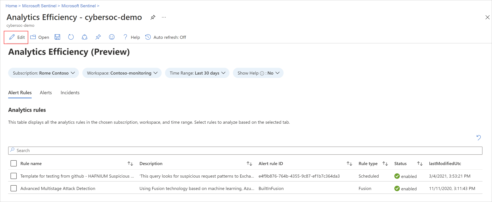
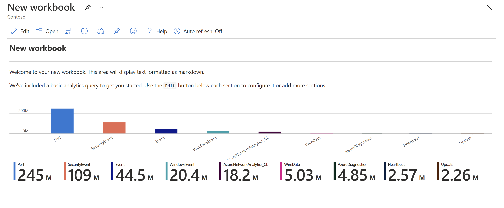

# Visualize and monitor your data by using workbooks in Microsoft Sentinel

After you connect your data sources to Microsoft Sentinel, visualize and monitor the data using workbooks in Microsoft Sentinel. Microsoft Sentinel workbooks are based on Azure Monitor workbooks, and add tables and charts with analytics for your logs and queries to the tools already available in Azure.

Microsoft Sentinel allows you to create custom workbooks across your data or use existing workbook templates available with packaged solutions or as standalone content from the content hub. Each workbook is an Azure resource like any other, and you can assign it with Azure role-based access control (RBAC) to define and limit who can access.

This article describes how to visualize your data in Microsoft Sentinel by using workbooks.

[!INCLUDE [unified-soc-preview](includes/unified-soc-preview.md)]

## Prerequisites

- You must have at least **Workbook reader** or **Workbook contributor** permissions on the resource group of the Microsoft Sentinel workspace.

   The workbooks that you see in Microsoft Sentinel are saved within the Microsoft Sentinel workspace's resource group and are tagged by the workspace in which they were created.

- To use a workbook template, install the solution that contains the workbook or install the workbook as a standalone item from the **Content Hub**. For more information, see [Discover and manage Microsoft Sentinel out-of-the-box content](sentinel-solutions-deploy.md).
 
## Create a workbook from a template

Use a template installed from the content hub to create a workbook.

1. For Microsoft Sentinel in the [Azure portal](https://portal.azure.com), under **Threat management**, select **Workbooks**.<br> For Microsoft Sentinel in the [Defender portal](https://security.microsoft.com/), select **Microsoft Sentinel** > **Threat management** > **Workbooks**.

1. Go to **Workbooks** and then select **Templates** to see the list of workbook templates installed.

    To see which templates are relevant to the data types you connected, review the **Required data types** field in each workbook where available.

    #### [Azure portal](#tab/azure-portal)
    :::image type="content" source="media/monitor-your-data/workbook-template-azure-portal.png" alt-text="Screenshot of a workbook template with required data types shown in the details pane." lightbox="media/monitor-your-data/workbook-template-azure-portal.png":::

    #### [Defender portal](#tab/defender-portal)
    :::image type="content" source="media/monitor-your-data/workbook-template-defender-portal.png" alt-text="Screenshot of a workbook template in the Defender portal that shows the required data types." lightbox="media/monitor-your-data/workbook-template-defender-portal.png":::

1. Select **Save** from the template details pane and the location where you want to save the JSON file for the template. This action creates an Azure resource based on the relevant template and saves the JSON file of the workbook not the data.

1. Select **View saved workbook** from the template details pane. 

1. Select the **Edit** button in the workbook toolbar to customize the workbook according to your needs.

    [  ](media/monitor-your-data/workbook-graph.png#lightbox)

    For example, select the **TimeRange** filter to view data for a different time range than the current selection. To edit a specific workbook area, either select **Edit** or select the ellipsis (**...**) to add elements, or move, clone, or remove the area.

    To clone your workbook, select **Save as**. Save the clone with another name, under the same subscription and resource group. Cloned workbooks are displayed under the **My workbooks** tab.

1. When you're done, select **Save** to save your changes.

For more information, see:

- [Create interactive reports with Azure Monitor Workbooks](../azure-monitor/visualize/workbooks-overview.md)
- [Tutorial: Visual data in Log Analytics](../azure-monitor/visualize/tutorial-logs-dashboards.md)

## Create new workbook

Create a workbook from scratch in Microsoft Sentinel.

1. For Microsoft Sentinel in the [Azure portal](https://portal.azure.com), under **Threat management**, select **Workbooks**.<br> For Microsoft Sentinel in the [Defender portal](https://security.microsoft.com/), select **Microsoft Sentinel** > **Threat management** > **Workbooks**.

1. Select **Add workbook**.

1. To edit the workbook, select **Edit**, and then add text, queries, and parameters as necessary. For more information on how to customize the workbook, see how to [Create interactive reports with Azure Monitor Workbooks](../azure-monitor/visualize/workbooks-overview.md). 

    [  ](media/monitor-your-data/create-workbook.png#lightbox)

1. When building a query, set the **Data source** to **Logs** and **Resource type** to **Log Analytics**, and then choose one or more workspaces.

   We recommend that your query uses an [Advanced Security Information Model (ASIM) parser](normalization-about-parsers.md) and not a built-in table. The query will then support any current or future relevant data source rather than a single data source.
 
1. After you create your workbook, save the workbook under the subscription and resource group of your Microsoft Sentinel workspace.

1. If you want to let others in your organization use the workbook, under **Save to** select **Shared reports**. If you want this workbook to be available only to you, select **My reports**.

1. To switch between workbooks in your workspace, select **Open**  in the toolbar of any workbook. The screen switches to a list of other workbooks you can switch to.

    Select the workbook you want to open:

    [  ](media/monitor-your-data/switch-workbooks.png#lightbox)

## Create new tiles for your workbooks

To add a custom tile to a Microsoft Sentinel workbook, first create the tile in Log Analytics. For more information, see [Visual data in Log Analytics](../azure-monitor/visualize/tutorial-logs-dashboards.md). 

Once you create a tile, select **Pin** and then select the workbook where you want the tile to appear.

## Refresh your workbook data

Refresh your workbook to display updated data. In the toolbar, select one of the following options:

- :::image type="icon" source="media/monitor-your-data/manual-refresh-button.png" border="false"::: **Refresh**, to manually refresh your workbook data.

- :::image type="icon" source="media/monitor-your-data/auto-refresh-workbook.png" border="false"::: **Auto refresh**, to set your workbook to automatically refresh at a configured interval.

    - Supported auto refresh intervals range from **5 minutes** to **1 day**.

    - Auto refresh is paused while you're editing a workbook, and intervals are restarted each time you switch back to view mode from edit mode.

    - Auto refresh intervals are also restarted if you manually refresh your data.

    By default, auto refresh is turned off. To optimize performance, auto refresh is turned off each time you close a workbook. It doesn't run in the background. Turn auto refresh back on as needed the next time you open the workbook.

## Print a workbook or save as PDF

To print a workbook, or save it as a PDF, use the options menu to the right of the workbook title.

1. Select options > :::image type="icon" source="media/monitor-your-data/print-icon.png" border="false"::: **Print content**. 
2. In the print screen, adjust your print settings as needed or select **Save as PDF** to save it locally.

   For example:

   :::image type="content" source="media/monitor-your-data/print-workbook.png" alt-text="Screenshot that shows how to print your workbook or save as PDF." :::

## How to delete workbooks

To delete a saved workbook, either a saved template or a customized workbook, select the saved workbook that you want to delete and select **Delete**. This action removes the saved workbook. It also removes the workbook resource and any changes you made to the template. The original template remains available.

## Workbook recommendations

This section reviews basic recommendations we have for using Microsoft Sentinel workbooks.

### Add Microsoft Entra ID workbooks

If you use Microsoft Entra ID with Microsoft Sentinel, we recommend that you install the Microsoft Entra solution for Microsoft Sentinel and use the following workbooks:

- **Microsoft Entra sign-ins** analyzes sign-ins over time to see if there are anomalies. This workbook provides failed sign-ins by applications, devices, and locations so that you can notice, at a glance if something unusual happens. Pay attention to multiple failed sign-ins. 
- **Microsoft Entra audit logs** analyzes admin activities, such as changes in users (add, remove, etc.), group creation, and modifications.  

### Add firewall workbooks

We recommend that you install the appropriate solution from the **Content hub** to add a workbook for your firewall.

For example, install the Palo Alto firewall solution for Microsoft Sentinel to add the Palo Alto workbooks. The workbooks analyze your firewall traffic, providing you with correlations between your firewall data and threat events, and highlight suspicious events across entities.

:::image type="content" source="media/qs-get-visibility/palo-alto-week-query.png" alt-text="Screenshot of the Palo Alto workbook.":::

### Create different workbooks for different uses

We recommend creating different visualizations for each type of persona that uses workbooks, based on the persona's role and what they're looking for. For example, create a workbook for your network admin that includes the firewall data.

Alternately, create workbooks based on how frequently you want to look at them, whether there are things you want to review daily, and others items you want to check once an hour. For example, you might want to look at your Microsoft Entra sign-ins every hour to search for anomalies.

### Sample query for comparing traffic trends across weeks

Use the following query to create a visualization that compares traffic trends across weeks. Switch the device vendor and data source you run the query on, depending on your environment.

The following sample query uses the **SecurityEvent** table from Windows. You might want to switch it to run on the **AzureActivity** or **CommonSecurityLog** table, on any other firewall.

```kusto
// week over week query
SecurityEvent
| where TimeGenerated > ago(14d)
| summarize count() by bin(TimeGenerated, 1d)
| extend Week = iff(TimeGenerated>ago(7d), "This Week", "Last Week"), TimeGenerated = iff(TimeGenerated>ago(7d), TimeGenerated, TimeGenerated + 7d)
```

### Sample query with data from multiple sources

You might want to create a query that incorporates data from multiples sources. For example, create a query that looks at Microsoft Entra audit logs for new users that were created, and then checks your Azure logs to see if the user started making role assignment changes within 24 hours of creation. That suspicious activity would show up in a visualization with the following query:

```kusto
AuditLogs
| where OperationName == "Add user"
| project AddedTime = TimeGenerated, user = tostring(TargetResources[0].userPrincipalName)
| join (AzureActivity
| where OperationName == "Create role assignment"
| project OperationName, RoleAssignmentTime = TimeGenerated, user = Caller) on user
| project-away user1
```

## Related articles

For more information, see:

- [Commonly used Microsoft Sentinel workbooks](top-workbooks.md)

- [Azure Monitor workbooks](/azure/azure-monitor/visualize/workbooks-overview)
