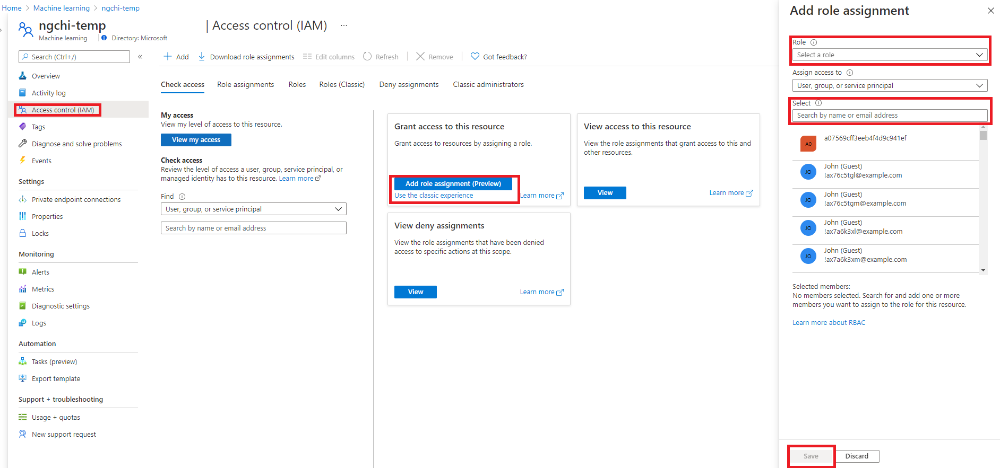
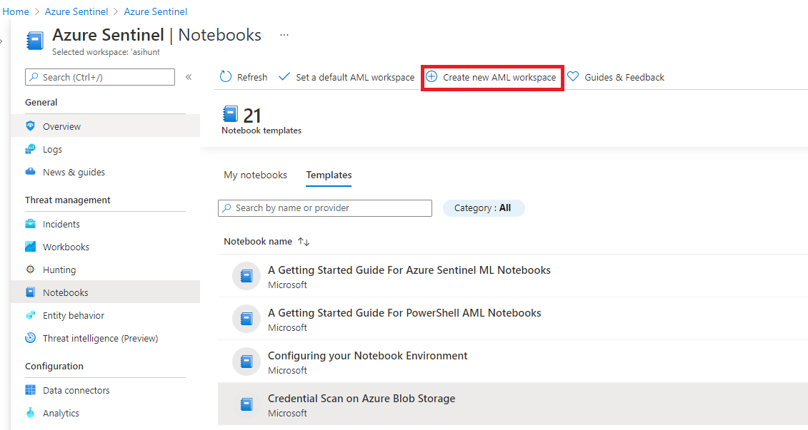
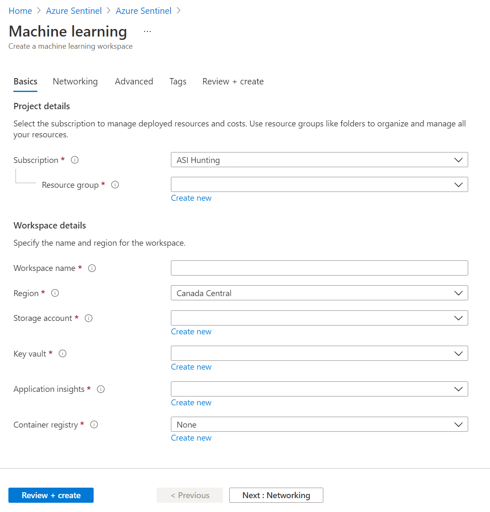
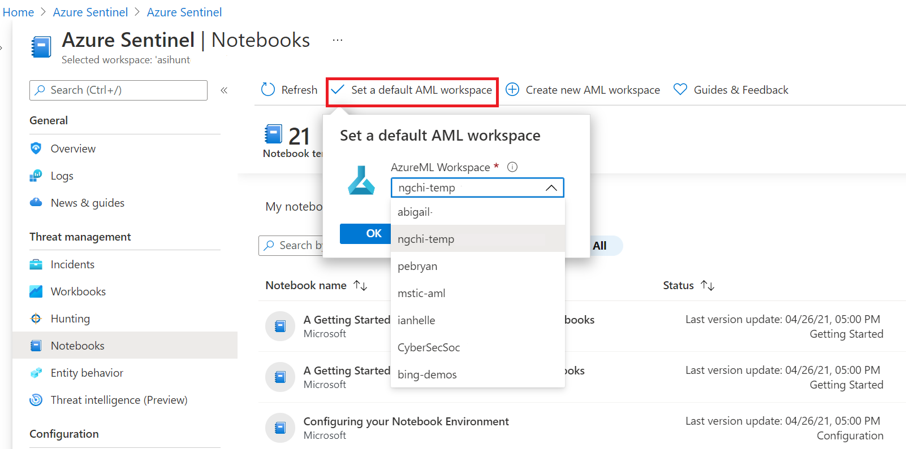
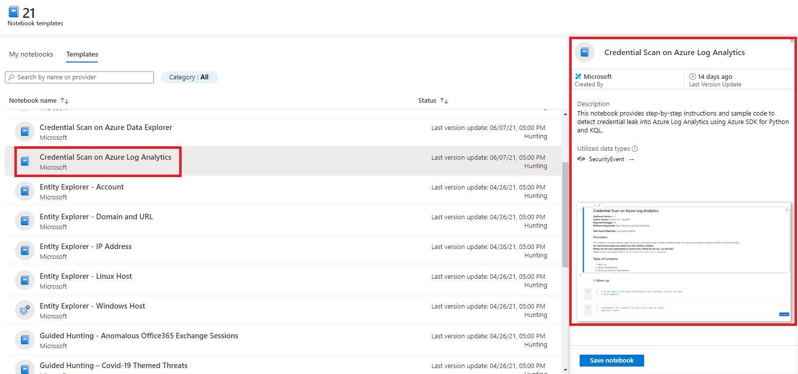
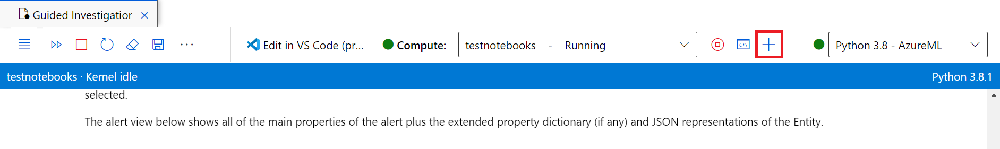
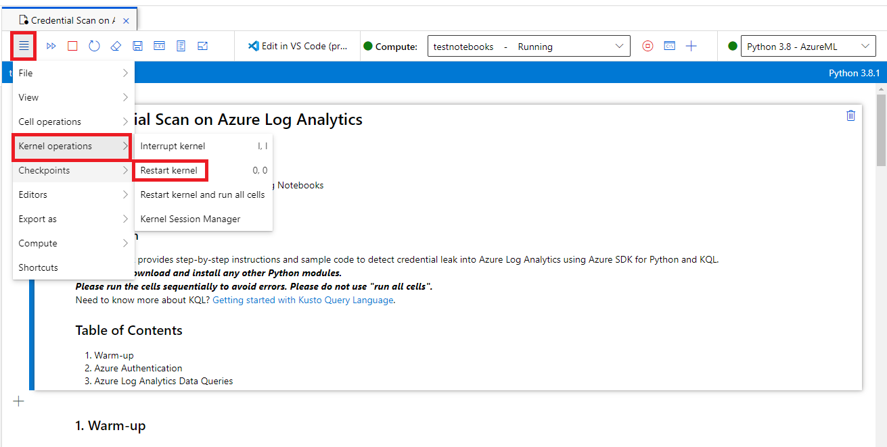

# Use Jupyter Notebook to hunt for security threats

[!INCLUDE [reference-to-feature-availability](includes/reference-to-feature-availability.md)]

The foundation of Azure Sentinel is the data store; it combines high-performance querying, dynamic schema, and scales to massive data volumes. The Azure portal and all Azure Sentinel tools use a common API to access this data store. The same API is also available for external tools such as [Jupyter](https://jupyter.org/) notebooks and Python. While many common tasks can be carried out in the portal, Jupyter extends the scope of what you can do with this data. It combines full programmability with a huge collection of libraries for machine learning, visualization, and data analysis. These attributes make Jupyter a compelling tool for security investigation and hunting.


We've integrated the Jupyter experience into the Azure portal, making it easy for you to create and run notebooks to analyze your data. The *Kqlmagic* library provides the glue that lets you take queries from Azure Sentinel and run them directly inside a notebook. Queries use the [Kusto Query Language](https://kusto.azurewebsites.net/docs/kusto/query/index.html). Several notebooks, developed by some of Microsoft's security analysts, are packaged with Azure Sentinel. Some of these notebooks are built for a specific scenario and can be used as-is. Others are intended as samples to illustrate techniques and features that you can copy or adapt for use in your own notebooks. Other notebooks may also be imported from the Azure Sentinel Community GitHub.

The integrated Jupyter experience uses [Azure Notebooks](https://notebooks.azure.com/) to store, share, and execute notebooks. You can also run these notebooks locally if you have a Python environment and Jupyter on your computer, or in other JupterHub environments such as Azure Databricks.

Notebooks have two components:

- The browser-based interface where you enter and run queries and code, and where the results of the execution are displayed.
- A *kernel* that is responsible for parsing and executing the code itself.

The Azure Sentinel notebook's kernel runs on an Azure virtual machine (VM). Several licensing options exist to leverage more powerful virtual machines if your notebooks include complex machine learning models.

The Azure Sentinel notebooks use many popular Python libraries such as pandas, matplotlib, bokeh, and others. There are a great many other Python packages for you to choose from, covering areas such as:

- Visualizations and graphics
- Data processing and analysis
- Statistics and numerical computing
- Machine learning and deep learning

We've also released some open-source Jupyter security tools in a package named [msticpy](https://github.com/Microsoft/msticpy/). This package is used in many of the included notebooks. Msticpy tools are designed specifically to help with creating notebooks for hunting and investigation and we're actively working on new features and improvements. For more information, see the [MSTIC Jupyter and Python Security Tools documentation](https://msticpy.readthedocs.io/).

The [Azure Sentinel Community GitHub repository](https://github.com/Azure/Azure-Sentinel) is the location for any future Azure Sentinel notebooks built by Microsoft or contributed from the community.

To use the notebooks, you must first have the right permissions, depending on your user role.

## Manage access to Azure Sentinel notebooks

As Azure Sentinel notebooks run on [Azure Machine Learning](https://docs.microsoft.com/azure/machine-learning/overview-what-is-azure-ml) (Azure ML) platform, you must have appropriate access to both Azure Sentinel workspace and an [Azure ML workspace](https://docs.microsoft.com/azure/machine-learning/concept-workspace).

1. **Azure Sentinel permissions**
    
    Like other Azure Sentinel resources, to access notebooks on Azure Sentinel Notebooks blade, an Azure Sentinel Reader, Azure Sentinel Responder, or Azure Sentinel Contributor role is required.

    Learn more about [Azure Sentinel-specific roles and permissions](https://docs.microsoft.com/azure/sentinel/roles).

2. **Azure Machine Learning permissions**

    ### Default roles

    An Azure Machine Learning workspace is an Azure resource. Like other Azure resources, when a new Azure Machine Learning workspace is created, it comes with three default roles. You can add users to the workspace and assign them to one of these built-in roles.

    | Role | Access level |
    | --- | --- |
    | **Reader** | Read-only actions in the workspace. Readers can list and view assets, including [datastore](how-to-access-data.md) credentials, in a workspace. Readers can't create or update these assets. |
    | **Contributor** | View, create, edit, or delete (where applicable) assets including notebooks in a workspace. For example, contributors can create a notebook, create or attach a compute cluster, submit a run, and deploy a web service. |
    | **Owner** | Full access to the workspace, including the ability to view, create, edit, or delete (where applicable) assets in a workspace. Additionally, you can change role assignments. |
    | **Custom Role** | Allows you to customize access to specific control or data plane operations within a workspace. For example, submitting a run, creating a compute, deploying a model or registering a dataset. |

    >[!IMPORTANT] Role access can be scoped to multiple levels in Azure. For example, someone with owner access to a workspace may not have owner access to the resource group that contains the workspace. For more information, see How Azure RBAC works.

    Currently there are no additional built-in roles that are specific to Azure Machine Learning. For more information on built-in roles, see [Azure built-in roles](https://docs.microsoft.com/azure/role-based-access-control/built-in-roles).

    ### Manage workspace access

    If you're an owner of an Azure ML workspace, you can add and remove roles for the workspace. You can also assign roles to users. Use the following links to discover how to manage access:
    - [Azure portal UI](../role-based-access-control/role-assignments-portal.md)
    - [PowerShell](../role-based-access-control/role-assignments-powershell.md)
    - [Azure CLI](../role-based-access-control/role-assignments-cli.md)
    - [REST API](../role-based-access-control/role-assignments-rest.md)
    - [Azure Resource Manager templates](../role-based-access-control/role-assignments-template.md)

    If you have installed the [Azure Machine Learning CLI](https://docs.microsoft.com/azure/machine-learning/reference-azure-machine-learning-cli), you can use CLI commands to assign roles to users:

    ```azurecli-interactive 
    az ml workspace share -w <workspace_name> -g <resource_group_name> --role <role_name> --user <user_corp_email_address>
    ```

    The `user` field is the email address of an existing user in the instance of Azure Active Directory where the workspace parent subscription lives. Here is an example of how to use this command:

    ```azurecli-interactive 
    az ml workspace share -w my_workspace -g my_resource_group --role Contributor --user jdoe@contoson.com
    ```

    > [!NOTE]
    > "az ml workspace share" command does not work for federated account by Azure Active Directory B2B. Please use Azure UI portal instead of command.

    ### Grant access via Azure portal UI
    To grant permissions via the UI, follow the following steps.

    i. From the Azure portal, navigate to your Machine Learning workspace. If you don't have an Azure ML workspace, [create a new Azure ML workspace](#Create-an-Azure-ML-workspace).

    ii. Select **Access Control (IAM)** blade, then in **Grant access to this resource**, select **Add Role Assignment** or **Use the classic experience**.

    iii. Select a role and the user you want to grant the permissions to. Then select **Save**.
    
    > [!div class="mx-imgBorder"]
    > 

    ### Create custom role
    
    If the built-in roles are insufficient, you can create custom roles. Custom roles might have read, write, delete, and compute resource permissions in that workspace. You can make the role available at a specific workspace level, a specific resource group level, or a specific subscription level.

    Learn more on how to [create custom role](https://docs.microsoft.com/azure/machine-learning/how-to-assign-roles#create-custom-role).

## Create an Azure ML workspace

1. From the Azure portal, navigate to **Azure Sentinel** > **Threat management** > **Notebooks** and then select **Create a new AML workspace**.

    > [!div class="mx-imgBorder"]
    > 

1. Provide the information for an Azure AML workspace. Then select **Next**.

    |Field|Description|
    |--|--|
    |Subscription|Select the Azure subscription that you want to use.|
    |Resource group|Use an existing resource group in your subscription or enter a name to create a new resource group. A resource group holds related resources for an Azure solution.|
    |Workspace name|Enter a unique name that identifies your workspace. Names must be unique across the resource group. Use a name that's easy to recall and to differentiate from workspaces created by others.|
    |Region|Select the location closest to your users and the data resources to create your workspace.|
    |Storage account| A storage account is used as the default datastore for the workspace. You may create a new Azure Storage resource or select an existing one in your subscription.|
    |KeyVault| A key vault is used to store secrets and other sensitive information that is needed by the workspace. You may create a new Azure Key Vault resource or select an existing one in your subscription.|
    |Application insights| The workspace uses Azure Application Insights to store monitoring information about your deployed models. You may create a new Azure Application Insights resource or select an existing one in your subscription.|
    |Container registry| A container registry is used to register docker images used in training and deployments. To minimize costs, a new Azure Container Registry resource is created only after you build your first image. Alternatively, you may choose to create the resource now or select an existing one in your subscription, or select **None** if you don't want to use any container registry.|

    > [!div class="mx-imgBorder"]
    > 

1. On "Networking" page, you can connect to your workspace either publicly or privately using a private endpoint. Then select **review + Create**.
    > [!div class="mx-imgBorder"]
    > 

1. Review the information, verify that it is correct, and then select **Create** to start the deployment of your workspace.

    > [!div class="mx-imgBorder"]
    > 

    It can take several minutes to create your workspace in the cloud during which time the **Overview** page displays the current deployment status.

    > [!div class="mx-imgBorder"]
    > 

1. Once your deployment is complete, you can launch notebooks in your new Azure ML workspace.

    > [!div class="mx-imgBorder"]
    > 

1. If you have multiple Azure ML workspaces, setting a default Azure ML workspace where you want to run the notebooks is required.

    > [!div class="mx-imgBorder"]
    > 

## Launch a notebook using your Azure ML workspace

1. From the Azure portal, navigate to **Azure Sentinel** > **Threat management** > **Notebooks**, where you can see notebooks that Azure Sentinel provides.

    > [!TIP]
    > Select **Guides & Feedback** to open a pane with additional help and guidance on notebooks.
    > 

1. Select individual notebooks to view their descriptions, required data types, and data sources.

    > [!div class="mx-imgBorder"]
    > 

1. Select the notebook you want to use, and then select **Save Notebook** to clone the notebook template into your own notebook project. You will then have an option to rename the notebook or keep the default name. 

    > [!div class="mx-imgBorder"]
    > 

1. Once the notebook is saved to your default Azure ML workspace, on the same view, select **Launch notebook**. 

    > [!div class="mx-imgBorder"]
    > 

1. A new page, your Azure ML studio, is open.

    > [!div class="mx-imgBorder"]
    > 

1. Select a compute instance. The compute is used for your notebook server. 

    * If you don't have a compute instance, do the following:
        
        a. In the notebook or script toolbar, to the right of the Compute dropdown, select **+ New Compute**. Depending on your screen size, this may be located under a ... menu.

        > [!div class="mx-imgBorder"]
        > 

        b. On the **Configured required settings** page, name a compute, choose a Virtual Machine size based on your workload types, and then select **Next**.

        Start with one with the **General Purpose** category first if you need compute to only test the notebooks.
        Only you can see and use the compute instances you create. Your User files are stored separately from the VM and are shared among all compute instances in the workspace.

        > [!div class="mx-imgBorder"]
        > 
    
    * If you have a stopped compute instance, select **Start compute** to the right of the Compute dropdown. Depending on your screen size, this may be located under a ... menu.

    1. On the **Configure Settings** page, enable any additional settings you may need, and then select **Create**.
    
    > [!div class="mx-imgBorder"]
    > 

1. Once your notebook server is created, you can now run the notebook cells. Within each cell, select the run icon to execute code in the notebooks.

    > [!div class="mx-imgBorder"]
    > 

## Troubleshooting

* If you can't connect to a notebook, ensure that web socket communication is **not** disabled. For compute instance Jupyter functionality to work, web socket communication must be enabled. Ensure your network allows websocket connections to *.instances.azureml.net and *.instances.azureml.ms. 

* When compute instance is deployed in a private link workspace it can be only be [accessed from within virtual network](./how-to-secure-training-vnet.md#compute-instance). If you are using custom DNS or hosts file please add an entry for < instance-name >.< region >.instances.azureml.ms with private IP address of workspace private endpoint. For more information see the [custom DNS](./how-to-custom-dns.md?tabs=azure-cli) article.

* If you run into an expired token or busy kernel issue, try logging out of your Azure ML studio and logging back in, and then restarting the kernel.

     > [!div class="mx-imgBorder"]
    > 

* If your kernel crashed and was restarted, you can run the following command to look at jupyter log and find out more details. `sudo journalctl -u jupyter`. If kernel issues persist, please consider using a compute instance with more memory.

Learn more on [how to run Jupyter notebooks in Azure ML studio](https://docs.microsoft.com/azure/machine-learning/how-to-run-jupyter-notebooks#troubleshooting).

## Recommendations

- For a quick introduction to querying data in Azure Sentinel, look at the [Getting Started with Azure ML Notebooks and Azure Sentinel](https://github.com/Azure/Azure-Sentinel-Notebooks/blob/master/A%20Getting%20Started%20Guide%20For%20Azure%20Sentinel%20ML%20Notebooks.ipynb) guide.

- Explore other scenario-based notebook examples such as **Credential Scan on Azure Log Analytics** and **Guided Investigation - Process Alerts** to learn more on how to use notebooks in threat hunting and investigation. These notebooks can be found in the Azure Sentinel portal -> **Notebooks** blade -> **Templates** tab.

- You'll find additional sample notebooks in the [**Sample-Notebooks**](https://github.com/Azure/Azure-Sentinel-Notebooks/tree/master/Sample-Notebooks) GitHub subfolder. These sample notebooks have been saved with data, so that it's easier to see the intended output.

- The [**HowTos**](https://github.com/Azure/Azure-Sentinel-Notebooks/tree/master/HowTos) GitHub subfolder contains notebooks describing, for example: Setting your default Python version, creating Azure Sentinel bookmarks from a notebook, and other subjects.

The notebooks provided are intended as both useful tools and as illustrations and code samples that you can use in the development of your own notebooks.

We welcome feedback, whether suggestions, requests for features, contributed Notebooks, bug reports or improvements and additions to existing notebooks. Go to the [Azure Sentinel Community GitHub](https://github.com/Azure/Azure-Sentinel) to create an issue or fork and upload a contribution.

## Next steps

In this article, you learned how to get started using Jupyter Notebook in Azure Sentinel. To learn more about Azure Sentinel, see the following articles:

- [Proactively hunt for threats](hunting.md)
- [Use bookmarks to save interesting information while hunting](bookmarks.md)
- [Jupyter, msticpy and Azure Sentinel](https://msticpy.readthedocs.io/en/latest/getting_started/JupyterAndAzureSentinel.html)
- [Tutorial: Edit and run Jupyter notebooks without leaving Azure ML studio](https://www.youtube.com/watch?v=AAj-Fz0uCNk)
