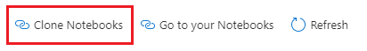
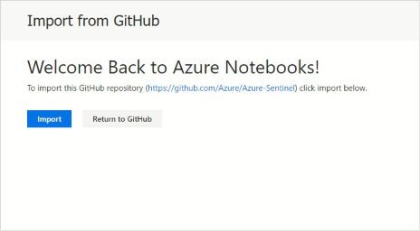
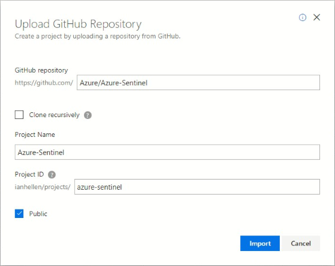
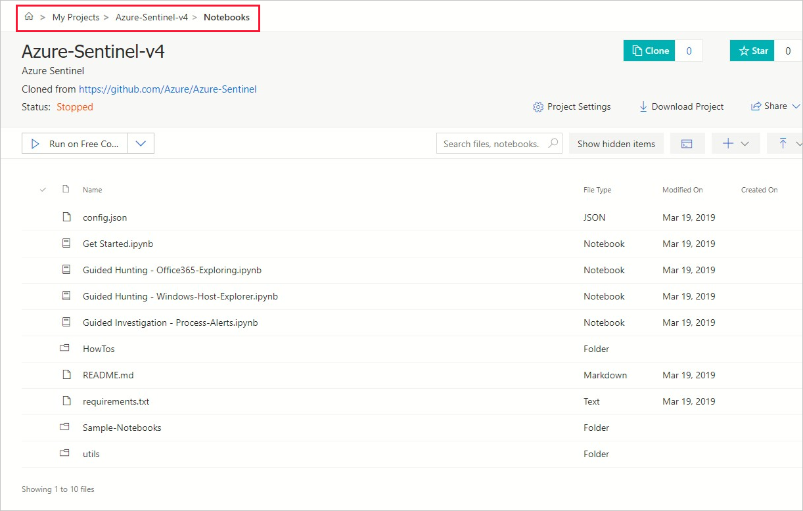
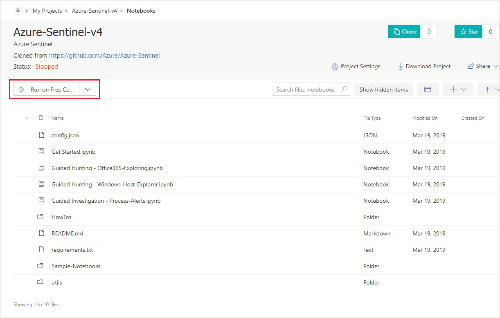
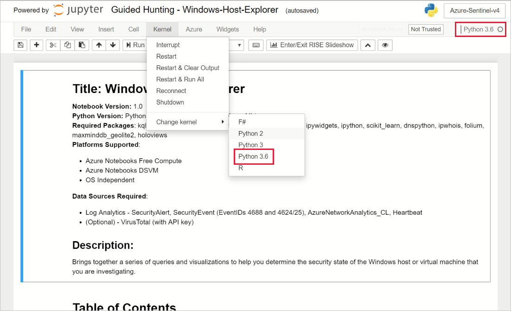

# Use Jupyter Notebooks to hunt for security threats

The foundation of Azure Sentinel is the data store; it combines high performance querying, dynamic schema, and scales to massive data volumes. The Azure portal and all Azure Sentinel tools use a common API to access this data store. The same API is also available for external tools such as [Jupyter](https://jupyter.org/) notebooks and Python. While many common tasks can be carried out in the portal, Jupyter extends the scope of what you can do with this data. It combines full programmability with a huge collection of libraries for machine learning, visualization, and data analysis. These attributes make Jupyter a compelling tool for security investigation and hunting.

We've integrated the Jupyter experience into the Azure portal, making it easy for you to create and execute notebooks to analyze your data. The *Kqlmagic* library provides the glue that lets you take queries from Azure Sentinel and run them directly inside a notebook. Queries use the [Kusto Query Language](https://kusto.azurewebsites.net/docs/query/index.html). Several notebooks, developed by some of Microsoft's security analysts, are packaged with Azure Sentinel. Some of these notebooks are built for a specific scenario and can be used as-is. Others are intended as samples to illustrate techniques and features that you can copy or adapt for use in your own notebooks. Other notebooks may also be imported from the Azure Sentinel community GitHub.

The integrated Jupyter experience uses [Azure Notebooks](https://notebooks.azure.com/) to store, share, and execute notebooks. You can also run these notebooks locally (if you have a Python environment and Jupyter on your computer) or in other JupterHub environments such as Azure Databricks.

Notebooks have two components:

- the browser-based interface where you enter and run queries and code, and where the results of the execution are displayed.
- a *kernel* that is responsible for parsing and executing the code itself. 

In Azure Notebooks, by default, this kernel runs on Azure *Free Cloud Compute and Storage*. If your notebooks include complex machine learning models or visualizations, consider using more powerful, dedicated compute resources such as [Data Science Virtual Machines](https://azure.microsoft.com/services/virtual-machines/data-science-virtual-machines/) (DSVM). Notebooks in your account are kept private unless you choose to share them.

The Azure Sentinel notebooks use many popular Python libraries such as pandas, matplotlib, bokeh, and others. There are a huge number of other Python packages for you to choose from, covering areas such as:

- visualizations and graphics
- data processing and analysis
- statistics and numerical computing
- machine learning and deep learning

We've also released some open-source Jupyter security tools in a package named [msticpy](https://github.com/Microsoft/msticpy/). This package is used in many of the included notebooks. Msticpy tools are designed specifically to help with creating notebooks for hunting and investigation and we're actively working on new features and improvements.

The initial notebooks include:

- **Guided investigation - Process Alerts**: Allows you to quickly triage alerts by analyzing activity on the affected host(s).​
- **Guided hunting - Windows host explorer**: Allows you to explore account activity, process executions, network activity, and other events on a host.  ​
- **Guided hunting - Office365-Exploring**: Hunt for suspicious Office 365 activity in multiple Office 365 data sets.​

The [Azure Sentinel Community GitHub repository](https://github.com/Azure/Azure-Sentinel) is the location for any future Azure Sentinel notebooks built by Microsoft or contributed from the community.

To start using Azure Sentinel notebooks, you can either launch a notebook directly from the **Notebooks** blade from the Azure portal, or you can clone all the notebooks into a project in Azure Notebooks and then run a notebook.

You must have an Azure Notebooks account to launch notebooks directly from within Azure Sentinel. For more information, see [Quickstart: Sign in and set a user ID](https://docs.microsoft.com/azure/notebooks/quickstart-sign-in-azure-notebooks) from the Azure Notebooks documentation.

## Launch a notebook directly from Azure Sentinel
 
1. From the Azure portal, navigate to **Azure Sentinel** > **Threat management** > **Notebooks**, where you can see the full list of notebooks that Azure Sentinel provides. 

2. Select the notebook you want to launch, and select **Launch Notebook**. For example: 
    
    > [!div class="mx-imgBorder"]
    > 

4. In your browser, you're taken directly to the [Azure Sentinel Community GitHub repository](https://github.com/Azure/Azure-Sentinel)

## Clone Azure Sentinel Notebooks to a new Azure Notebooks project

These instruction use an example that creates an Azure Notebooks project from the Azure portal, populating the project with notebooks. Before you use these notebooks, it's a good idea to make a copy of the notebook and work on the copy. Working on copies lets you safely update to future versions of notebooks without overwriting any of your data.

1. From the Azure portal, navigate to **Azure Sentinel** > **Threat management** > **Notebooks** and then select **Clone Notebooks** from the command bar:
  
    > [!div class="mx-imgBorder"]
    >

2. When the following dialog appears, select **Import** to clone the GitHub repo into your Azure Notebooks project. If you don't have an existing Azure Notebooks account, you'll be prompted to create one and sign in.

   

3. When you create a new project, you must nme it - use the default name or type in a new one. Don't check the **Clone Recursively** option because this option refers to linked GitHub repos. Click **Import** to start cloning the GitHub content, which can take a few minutes to complete.

   

4. Open the project (for example, **Azure-Sentinel** is the default project name), and then open the **Notebooks** folder to see the notebooks. For example:

   

## Run a notebook

Each notebook walks you through the steps for carrying out a hunt or investigation. Libraries and other dependencies needed by the notebook can be installed from the Notebook itself or via a simple configuration procedure. Configuration that ties your notebook project back to your Azure Sentinel subscription is automatically provisioned in the preceding steps.

1. Before you open a notebook, note that by default, Free Compute is selected to run the notebooks:
    
   
    
    If you've configured a Data Science Virtual Machines (DSVM) to use as explained in the introduction, select the DSVM and authenticate before you open the first notebook. 

2. Select a notebook to open it.

3. The first time you open a notebook, you might be prompted to select a kernel version. If you're not prompted, you can select the kernel version from **Kernel** >  **Change kernel**, and then select a version that's at least 3.6. The selected kernel version is displayed in the top right of the notebook window:
    
   

For a quick introduction to querying data in Azure Sentinel, look at the [GetStarted](https://github.com/Azure/Azure-Sentinel/blob/master/Notebooks/Get%20Started.ipynb) notebook in the main Notebooks folder. 

You'll find additional sample notebooks in the **Sample-Notebooks** subfolder. These sample notebooks have been saved with data, so that it's easier to see the intended output. We recommend viewing these notebooks in [nbviewer](https://nbviewer.jupyter.org/)). 

The **HowTos** folder contains notebooks describing, for example: Setting you default Python version, configuring a DSVM, creating Azure Sentinel bookmarks from a notebook, and other subjects.

These notebooks are intended as both useful tools and as illustrations and code samples that you can use in the development of your own notebooks.

We welcome feedback, whether suggestions, requests for features, contributed Notebooks, bug reports or improvements and additions to existing notebooks. Go to the [Azure Sentinel Community GitHub](https://github.com/Azure/Azure-Sentinel) to create an issue or fork and upload a contribution.

## Next steps

In this article, you learned how to get started using Jupyter notebooks in Azure Sentinel. To learn more about Azure Sentinel, see the following articles:

- [Proactively hunt for threats](hunting.md)
- [Use bookmarks to save interesting information while hunting](bookmarks.md)
