# Use Jupyter Notebook to hunt for security threats

The foundation of Azure Sentinel is the data store; it combines high-performance querying, dynamic schema, and scales to massive data volumes. The Azure portal and all Azure Sentinel tools use a common API to access this data store. The same API is also available for external tools such as [Jupyter](https://jupyter.org/) notebooks and Python. While many common tasks can be carried out in the portal, Jupyter extends the scope of what you can do with this data. It combines full programmability with a huge collection of libraries for machine learning, visualization, and data analysis. These attributes make Jupyter a compelling tool for security investigation and hunting.

We've integrated the Jupyter experience into the Azure portal, making it easy for you to create and run notebooks to analyze your data. The *Kqlmagic* library provides the glue that lets you take queries from Azure Sentinel and run them directly inside a notebook. Queries use the [Kusto Query Language](https://kusto.azurewebsites.net/docs/kusto/query/index.html). Several notebooks, developed by some of Microsoft's security analysts, are packaged with Azure Sentinel. Some of these notebooks are built for a specific scenario and can be used as-is. Others are intended as samples to illustrate techniques and features that you can copy or adapt for use in your own notebooks. Other notebooks may also be imported from the Azure Sentinel Community GitHub.

The integrated Jupyter experience uses [Azure Notebooks](https://notebooks.azure.com/) to store, share, and execute notebooks. You can also run these notebooks locally if you have a Python environment and Jupyter on your computer, or in other JupterHub environments such as Azure Databricks.

Notebooks have two components:

- The browser-based interface where you enter and run queries and code, and where the results of the execution are displayed.
- A *kernel* that is responsible for parsing and executing the code itself.

The Azure Sentinel notebook's kernel runs on an Azure virtual machine (VM). Several licensing options exist to leverage more powerful virtual machines if your notebooks include complex machine learning models.

The Azure Sentinel notebooks use many popular Python libraries such as pandas, matplotlib, bokeh, and others. There are a great many other Python packages for you to choose from, covering areas such as:

- Visualizations and graphics
- Data processing and analysis
- Statistics and numerical computing
- Machine learning and deep learning

We've also released some open-source Jupyter security tools in a package named [msticpy](https://github.com/Microsoft/msticpy/). This package is used in many of the included notebooks. Msticpy tools are designed specifically to help with creating notebooks for hunting and investigation and we're actively working on new features and improvements.

The [Azure Sentinel Community GitHub repository](https://github.com/Azure/Azure-Sentinel) is the location for any future Azure Sentinel notebooks built by Microsoft or contributed from the community.

To use the notebooks, you must first create an Azure Machine Learning (ML) workspace.

## Create an Azure ML workspace

1. From the Azure portal, navigate to **Azure Sentinel** > **Threat management** > **Notebooks** and then select **Launch Notebook**.

    > [!div class="mx-imgBorder"]
    > 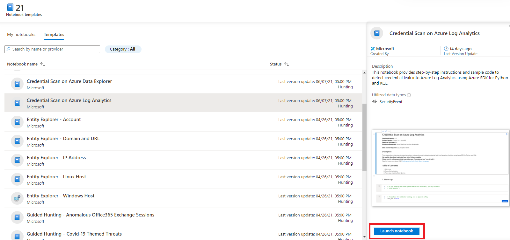

1. Under **AzureML Workspace**, select **Create New**.

    > [!div class="mx-imgBorder"]
    > 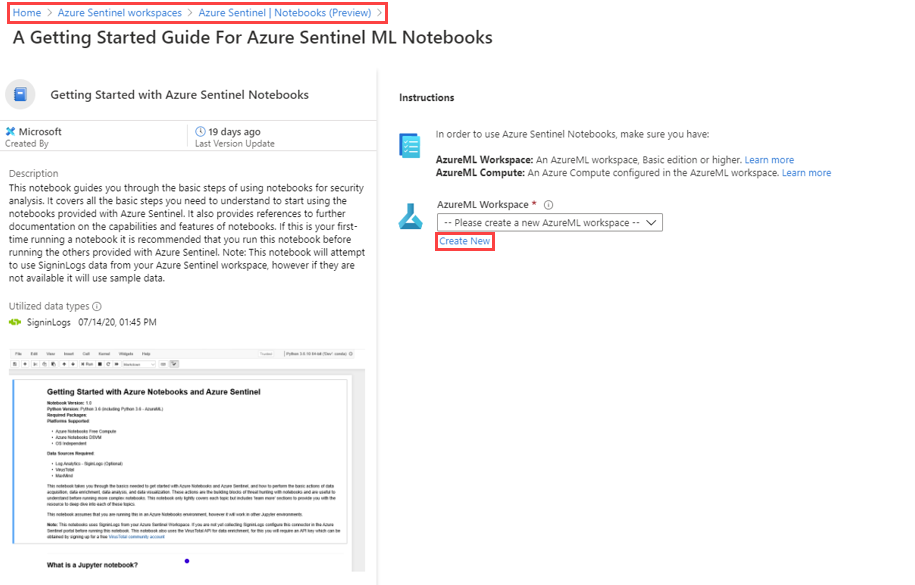

1. On the **Machine Learning** page, provide the following information, and then select **Review + create**.

    |Field|Description|
    |--|--|
    |Subscription|Select the Azure subscription that you want to use.|
    |Resource group|Use an existing resource group in your subscription or enter a name to create a new resource group. A resource group holds related resources for an Azure solution. In this example, we use **AzureMLRG**.|
    |Workspace name|Enter a unique name that identifies your workspace. In this example, we use **testworkspace1**. Names must be unique across the resource group. Use a name that's easy to recall and to differentiate from workspaces created by others.|
    |Region|Select the location closest to your users and the data resources to create your workspace.|
    |Workspace edition|Select **Basic** as the workspace type in this example. The workspace type (Basic & Enterprise) determines the features to which you'll have access and pricing.|

    > [!div class="mx-imgBorder"]
    > 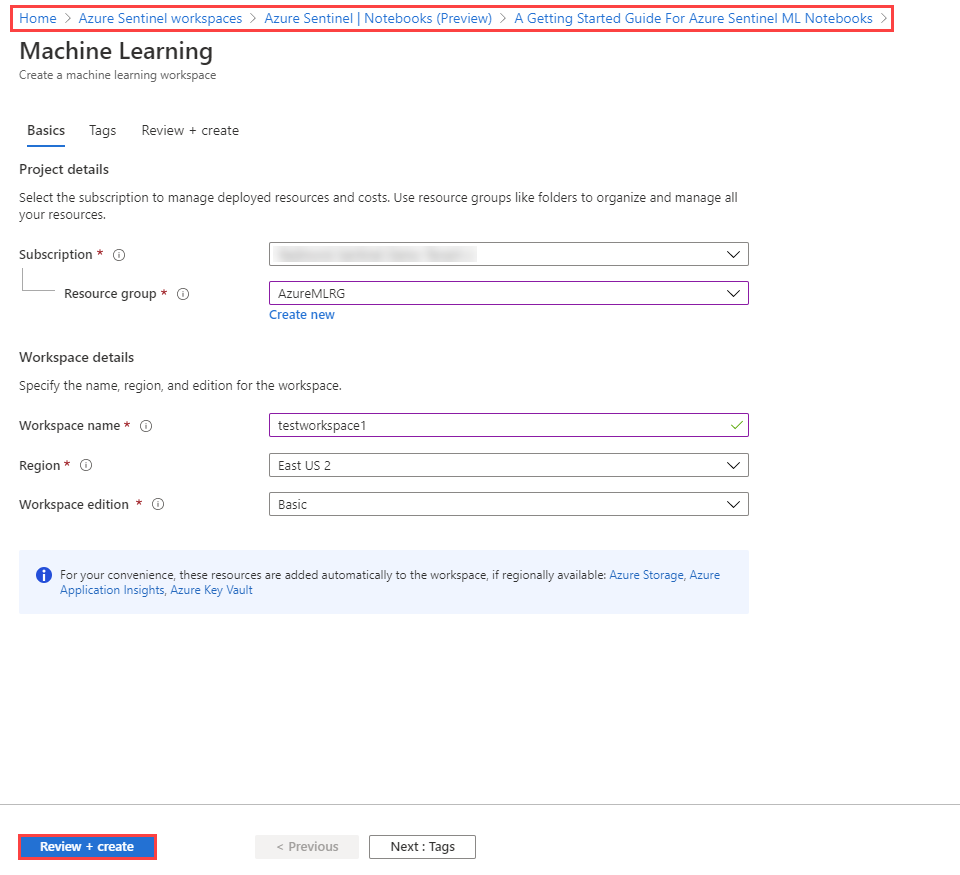

1. Review the information, verify that it is correct, and then select **Create** to start the deployment of your workspace.

    > [!div class="mx-imgBorder"]
    > 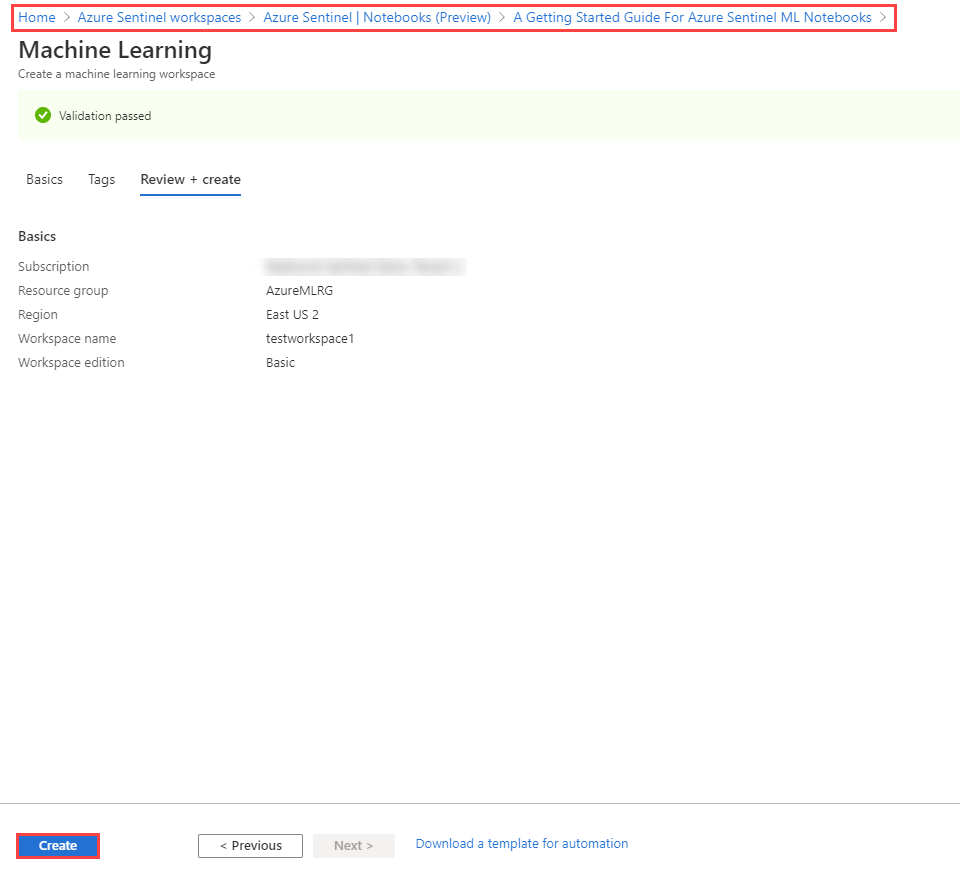

    It can take several minutes to create your workspace in the cloud during which time the **Overview** page displays the current deployment status.

    > [!div class="mx-imgBorder"]
    > 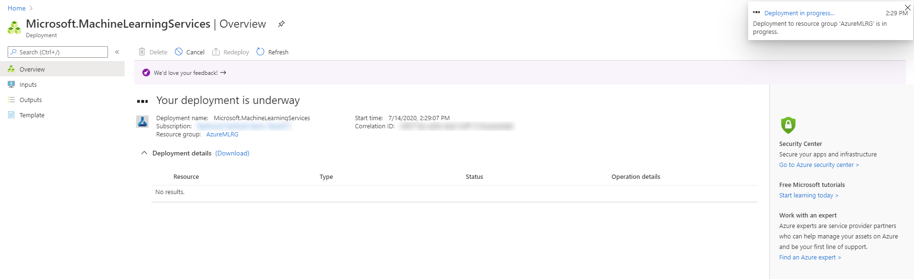

Once your deployment is complete, you can launch notebooks in your new Azure ML workspace.

> [!div class="mx-imgBorder"]
> 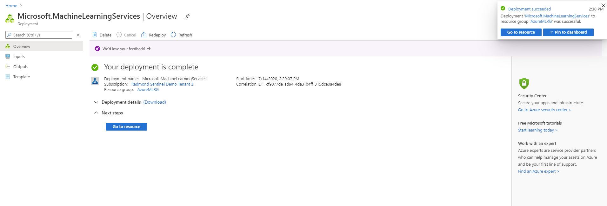

## Launch a notebook using your Azure ML workspace

1. From the Azure portal, navigate to **Azure Sentinel** > **Threat management** > **Notebooks**, where you can see notebooks that Azure Sentinel provides.

    > [!TIP]
    > Select **Guides & Feedback** to open a pane with additional help and guidance on notebooks.
    > 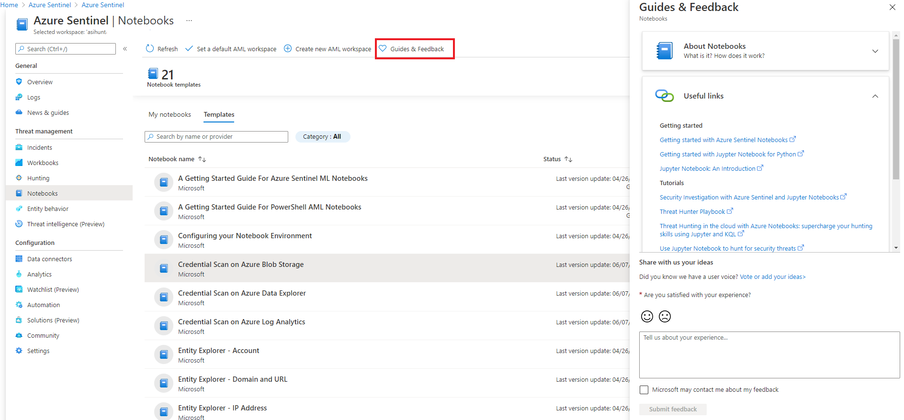

1. Select individual notebooks to view their descriptions, required data types, and data sources.

    > [!div class="mx-imgBorder"]
    > 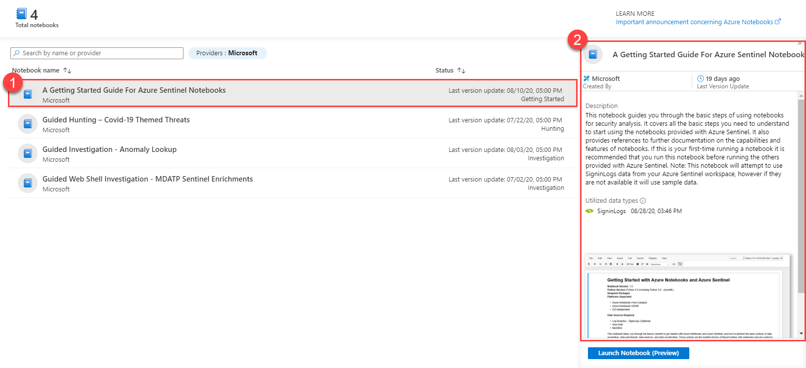

1. Select the notebook you want to use, and then select **Launch Notebook** to clone and configure the notebook into a new Azure Notebooks project that connects to your Azure Sentinel workspace. When the process is complete, the notebook opens within Azure Notebooks for you to run.

    > [!div class="mx-imgBorder"]
    > 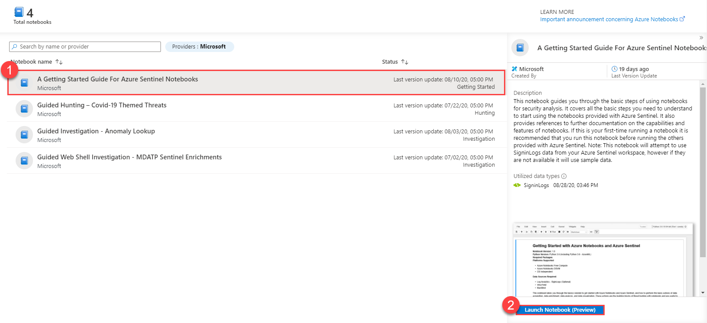

1. Under AzureML Workspace, select your Azure ML workspace, and then select **Launch**.

    > [!div class="mx-imgBorder"]
    > 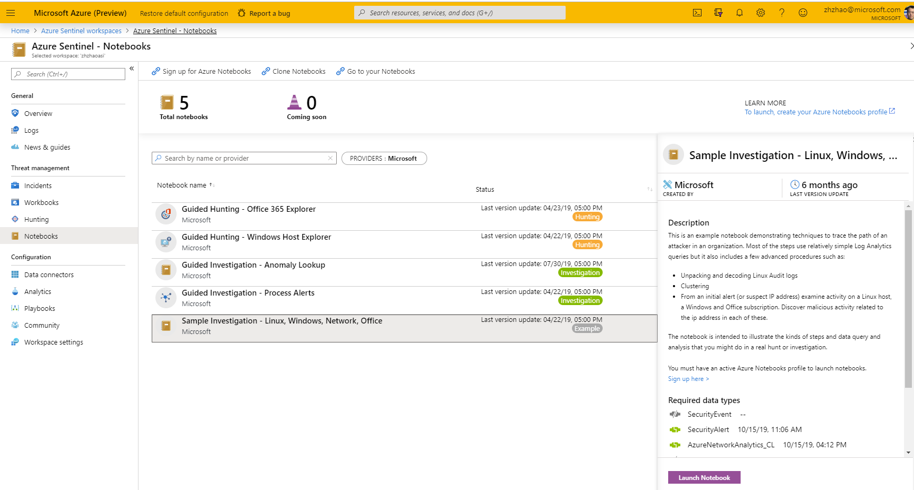

1. Select a compute instance. If you don't have a compute instance, do the following:
    1. Select the plus sign (+) to start the **New compute instance** wizard.

        > [!div class="mx-imgBorder"]
        > 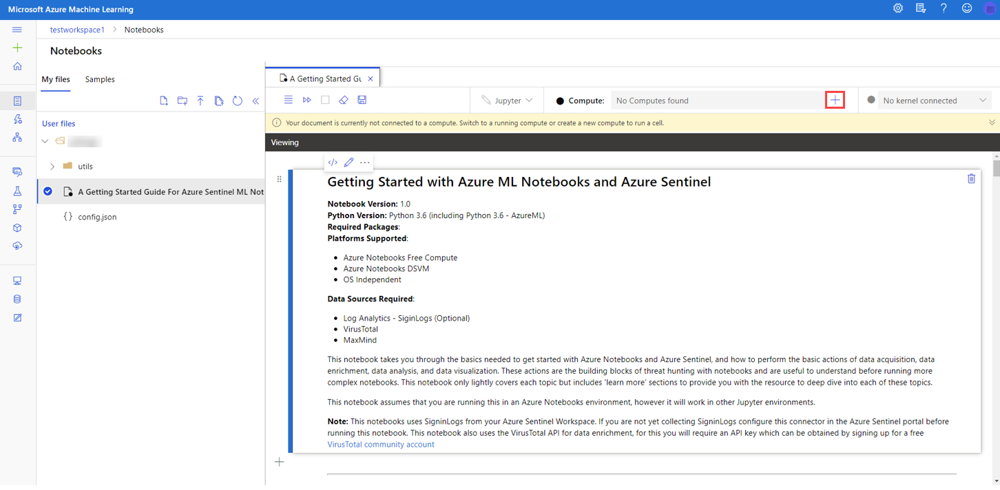

    1. On the **New compute instance** page, provide the required information, and then select **Create**.

        > [!div class="mx-imgBorder"]
        > 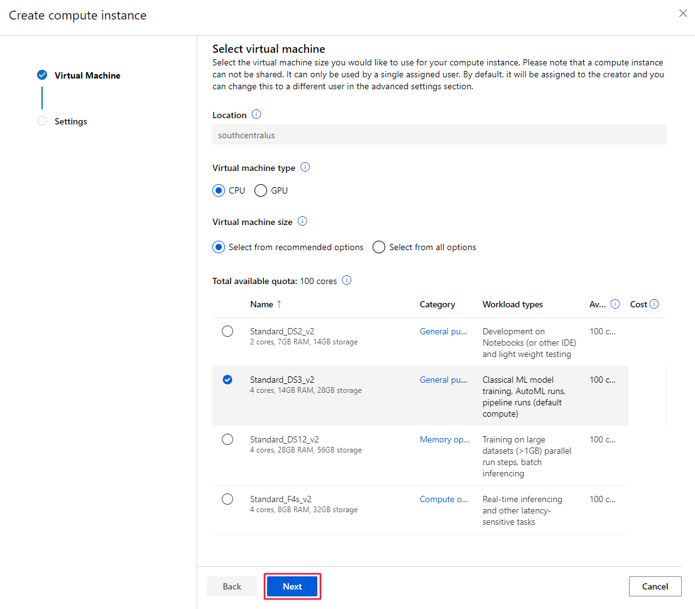

1. Once your notebook server is created, within each cell select the run icon to execute code in the notebooks.

    > [!div class="mx-imgBorder"]
    > 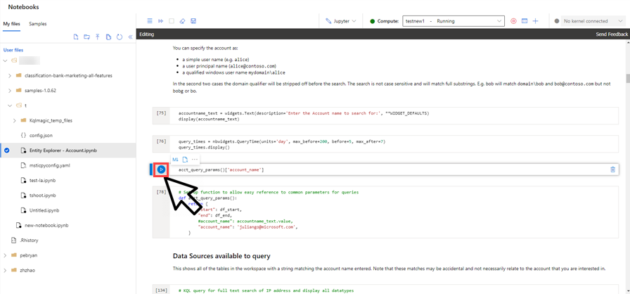

Recommendations:

- For a quick introduction to querying data in Azure Sentinel, look at the [Getting Started with Azure ML Notebooks and Azure Sentinel](https://github.com/Azure/Azure-Sentinel-Notebooks/blob/master/A%20Getting%20Started%20Guide%20For%20Azure%20Sentinel%20ML%20Notebooks.ipynb) guide.

- You'll find additional sample notebooks in the [**Sample-Notebooks**](https://github.com/Azure/Azure-Sentinel-Notebooks/tree/master/Sample-Notebooks) GitHub subfolder. These sample notebooks have been saved with data, so that it's easier to see the intended output. We recommend viewing these notebooks in [nbviewer](https://nbviewer.jupyter.org/).

- The [**HowTos**](https://github.com/Azure/Azure-Sentinel-Notebooks/tree/master/HowTos) GitHub subfolder contains notebooks describing, for example: Setting you default Python version, configuring a DSVM, creating Azure Sentinel bookmarks from a notebook, and other subjects.

The notebooks provided are intended as both useful tools and as illustrations and code samples that you can use in the development of your own notebooks.

We welcome feedback, whether suggestions, requests for features, contributed Notebooks, bug reports or improvements and additions to existing notebooks. Go to the [Azure Sentinel Community GitHub](https://github.com/Azure/Azure-Sentinel) to create an issue or fork and upload a contribution.

## Next steps

In this article, you learned how to get started using Jupyter Notebook in Azure Sentinel. To learn more about Azure Sentinel, see the following articles:

- [Proactively hunt for threats](hunting.md)
- [Use bookmarks to save interesting information while hunting](bookmarks.md)
