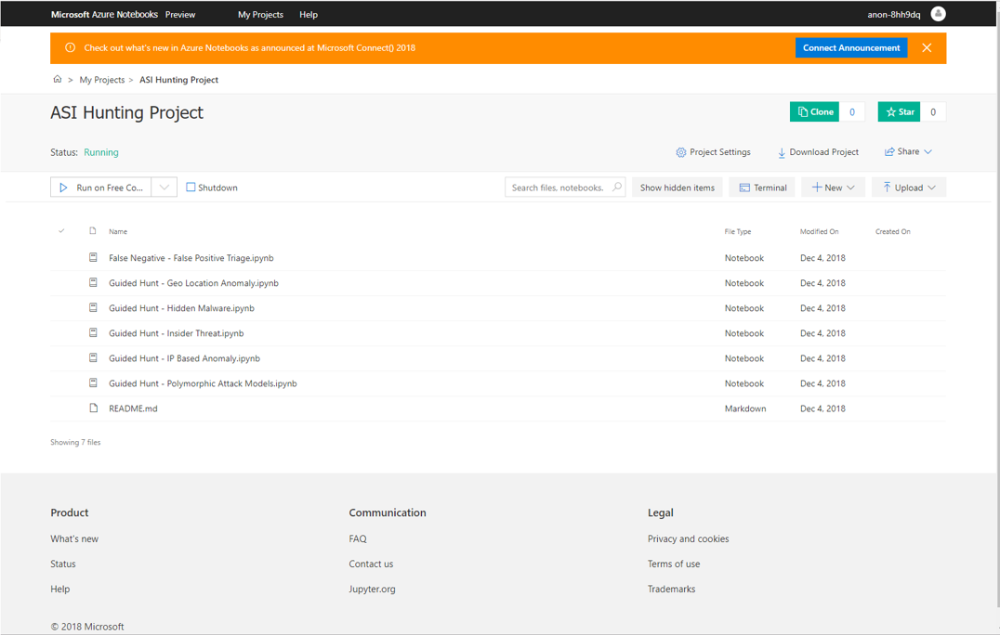
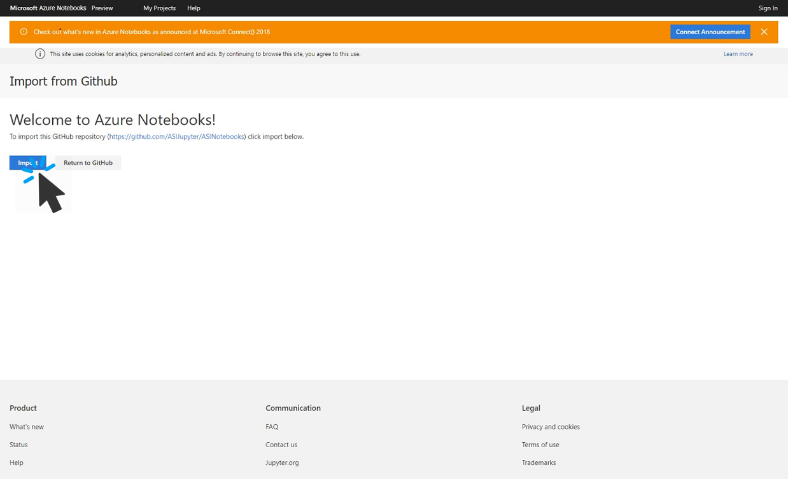
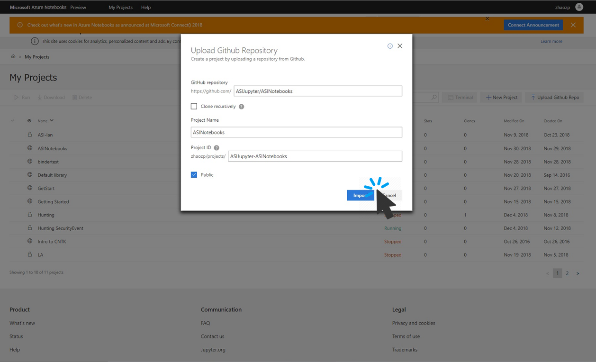
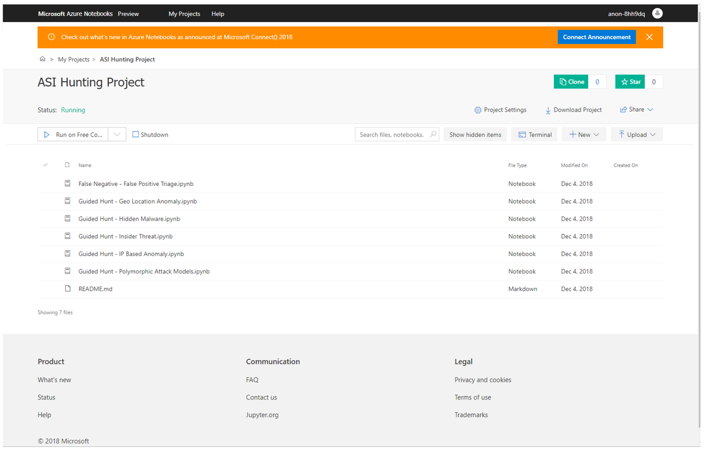

# Use notebooks to hunt for anomalies

> [!IMPORTANT]
> Azure Sentinel is currently in public preview.
> This preview version is provided without a service level agreement, and it's not recommended for production workloads. Certain features might not be supported or might have constrained capabilities. 
> For more information, see [Supplemental Terms of Use for Microsoft Azure Previews](https://azure.microsoft.com/support/legal/preview-supplemental-terms/).

Azure Sentinel leverages the power of Jupyter interactive notebooks to provide insight and actions to investigate or hunt for security anomalies within your environment. Azure Sentinel comes preloaded with notebooks that were developed by Microsoft's security analysts. Each notebook is purpose built with a self-contained workflow for a specific use case. Visualizations are included in each notebook for faster data exploration and threat hunting.​ You customize the built-in notebooks to meet your needs, create new notebooks from scratch or import notebooks from the Azure Sentinel' GitHub community. Jupyter notebooks are imported as a project in the Azure Notebooks page – this enables user to access all of their Azure Sentinel notebooks in one place. Notebooks can be run with a click of a button or can be configured by user to match their environment.

The fully integrated experience enables notebooks to run on Cloud Compute and Storage with no underlying maintenance overhead. The ability to leverage the existing Jupyter Notebooks ecosystem enables you to crowd source models, without sharing customer data. 

Each notebook is hosted on the Azure Notebooks (currently in preview), an interactive development environment in the Azure cloud. Notebooks are always accessible, always available from any browser, anywhere in the world.  The Azure Sentinel' built-in notebooks for investigation and hunting are cloned into a project that belongs to you, and which you can modify and tailor to your environment. Some of the most popular built-in notebooks are:

- **Alert investigation and hunting**: This interactive notebook enables quick triage of different classes of alerts by retrieving related activity and enriching the alert with associated activity and data from which the alert was generated.​

- **Endpoint host guided hunting**: Allows you to hunt for signs of a security breach by drilling down into the security relevant activities associated with an endpoint host.  ​

- **Office sign in guided hunting**: Enables you to hunt for suspicious sign-ins by visualizing geographic locations of suspect logs as well as displaying unusual sign-in patterns derived from  Office 365 data.​

## Run a notebook
In the following example, we run the built-in notebook to search for deep diving into location anomalies to see if anyone in an unexpected location is doing something on your network.

1. In the Azure Sentinel portal, click **Notebooks** and then select any of the built-in notebooks.
  
   

3. Click **Import** to clone the GitHub repo into your Azure Notebooks project.
   
4. Each notebook walks you through the steps for performing a hunt or investigation. Models, libraries, and other dependencies and configuration for connectivity to Azure Sentinel is automatically imported to enable one-click execution. All code and libraries necessary to run a notebook are pre-loaded. You can immediately begin running a notebook against your Log Analytics workspace with no configuration.

   

5. Explore, modify and run all the sample notebooks provided. These can be used as building blocks for many different scenarios.

   

## Next steps
In this article, you learned how to run a hunting investigation using notebooks in Azure Sentinel. To learn more about Azure Sentinel, see the following articles:

- [Proactively hunt for threats](hunting.md)
- [Use bookmarks to save interesting information while hunting](bookmarks.md)