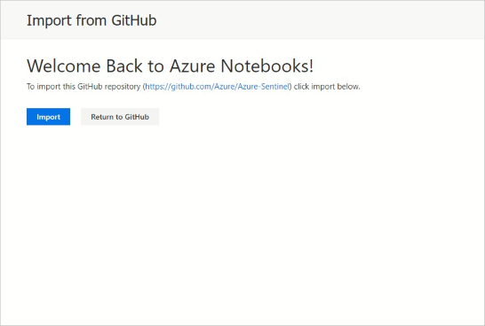

# Use Jupyter Notebooks to hunt for Security Threats

> [!IMPORTANT]
> Azure Sentinel is currently in public preview.
> This preview version is provided without a service level agreement, and it's not recommended for production workloads. Certain features might not be supported or might have constrained capabilities. 
> For more information, see [Supplemental Terms of Use for Microsoft Azure Previews](https://azure.microsoft.com/support/legal/preview-supplemental-terms/).

Azure Sentinel brings the power of [Jupyter](https://jupyter.org/) notebooks and Python to security investigation and hunting within your environment. Several example notebooks, developed by Microsoft security analysts, are included and make use of Azure Sentinel's high-performance REST API to access all of the data in your workspace. Using [Keyword Query Language](https://docs.microsoft.com/en-us/sharepoint/dev/general-development/keyword-query-language-kql-syntax-reference) you can query, import and process your security logs from Jupyter.

Many of the notebook supplied are built with a workflow for a specific use case, while others are meant as samples to illustrate techniques and features. The notebooks make use of data tools and a variety of visualizations for data exploration and threat hunting.​ You customize the built-in notebooks to meet your needs, create new notebooks from scratch or import notebooks from the Azure Sentinel' GitHub community. From the Azure Sentinel portal you can create an [Azure Notebooks](https://notebooks.azure.com/) project populated with the hunting and investigation notebooks. This allows you to access and all of your notebooks in one place and edited and run them with a click of a button.

By default, the notebooks run on Azure Free Cloud Compute and Storage. You can also opt to run your notebooks on more powerful compute resources such as [Data Science Virtual Machines](https://azure.microsoft.com/en-us/services/virtual-machines/data-science-virtual-machines/) (DSVM). In either case, you have a flexible, browser-based development and execution environment, which is accessible from anywhere. You can use an existing Azure account or create a new one: notebooks in your account are kept private unless you choose to share them. You can also run any of the notebooks locally if you have a Python environment on your computer.

The notebooks make use of many popular Python libraries such as pandas, matplotlib, bokeh and others. The vibrant Python ecosystem means that you have access to a vast array of visualizations, data processing and machine learning capabilities within your notebooks. Microsoft has also released a set of open source Jupyter security tools (currently in preview) designed to make building and using notebooks for hunting and investigation easier and more productive - read more about this at the [msticpy](https://github.com/Microsoft/msticpy/) GitHub repository. The **msticpy** package is used extensively in the included notebooks.

Over the coming months more notebooks will be added to the core set. The intial set include:

- **Guided investigation - Process Alerts**: This notebook allows you to quickly triage alerts by analyzing activity on the affected host(s).​

- **Guided hunting - Windows host explorer**: Can be used in the context of hunting or investigation, allow you explore logon activity, processe executions, network activity and other events on a host.  ​

- **Guided hunting - Office365-Exploring**: Enables you to hunt for suspicious Office 365 activity by analyzing and visualizing auditing logs from multiple O365 data sets.​

## Run a notebook
In the following example, we create an Azure Notebooks project from the Azure Sentinel portal. This will populate the project with notebooks. When using these notebooks, it is a good idea to make a copy of the notebook and work on the copy. This means that you can easily update the notebook to a newer version without overwriting any of your data.

1. In the Azure Sentinel portal, click **Notebooks** in the navigation menu. To create a new Azure Notebooks project click **Clone Azure Sentinel Notebooks** or to open your existing notebooks projects click **Go to your Notebooks**.
  
   

2. If you chose **Clone Azure Sentinel Notebooks** in the previous step the following dialog will appear. Click **Import** to clone the GitHub repo into your Azure Notebooks project. If you do not have an existing Azure Notebook you will be prompted to login and one will be created.
   
3. If you are creating a new project from GitHub you will be prompted to name the project. You can keep the default name or type in a new one. You do not need to check the **Clone Recursively** option - this refers to linked GitHub repos. Clicking on **Import** starts cloning the GitHub content; this can take a few minutes to complete.
   
4. Open the **Notebooks** folder to see the notebooks. Each notebook walks you through the steps for performing a hunt or investigation. Libraries and other dependencies needed by the notebook can be installed from the Notebook itself or via a simple configuration procedure. Configuration that ties your notebook project back to your Azure Sentinel subscription is automatically provisioned in the preceding steps. Your notebooks are ready to run against your Azure Sentinel Log Analytics workspace.

   

5. Open a Notebook. Free Compute is selected by default to run the notebooks (highlighted). If you have configured a DSVM to use (see above), select this and authenticate before opening the first notebook. Click on one to open it. 

   

6. Selecting the Python version. When you first open a notebook it may prompt you to select a kernel version. If not, select the kernel to use as follows. Python 3.6 or later should be showing as the selected kernel in the top right of the notebook screen. 

   
   
For a quick introduction to querying data in Azure Sentinel, look at the **GetStarted** notebook in the main Notebooks folder. Additional sample notebooks can be found in the **Sample-Notebooks** subfolder. These notebooks have been saved with sample data, so that it is easier to see the intended output (we recommend viewing these in [nbviewer](https://nbviewer.jupyter.org/)). The **HowTos** folder contains notebooks describing, for example, how to set up your Azure Notebooks default Python environment, how to configure a DSVM, how to create and read Azure Sentinel bookmarks and other topics.

These notebooks are intended as both useful tools and as illustrations and code samples that you can use in the development of your own notebooks.

We welcome feedback, whether suggestions, requests for features, contributed Notebooks, bug reports or improvements and additions to existing notebooks. Go to the [Azure Sentinel Community GitHub](https://github.com/Azure/Azure-Sentinel) to create an issue or fork and upload a contribution.

## Next steps
In this article, you learned how to get started using Jupyter notebooks in Azure Sentinel. To learn more about Azure Sentinel, see the following articles:

- [Proactively hunt for threats](hunting.md)
- [Use bookmarks to save interesting information while hunting](bookmarks.md)
