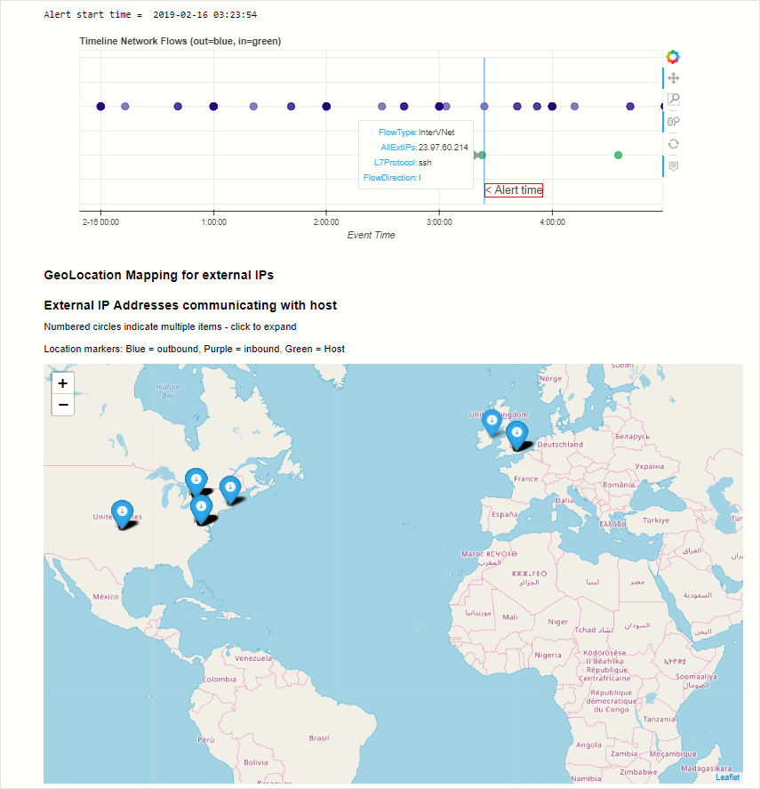

# Use Jupyter Notebooks to hunt for Security Threats

> [!IMPORTANT]
> Azure Sentinel is currently in public preview.
> This preview version is provided without a service level agreement, and it's not recommended for production workloads. Certain features might not be supported or might have constrained capabilities.
> For more information, see [Supplemental Terms of Use for Microsoft Azure Previews](https://azure.microsoft.com/support/legal/preview-supplemental-terms/).

Azure Sentinel brings the power of [Jupyter](https://jupyter.org/) notebooks and Python to security investigation and hunting. Several example notebooks, developed by Microsoft security analysts, are included. These make use of Azure Sentinel's high-performance REST API to access all the data in your workspace. Using [Kusto Query Language](https://kusto.azurewebsites.net/docs/query/index.html) you can query, import and process your security logs from Jupyter.

Many of the notebooks supplied are built for a specific use case, while others are meant as samples to illustrate techniques and features. The notebooks use data tools and visualizations that make data exploration more streamlined and productive.​ You copy and adapt the supplied notebooks for your workflow or create new notebooks from scratch. You can also import notebooks from the Azure Sentinel' GitHub community. The Azure Sentinel portal lets you create an [Azure Notebooks](https://notebooks.azure.com/) project populated with the hunting and investigation notebooks. From here, they can be edited and run them with a click of a button.

Notebooks have both a visual element (in your browser) and a *kernel* that parses and executes the code in the notebook cells. By default, this kernel runs on Azure Free Cloud Compute and Storage. You can also opt to run your notebooks on more powerful compute resources such as [Data Science Virtual Machines](https://azure.microsoft.com/en-us/services/virtual-machines/data-science-virtual-machines/) (DSVM) - this is something that you might want if you use complex machine learning models or visualizations with lots of data. You can also run any of the notebooks locally if you have a Python environment and Jupyter on your computer.

The browser-based development and execution environment means you can run your notebooks from anywhere. Azure Notebooks requires an Azure account (you can create a new one during the sign-up process). Notebooks in your account are kept private unless you choose to share them.

The notebooks use many popular Python libraries such as pandas, matplotlib, bokeh, and others. There are a huge number of other Python packages for you to choose from, covering areas such as:

- visualizations and graphics
- data processing and analysis
- statistics and numerical computing
- machine learning and deep learning

Microsoft has also released a package of open-source Jupyter security tools named [msticpy](https://github.com/Microsoft/msticpy/). We've built the tools specifically to help with creating notebooks for hunting and investigation. *msticpy* is used in many of the included notebooks and we're actively working on new features and improvements.

The [Azure Sentinel Community GitHub repository](https://github.com/Azure/Azure-Sentinel) will be the location for any future Azure Sentinel notebooks authored by Microsoft or contributed from the community. The initial notebooks include:

- **Guided investigation - Process Alerts**: Allows you to quickly triage alerts by analyzing activity on the affected host(s).​

- **Guided hunting - Windows host explorer**: Allows you to explore account activity, process executions, network activity, and other events on a host.  ​

- **Guided hunting - Office365-Exploring**: Hunt for suspicious Office 365 activity in multiple O365 data sets.​

## Run a notebook

In the following example, we create an Azure Notebooks project from the Azure Sentinel portal and populate the project with notebooks. Before you use these notebooks, it's a good idea to make a copy of the notebook and work on the copy. THis means you can safely update the notebook version without overwriting any of your data.

1. In the Azure Sentinel portal, click **Notebooks** in the navigation menu. To create a new Azure Notebooks project, click **Clone Azure Sentinel Notebooks** or to open your existing notebooks projects click **Go to your Notebooks**.
  
   

2. If you chose **Clone Azure Sentinel Notebooks** in the previous step, the following dialog will appear. Click **Import** to clone the GitHub repo into your Azure Notebooks project. If you don't have an existing Azure Notebooks account, you'll be prompted to create one and sign in.

   

3. When creating a new project, you need to name the project - use the default name or type in a new one. Don't check the **Clone Recursively** option - this refers to linked GitHub repos. Clicking on **Import** starts cloning the GitHub content, which can take a few minutes to complete.

   

4. Open the **Notebooks** folder to see the notebooks. Each notebook walks you through the steps for carrying out a hunt or investigation. Libraries and other dependencies needed by the notebook can be installed from the Notebook itself or via a simple configuration procedure. Configuration that ties your notebook project back to your Azure Sentinel subscription is automatically provisioned in the preceding steps. Your notebooks are ready to run against your Azure Sentinel Log Analytics workspace.

   

5. Open a Notebook. Free Compute is selected by default to run the notebooks (highlighted). If you've configured a DSVM to use (see above), select this and authenticate before opening the first notebook. Click on one to open it.

   

6. Selecting the Python version. When you first open a notebook, it may prompt you to select a kernel version. If not, select the kernel to use as follows. Python 3.6 or later should be the selected kernel (in the top right of the notebook window).

   

For a quick introduction to querying data in Azure Sentinel, look at the [GetStarted](https://github.com/Azure/Azure-Sentinel/blob/master/Notebooks/Get%20Started.ipynb) notebook in the main Notebooks folder. Additional sample notebooks can be found in the **Sample-Notebooks** subfolder. The sample notebooks have been saved with data, so that it's easier to see the intended output (we recommend viewing them in [nbviewer](https://nbviewer.jupyter.org/)). The **HowTos** folder contains notebooks describing, for example: setting you default Python version, configuring a DSVM, creating Azure Sentinel bookmarks from a notebook, and other subjects.

These notebooks are intended as both useful tools and as illustrations and code samples that you can use in the development of your own notebooks.

We welcome feedback, whether suggestions, requests for features, contributed Notebooks, bug reports or improvements and additions to existing notebooks. Go to the [Azure Sentinel Community GitHub](https://github.com/Azure/Azure-Sentinel) to create an issue or fork and upload a contribution.

## Next steps

In this article, you learned how to get started using Jupyter notebooks in Azure Sentinel. To learn more about Azure Sentinel, see the following articles:

- [Proactively hunt for threats](hunting.md)
- [Use bookmarks to save interesting information while hunting](bookmarks.md)