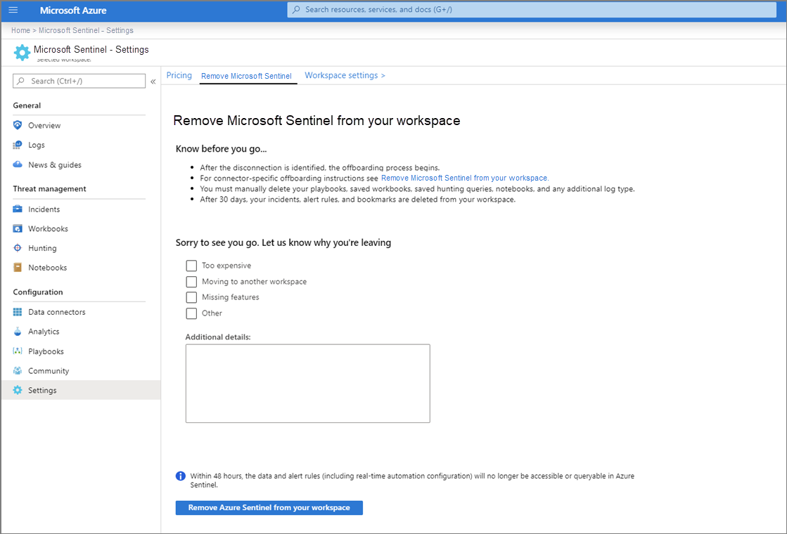

# Remove Microsoft Sentinel from your workspace

[!INCLUDE [Banner for top of topics](./includes/banner.md)]

If you no longer want to use Microsoft Sentinel, this article explains how to remove it from your workspace.

## How to remove Microsoft Sentinel

Follow this process to remove Microsoft Sentinel from your workspace:

1. Go to **Microsoft Sentinel**, followed by **Settings**, and select the tab **Remove Microsoft Sentinel**.

1. Before you remove Microsoft Sentinel, please use the checkboxes to let us know why you're removing it.

1. Select **Remove Microsoft Sentinel from your workspace**.
    
    

## What happens behind the scenes?

When you remove the solution, Microsoft Sentinel takes up to 48 hours to complete the first phase of the deletion process.

After the disconnection is identified, the offboarding process begins.

**The configuration of these connectors is removed:**
-   Office 365

-   AWS

-   Microsoft services security alerts: Microsoft Defender for Identity (*formerly Azure ATP*), Microsoft Defender for Cloud Apps including Cloud Discovery Shadow IT reporting, Azure AD Identity Protection, Microsoft Defender for Endpoint (*formerly Microsoft Defender ATP*), security alerts from Microsoft Defender for Cloud

-   Threat Intelligence

-   Common security logs (including CEF-based logs, Barracuda, and Syslog) (If you get security alerts from Microsoft Defender for Cloud, these logs will continue to be collected.)

-   Windows Security Events (If you get security alerts from Microsoft Defender for Cloud, these logs will continue to be collected.)

Within the first 48 hours, the data and analytic rules (including real-time automation configuration) will no longer be accessible or queryable in Microsoft Sentinel.

**After 30 days these resources are removed:**

-   Incidents (including investigation metadata)

-   Analytic rules

-   Bookmarks

Your playbooks, saved workbooks, saved hunting queries, and notebooks are not removed. **Some may break due to the removed data. You can remove those manually.**

After you remove the service, there is a grace period of 30 days during which you can re-enable the solution and your data and analytic rules will be restored but the configured connectors that were disconnected must be reconnected.

> [!NOTE]
> If you remove the solution, your subscription will continue to be registered with the Microsoft Sentinel resource provider. **You can remove it manually.**

## Next steps
In this document, you learned how to remove the Microsoft Sentinel service. If you change your mind and want to install it again:
- Get started [on-boarding Microsoft Sentinel](quickstart-onboard.md).
