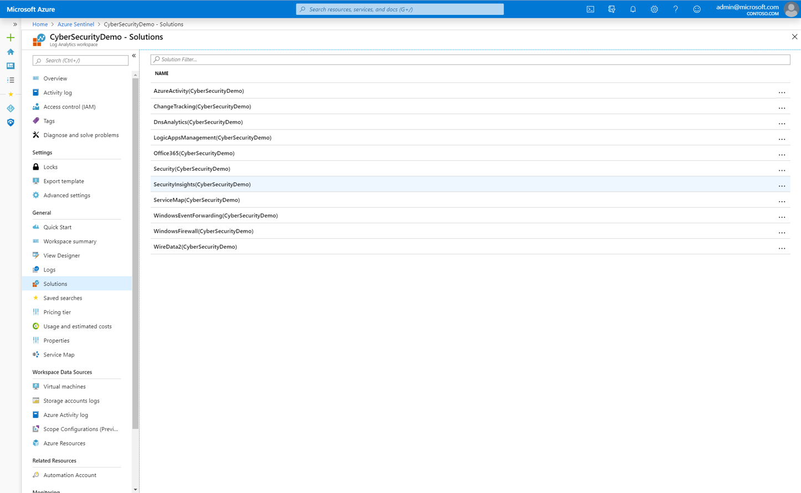

# Remove Azure Sentinel from your tenant

If you no longer want to use the Azure Sentinel, this article explains how to remove it from your tenant.

## How to delete Azure Sentinel

In the background, when you install Azure Sentinel, the **SecurityInsights** solution is installed on your selected workspace. So the first thing you need to do is remove the **SecurityInsights** solution.

1.  Go to **Azure Sentinel**, followed by **Configuration**, followed by **Workspace settings**, and then **Solutions**.

2.  Select `SecurityInsights` and click on it.

    

3.  At the top of the page select **Delete**.

    > [!IMPORTANT]
    > If you delete the workspace, the workspace and Azure Sentinel are removed from your tenant in Azure Monitor.

    

## What happens behind the scenes?

When you delete the solution, Azure Sentinel takes up to 48 hours to complete the first phase of the deletion process.

After the disconnection is identified, the offboarding process begins.

**The configuration of these connectors is deleted:**
-   Office 365

-   AWS

-   Microsoft services security alerts (Azure ATP, Microsoft Cloud App Security including Cloud Discovery Shadow IT reporting, Azure AD Identity Protection, Microsoft Defender ATP, Azure Security Center)

-   Threat Intelligence

-   Common security logs (including CEF-based logs, Barracuda, and Syslog) (If you have Azure Security Center, these logs will continue to be collected.)

-   Windows Security Events (If you have Azure Security Center, these logs will continue to be collected.)

Within the first 48 hours, the data and alert rules (including real-time automation configuration) will no longer be accessible or queryable in Azure Sentinel.

**After 30 days these resources are deleted:**

-   Incidents (including investigation metadata)

-   Alert rules

-   Bookmarks

Your playbooks, saved workbooks, saved hunting queries, and notebooks are not deleted. **Some may break due to the removed data. You can remove those manually.**

After you remove the service, there is a grace period of 30 days during which you can re-enable the solution and your data and alert rules will be restored but the configured connectors that were disconnected must be reconnected.

> [!NOTE]
> If you remove the solution, your subscription will continue to be registered with the Azure Sentinel resource provider. **You can remove it manually.**

## Next steps
In this document, you learned how to remove the Azure Sentinel service. If you change your mind and want to install it again:
- Get started [on-boarding Azure Sentinel](quickstart-onboard.md).

