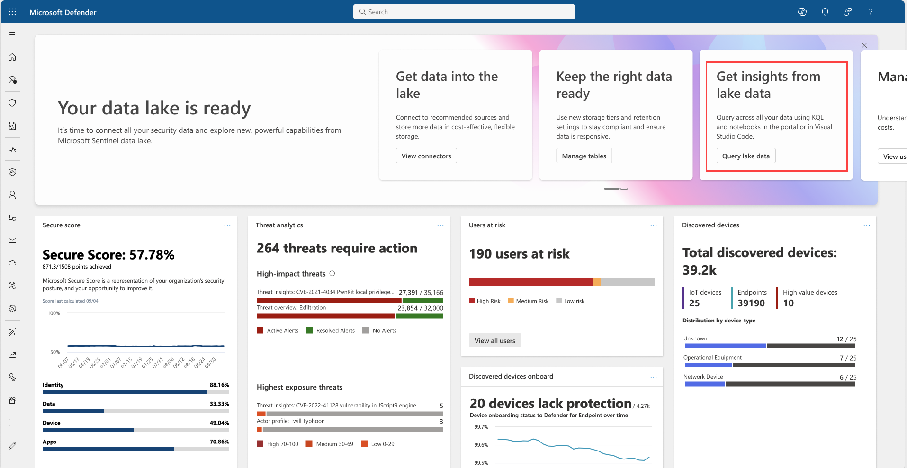
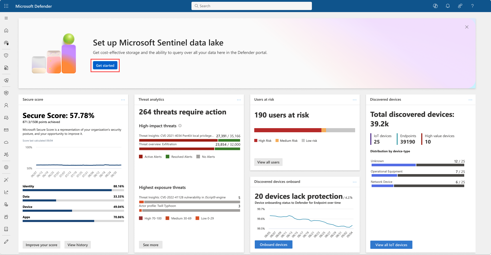
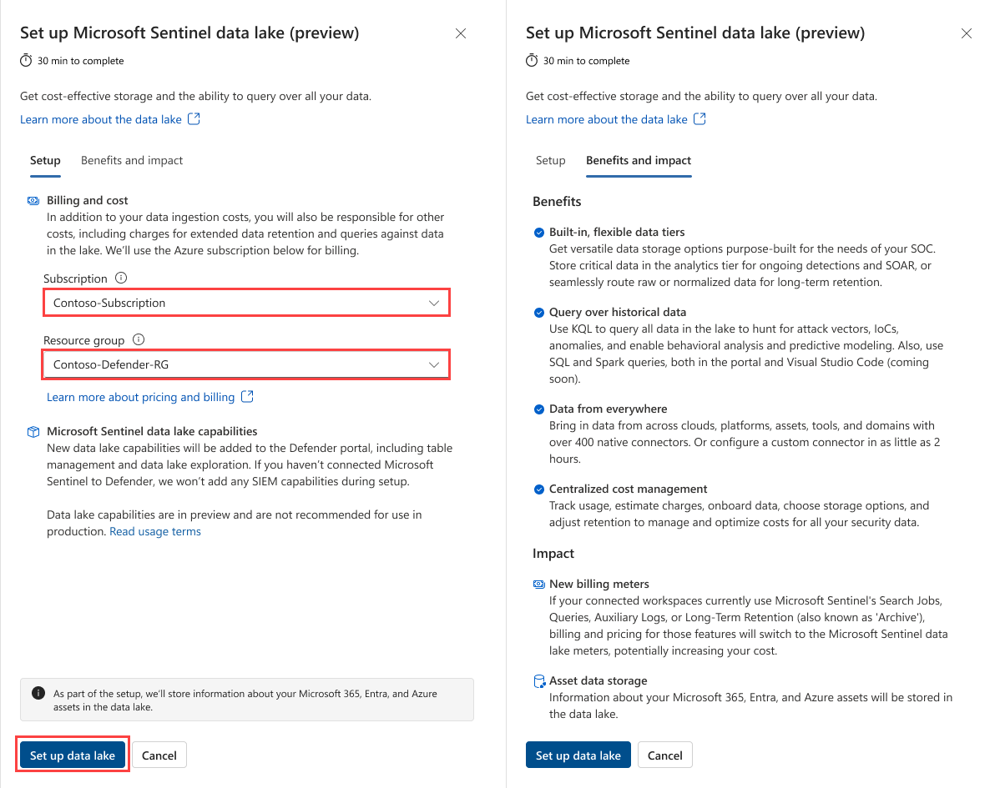
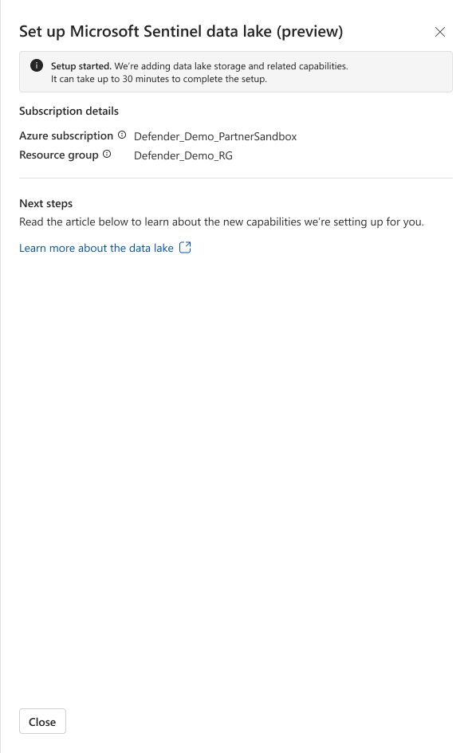
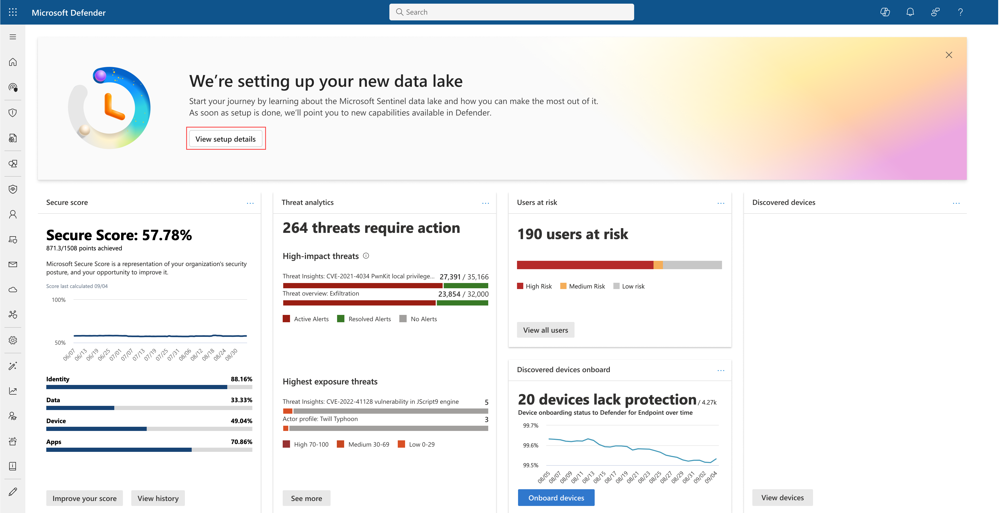
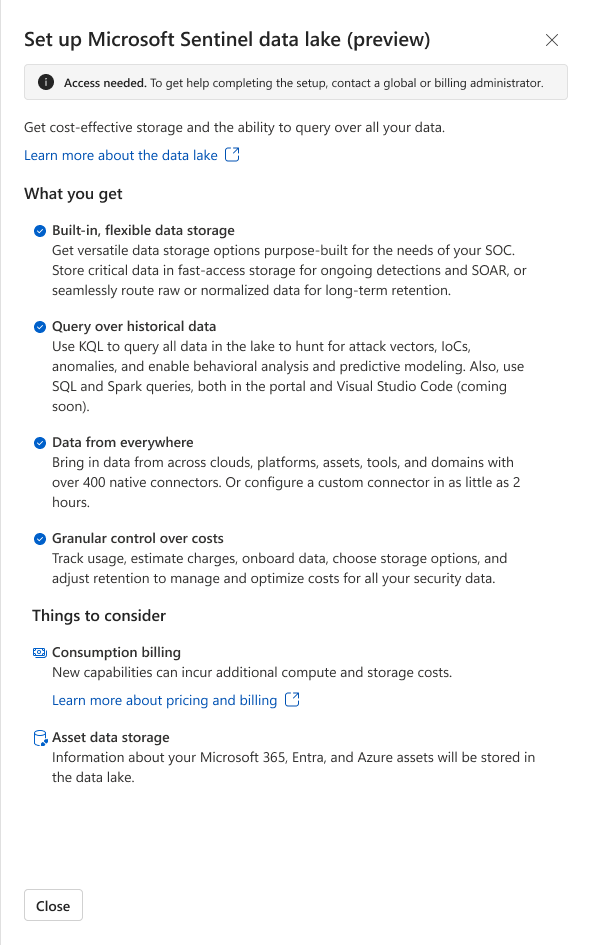
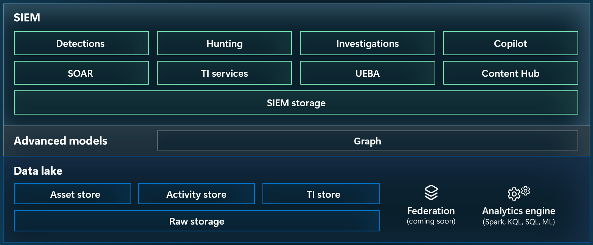
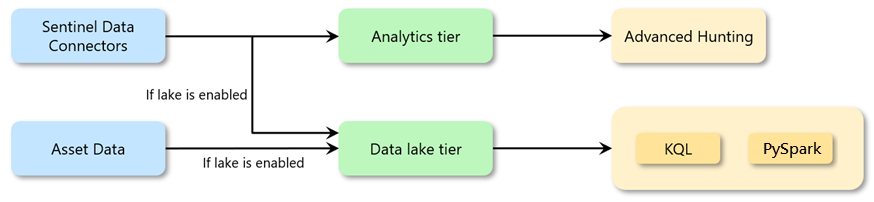
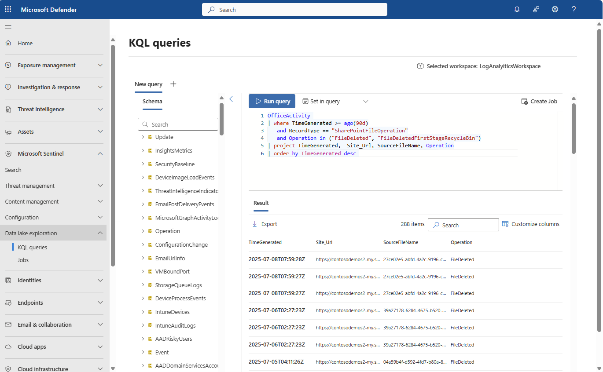

# Onboard Microsoft Sentinel Data Lake

Microsoft Sentinel Data Lake provides cost-effective, long-term storage for security logs and supports data analysis through [Microsoft Defender XDR](/microsoft-365/security/defender). With Data Lake, security teams can store high-volume, low-fidelity logs (such as firewall or DNS data, asset inventories, and historical records) for up to 12 years, while continuing to use the analytics tier for advanced hunting and real-time alerting.

This article explains how to enable Microsoft Sentinel Data Lake, configure roles and permissions, and manage table tiers and retention policies in the Microsoft Defender portal.

---

## Prerequisites and considerations

Before onboarding Microsoft Sentinel Data Lake, ensure the following:

- At least one active Azure subscription and a resource group for Data Lake billing.  
- Subscription [Owner](/azure/role-based-access-control/built-in-roles#owner) role required.  
- Global or Security Administrator role in Microsoft Entra ID.  
- Microsoft Sentinel primary workspace **must be integrated with Microsoft Defender XDR**.  
- Microsoft Sentinel workspace **must be in the same region as your tenant’s home region**.  
- Read privileges required in the primary and secondary workspaces to attach them to the Data Lake.  

**Considerations:**

- Once enabled, data in the Microsoft Sentinel analytics tier is also available in the Data Lake tier without extra charge.
  
 

- Data ingestion takes **90–120 minutes** after enabling or switching ingestion tiers.  
- Tables in the Auxiliary tier are migrated to Data Lake and no longer available in Advanced Hunting.  
- Tables in the Basic tier aren’t supported by Data Lake.  
- For the XDR tier, retention is limited to 30 days, with no option for direct Data Lake storage.  
- KQL jobs can be scheduled to promote results from the Data Lake tier to the Analytics tier.  

---

## Microsoft Sentinel Data Lake permissions

| Role Type            | Role Name                                | Purpose                                                                 |
|----------------------|------------------------------------------|-------------------------------------------------------------------------|
| Microsoft Entra ID   | Security Reader                          | Read access to all Data Lake workspaces and run KQL queries              |
| Microsoft Entra ID   | Security Operator                        | Write access to Data Lake workspaces and manage jobs                     |
| Azure built-in roles | Microsoft Sentinel Contributor, Microsoft Sentinel Reader | Access to specific Sentinel workspaces |

---

## Onboard Microsoft Sentinel Data Lake

To enable Microsoft Sentinel Data Lake in the Defender portal:

1. Sign in to the [Microsoft Defender portal](https://security.microsoft.com).  
2. Go to **System > Settings > Microsoft Sentinel > Data Lake**.  
3. Select **Start setup**.

   

4. Choose the subscription and resource group for Data Lake billing.  
5. Select **Set up data lake**.
   
   

6. Wait 30–40 minutes for setup to complete.

   
   
7. A confirmation banner appears on the Defender portal homepage once the Data Lake is created.
      
   

8. The Defender XDR homepage also shows a banner confirming Data Lake creation.
   
   
  

---

## Auto-created resources

When onboarding completes, a hidden resource is provisioned with the prefix `msg-resources-<GUID>`.  

- This resource is a managed identity.
- 
  

- It is granted the **Azure Reader** role for all subscriptions onboarded into the Data Lake.
- 
  
---

## Explore Data Lake with KQL queries

1. Navigate to **Microsoft Sentinel > Configuration > Data Lake exploration > KQL queries**.
   
   

2. In the workspace scope, switch from the default workspace to the connected Sentinel workspace.  
3. Run a KQL query against the Data Lake tier.  

---

## Manage table tiers and retention

You can manage table retention and tiers in a unified panel:  

1. Go to **Microsoft Sentinel > Configuration > Tables**.  
2. Select a table and choose **Manage table**.  
3. Configure data retention according to its assigned tier:  
   - **Analytics tier**: 90 days free, up to 2 years.  
   - **Data Lake tier**: Up to 12 years.  
   - **XDR default tier**: 30 days free, up to 12 years.  

> [!NOTE]  
> You can configure a table to ingest data exclusively in the Data Lake tier. Once enabled, new data won’t be ingested into the Analytics tier.  

---

## Next steps

- [Manage Microsoft Sentinel costs](/azure/sentinel/sentinel-costs)  
