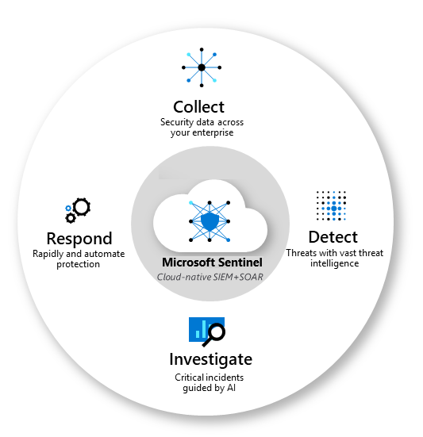
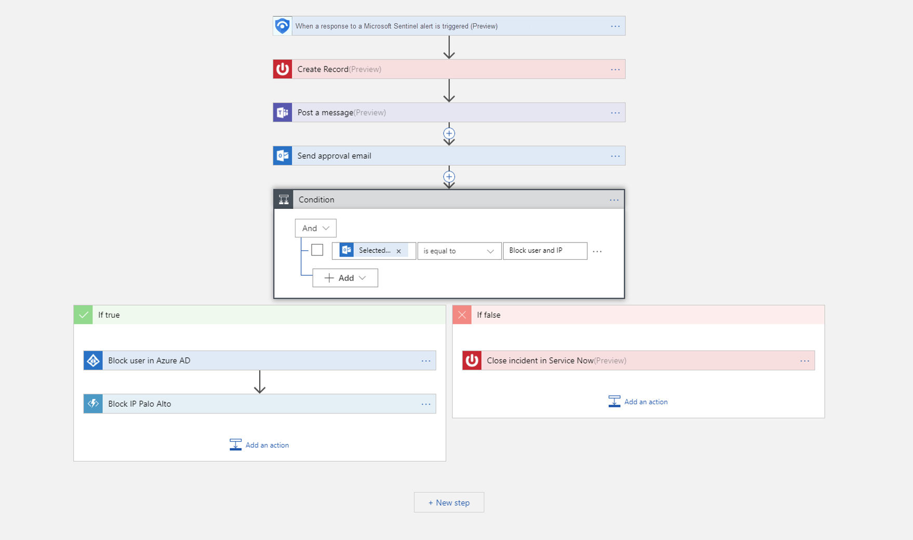
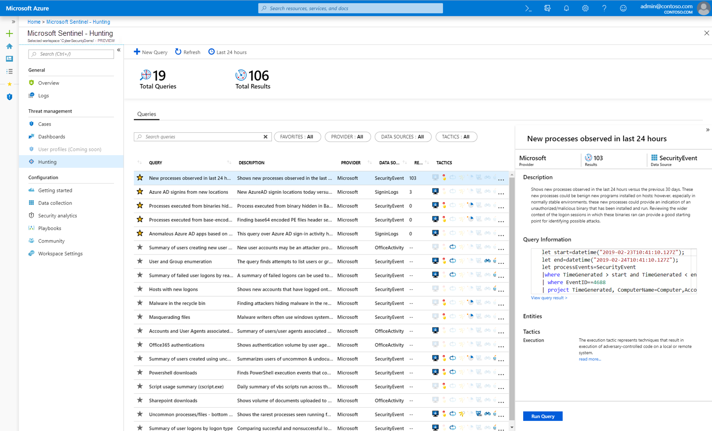
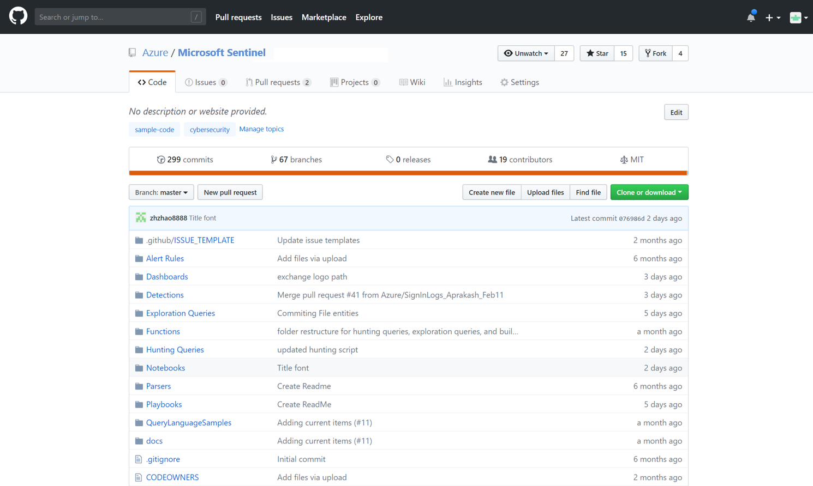

# What is Azure Sentinel?

Microsoft Azure Sentinel is a scalable, cloud-native, **security information event management (SIEM)** and **security orchestration automated response (SOAR)** solution. Azure Sentinel delivers intelligent security analytics and threat intelligence across the enterprise, providing a single solution for alert detection, threat visibility, proactive hunting, and threat response. 

Azure Sentinel is your birds-eye view across the enterprise alleviating the stress of increasingly sophisticated attacks, increasing volumes of alerts, and long resolution timeframes.

- **Collect data at cloud scale** across all users, devices, applications, and infrastructure, both on-premises and in multiple clouds. 

- **Detect previously undetected threats**, and minimize false positives using Microsoft's analytics and unparalleled threat intelligence. 

- **Investigate threats with artificial intelligence**, and hunt for suspicious activities at scale, tapping into years of cyber security work at Microsoft. 

- **Respond to incidents rapidly** with built-in orchestration and automation of common tasks.

Building on the full range of existing Azure services, Azure Sentinel natively incorporates proven foundations, like Log Analytics, and Logic Apps. Azure Sentinel enriches your investigation and detection with AI, and provides Microsoft's threat intelligence stream and enables you to bring your own threat intelligence. 

## Connect to all your data

To on-board Azure Sentinel, you first need to [connect to your security sources](connect-data-sources.md). Azure Sentinel comes with a number of connectors for Microsoft solutions, available out of the box and providing real-time integration, including Microsoft Threat Protection solutions, and Microsoft 365 sources, including Office 365, Azure AD, Azure ATP, and Microsoft Cloud App Security, and more. In addition, there are built-in connectors to the broader security ecosystem for non-Microsoft solutions. You can also use common event format, Syslog or REST-API to connect your data sources with Azure Sentinel as well.  

[!INCLUDE [azure-lighthouse-supported-service](../../includes/azure-lighthouse-supported-service.md)]

## Workbooks

After you [connected your data sources](quickstart-onboard.md) to Azure Sentinel, you can monitor the data using the Azure Sentinel integration with Azure Monitor Workbooks, which provides versatility in creating custom workbooks. While Workbooks are displayed differently in Azure Sentinel, it may be useful for you to see how to [Create interactive reports with Azure Monitor Workbooks](../azure-monitor/platform/workbooks-overview.md). Azure Sentinel allows you to create custom workbooks across your data, and also comes with built-in workbook templates to allow you to quickly gain insights across your data as soon as you connect a data source.

## Analytics

To help you reduce noise and minimize the number of alerts you have to review and investigate, Azure Sentinel uses [analytics to correlate alerts into incidents](tutorial-detect-threats-built-in.md). **Incidents** are groups of related alerts that together create an actionable possible-threat that you can investigate and resolve. Use the built-in correlation rules as-is, or use them as a starting point to build your own. Azure Sentinel also provides machine learning rules to map your network behavior and then look for anomalies across your resources. These analytics connect the dots, by combining low fidelity alerts about different entities into potential high-fidelity security incidents.

## Security automation & orchestration

Automate your common tasks and [simplify security orchestration with playbooks](tutorial-respond-threats-playbook.md) that integrate with Azure services as well as your existing tools. Built on the foundation of Azure Logic Apps, Azure Sentinel's automation and orchestration solution provides a highly-extensible architecture that enables scalable automation as new technologies and threats emerge. To build playbooks with Azure Logic Apps, you can choose from a growing gallery of built-in playbooks. These include [200+ connectors](https://docs.microsoft.com/azure/connectors/apis-list) for services such as Azure functions. The connectors allow you to apply any custom logic in code, ServiceNow, Jira, Zendesk, HTTP requests, Microsoft Teams, Slack, Windows Defender ATP, and Cloud App Security.

For example, if you use the ServiceNow ticketing system, you can use the tools provided to use Azure Logic Apps to automate your workflows and open a ticket in ServiceNow each time a particular event is detected.

## Investigation

Currently in preview, Azure Sentinel [deep investigation](tutorial-investigate-cases.md) tools help you to understand the scope and find the root cause, of a potential security threat. You can choose an entity on the interactive graph to ask interesting questions for a specific entity, and drill down into that entity and its connections to get to the root cause of the threat. 

## Hunting

Use Azure Sentinel's [powerful hunting search-and-query tools](hunting.md), based on the MITRE framework, which enable you to proactively hunt for security threats across your organization’s data sources, before an alert is triggered. After you discover which hunting query provides high-value insights into possible attacks, you can also create custom detection rules based on your query, and surface those insights as alerts to your security incident responders. While hunting, you can create bookmarks for interesting events, enabling you to return to them later, share them with others, and group them with other correlating events to create a compelling incident for investigation.

## Community

The Azure Sentinel community is a powerful resource for threat detection and automation. Our Microsoft security analysts constantly create and add new workbooks, playbooks, hunting queries, and more, posting them to the community for you to use in your environment. You can download sample content from the private community GitHub [repository](https://aka.ms/asicommunity) to create custom workbooks, hunting queries, notebooks, and playbooks for Azure Sentinel. 

## Next steps

- To get started with Azure Sentinel, you need a subscription to Microsoft Azure. If you do not have a subscription, you can sign up for a [free trial](https://azure.microsoft.com/free/).
- Learn how to [onboard your data to Azure Sentinel](quickstart-onboard.md), and [get visibility into your data, and potential threats](quickstart-get-visibility.md).
