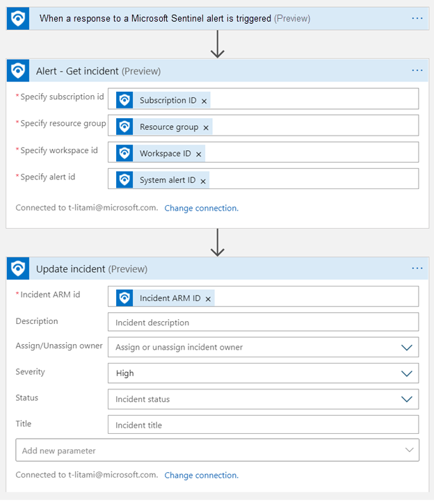
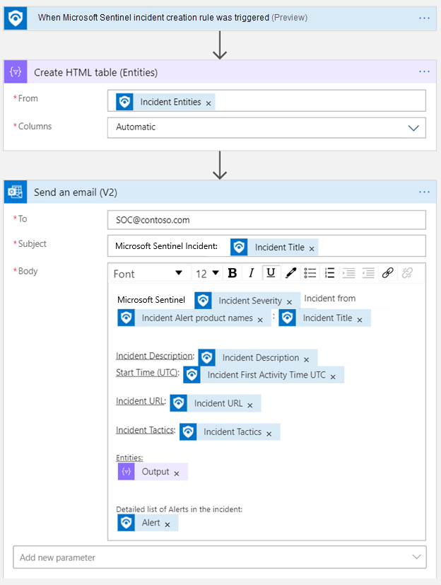
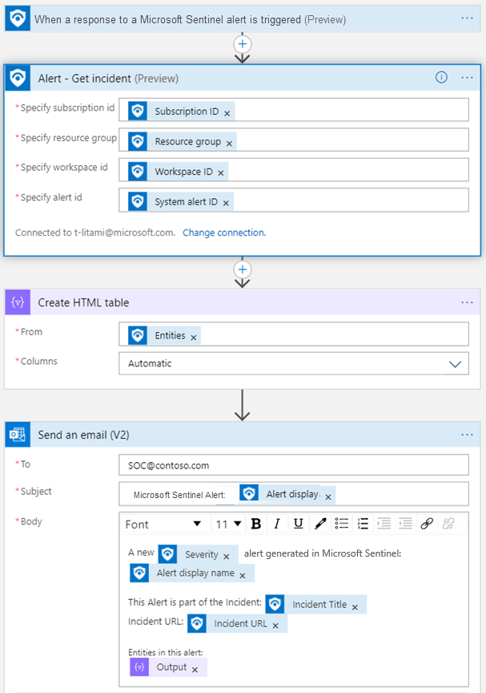
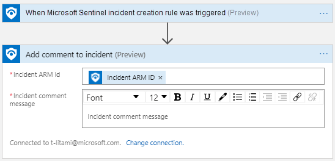
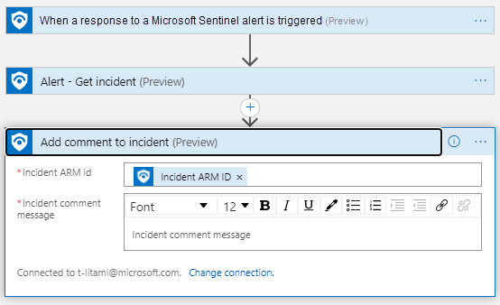
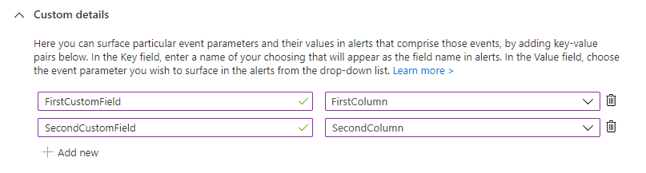
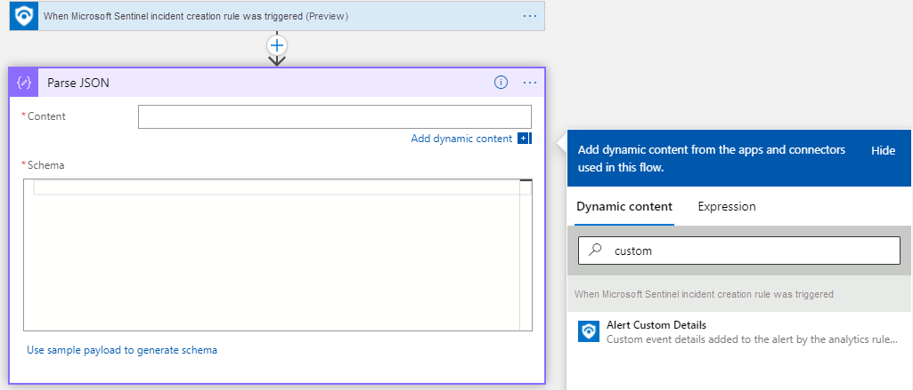
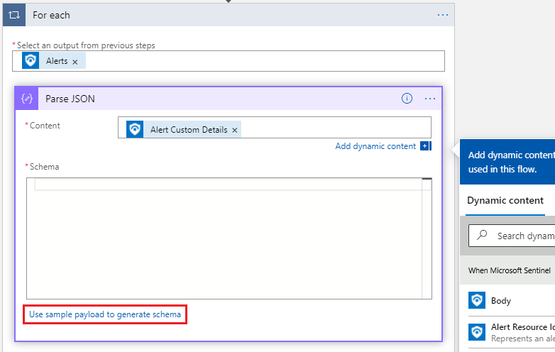
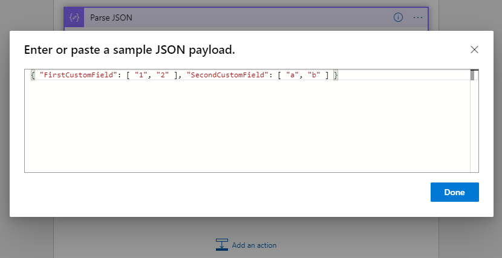
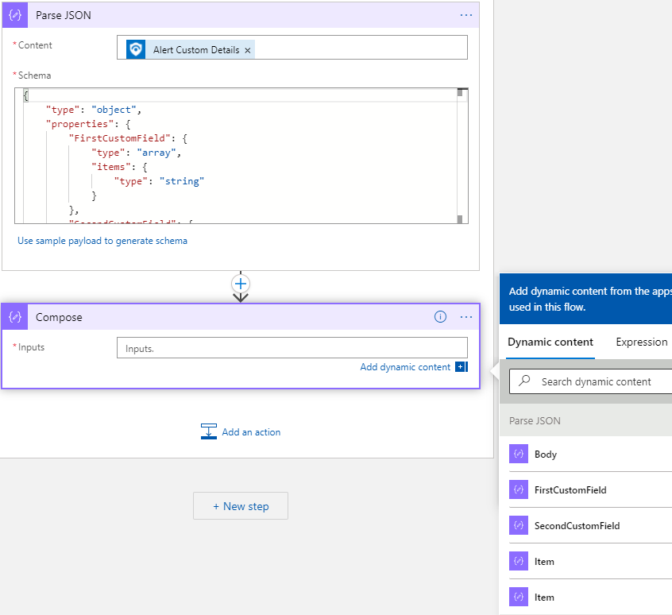

# Use triggers and actions in Microsoft Sentinel playbooks

This document explains the types of triggers and actions in the [Logic Apps Microsoft Sentinel connector](/connectors/azuresentinel/), that playbooks can use to interact with Microsoft Sentinel and the information in your workspace's tables. It further shows you how to get to specific types of Microsoft Sentinel information that you are likely to need.

This document, along with our guide to [Authenticating playbooks to Microsoft Sentinel](authenticate-playbooks-to-sentinel.md), is a companion to our other playbook documentation - [Tutorial: Use playbooks with automation rules in Microsoft Sentinel](tutorial-respond-threats-playbook.md). These three documents will refer to each other back and forth.

For an introduction to playbooks, see [Automate threat response with playbooks in Microsoft Sentinel](automate-responses-with-playbooks.md).

For the complete specification of the Microsoft Sentinel connector, see the [Logic Apps connector documentation](/connectors/azuresentinel/).

## Permissions required

| Roles \ Connector components | Triggers | "Get" actions | Update incident,<br>add a comment |
| ------------- | :-----------: | :------------: | :-----------: |
| **[Microsoft Sentinel Reader](../role-based-access-control/built-in-roles.md#microsoft-sentinel-reader)** | &#10003; | &#10003; | &#10007; |
| **Microsoft Sentinel [Responder](../role-based-access-control/built-in-roles.md#microsoft-sentinel-responder)/[Contributor](../role-based-access-control/built-in-roles.md#microsoft-sentinel-contributor)** | &#10003; | &#10003; | &#10003; |

[Learn more about permissions in Microsoft Sentinel](./roles.md).

## Microsoft Sentinel triggers summary

Though the Microsoft Sentinel connector can be used in a variety of ways, the connector's components can be divided into three flows, each triggered by a different Microsoft Sentinel occurrence:

| Trigger&nbsp;(full&nbsp;name in Logic Apps Designer) | When to use it | Known limitations 
| --------------------- | -------------- | -------------- | 
| **Microsoft Sentinel incident (Preview)** | Recommended for most incident automation scenarios.<br><br>The playbook receives incident objects, including entities and alerts. Using this trigger allows the playbook to be attached to an **Automation rule**, so it can be triggered when an incident is created (and now, updated as well) in Microsoft Sentinel, and all the [benefits of automation rules](./automate-incident-handling-with-automation-rules.md) can be applied to the incident. | Playbooks with this trigger do not support alert grouping, meaning they will receive only the first alert sent with each incident.<br><br>**UPDATE**: As of February 2023, alert grouping is supported for this trigger.
| **Microsoft Sentinel alert (Preview)** | Advisable for playbooks that need to be run on alerts manually from the Microsoft Sentinel portal, or for **scheduled** analytics rules that don't generate incidents for their alerts. | This trigger cannot be used to automate responses for alerts generated by **Microsoft security** analytics rules.<br><br>Playbooks using this trigger cannot be called by **automation rules**. |
| **Microsoft Sentinel entity (Preview)** | To be used for playbooks that need to be run manually on specific entities from an investigation or threat hunting context. | Playbooks using this trigger cannot be called by **automation rules**. |

The schemas used by these flows are not identical. The recommended practice is to use the **Microsoft Sentinel incident trigger** flow, which is applicable to most scenarios.

### Incident dynamic fields

The **Incident** object received from **Microsoft Sentinel incident** includes the following dynamic fields:

- Incident properties (Shown as "Incident: field name")

- Alerts (array)

  - Alert properties (Shown as "Alert: field name")

    When selecting an alert property such as **Alert: \<property name>**, a *for each* loop is automatically generated, since an incident can include multiple alerts.

- Entities (array of all an alert's entities)

- Workspace info fields (applies to the Sentinel workspace where the incident was created)
  - Subscription ID
  - Workspace name
  - Workspace ID
  - Resource group name

## Microsoft Sentinel actions summary

| Component | When to use it |
| --------- | -------------- |
| **Alert - Get Incident** | In playbooks that start with Alert trigger. Useful for getting the incident properties, or retrieving the **Incident ARM ID** to use with the **Update incident** or **Add comment to incident** actions. |
| **Get Incident** | When triggering a playbook from an external source or with a non-Sentinel trigger. Identify with an **Incident ARM ID**. Retrieves the incident properties and comments. |
| **Update Incident** | To change an incident's **Status** (for example, when closing the incident), assign an **Owner**, add or remove a tag, or to change its **Severity**, **Title**, or **Description**.
| **Add comments to incident** | To enrich the incident with information collected from external sources; to audit the actions taken by the playbook on the entities; to supply additional information valuable for incident investigation. |
| **Entities - Get \<*entity type*\>** | In playbooks that work on a specific entity type (**IP**, **Account**, **Host**, **URL** or **FileHash**) which is known at playbook creation time, and you need to be able to parse it and work on its unique fields. |
|

## Work with incidents - usage examples

> [!TIP] 
> The actions **Update Incident** and **Add a Comment to Incident** require the **Incident ARM ID**.
>
> Use the **Alert - Get Incident** action beforehand to get the **Incident ARM ID**.

### Update an incident
-  Playbook is triggered by **Microsoft Sentinel incident**

    

-  Playbook is triggered by **Microsoft Sentinel alert**

    
      
### Use Incident Information

Basic playbook to send incident details over mail:
-  Playbook is triggered by **Microsoft Sentinel incident**

    

-  Playbook is triggered by **Microsoft Sentinel alert**

    

### Add a comment to the incident

-  Playbook is triggered by **Microsoft Sentinel incident**

    

-  Playbook is triggered by **Microsoft Sentinel alert**

    

### Disable a user

- Playbook is triggered by **Microsoft Sentinel Entity**

    :::image type="content" source="media/playbook-triggers-actions/entity-trigger-actions.png" alt-text="Screenshot showing actions to take in an entity-trigger playbook to disable a user.":::

### Entity playbooks with no incident ID

Playbooks created with the **Entity trigger** often make use of the **Incident ARM ID** field (for example, in order to update an incident after taking action on the entity).

If such a playbook is triggered in a **context unconnected to an incident** (for example, when threat hunting), then there is **no incident** whose ID can populate this field. In this case, the field will be populated with a null value.

**As a result, the playbook may fail to run to completion.** To prevent this failure, it's recommended to create a condition that will check for a value in the incident ID field before taking any actions on it, and prescribe a different set of actions if the field has a null value - that is, if the playbook isn't being run from an incident.

1. Before the first action that refers to the **Incident ARM ID** field, add a step of type **Condition**.

1. Select the **Choose a value** field and enter the **Add dynamic content** dialog.

1. Select the **Expression** tab and the **length(collection)** function.

1. Select the **Dynamic content** tab and the **Incident ARM ID** field.

1. Verify the resulting expression is `length(triggerBody()?['IncidentArmID'])` and select **OK**.

    :::image type="content" source="media/playbook-triggers-actions/condition-incident-id.png" alt-text="Screenshot of dynamic content dialog to select fields for a playbook condition.":::

1. Set the **operator** and **value** in the condition to "is greater than" and "0".

    :::image type="content" source="media/playbook-triggers-actions/condition-length.png" alt-text="Screenshot of final definition of condition described in the previous screenshot.":::

1. In the **True** frame, add the actions to be taken if the playbook is run from an incident context.

    In the **False** frame, add the actions to be taken if the playbook is run from a non-incident context.


## Work with specific Entity types

The **Entities** dynamic field is an array of JSON objects, each of which represents an entity. Each entity type has its own schema, depending on its unique properties.

The **"Entities - Get \<entity type>"** action allows you to do the following:

- Filter the array of entities by the requested type.
- Parse the specific fields of this type, so they can be used as dynamic fields in further actions.

The input is the **Entities** dynamic field.

The response is an array of entities, where the special properties are parsed and can be directly used in a *For each* loop.

Currently supported entity types are:

- [IP](/connectors/azuresentinel/#entities---get-ips)
- [Host](/connectors/azuresentinel/#entities---get-hosts)
- [Account](/connectors/azuresentinel/#entities---get-accounts)
- [URL](/connectors/azuresentinel/#entities---get-urls)
- [FileHash](/connectors/azuresentinel/#entities---get-filehashes)

    :::image type="content" source="media/playbook-triggers-actions/entities-actions.png" alt-text="Entities Actions List":::

For other entity types, similar functionality can be achieved using Logic Apps' built-in actions:

- Filter the array of entities by the requested type using [**Filter Array**](../logic-apps/logic-apps-perform-data-operations.md#filter-array-action).

- Parse the specific fields of this type, so they can be used as dynamic fields in further actions using [**Parse JSON**](../logic-apps/logic-apps-perform-data-operations.md#parse-json-action).

## Work with custom details

The **Alert custom details** dynamic field, available in the **incident trigger**, is an array of JSON objects, each of which represents a custom detail of an alert. [Custom details](surface-custom-details-in-alerts.md), you will recall, are key-value pairs that allow you to surface information from events in the alert so they can be represented, tracked, and analyzed as part of the incident.

Since this field in the alert is customizable, its schema depends on the type of event being surfaced. You will have to supply data from an instance of this event to generate the schema that will determine how the custom details field will be parsed.

See the following example:



In these key-value pairs, the key (the left-hand column) represents the custom fields you create, and the value (the right-hand column) represents the fields from the event data that populate the custom fields.

You can supply the following JSON code to generate the schema. The code shows the key names as arrays, and the values (shown as the actual values, not the column that contains the values) as items in the arrays.

```json
{ "FirstCustomField": [ "1", "2" ], "SecondCustomField": [ "a", "b" ] }
```

1. Add a new step using the **Parse JSON** built-in action. You can enter 'parse json' in the Search field to find it.

1. Find and select **Alert Custom Details** in the **Dynamic content** list, under the incident trigger.

    

    This will create a **For each** loop, since an incident contains an array of alerts.

1. Click on the **Use sample payload to generate schema** link.

    

1. Supply a sample payload. You can find a sample payload by looking in Log Analytics (the **Logs** blade) for another instance of this alert, and copying the custom details object (under **Extended Properties**). In the screenshot below, we used the JSON code shown above.

    

1. The custom fields are ready to be used dynamic fields of type **Array**. You can see here the array and its items, both in the schema and in the list that appears under **Dynamic content**, that we described above.

    
    
## Next steps

In this article, you learned more about using the triggers and actions in Microsoft Sentinel playbooks to respond to threats. 
- Learn how to [proactively hunt for threats](hunting.md) using Microsoft Sentinel.
