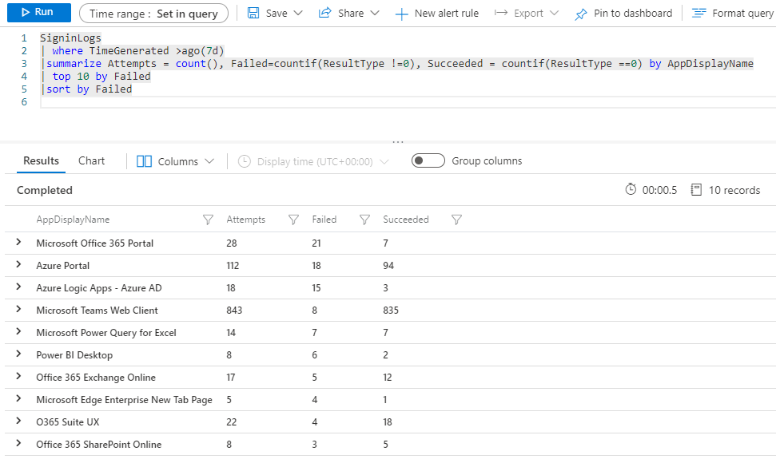
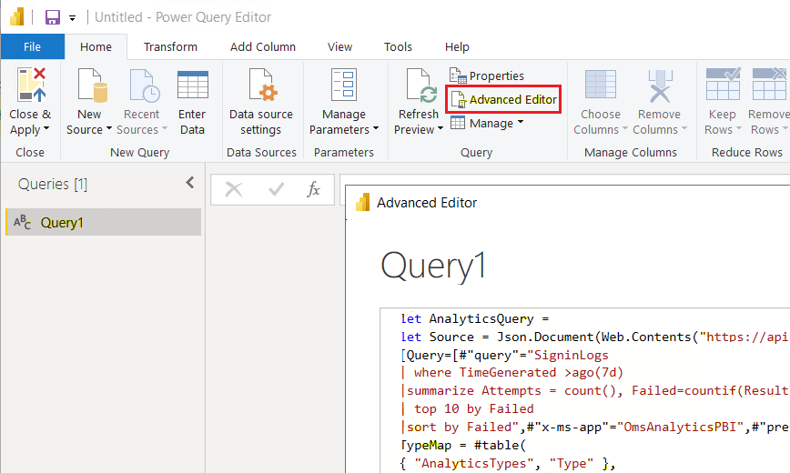
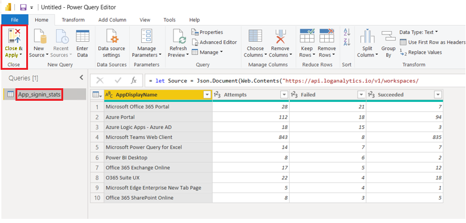
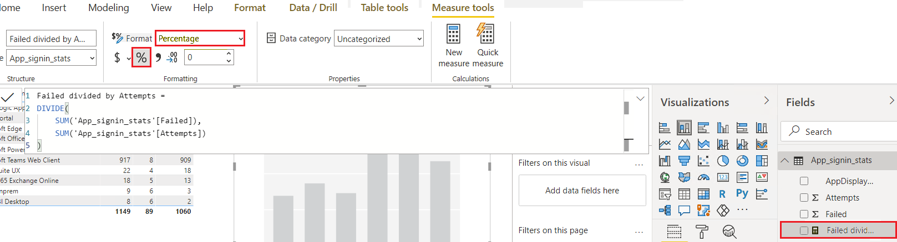
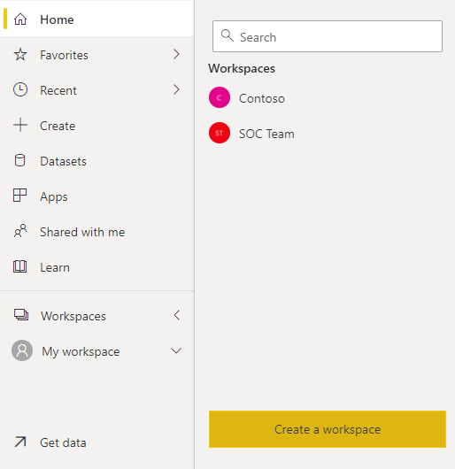
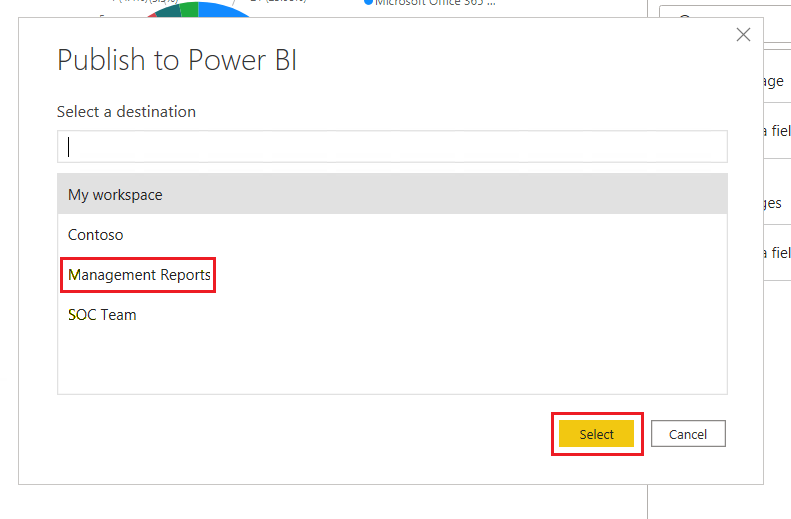
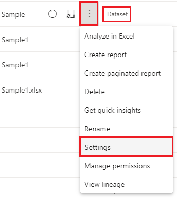
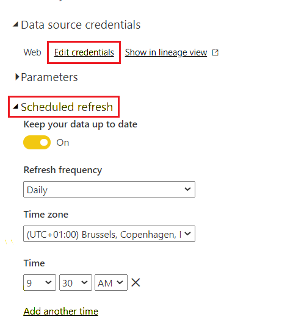

# Create a Power BI report from Azure Sentinel data

[Power BI](https://powerbi.microsoft.com/) is a reporting and analytics platform that uses apps, services, and connectors to turn data into coherent, immersive, interactive visualizations. Power BI lets you easily connect to data sources, visualize and discover relationships, and share insights with others. Data can be anything from an Excel spreadsheet to a collection of cloud-based and on-premises data warehouses. The Power BI Desktop application connects to data and creates visualizations and reports. The Power BI online service accesses and shares reports, datasets, and workspaces.

You can base Power BI reports on data from Azure Sentinel Log Analytics workspaces, and share those reports with people who don't have access to Azure Sentinel. For example, you might want to share information about failed sign-in attempts with the app owners, without granting them Azure Sentinel access. Power BI visualizations can present the relevant information at a glance.

In this tutorial, you:

- Export a Log Analytics Kusto query to a Power BI M language query.
- Use the exported query in Power BI Desktop to create visualizations and a report.
- Publish the report to the Power BI service and share it with others.
- Add the report to a Teams channel.

People you granted access in the Power BI service, and members of the Teams channel, can see the report without needing Azure Sentinel permissions.

## Prerequisites

To complete this tutorial, you need:

- An Azure Sentinel workspace that monitors app sign-ins.
- A Power BI account that has at least read-level permission to the Azure Sentinel workspace.
- [Power BI Desktop installed from the Microsoft Store](https://aka.ms/pbidesktopstore).

## Export a query from Log Analytics

In your Log Analytics workspace for Azure Sentinel, select **Logs** to open the query editor. Under **New Query 1**, enter the following Kusto query:
   
   ```kusto
   SigninLogs
   |  where TimeGenerated >ago(7d)
   | summarize Attempts = count(), Failed=countif(ResultType !=0), Succeeded = countif(ResultType ==0) by AppDisplayName
   |  top 10 by Failed
   | sort by Failed
   ```
   
1. Select **Run** to run the query and generate results.
   
   
   
1. To export the query to Power BI MQuery format, select **Export**, and then select **Export to Power BI (M query)**. This action exports the query to a text file called *PowerBIQuery.txt*. Copy the contents of the exported file.
   
   

## Get the data in Power BI Desktop

1. Open Power BI Desktop, and sign in to your Power BI account that has at least reader access to the Log Analytics workspace.
   
   
   
1. In the Power BI ribbon, select **Get data** and then select **Blank query**. The **Power Query Editor** opens.
   
   
   
1. In the **Power Query Editor**, select **Advanced Editor**.
   
1. Paste the copied contents of the exported *PowerBIQuery.txt* file into the **Advanced Editor** window, and then select **Done**.
   
   
   
1. In the **Power Query Editor**, rename the query to *App_signin_stats*, and then select **Close & Apply**.
   
   

## Create visualizations from the data

Now that your data is in Power BI, you can create visualizations to provide insights into the data.

### Create a table visual

First, create a table that shows all the results of the query.

1. In Power BI Desktop, to add a table visualization to the report canvas, select the **table** icon under **Visualizations**.
   
   
   
1. Under **Fields**, select all the fields in your query, so they all appear in the table. If you can't see all the data, enlarge the table by dragging its selection handles.
   
   
   
### Create a pie chart

Next, create a pie chart that shows which applications had the most failed sign-in attempts.

1. Deselect the table visual by clicking outside of it, and then under **Visualizations**, select the **pie chart** icon.
   
   
   
1. Drag **AppDisplayName** from the **Fields** pane into the **Legend** well, and drag **Failed** from **Fields** into the **Values** well. The pie chart now shows the number of failed sign-in attempts per application.
   
   
   
### Create a new quick measure

You also want to show which applications have the highest percentages of failed sign-in attempts compared to total attempts. Since your query doesn't have a percentage column, you can create a new measure to show this information.

1. Under **Visualizations**, select the **stacked column chart** icon to create a stacked column chart.
   
   
   
1. In the ribbon, select **Quick measure**.
   
1. In the **Quick measures** window, under **Calculation**, select **Division**. Drag **Failed** from **Fields** into the **Numerator** field, and drag **Attempts** from **Fields** to **Denominator**.
   
   
   
1. Select **OK**. The new measure appears in the **Fields** pane.
   
1. Select the new measure in the **Fields** pane, and under **Formatting** in the ribbon, select **Percentage**.
   
   
   
1. With the column chart selected on the canvas, drag the **AppDisplayName** field into the **Axis** well, and the new **Failed divided by Attempts** measure into the **Values** well. The chart now shows the percentage of failed sign-in attempts for each application.
   
   
   
### Refresh the data and save the report

1. Select **Refresh** to get the latest data.
   
   
   
1. Select **File** > **Save** and save your report.

## Create a Power BI online workspace

To create a Power BI workspace to publish the report to:

1. Sign in to [powerbi.com](https://powerbi.com) with the same account you used for Power BI Desktop and Azure Sentinel read access.
   
1. Under **Workspaces**, select **Create a workspace**. Name the workspace *Management Reports*, and select **Save**.
   
   
   
1. To grant others access to the workspace, select the **More options** dots next to the new workspace name, and then select **Workspace access**. You can grant others access to the entire workspace, or to the published report only, or to the Power BI *.pbix* file. For now, add members to the workspace as needed.
   
   

## Publish the Power BI report

You must publish your Power BI report before others can see it.

1. In Power BI Desktop, select **Publish**.
   
   
   
1. Select the **Management Reports** workspace to publish to, and select **Select**.
   
   
   
## Import the report to a Microsoft Teams channel

You also want members of the Management Teams channel to be able to see the report. To add the report to a Teams channel:

1. In the appropriate Teams channel, select **+** to add a tab, and in the **Add a tab** window, search for and select **Power BI**.

   
   
1. From the list, select the report you created, and select **Save**. The report appears in a new tab in the Teams channel.
   
   

## Schedule report refresh

You can refresh your Power BI report on a schedule, so updated data always appears in the report.

1. In the Power BI service, select the workspace you published your report to.
   
1. Next to the report **Dataset**, select **More options** > **Settings**.
   
   
   
1. Select **Edit credentials** to provide the credentials to connect to Log Analytics.
   
1. Under **Scheduled refresh**, set the slider to **On**, and set up a refresh schedule for your report.
   
   

## Next steps

[Import Azure Monitor log data into Power BI](/azure/azure-monitor/visualize/powerbi)

