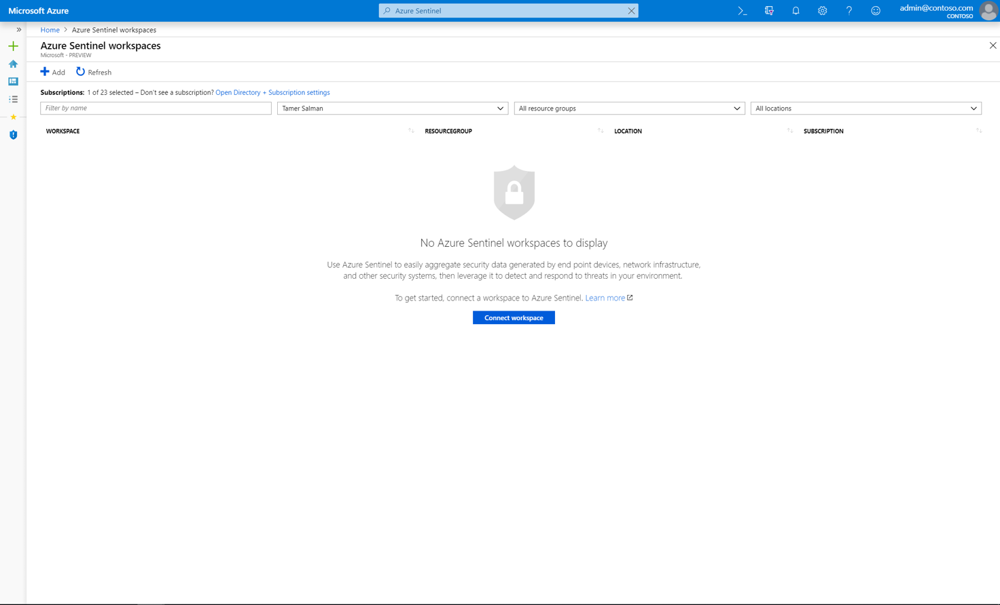
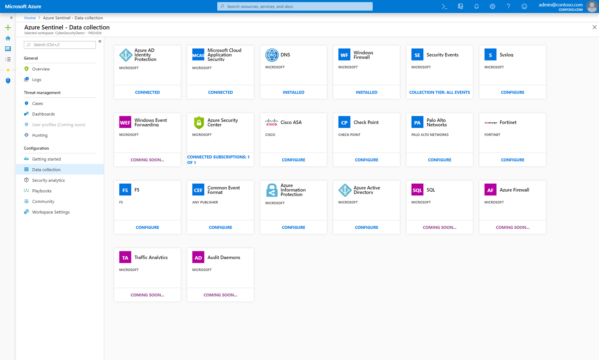

# On-board Azure Sentinel Preview

> [!IMPORTANT]
> Azure Sentinel is currently in public preview.
> This preview version is provided without a service level agreement, and it's not recommended for production workloads. Certain features might not be supported or might have constrained capabilities. 
> For more information, see [Supplemental Terms of Use for Microsoft Azure Previews](https://azure.microsoft.com/support/legal/preview-supplemental-terms/).

To on-board Azure Sentinel, you first need to connect to your security sources. Azure Sentinel comes with a number of connectors for Microsoft solutions, available out of the box and providing real-time integration, including Microsoft Threat Protection solutions, Microsoft 365 sources, including Office 365, Azure AD, Azure ATP, and Microsoft Cloud App Security, and more. In addition, there are built-in connectors to the broader security ecosystem for non-Microsoft solutions. You can use common event format, Syslog or REST-API to connect your data sources with Azure Sentinel as well.  

After you connect your data sources, you will be able to choose from a gallery of expertly created dashboards that surface insights based on your data. These dashboards can be easily customized to your needs.

## Global prerequisites

1. Log Analytics workspace. Learn how to [create a Log Analytics workspace](../log-analytics/log-analytics-quick-create-workspace.md)

2. Contributor permissions to your Log Analytics workspace
3. Tenant global or security admin permissions (some data sources)

## Enable Azure Sentinel

1. Go into the Azure portal.
2. Make sure that the subscription in which Azure Sentinel is created, is selected. 
3. Search for Azure Sentinel. 
   

1. Click **+Add**.
1. Select which workspace you want to use or create a new one. You can run Azure Sentinel on more than one workspace, but the data will be isolated to a single workspace.

   

  >[!NOTE] 
  > - **Workspace location**  It's important to understand that all the data that you stream to Azure Sentinel will be stored in the geographic location of the workspace you selected.  
  > - You won't see the ASC default workspaces here, you can't run Azure Sentinel on them.

6. Click **Add security insights**.
  
   

## Connect data sources

Azure Sentinel creates the connection to services and apps by connecting to the service and forwarding the events and logs to Azure Sentinel. For machines and virtual machines, you can install the Azure Sentinel agent that collects the logs and forwards them to Azure Sentinel. For Firewalls and proxies, Azure Sentinel utilizes a Linux Syslog server. The he agent is installed on it and from which the agent collects the log files and forwards them to Azure Sentinel. 
 
1. Click **Data collection**.
2. There is a tile for each data source you can connect. 
For example, click **Azure Active Directory**. If you connect this data source, you stream all the logs from Azure AD into Azure Sentinel. You can select what type of logs you wan to get - Sign-in logs and or Audit logs. For Azure AD, it gives you information about what type of licenses you need for this to work.  
At the bottom, Azure Sentinel provides recommendations for which dashboards you should install for each connector so you can immediately get interesting insights across your data.   Follow the installation instructions or [refer to the relevant connection guide](connect-azure-active-directory.md) for more information.
 

8. Use the sample query data if you want to start building queries in Log Analytics that run on this data. The samples help by providing you with basic queries including the correct parameter names for data of this type.

For information about machines, services, and apps that are natively connected to Azure Sentinel, see [Connect Microsoft services](connect-azure-active-directory.md).
For information about other on-premises machines, services, and apps that can be connected to Azure Sentinel, see [Connect your on-premises appliance to Azure Sentinel using Common Event Format](connect-common-error-format.md).

Azure Sentinel also collects [Syslog](connect-syslog.md) and [CEF over Syslog](connect-common-error-format.md) formatted events. If your solution supports CEF, it is recommended that you send your log events as CEF because of Azure Sentinel's integration with Log Analytics, which parses and normalizes the data best from CEF. In addition, CEF data analyzed with Azure Sentinel includes Threat Intelligence enrichment from Microsoft Threat Intelligence feeds to identify interaction with malicious IP addresses and locations.

## Next steps
In this document, you learned about connecting data sources to Azure Sentinel. To learn more about Azure Sentinel, see the following articles:
- Learn how to [get visibility into your data, and potential threats](quickstart-get-visibility.md).
- Get started [detecting threats with Azure Sentinel](tutorial-detect-threats.md).
- Stream data from [Common Error Format appliances](connect-common-error-format.md) into Azure Sentinel.
