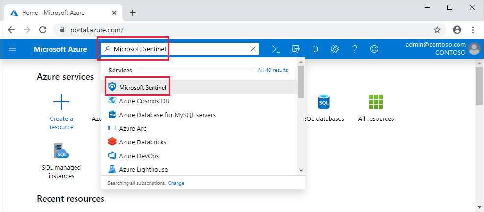
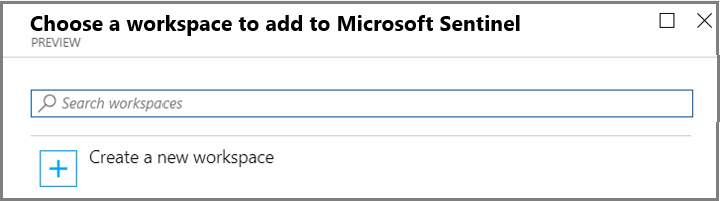

# Quickstart: On-board Azure Sentinel

In this quickstart, learn how to on-board Azure Sentinel. 

To on-board Azure Sentinel, you first need to enable Azure Sentinel, and then connect your data sources. Azure Sentinel comes with a number of connectors for Microsoft solutions, available out of the box and providing real-time integration, including Microsoft Threat Protection solutions, Microsoft 365 sources (including Office 365), Azure AD, Azure ATP, Microsoft Cloud App Security, and more. In addition, there are built-in connectors to the broader security ecosystem for non-Microsoft solutions. You can also use Common Event Format (CEF), Syslog or REST-API to connect your data sources with Azure Sentinel.  

After you connect your data sources, choose from a gallery of expertly created workbooks that surface insights based on your data. These workbooks can be easily customized to your needs.

>[!IMPORTANT] 
> For information about the charges incurred when using Azure Sentinel, see [Azure Sentinel pricing](https://azure.microsoft.com/pricing/details/azure-sentinel/).
  

## Global prerequisites

- Active Azure Subscription, if you don't have one, create a [free account](https://azure.microsoft.com/free/?WT.mc_id=A261C142F) before you begin.

- Log Analytics workspace. Learn how to [create a Log Analytics workspace](../log-analytics/log-analytics-quick-create-workspace.md). For more information about Log Analytics workspaces, see [Designing your Azure Monitor Logs deployment](../azure-monitor/platform/design-logs-deployment.md).

- To enable Azure Sentinel, you need contributor permissions to the subscription in which the Azure Sentinel workspace resides. 
- To use Azure Sentinel, you need either contributor or reader permissions on the resource group that the workspace belongs to.
- Additional permissions may be needed to connect specific data sources.
- Azure Sentinel is a paid service. For pricing information see [About Azure Sentinel](https://go.microsoft.com/fwlink/?linkid=2104058).
 
## Enable Azure Sentinel 

1. Sign in to the Azure portal. Make sure that the subscription in which Azure Sentinel is created is selected.

1. Search for and select **Azure Sentinel**.

   

1. Select **Add**.

1. Select the workspace you want to use or create a new one. You can run Azure Sentinel on more than one workspace, but the data is isolated to a single workspace.

   

   >[!NOTE] 
   > - Default workspaces created by Azure Security Center will not appear in the list; you can't install Azure Sentinel on them.
   > - Azure Sentinel can run on workspaces in any [GA region of Log Analytics](https://azure.microsoft.com/global-infrastructure/services/?products=monitor) except the China and Germany (Sovereign) regions. Data generated by Azure Sentinel (such as incidents, bookmarks, and alert rules, which may contain some customer data sourced from these workspaces) is saved either in Europe (for workspaces located in Europe), in Australia (for workspaces located in Australia), or in East US (for workspaces located in any other region).

   >[!IMPORTANT]
   > - Once Azure Sentinel has been enabled on a workspace, the moving of that workspace to other resource groups or subscriptions is not supported. If you need to move the workspace, contact [Azure Sentinel](mailto:AzureSentinel@microsoft.com).

1. Select **Add Azure Sentinel**.
  

## Connect data sources

Azure Sentinel creates the connection to services and apps by connecting to the service and forwarding the events and logs to Azure Sentinel. For machines and virtual machines, you can install the Azure Sentinel agent that collects the logs and forwards them to Azure Sentinel. For Firewalls and proxies, Azure Sentinel utilizes a Linux Syslog server. The agent is installed on it and from which the agent collects the log files and forwards them to Azure Sentinel. 
 
1. Click **Data connectors**.
1. There is a tile for each data source you can connect. 
For example, click **Azure Active Directory**. If you connect this data source, you stream all the logs from Azure AD into Azure Sentinel. You can select what type of logs you wan to get - sign-in logs and/or audit logs.  
At the bottom, Azure Sentinel provides recommendations for which workbooks you should install for each connector so you can immediately get interesting insights across your data.   Follow the installation instructions or [refer to the relevant connection guide](connect-data-sources.md) for more information. For information about data connectors, see [Connect Microsoft services](connect-data-sources.md).

After your data sources are connected, your data starts streaming into Azure Sentinel and is ready for you to start working with. You can view the logs in the [built-in dashboards](quickstart-get-visibility.md) and start building queries in Log Analytics to [investigate the data](tutorial-investigate-cases.md).

## Next steps
In this document, you learned about connecting data sources to Azure Sentinel. To learn more about Azure Sentinel, see the following articles:
- Learn how to [get visibility into your data, and potential threats](quickstart-get-visibility.md).
- Get started [detecting threats with Azure Sentinel](tutorial-detect-threats-built-in.md).
- Stream data from [Common Event Format appliances](connect-common-event-format.md) into Azure Sentinel.
