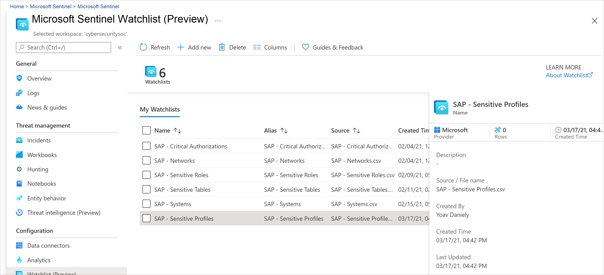
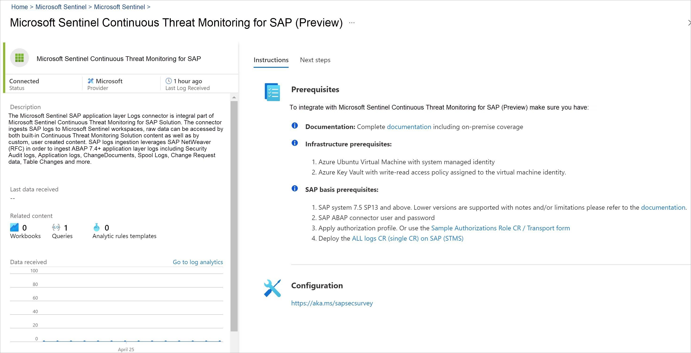
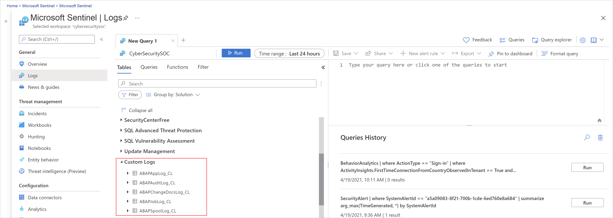

#  Deploy SAP continuous threat monitoring (public preview)

This article takes you step by step through the process of deploying Azure Sentinel continuous threat monitoring for SAP.

> [!IMPORTANT]
> The Azure Sentinel SAP solution is currently in PREVIEW. The [Azure Preview Supplemental Terms](https://azure.microsoft.com/support/legal/preview-supplemental-terms/) include additional legal terms that apply to Azure features that are in beta, preview, or otherwise not yet released into general availability.
>

## Overview

[Azure Sentinel solutions](sentinel-solutions.md) include bundled security content, such as threat detections, workbooks, and watchlists. Solutions enable you to onboard Azure Sentinel security content for a specific data connector using a single process.

The Azure Sentinel SAP data connector enables you to monitor SAP systems for sophisticated threats within the business and application layers.

The SAP data connector streams a multitude of 14 application logs from the entire SAP system landscape, and collects logs from both Advanced Business Application Programming (ABAP) via NetWeaver RFC calls and file storage data via OSSAP Control interface. The SAP data connector adds to Azure Sentinels ability to monitor the SAP underlying infrastructure.

To ingest SAP logs into Azure Sentinel, you must have the Azure Sentinel SAP data connector installed on your SAP environment. We recommend that you use a Docker container on an Azure VM for the deployment, as described in this tutorial.

After the SAP data connector is deployed, deploy the  SAP solution security content to smoothly gain insight into your organization's SAP environment and improve any related security operation capabilities.

In this tutorial, you learn:

> [!div class="checklist"]
> * How to prepare your SAP system for the SAP data connector deployment
> * How to use a Docker container and an Azure VM to deploy the SAP data connector
> * How to deploy the SAP solution security content in Azure Sentinel

## Prerequisites

In order to deploy the Azure Sentinel SAP data connector and security content as described in this tutorial, you must have the following prerequisites:

|Area  |Description  |
|---------|---------|
|**Azure prerequisites**     |  **Access to Azure Sentinel**. Make a note of your Azure Sentinel workspace ID and key to use in this tutorial when [deploying your SAP data connector](#deploy-your-sap-data-connector). <br>To view these details from Azure Sentinel, go to **Settings** > **Workspace settings** > **Agents management**. <br><br>**Ability to create Azure resources**. For more information, see the [Azure Resource Manager documentation](../azure-resource-manager/management/manage-resources-portal.md). <br><br>**Access to Azure Key Vault**. This tutorial describes the recommended steps for using Azure Key Vault to store your credentials. For more information, see the [Azure Key Vault documentation](../key-vault/index.yml).       |
|**System prerequisites**     |   **Software**. The SAP data connector deployment script automatically installs software prerequisites. For more information, see [Automatically installed software](#automatically-installed-software). <br><br> **System connectivity**. Ensure that the VM serving as your SAP data connector host has access to: <br>- Azure Sentinel <br>- Azure Key Vault <br>- The SAP environment host, via the following TCP ports: *32xx*, *5xx13*, and *33xx*, where *xx* is the SAP instance number. <br><br>Make sure that you also have an SAP user account in order to access the SAP software download page.<br><br>**System architecture**. The SAP solution is deployed on a VM as a Docker container, and each SAP client requires its own container instance. For sizing recommendations, see [Recommended virtual machine sizing](sap-solution-detailed-requirements.md#recommended-virtual-machine-sizing). <br>Your VM and the Azure Sentinel workspace can be in different Azure subscriptions, and even different Azure AD tenants.|
|**SAP prerequisites**     |   **Supported SAP versions**. We recommend using [SAP_BASIS versions 750 SP13](https://support.sap.com/en/my-support/software-downloads/support-package-stacks/product-versions.html#:~:text=SAP%20NetWeaver%20%20%20%20SAP%20Product%20Version,%20%20SAPKB710%3Cxx%3E%20%207%20more%20rows) or higher. <br>Select steps in this tutorial provide alternate instructions if you are working on older SAP version [SAP_BASIS 740](https://support.sap.com/en/my-support/software-downloads/support-package-stacks/product-versions.html#:~:text=SAP%20NetWeaver%20%20%20%20SAP%20Product%20Version,%20%20SAPKB710%3Cxx%3E%20%207%20more%20rows).<br><br> **SAP system details**. Make a note of the following SAP system details for use in this tutorial:<br>    - SAP system IP address<br>- SAP system number, such as `00`<br>    - SAP System ID, from the SAP NetWeaver system. For example, `NPL`. <br>- SAP client ID, such as`001`.<br><br>**SAP NetWeaver instance access**. Access to your SAP instances must use one of the following options: <br>- [SAP ABAP user/password](#configure-your-sap-system). <br>- A user with an X509 certificate, using SAP CRYPTOLIB PSE. This option may require expert manual steps.<br><br>**Support from your SAP team**.  You'll need the support of your SAP team in order to ensure that your SAP system is [configured correctly](#configure-your-sap-system) for the solution deployment.   |
|     |         |


### Automatically installed software

The [SAP data connector deployment script](#deploy-your-sap-data-connector) installs the following software on your VM using SUDO (root) privileges:

- [Unzip.](https://www.microsoft.com/en-us/p/unzip/9mt44rnlpxxt?activetab=pivot:overviewtab)
- [NetCat](https://sectools.org/tool/netcat/)
- [Python 3.6 or higher](https://www.python.org/downloads/)
- [Python3-pip](https://pypi.org/project/pip/)
- [Docker](https://www.docker.com/)

## Configure your SAP system

This procedure describes how to ensure that your SAP system has the correct prerequisites installed and is configured for the Azure Sentinel SAP data connector deployment.

> [!IMPORTANT]
> Perform this procedure together with your SAP team to ensure correct configurations.
>

**To configure your SAP system for the SAP data connector**:

1. Ensure that the following SAP notes are deployed in your system, depending on your version:

    |SAP BASIS versions  |Required note |
    |---------|---------|
    |- 750 SP01 to SP12<br>- 751 SP01 to SP06<br>- 752 SP01 to SP03     |  2641084: Standardized read access for the Security Audit log data       |
    |- 700 to 702<br>- 710 to 711, 730, 731, 740, and 750     | 2173545: CD: CHANGEDOCUMENT_READ_ALL        |
    |- 700 to 702<br>- 710 to 711, 730, 731, and 740<br>- 750 to 752     | 2502336: CD (Change Document): RSSCD100 - read only from archive, not from database        |
    |     |         |

    Later versions do not require the additional notes. For more information, see the [SAP support Launchpad site](https://support.sap.com/en/index.html), logging in with a SAP user account.

1. Download and install one of the following SAP change requests from the Azure Sentinel GitHub repository, at https://github.com/Azure/Azure-Sentinel/tree/master/Solutions/SAP/CR:

    - **SAP versions 750 or higher**: Install the SAP change request *144 (NPLK900144)*
    - **SAP versions 740**: Install the SAP change request *146 (NPLK900146)*

    When performing this step, ensure that you use binary mode to transfer the files to the SAP system and use the **STMS_IMPORT** SAP transaction code.

    > [!NOTE]
    > In the SAP **Import Options** area, you may see the **Ignore Invalid Component Version** option displayed. If displayed, select this option before continuing.
    >

1. Create a new SAP role named **/MSFTSEN/SENTINEL_CONNECTOR** by importing the SAP change request *14 (NPLK900140)*. Use the **STMS_IMPORT** SAP transaction code.

    Verify that the role is created with the required permissions, such as:

    :::image type="content" source="media/sap/required-sap-role-authorizations.png" alt-text="Required SAP role permissions for the Azure Sentinel SAP data connector.":::

    For more information, see [authorizations for the ABAP user](sap-solution-detailed-requirements.md#required-abap-authorizations).

1. Create a non-dialog, RFC/NetWeaver user for the SAP data connector and attach the newly created **/MSFTSEN/SENTINEL_CONNECTOR** role.

    - After attaching the role, verify that the role permissions are distributed to the user.
    - This process requires that you use a username and password for the ABAP user. After the new user is created and has required permissions, make sure to change the ABAP user password.

1. Download and place the **SAP NetWeaver RFC SDK 7.50 for Linux on x86_64 64 BIT** version on your VM, as it's required during the installation process.

    For example, find the SDK on the [SAP software download site](https://launchpad.support.sap.com/#/softwarecenter/template/products/_APP=00200682500000001943&_EVENT=DISPHIER&HEADER=Y&FUNCTIONBAR=N&EVENT=TREE&NE=NAVIGATE&ENR=01200314690100002214&V=MAINT) > **SAP NW RFC SDK** > **SAP NW RFC SDK 7.50** > **nwrfc750X_X-xxxxxxx.zip**. Make sure to download the **LINUX ON X86_64 65BIT** option. Copy the file, such as by using SCP, to your VM.

    You'll need an SAP user account to access the SAP software download page.

1. (Optional) The SAP **Auditlog** file is used system-wide and supports multiple SAP clients. However, each instance of the Azure Sentinel SAP solution supports a single SAP client only.

    Therefore, if you have a multi-client SAP system, we recommend that you enable the **Auditlog** file only for the client where you deploy the SAP solution to avoid data duplication.


## Deploy a Linux VM for your SAP data connector

This procedure describes how to use the Azure CLI to deploy an Ubuntu server 18.04 LTS VM and assign it with a [system-managed identity](../active-directory/managed-identities-azure-resources/index.yml).

> [!TIP]
> You can also deploy the data connector on RHEL, versions 7.7 and higher or SUSE versions 15 and higher. Note that any OS and patch levels must be completely up to date.
>

**To deploy and prepare your Ubuntu VM**:

1. Use the following command as an example, inserting the values for your resource group and VM name:

    ```azurecli
    az vm create  --resource-group [resource group name]   --name [VM Name] --image UbuntuLTS  --admin-username AzureUser --data-disk-sizes-gb 10 – --size Standard_DS2_– --generate-ssh-keys  --assign-identity
    ```

1. On your new VM, install:

    - [Venv](https://docs.python.org/3.8/library/venv.html), with Python version 3.8 or higher.
    - The [Azure CLI](/cli/azure/), version 2.8.0 or higher.

> [!IMPORTANT]
> Make sure that you apply any security best practices for your organization, just as you would any other VM.
>

For more information, see [Quickstart: Create a Linux virtual machine with the Azure CLI](../virtual-machines/linux/quick-create-cli.md).

## Create key vault for your SAP credentials

This tutorial uses a newly created or dedicated [Azure Key Vault](../key-vault/index.yml) to store credentials for your SAP data connector.

**To create or dedicate an Azure Key Vault**:

1. Create a new Azure Key Vault, or choose an existing one to dedicate to your SAP data connector deployment.

    For example, to create a new Key Vault, run the following commands, using the name of your Key Vault resource group and entering your Key Vault name:

    ```azurecli
    kvgp=<KVResourceGroup>

    kvname=<keyvaultname>

    #Create Key Vault
    az keyvault create \
      --name $kvname \
      --resource-group $kvgp
    ```

1. Assign an access policy, including GET, LIST, and SET permissions to the VM's managed identity.

    In Azure Key Vault, select to **Access Policies** > **Add Access Policy - Secret Permissions: Get, List, and Set** > **Select Principal**. Enter your [VM's name](#deploy-a-linux-vm-for-your-sap-data-connector), and then select **Add** > **Save**.

    For more information, see the [Key Vault documentation](../key-vault/general/assign-access-policy-portal.md).

1. Run the following command to get the [VM's principal ID](#deploy-a-linux-vm-for-your-sap-data-connector), entering the name of your Azure resource group:

    ```azurecli
    VMPrincipalID=$(az vm show -g [resource group] -n [Virtual Machine] --query identity.principalId -o tsv)
    ```

    Your principal ID is displayed for you to use in the following step.

1. Run the following command to assign the VM's access permissions to the Key Vault, entering the name of your resource group and the principal ID value returned from the previous step.

    ```azurecli
    az keyvault set-policy -n [key vault] -g [resource group] --object-id $VMPrincipalID --secret-permissions get list set
    ```

## Deploy your SAP data connector

The Azure Sentinel SAP data connector deployment script installs [required software](#automatically-installed-software) and then installs the connector on your [newly created VM](#deploy-a-linux-vm-for-your-sap-data-connector), storing credentials in your [dedicated key vault](#create-key-vault-for-your-sap-credentials).

The SAP data connector deployment script is stored in the [Azure Sentinel GitHub repository > DataConnectors > SAP](https://raw.githubusercontent.com/Azure/Azure-Sentinel/master/Solutions/SAP/sapcon-sentinel-kickstart.sh).

To run the SAP data connector deployment script, you'll need the following details:

- Your Azure Sentinel workspace details, as listed in the [Prerequisites](#prerequisites) section.
- The SAP system details listed in the [Prerequisites](#prerequisites) section.
- Access to a VM user with SUDO privileges.
- The SAP user you created in [Configure your SAP system](#configure-your-sap-system), with the **/MSFTSEN/SENTINEL_CONNECTOR** role applied.
- The help of your SAP team.

**To run the SAP solution deployment script**:

1. Run the following command to deploy the SAP solution on your VM:

    ```azurecli
    wget -O sapcon-sentinel-kickstart.sh https://raw.githubusercontent.com/Azure/Azure-Sentinel/master/Solutions/SAP/sapcon-sentinel-kickstart.sh && bash ./sapcon-sentinel-kickstart.sh
    ```

1. Follow the on-screen instructions to enter your SAP and Key Vault details and complete the deployment. A confirmation message appears when the deployment is complete:

    ```azurecli
    The process has been successfully completed, thank you!
    ```

    Azure Sentinel starts to retrieve SAP logs for the configured time span, until 24 hours before the initialization time.

1. We recommend reviewing the system logs to make sure that the data connector is transmitting data. Run:

    ```bash
    docker logs -f sapcon-[SID]
    ```

## Deploy SAP security content

Deploy the [SAP security content](sap-solution-security-content.md) from the Azure Sentinel **Solutions** and **Watchlists** areas.

The **Azure Sentinel - Continuous Threat Monitoring for SAP** solution enables the SAP data connector to show in the Azure Sentinel **Data connectors** area, and deploys the **SAP - System Applications and Products** workbook and SAP-related analytics rules.

Add SAP-related watchlists to your Azure Sentinel workspace manually.

**To deploy SAP solution security content**:

1. From the Azure Sentinel navigation menu, select **Solutions (Preview)**.

    The **Solutions** page displays a filtered, searchable list of solutions.

1. Select **Azure Sentinel - Continuous Threat Monitoring for SAP (preview)** to open the SAP solution page.

    :::image type="content" source="media/sap/sap-solution.png" alt-text="Azure Sentinel - Continuous Threat Monitoring for SAP (preview) solution.":::

1. Select **Create** to launch the solution deployment wizard, and enter the details of the Azure subscription, resource group, and Log Analytics workspace where you want to deploy the solution.

1. Select **Next** to cycle through the **Data Connectors** **Analytics** and **Workbooks** tabs, where you can learn about the components that will be deployed with this solution.

    The default name for the workbook is **SAP - System Applications and Products - Preview**. Change it in the workbooks tab as needed.

    For more information, see [Azure Sentinel SAP solution: security content reference (public preview)](sap-solution-security-content.md).

1. In the **Review + create tab**, wait for the **Validation Passed** message, then select **Create** to deploy the solution.

    > [!TIP]
    > You can also select **Download a template** for a link to deploy the solution as code.

1. After the deployment is completed, a confirmation message appears at the top-right of the page.

    To display the newly deployed content, go to:

    - **Threat Management** > **Workbooks**, to find the [SAP - System Applications and Products - Preview](sap-solution-security-content.md#sap---system-applications-and-products-workbook) workbook.
    - **Configuration** > **Analytics** to find a series of [SAP-related analytics rules](sap-solution-security-content.md#built-in-analytics-rules).

1. Add SAP-related watchlists to use in your search, detection rules, threat hunting, and response playbooks. These watchlists provide the configuration for the Azure Sentinel SAP Continuous Threat Monitoring solution.

    1. Download SAP watchlists from the Azure Sentinel GitHub repository at https://github.com/Azure/Azure-Sentinel/tree/master/Solutions/SAP/Analytics/Watchlists.

    1. In the Azure Sentinel **Watchlists** area, add the watchlists to your Azure Sentinel workspace. Use the downloaded CSV files as the sources, and then customize them as needed for your environment. 

        [  ](media/sap/sap-watchlists.png#lightbox)

        For more information, see [Use Azure Sentinel watchlists](watchlists.md) and [Available SAP watchlists](sap-solution-security-content.md#available-watchlists).

1. In Azure Sentinel, navigate to the **Azure Sentinel Continuous Threat Monitoring for SAP** data connector to confirm the connection:

    [  ](media/sap/sap-data-connector.png#lightbox)

    SAP ABAP logs are displayed in the Azure Sentinel **Logs** page under **Custom logs**:

    [  ](media/sap/sap-logs-in-sentinel.png#lightbox)

    For more information, see [Azure Sentinel SAP solution logs reference (public preview)](sap-solution-log-reference.md).


## Update your SAP data connector

If you have a Docker container already running with an earlier version of the SAP data connector, run the SAP data connector update script to get the latest features available.

1. Make sure that you have the most recent versions of the relevant deployment scripts from the Azure Sentinel github repository. Run:

    ```azurecli
    wget -O sapcon-instance-update.sh https://raw.githubusercontent.com/Azure/Azure-Sentinel/master/Solutions/SAP/sapcon-instance-update.sh && bash ./sapcon-instance-update.sh
    ```
1. Run the following command on your SAP data connector machine:

    ```azurecli
    ./ sapcon-instance-update.sh
    ```

1. Restart the Docker container:

    ```bash
    docker restart sapcon-[SID]
    ```

The SAP data connector Docker container on your machine is updated. 

Make sure to check for any other updates available:

- Relevant SAP change requests, in the [Azure Sentinel GitHub repository](https://github.com/Azure/Azure-Sentinel/tree/master/Solutions/SAP/CR).
- Azure Sentinel SAP security content, in the **Azure Sentinel Continuous Threat Monitoring for SAP** solution
- Relevant watchlists, in the [Azure Sentinel GitHub repository](https://github.com/Azure/Azure-Sentinel/tree/master/Solutions/SAP/Analytics/Watchlists)


## Collect SAP HANA audit logs

If you have SAP HANA database audit logs configured with Syslog, you'll need also need to configure your Log Analytics agent to collect the Syslog files.

1. Make sure that the SAP HANA audit log trail is configured to use Syslog as described in *SAP Note 0002624117*, accessible from the [SAP Launchpad support site](https://launchpad.support.sap.com/#/notes/0002624117). For more information, see:

    - [SAP HANA Audit Trail - Best Practice](https://archive.sap.com/documents/docs/DOC-51098)
    - [Recommendations for Auditing](https://help.sap.com/viewer/742945a940f240f4a2a0e39f93d3e2d4/2.0.05/en-US/5c34ecd355e44aa9af3b3e6de4bbf5c1.html)

1. Check your operating system Syslog files for any relevant HANA database events.

1. Install and configure a Log Analytics agent on your machine:

    1. Sign in to your HANA database operating system as a user with sudo privileges.
    1. In the Azure portal, go to your Log Analytics workspace. On the left, under **Settings**, select **Agents management > Linux servers**.
    1. Copy the code shown in the box under **Download and onboard agent for Linux** to your terminal and run the script.

    The Log Analytics agent is installed on your machine and connected to your workspace. For more information, see [Install Log Analytics agent on Linux computers
](../azure-monitor/agents/agent-linux.md) and [OMS Agent for Linux](https://github.com/microsoft/OMS-Agent-for-Linux) on the Microsoft GitHub repository.

1. Refresh the **Agents Management > Linux servers** tab to see that you have **1 Linux computers connected**.

1. Under **Settings** on the left, select **Agents configuration** and select the **Syslog** tab.

1. Select **Add facility** to add the facilities you want to collect. 

    > [!TIP]
    > Since the facilities where HANA database events are saved can change between different distributions, we recommend that you add all facilities, check them against your Syslog logs, and then remove any that aren't relevant.
    >

1. In Azure Sentinel, check to see that HANA database events are now shown in the ingested logs.

## Next steps

Learn more about the Azure Sentinel SAP solutions:

- [Expert configuration options, on-premises deployment and SAPControl log sources](sap-solution-deploy-alternate.md)
- [Azure Sentinel SAP solution detailed SAP requirements](sap-solution-detailed-requirements.md)
- [Azure Sentinel SAP solution logs reference](sap-solution-log-reference.md)
- [Azure Sentinel SAP solution: built-in security content](sap-solution-security-content.md)
- [Troubleshooting your Azure Sentinel SAP solution deployment](sap-deploy-troubleshoot.md)

For more information, see [Azure Sentinel solutions](sentinel-solutions.md).
