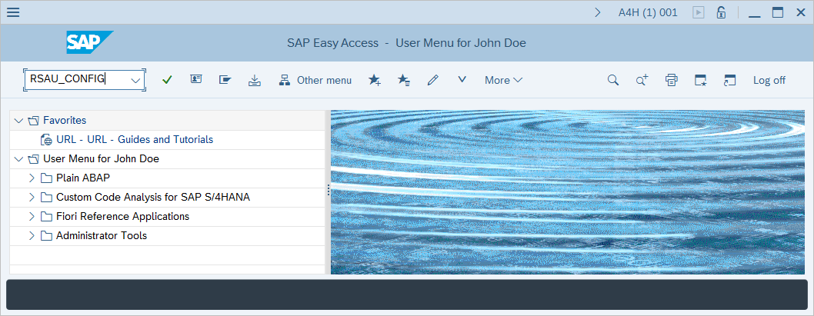
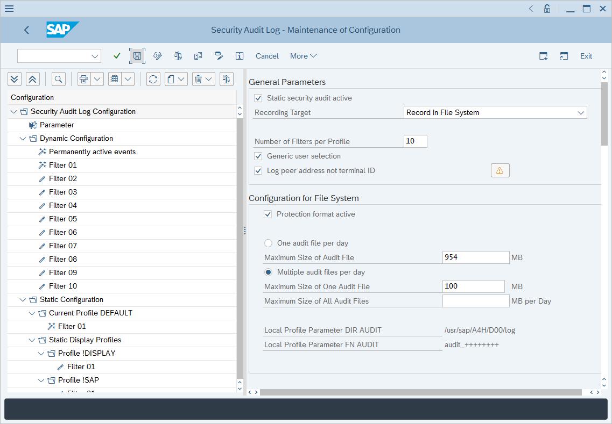
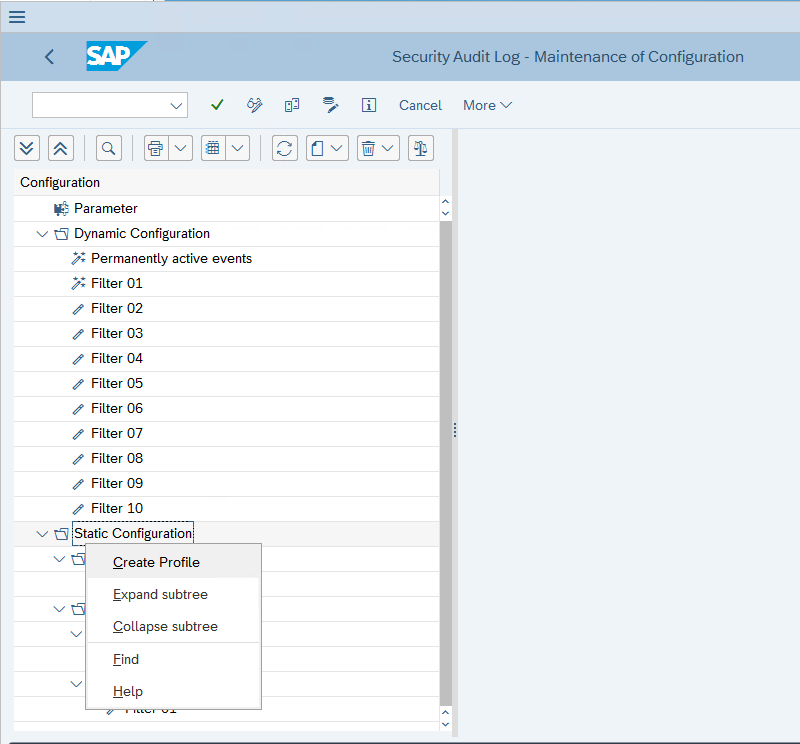
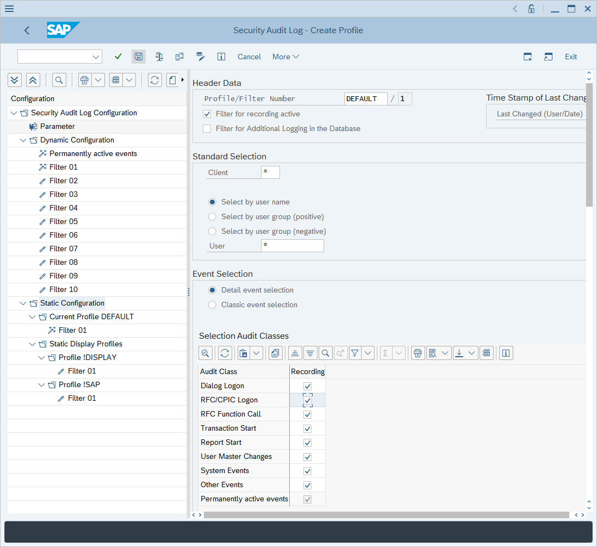

# Enable and configure SAP auditing for Microsoft Sentinel

This article shows you how to enable and configure auditing for the Microsoft Sentinel solution for SAP® applications, so that you can have complete visibility into your SAP solution.

> [!IMPORTANT]
> We strongly recommend that any management of your SAP system is carried out by an experienced SAP system administrator.
>
> The steps in this article may vary, depending on your SAP system's version, and should be considered as a sample only.

Some installations of SAP systems may not have audit log enabled by default. For best results in evaluating the performance and efficacy of the Microsoft Sentinel solution for SAP® applications, enable auditing of your SAP system and configure the audit parameters.

## Deployment milestones

Track your SAP solution deployment journey through this series of articles:

1. [Deployment overview](deployment-overview.md)

1. [Deployment prerequisites](prerequisites-for-deploying-sap-continuous-threat-monitoring.md)

1. [Work with the solution across multiple workspaces](cross-workspace.md) (PREVIEW)

1. [Prepare SAP environment](preparing-sap.md)

1. **Configure auditing (*You are here*)**

1. [Deploy data connector agent](deploy-data-connector-agent-container.md)

1. [Deploy SAP security content](deploy-sap-security-content.md)

1. [Configure Microsoft Sentinel solution for SAP® applications](deployment-solution-configuration.md)

1. Optional deployment steps   
   - [Configure data connector to use SNC](configure-snc.md)
   - [Collect SAP HANA audit logs](collect-sap-hana-audit-logs.md)
   - [Configure audit log monitoring rules](configure-audit-log-rules.md)
   - [Deploy SAP connector manually](sap-solution-deploy-alternate.md)
   - [Select SAP ingestion profiles](select-ingestion-profiles.md)

## Check if auditing is enabled

1. Sign in to the SAP GUI and run the **RSAU_CONFIG** transaction.

   

1. In the **Security Audit Log - Display of Current Configuration** window, find the **Parameter** section within the **Configuration** section. Under **General Parameters**, see that the **Static security audit active** checkbox is marked.

## Enable auditing

> [!IMPORTANT]
> Your audit policy should be determined in close collaboration with SAP administrators and your security department.

1. Sign in to the SAP GUI and run the **RSAU_CONFIG** transaction.

1. In the **Security Audit Log** screen, select **Parameter** under **Security Audit Log Configuration** section in **Configuration** tree.

1. If the **Static security audit active** checkbox is marked, system-level auditing is turned on. If it isn't, select **Display <-> Change** and mark the **Static security audit active** checkbox. 

1. By default, the SAP system logs the client name (terminal ID) rather than client IP address. If you want the system to log by client IP address instead, mark the **Log peer address not terminal ID** checkbox in the **General Parameters** section.

1. If you changed any settings in the **Security Audit Log Configuration - Parameter** section, select **Save** to save the changes. Auditing will be activated only after the server is rebooted.

   > [!IMPORTANT]
   > SAP applications running on Windows OS should consider recommendations in SAP Note 2360334 in case the audit log isn't read correctly after setup.

   

1. Right-click **Static Configuration** and select **Create Profile**.

    

1. Specify a name for the profile in the **Profile/Filter Number** field. 

   > [!NOTE]
   > Vanilla SAP installation requires this additional step: right-click the profile you have created and create a new filter.

1. Mark the **Filter for recording active** checkbox.

1. In the **Client** field, enter `*`.

1. In the **User** field enter `*`.

1. Under **Event Selection**, choose **Classic event selection** and select all the event types in the list. 

    Alternatively, choose **Detail event selection**, review the list of message IDs listed in the [Recommended audit categories](#recommended-audit-categories) section of this article, and configure them in **Detail event selection**.

1. Select **Save**.

    

1. You'll see that the **Static Configuration** section displays the newly created profile. Right-click the profile and select **Activate**.

1. In the confirmation window select **Yes** to activate the newly created profile.

### Recommended audit categories

The following table lists Message IDs used by the Microsoft Sentinel solution for SAP® applications. In order for analytics rules to detect events properly, we strongly recommend configuring an audit policy that includes the message IDs listed below as a minimum.

| Message ID | Message text | Category name | Event Weighting | Class Used in Rules |
| - | - | - | - | - |
| AU1 | Logon successful (type=&A, method=&C) | Logon | Severe | Used |
| AU2 | Logon failed (reason=&B, type=&A, method=&C) | Logon | Critical | Used |
| AU3 | Transaction &A started. | Transaction Start | Non-Critical | Used |
| AU5 | RFC/CPIC logon successful (type=&A, method=&C) | RFC Login | Non-Critical | Used |
| AU6 | RFC/CPIC logon failed, reason=&B, type=&A, method=&C | RFC Login | Critical | Used |
| AU7 | User &A created. | User Master Record Change | Critical | Used |
| AU8 | User &A deleted. | User Master Record Change | Severe | Used |
| AU9 | User &A locked. | User Master Record Change | Severe | Used |
| AUA | User &A unlocked. | User Master Record Change | Severe | Used |
| AUB | Authorizations for user &A changed. | User Master Record Change | Severe | Used |
| AUD | User master record &A changed. | User Master Record Change | Severe | Used |
| AUE | Audit configuration changed | System | Critical | Used |
| AUF | Audit: Slot &A: Class &B, Severity &C, User &D, Client &E, &F | System | Critical | Used |
| AUG | Application server started | System | Critical | Used |
| AUI | Audit: Slot &A Inactive | System | Critical | Used |
| AUJ | Audit: Active status set to &1 | System | Critical with Monitor Alert | Used |
| AUK | Successful RFC call &C (function group = &A) | RFC Start | Non-Critical | Used |
| AUM | User &B locked in client &A after errors in password checks | Logon | Critical with Monitor Alert | Used |
| AUO | Logon failed (reason = &B, type = &A) | Logon | Severe | Used |
| AUP | Transaction &A locked | Transaction Start | Severe | Used |
| AUQ | Transaction &A unlocked | Transaction Start | Severe | Used |
| AUR | &A &B created | User Master Record Change | Severe | Used |
| AUT | &A &B changed | User Master Record Change | Severe | Used |
| AUW | Report &A started | Report Start | Non-Critical | Used |
| AUY | Download &A Bytes to File &C | Other | Severe | Used |
| BU1 | Password check failed for user &B in client &A | Other | Critical with Monitor Alert | Used |
| BU2 | Password changed for user &B in client &A | User Master Record Change | Non-Critical | Used |
| BU4 | Dynamic ABAP code: Event &A, event type &B, check total &C | Other | Non-Critical | Used |
| BUG | HTTP Security Session Management was deactivated for client &A. | Other | Critical with Monitor Alert | Used |
| BUI | SPNego replay attack detected (UPN=&A) | Logon | Critical | Used |
| BUV | Invalid hash value &A. The context contains &B. | User Master Record Change | Critical | Used |
| BUW | A refresh token issued to client &A was used by client &B. | User Master Record Change | Critical | Used |
| CUK | C debugging activated | Other | Critical | Used |
| CUL | Field content in debugger changed by user &A: &B (&C) | Other | Critical | Used |
| CUM | Jump to ABAP Debugger by user &A: &B (&C) | Other | Critical | Used |
| CUN | A process was stopped from the debugger by user &A (&C) | Other | Critical | Used |
| CUO | Explicit database operation in debugger by user &A: &B (&C) | Other | Critical | Used |
| CUP | Non-exclusive debugging session started by user &A (&C) | Other | Critical | Used |
| CUS | Logical file name &B is not a valid alias for logical file name &A | Other | Severe | Used |
| CUZ | Generic table access by RFC to &A with activity &B | RFC Start | Critical | Used |
| DU1 | FTP server allowlist is empty | RFC Start | Severe | Used |
| DU2 | FTP server allowlist is non-secure due to use of placeholders | RFC Start | Severe | Used |
| DU8 | FTP connection request for server &A successful | RFC Start | Non-Critical | Used |
| DU9 | Generic table access call to &A with activity &B (auth. check: &C ) | Transaction Start | Non-Critical | Used |
| DUH | OAuth 2.0: Token declared invalid (OAuth client=&A, user=&B, token type=&C) | User Master Record Change | Severe with Monitor Alert | Used |
| EU1 | System change options changed ( &A to &B ) | System | Critical | Used |
| EU2 | Client &A settings changed ( &B ) | System | Critical | Used |
| EUF | Could not call RFC function module &A | RFC Start | Non-Critical | Used |
| FU0 | Exclusive security audit log medium changed (new status &A) | System | Critical | Used |
| FU1 | RFC function &B with dynamic destination &C was called in program &A | RFC Start | Non-Critical | Used |

## Next steps

In this article, you learned how to enable and configure SAP auditing for Microsoft Sentinel.

> [!div class="nextstepaction"]
> [Deploy and configure the container hosting the data connector agent](deploy-data-connector-agent-container.md)
