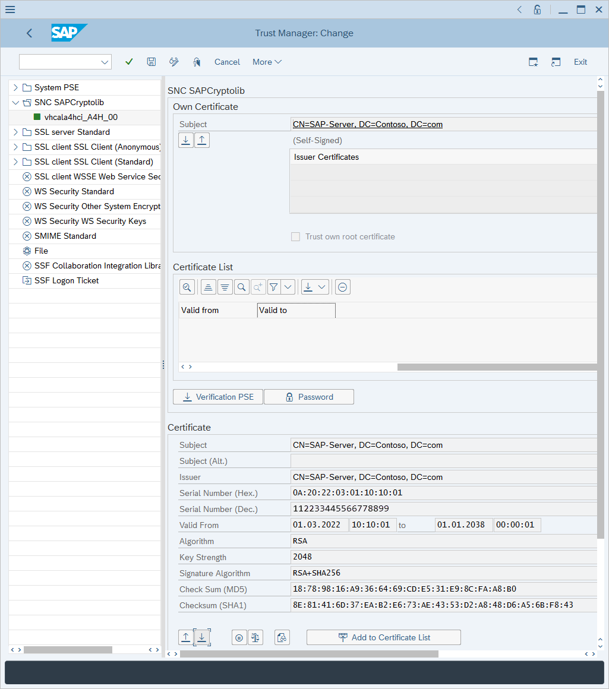
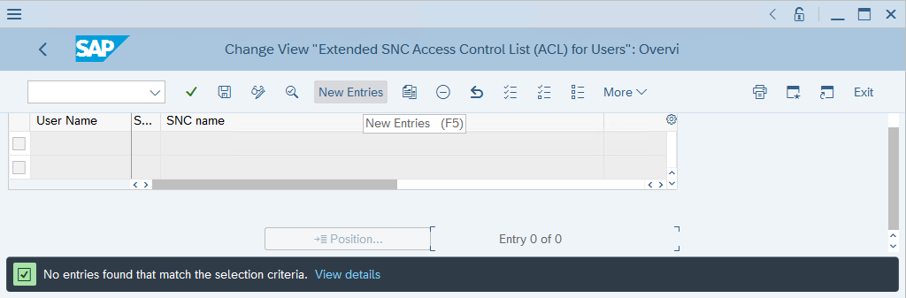
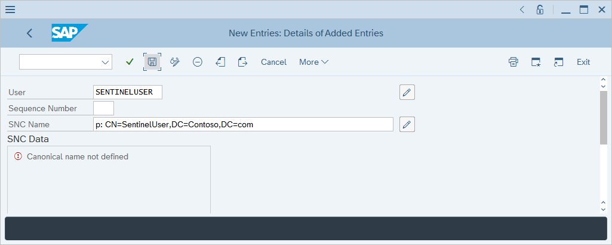
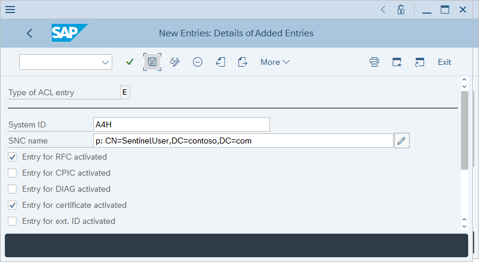

# Deploy the Microsoft Sentinel for SAP data connector with SNC

This article shows you how to deploy the **Microsoft Sentinel for SAP** data connector to ingest NetWeaver/ABAP logs over a secure connection using Secure Network Communications (SNC).

The SAP data connector agent typically connects to an SAP ABAP server using an RFC connection, and a user's username and password for authentication.

However, some environments may require the connection be over an encrypted channel, and client certificates be used for authentication. In these cases you can use SAP Secure Network Communication for this purpose, and you'll have to take the appropriate steps as outlined in this article.

## Prerequisites

- SAP Cryptographic library [Download the SAP Cryptographic Library](https://help.sap.com/viewer/d1d04c0d65964a9b91589ae7afc1bd45/5.0.4/en-US/86921b29cac044d68d30e7b125846860.html).
- Network connectivity. SNC uses ports *48xx* (where xx is the SAP instance number) to connect to the ABAP server.
- SAP server configured to support SNC authentication.
- Self-signed, or enterprise CA-issued certificate for user authentication.
 
> [!NOTE]
> This guide is a sample case for configuring SNC. In production environments it is strongly recommended to consult with SAP administrators to devise a deployment plan.

## Configure your SNC deployment

### Export server certificate

1. Sign in to your SAP client and run the **STRUST** transaction.

1. Navigate and expand the **SNC SAPCryptolib** section in the left hand pane.

1. Select the system, then select the value of the **Subject** field.

    The server certificate information will be displayed in the **Certificate** section at the bottom of the page.

1. Select the **Export certificate** button at the bottom of the page.

    

1. In the **Export Certificate** dialog box, select **Base64** as the file format, select the double boxes icon next to the **File Path** field, and select a filename to export the certificate to, then select the green checkmark to export the certificate.


### Import your certificate

This section explains how to import a certificate so that it's trusted by your ABAP server. It's important to understand which certificate needs to be imported into the SAP system. In any case, only public keys of the certificates need to be imported into the SAP system.

- **If the user certificate is self-signed:** Import a user certificate.

- **If user certificate is issued by an enterprise CA:** Import an enterprise CA certificate. In the event that both root and subordinate CA servers are used, import both root and subordinate CA public certificates.

1. Run the **STRUST** transaction.

1. Select **Display<->Change**.

1. Select **Import certificate** at the bottom of the page.

1. In the **Import certificate** dialog box, select the double boxes icon next to the **File path** field and locate the certificate.

    1. Locate the file containing the certificate (public key only) and select the green checkmark to import the certificate.

        The certificate information is displayed in the **Certificate** section.

    1. Select **Add to Certificate List**.

        The certificate will appear in the **Certificate List** area.

### Associate certificate with a user account

1. Run the **SM30** transaction.

1. In the **Table/View** field, type **USRACLEXT**, then select **Maintain**.

1. Review the output, identify whether the target user already has an associated SNC name. If not, select **New Entries**.

    

1. Type the target user's username in the **User** field and the user's certificate subject name prefixed with **p:** in the **SNC Name** field, then select **Save**.

    

### Grant logon rights using certificate

1. Run the **SM30** transaction.

1. In the **Table/View** field, type **VSNCSYSACL**, then select **Maintain**.

1. Confirm that the table is cross-client in the informational prompt that appears.

1. In **Determine Work Area: Entry** type **E** in the **Type of ACL entry** field, and select the green checkmark.

1. Review the output, identify whether the target user already has an associated SNC name. If not, select **New Entries**.

    

1. Enter your system ID and user certificate subject name with a **p:** prefix.

    

1. Ensure **Entry for RFC activated** and **Entry for certificate activated** checkboxes are marked, then select **Save**.

### Map users of the ABAP service provider to external user IDs

1. Run the **SM30** transaction.

1. In the **Table/View** field, type **VUSREXTID**, then select **Maintain**. 

1. In the **Determine Work Area: Entry** page, select the **DN** ID type as the **Work Area**. 

1. Type these details:

    - **External ID**: *CN=Sentinel*, *C=US*
    - **Seq. No**: *000*
    - **User**: *SENTINEL*

1. Select **Save** and **Enter**. 

    :::image type="content" source="media/configure-snc/vusrextid-table-configuration.png" alt-text="Screenshot of configuring the SAP VUSREXTID table.":::

### Set up the container

> [!NOTE]
> If you set up the SAP data connector agent container via the UI, don't perform the steps in this section. Continue to set up the connector [in the connector page](deploy-data-connector-agent-container.md) instead.

1. Transfer the **libsapcrypto.so** and **sapgenpse** files to the target system where the container will be created.

1. Transfer the client certificate (private and public key) to the target system where the container will be created.

    The client certificate and key can be in .p12, .pfx, or Base-64 .crt and .key format.

1. Transfer the server certificate (public key only) to the target system where the container will be created. 

    The server certificate must be in Base-64 .crt format.

1. If the client certificate was issued by an enterprise certification authority, transfer the issuing CA and root CA certificates to the target system where the container will be created.

1. Retrieve the kickstart script from the Microsoft Sentinel GitHub repository:

    ```bash
    wget https://raw.githubusercontent.com/Azure/Azure-Sentinel/master/Solutions/SAP/sapcon-sentinel-kickstart.sh
    ```

1. Change the script's permissions to make it executable:

    ```bash
    chmod +x ./sapcon-sentinel-kickstart.sh
    ```

1. Run the script, specifying the following base parameters:

    ```bash
    ./sapcon-sentinel-kickstart.sh \
    --use-snc \
    --cryptolib <path to sapcryptolib.so> \
    --sapgenpse <path to sapgenpse> \
    --server-cert <path to server certificate public key> \
    ```
    
    If the client certificate is in .crt/.key format, use the following switches:
    
    ```bash
    --client-cert <path to client certificate public key> \
    --client-key <path to client certificate private key> \
    ```
    
    If the client certificate is in .pfx or .p12 format:
    
    ```bash
    --client-pfx <pfx filename>
    --client-pfx-passwd <password>
    ```

    If the client certificate was issued by an enterprise CA, add this switch for **each** CA in the trust chain:

    ```bash
    --cacert <path to ca certificate>
    ```

    For example:

    ```bash
    ./sapcon-sentinel-kickstart.sh \
    --use-snc \
    --cryptolib /home/azureuser/libsapcrypto.so \
    --sapgenpse /home/azureuser/sapgenpse \
    --client-cert /home/azureuser/client.crt \
    --client-key /home/azureuser/client.key \
    --cacert /home/azureuser/issuingca.crt
    --cacert /home/azureuser/rootca.crt
    --server-cert /home/azureuser/server.crt \
    ```

For additional information on options available in the kickstart script, review [Reference: Kickstart script](reference-kickstart.md)

## Next steps

Learn more about the Microsoft Sentinel solution for SAP® applications:

- [Deploy Microsoft Sentinel solution for SAP® applications](deployment-overview.md)
- [Prerequisites for deploying Microsoft Sentinel solution for SAP® applications](prerequisites-for-deploying-sap-continuous-threat-monitoring.md)
- [Deploy SAP Change Requests (CRs) and configure authorization](preparing-sap.md)
- [Deploy the solution content from the content hub](deploy-sap-security-content.md)
- [Deploy and configure the container hosting the SAP data connector agent](deploy-data-connector-agent-container.md)
- [Enable and configure SAP auditing](configure-audit.md)
- [Monitor the health of your SAP system](../monitor-sap-system-health.md)
- [Collect SAP HANA audit logs](collect-sap-hana-audit-logs.md)

Troubleshooting:

- [Troubleshoot your Microsoft Sentinel solution for SAP® applications deployment](sap-deploy-troubleshoot.md)

Reference files:

- [Microsoft Sentinel solution for SAP® applications data reference](sap-solution-log-reference.md)
- [Microsoft Sentinel solution for SAP® applications: security content reference](sap-solution-security-content.md)
- [Kickstart script reference](reference-kickstart.md)
- [Update script reference](reference-update.md)
- [Systemconfig.ini file reference](reference-systemconfig.md)

For more information, see [Microsoft Sentinel solutions](../sentinel-solutions.md).